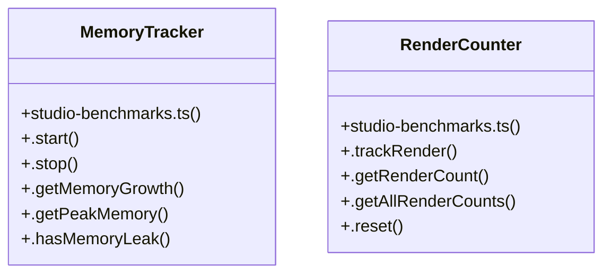

# User Interface Effects

> 78 nodes · cohesion 0.03

## Key Concepts

- [scroll-fps.test.ts](file:///D:/.MUSICVERSE/aimusicverse/tests/performance/scroll-fps.test.ts#L1) (13 connections)
- [studio-benchmarks.ts](file:///D:/.MUSICVERSE/aimusicverse/tests/performance/studio-benchmarks.ts#L1) (13 connections)
- [AILyricsWizard.tsx](file:///D:/.MUSICVERSE/aimusicverse/src/components/generate-form/AILyricsWizard.tsx#L1) (8 connections)
- [lyricsWizardStore.ts](file:///D:/.MUSICVERSE/aimusicverse/src/stores/lyricsWizardStore.ts#L1) (8 connections)
- [SectionReplacementPanel.tsx](file:///D:/.MUSICVERSE/aimusicverse/src/components/stem-studio/SectionReplacementPanel.tsx#L1) (6 connections)
- [MemoryTracker](file:///D:/.MUSICVERSE/aimusicverse/tests/performance/studio-benchmarks.ts#L192) (6 connections)
- [makeCurrent()](file:///D:/.MUSICVERSE/aimusicverse/coverage/lcov-report/block-navigation.js#L31) (5 connections)
- [EnhancedProfileSetup()](file:///D:/.MUSICVERSE/aimusicverse/src/components/profile/setup/EnhancedProfileSetup.tsx#L42) (5 connections)
- [RenderCounter](file:///D:/.MUSICVERSE/aimusicverse/tests/performance/studio-benchmarks.ts#L253) (5 connections)
- [runBenchmark()](file:///D:/.MUSICVERSE/aimusicverse/tests/performance/studio-benchmarks.ts#L41) (5 connections)
- [toggleClass()](file:///D:/.MUSICVERSE/aimusicverse/coverage/lcov-report/block-navigation.js#L24) (4 connections)
- [block-navigation.js](file:///D:/.MUSICVERSE/aimusicverse/coverage/lcov-report/block-navigation.js#L1) (4 connections)
- [stateMachine.ts](file:///D:/.MUSICVERSE/aimusicverse/src/lib/stateMachine.ts#L1) (4 connections)
- [.reset()](file:///D:/.MUSICVERSE/aimusicverse/tests/performance/studio-benchmarks.ts#L281) (4 connections)
- [useLyricsWizardMachine()](file:///D:/.MUSICVERSE/aimusicverse/src/hooks/useLyricsWizardMachine.ts#L33) (4 connections)
- [canProceed()](file:///D:/.MUSICVERSE/aimusicverse/src/components/generate-form/AILyricsWizard.tsx#L91) (3 connections)
- [useLyricsWizardMachine.ts](file:///D:/.MUSICVERSE/aimusicverse/src/hooks/useLyricsWizardMachine.ts#L1) (3 connections)
- [item](file:///D:/.MUSICVERSE/aimusicverse/tests/performance/scroll-fps.test.ts#L23) (3 connections)
- [measureFrame()](file:///D:/.MUSICVERSE/aimusicverse/tests/performance/scroll-fps.test.ts#L86) (3 connections)
- [measureScrollFPS()](file:///D:/.MUSICVERSE/aimusicverse/tests/performance/studio-benchmarks.ts#L111) (3 connections)
- [.getPeakMemory()](file:///D:/.MUSICVERSE/aimusicverse/tests/performance/studio-benchmarks.ts#L235) (3 connections)
- [handleApply()](file:///D:/.MUSICVERSE/aimusicverse/src/components/generate-form/AILyricsWizard.tsx#L84) (2 connections)
- [goToNext()](file:///D:/.MUSICVERSE/aimusicverse/coverage/lcov-report/block-navigation.js#L52) (2 connections)
- [goToPrevious()](file:///D:/.MUSICVERSE/aimusicverse/coverage/lcov-report/block-navigation.js#L41) (2 connections)
- [EnhancedProfileSetup.tsx](file:///D:/.MUSICVERSE/aimusicverse/src/components/profile/setup/EnhancedProfileSetup.tsx#L1) (2 connections)
- _... and 53 more nodes in this community_

## Class Diagram

## Relationships

- [[User Achievements]] (1 shared connections)

## Source Files

- [D:\.MUSICVERSE\aimusicverse\coverage\lcov-report\block-navigation.js](file:///D:/.MUSICVERSE/aimusicverse/coverage/lcov-report/block-navigation.js)
- [D:\.MUSICVERSE\aimusicverse\src\components\generate-form\AILyricsWizard.tsx](file:///D:/.MUSICVERSE/aimusicverse/src/components/generate-form/AILyricsWizard.tsx)
- [D:\.MUSICVERSE\aimusicverse\src\components\profile\setup\EnhancedProfileSetup.tsx](file:///D:/.MUSICVERSE/aimusicverse/src/components/profile/setup/EnhancedProfileSetup.tsx)
- [D:\.MUSICVERSE\aimusicverse\src\components\stem-studio\SectionReplacementPanel.tsx](file:///D:/.MUSICVERSE/aimusicverse/src/components/stem-studio/SectionReplacementPanel.tsx)
- [D:\.MUSICVERSE\aimusicverse\src\hooks\telegram\useTelegramMainButton.ts](file:///D:/.MUSICVERSE/aimusicverse/src/hooks/telegram/useTelegramMainButton.ts)
- [D:\.MUSICVERSE\aimusicverse\src\hooks\useLyricsWizardMachine.ts](file:///D:/.MUSICVERSE/aimusicverse/src/hooks/useLyricsWizardMachine.ts)
- [D:\.MUSICVERSE\aimusicverse\src\lib\stateMachine.ts](file:///D:/.MUSICVERSE/aimusicverse/src/lib/stateMachine.ts)
- [D:\.MUSICVERSE\aimusicverse\src\stores\lyricsWizardStore.ts](file:///D:/.MUSICVERSE/aimusicverse/src/stores/lyricsWizardStore.ts)
- [D:\.MUSICVERSE\aimusicverse\tests\performance\scroll-fps.test.ts](file:///D:/.MUSICVERSE/aimusicverse/tests/performance/scroll-fps.test.ts)
- [D:\.MUSICVERSE\aimusicverse\tests\performance\studio-benchmarks.ts](file:///D:/.MUSICVERSE/aimusicverse/tests/performance/studio-benchmarks.ts)

## Audit Trail

- EXTRACTED: 152 (82%)
- INFERRED: 34 (18%)
- AMBIGUOUS: 0 (0%)

---

_Part of the graphify knowledge wiki. See [[index]] to navigate._
