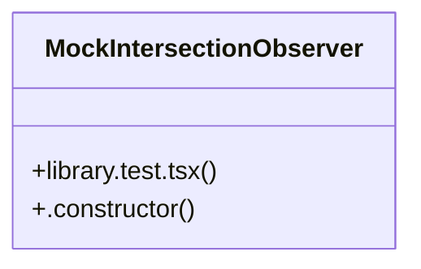

# User Interface Management

> 374 nodes · cohesion 0.01

## Key Concepts

- [hapticImpact()](file:///D:/.MUSICVERSE/aimusicverse/src/lib/haptic.ts#L52) (30 connections)
- [WriteToolPanel.tsx](file:///D:/.MUSICVERSE/aimusicverse/src/components/lyrics-workspace/ai-agent/tools/WriteToolPanel.tsx#L1) (17 connections)
- [InstrumentalGeneratorPanel.tsx](file:///D:/.MUSICVERSE/aimusicverse/src/components/studio/InstrumentalGeneratorPanel.tsx#L1) (17 connections)
- [trackEvent()](file:///D:/.MUSICVERSE/aimusicverse/src/services/analytics/events.service.ts#L13) (17 connections)
- [onClose](file:///D:/.MUSICVERSE/aimusicverse/src/pages/lyrics-studio/__tests__/LyricsAIPanel.test.tsx#L89) (15 connections)
- [UnifiedActionBar.tsx](file:///D:/.MUSICVERSE/aimusicverse/src/components/common/UnifiedActionBar.tsx#L1) (14 connections)
- [ChipInput.tsx](file:///D:/.MUSICVERSE/aimusicverse/src/components/ui/ChipInput.tsx#L1) (14 connections)
- [SFXGeneratorPanel.tsx](file:///D:/.MUSICVERSE/aimusicverse/src/components/studio/SFXGeneratorPanel.tsx#L1) (13 connections)
- [CompactSheetHeader.tsx](file:///D:/.MUSICVERSE/aimusicverse/src/components/track-actions/CompactSheetHeader.tsx#L1) (13 connections)
- [SmartPaywallDialog.tsx](file:///D:/.MUSICVERSE/aimusicverse/src/components/premium/SmartPaywallDialog.tsx#L1) (12 connections)
- [library.test.tsx](file:///D:/.MUSICVERSE/aimusicverse/tests/unit/components/library/library.test.tsx#L1) (12 connections)
- [triggerHapticFeedback()](file:///D:/.MUSICVERSE/aimusicverse/src/lib/mobile-utils.ts#L309) (12 connections)
- [OnboardingOverlay.tsx](file:///D:/.MUSICVERSE/aimusicverse/src/components/onboarding/OnboardingOverlay.tsx#L1) (11 connections)
- [lyrics.test.tsx](file:///D:/.MUSICVERSE/aimusicverse/tests/unit/components/lyrics/lyrics.test.tsx#L1) (11 connections)
- [BotMenuItemForm.tsx](file:///D:/.MUSICVERSE/aimusicverse/src/components/admin/BotMenuItemForm.tsx#L1) (10 connections)
- [DailyMissions.tsx](file:///D:/.MUSICVERSE/aimusicverse/src/components/gamification/DailyMissions.tsx#L1) (10 connections)
- [HeaderVersionSelector.tsx](file:///D:/.MUSICVERSE/aimusicverse/src/components/track-detail/HeaderVersionSelector.tsx#L1) (10 connections)
- [events.service.ts](file:///D:/.MUSICVERSE/aimusicverse/src/services/analytics/events.service.ts#L1) (10 connections)
- [StreakBadge.tsx](file:///D:/.MUSICVERSE/aimusicverse/src/components/gamification/StreakBadge.tsx#L1) (9 connections)
- [TrackDetailPanel.tsx](file:///D:/.MUSICVERSE/aimusicverse/src/components/library/TrackDetailPanel.tsx#L1) (9 connections)
- [ProOnboardingDialog.tsx](file:///D:/.MUSICVERSE/aimusicverse/src/components/premium/ProOnboardingDialog.tsx#L1) (9 connections)
- [CollapsibleSection.tsx](file:///D:/.MUSICVERSE/aimusicverse/src/components/ui/CollapsibleSection.tsx#L1) (9 connections)
- [CreditBalanceWarning.tsx](file:///D:/.MUSICVERSE/aimusicverse/src/components/generate-form/CreditBalanceWarning.tsx#L1) (8 connections)
- [NotificationManager.tsx](file:///D:/.MUSICVERSE/aimusicverse/src/components/notifications/NotificationManager.tsx#L1) (8 connections)
- [TrialBanner.tsx](file:///D:/.MUSICVERSE/aimusicverse/src/components/premium/TrialBanner.tsx#L1) (8 connections)
- *... and 349 more nodes in this community*

## Class Diagram

## Relationships

- No strong cross-community connections detected

## Source Files

- [D:\.MUSICVERSE\aimusicverse\src\__tests__\hooks\useSwipeNavigation.test.ts](file:///D:/.MUSICVERSE/aimusicverse/src/__tests__/hooks/useSwipeNavigation.test.ts)
- [D:\.MUSICVERSE\aimusicverse\src\components\admin\BotMenuItemForm.tsx](file:///D:/.MUSICVERSE/aimusicverse/src/components/admin/BotMenuItemForm.tsx)
- [D:\.MUSICVERSE\aimusicverse\src\components\audio-hub\AudioHubQuickActions.tsx](file:///D:/.MUSICVERSE/aimusicverse/src/components/audio-hub/AudioHubQuickActions.tsx)
- [D:\.MUSICVERSE\aimusicverse\src\components\common\UnifiedActionBar.tsx](file:///D:/.MUSICVERSE/aimusicverse/src/components/common/UnifiedActionBar.tsx)
- [D:\.MUSICVERSE\aimusicverse\src\components\gamification\DailyMissions.tsx](file:///D:/.MUSICVERSE/aimusicverse/src/components/gamification/DailyMissions.tsx)
- [D:\.MUSICVERSE\aimusicverse\src\components\gamification\StreakBadge.tsx](file:///D:/.MUSICVERSE/aimusicverse/src/components/gamification/StreakBadge.tsx)
- [D:\.MUSICVERSE\aimusicverse\src\components\generate-form\CreditBalanceWarning.tsx](file:///D:/.MUSICVERSE/aimusicverse/src/components/generate-form/CreditBalanceWarning.tsx)
- [D:\.MUSICVERSE\aimusicverse\src\components\home\CollapsibleSection.tsx](file:///D:/.MUSICVERSE/aimusicverse/src/components/home/CollapsibleSection.tsx)
- [D:\.MUSICVERSE\aimusicverse\src\components\library\SwipeableTrackItem.tsx](file:///D:/.MUSICVERSE/aimusicverse/src/components/library/SwipeableTrackItem.tsx)
- [D:\.MUSICVERSE\aimusicverse\src\components\library\TrackDetailPanel.tsx](file:///D:/.MUSICVERSE/aimusicverse/src/components/library/TrackDetailPanel.tsx)
- [D:\.MUSICVERSE\aimusicverse\src\components\library\shared\PlayOverlay.tsx](file:///D:/.MUSICVERSE/aimusicverse/src/components/library/shared/PlayOverlay.tsx)
- [D:\.MUSICVERSE\aimusicverse\src\components\lyrics-workspace\ai-agent\AIAgentTabs.tsx](file:///D:/.MUSICVERSE/aimusicverse/src/components/lyrics-workspace/ai-agent/AIAgentTabs.tsx)
- [D:\.MUSICVERSE\aimusicverse\src\components\lyrics-workspace\ai-agent\QuickActionChips.tsx](file:///D:/.MUSICVERSE/aimusicverse/src/components/lyrics-workspace/ai-agent/QuickActionChips.tsx)
- [D:\.MUSICVERSE\aimusicverse\src\components\lyrics-workspace\ai-agent\QuickActionsBar.tsx](file:///D:/.MUSICVERSE/aimusicverse/src/components/lyrics-workspace/ai-agent/QuickActionsBar.tsx)
- [D:\.MUSICVERSE\aimusicverse\src\components\lyrics-workspace\ai-agent\tools\WriteToolPanel.tsx](file:///D:/.MUSICVERSE/aimusicverse/src/components/lyrics-workspace/ai-agent/tools/WriteToolPanel.tsx)
- [D:\.MUSICVERSE\aimusicverse\src\components\mobile\MobileListItem.tsx](file:///D:/.MUSICVERSE/aimusicverse/src/components/mobile/MobileListItem.tsx)
- [D:\.MUSICVERSE\aimusicverse\src\components\navigation\QuickActionsBar.tsx](file:///D:/.MUSICVERSE/aimusicverse/src/components/navigation/QuickActionsBar.tsx)
- [D:\.MUSICVERSE\aimusicverse\src\components\notifications\NotificationManager.tsx](file:///D:/.MUSICVERSE/aimusicverse/src/components/notifications/NotificationManager.tsx)
- [D:\.MUSICVERSE\aimusicverse\src\components\onboarding\OnboardingOverlay.tsx](file:///D:/.MUSICVERSE/aimusicverse/src/components/onboarding/OnboardingOverlay.tsx)
- [D:\.MUSICVERSE\aimusicverse\src\components\payments\PaymentButton.tsx](file:///D:/.MUSICVERSE/aimusicverse/src/components/payments/PaymentButton.tsx)

## Audit Trail

- EXTRACTED: 737 (80%)
- INFERRED: 181 (20%)
- AMBIGUOUS: 0 (0%)

---

*Part of the graphify knowledge wiki. See [[index]] to navigate.*