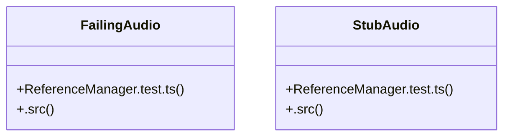

# User Interface State

> 15 nodes · cohesion 0.13

## Key Concepts

- [ReferenceManager.test.ts](file:///D:/.MUSICVERSE/aimusicverse/src/services/audio-reference/__tests__/ReferenceManager.test.ts#L1) (12 connections)
- [FailingAudio](file:///D:/.MUSICVERSE/aimusicverse/src/services/audio-reference/__tests__/ReferenceManager.test.ts#L84) (2 connections)
- [ref](file:///D:/.MUSICVERSE/aimusicverse/src/services/audio-reference/__tests__/ReferenceManager.test.ts#L255) (2 connections)
- [resetAll()](file:///D:/.MUSICVERSE/aimusicverse/src/services/audio-reference/__tests__/ReferenceManager.test.ts#L38) (2 connections)
- [StubAudio](file:///D:/.MUSICVERSE/aimusicverse/src/services/audio-reference/__tests__/ReferenceManager.test.ts#L58) (2 connections)
- [blob](file:///D:/.MUSICVERSE/aimusicverse/src/services/audio-reference/__tests__/ReferenceManager.test.ts#L113) (1 connections)
- [.src()](file:///D:/.MUSICVERSE/aimusicverse/src/services/audio-reference/__tests__/ReferenceManager.test.ts#L85) (1 connections)
- [file](file:///D:/.MUSICVERSE/aimusicverse/src/services/audio-reference/__tests__/ReferenceManager.test.ts#L70) (1 connections)
- [fromInsertSelectSingleMock](file:///D:/.MUSICVERSE/aimusicverse/src/services/audio-reference/__tests__/ReferenceManager.test.ts#L16) (1 connections)
- [originalAudio](file:///D:/.MUSICVERSE/aimusicverse/src/services/audio-reference/__tests__/ReferenceManager.test.ts#L57) (1 connections)
- [originalFetch](file:///D:/.MUSICVERSE/aimusicverse/src/services/audio-reference/__tests__/ReferenceManager.test.ts#L166) (1 connections)
- [r](file:///D:/.MUSICVERSE/aimusicverse/src/services/audio-reference/__tests__/ReferenceManager.test.ts#L71) (1 connections)
- [storageGetPublicUrlMock](file:///D:/.MUSICVERSE/aimusicverse/src/services/audio-reference/__tests__/ReferenceManager.test.ts#L15) (1 connections)
- [storageUploadMock](file:///D:/.MUSICVERSE/aimusicverse/src/services/audio-reference/__tests__/ReferenceManager.test.ts#L14) (1 connections)
- [.src()](file:///D:/.MUSICVERSE/aimusicverse/src/services/audio-reference/__tests__/ReferenceManager.test.ts#L62) (1 connections)

## Class Diagram

## Relationships

- No strong cross-community connections detected

## Source Files

- [D:\.MUSICVERSE\aimusicverse\src\services\audio-reference\__tests__\ReferenceManager.test.ts](file:///D:/.MUSICVERSE/aimusicverse/src/services/audio-reference/__tests__/ReferenceManager.test.ts)

## Audit Trail

- EXTRACTED: 28 (93%)
- INFERRED: 2 (7%)
- AMBIGUOUS: 0 (0%)

---

*Part of the graphify knowledge wiki. See [[index]] to navigate.*