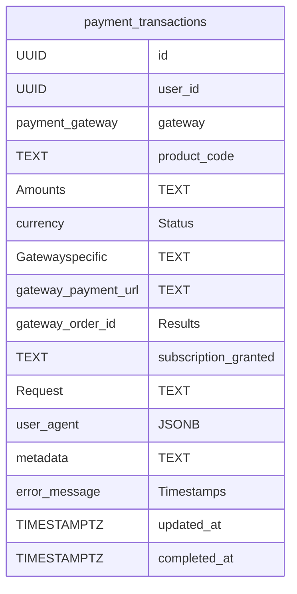

# Knowledge Graph Index

> Auto-generated by graphify. Start here — read community articles for context, then drill into god nodes for detail.

**43067 nodes · 62631 edges · 2110 communities**

---

## System Architecture Flowchart

```mermaid
flowchart TD
    C0["Menu Management (2416 nodes)"]
    C1["Music Generation (1500 nodes)"]
    C2["Music Interaction (1364 nodes)"]
    C3["User Achievements (1354 nodes)"]
    C4["Lyric Generation (1353 nodes)"]
    C5["Accessibility and Rhythm (916 nodes)"]
    C6["Audio Playback (565 nodes)"]
    C7["Media Playback (476 nodes)"]
    C8["Tab Navigation (443 nodes)"]
    C9["User Interface Management (374 nodes)"]
    C10["Audio Analysis (373 nodes)"]
    C11["Note Management (369 nodes)"]
    C12["Error Handling (342 nodes)"]
    C13["Progress Tracking (342 nodes)"]
    C14["Audio Playback (329 nodes)"]
    C15["Subscription Management (286 nodes)"]
    C16["UI Management (284 nodes)"]
    C17["Audio Context Management (271 nodes)"]
    C18["User Interaction (268 nodes)"]
    C19["Audio Analysis (242 nodes)"]
    C20["Audio Visualization (236 nodes)"]
    C21["Admin Management (219 nodes)"]
    C22["Music Notation (210 nodes)"]
    C23["Lyrics Processing (187 nodes)"]
    C24["User Interface Effects (187 nodes)"]
    C25["User Interface Controls (179 nodes)"]
    C26["Dialog Management (175 nodes)"]
    C27["AI Assistant (172 nodes)"]
    C28["Audio Analysis (163 nodes)"]
    C29["Image Optimization (162 nodes)"]
    C30["Character Counter (157 nodes)"]
    C31["Audio Playback (153 nodes)"]
    C32["Sprint Management (147 nodes)"]
    C33["User Moderation (147 nodes)"]
    C34["Music Playback (137 nodes)"]
    C35["User Engagement (130 nodes)"]
    C36["Project Management (129 nodes)"]
    C37["Lyrics Scrolling (117 nodes)"]
    C38["Artist Project Management (114 nodes)"]
    C39["Lyrics Management (110 nodes)"]
    C40["Audio Playback (105 nodes)"]
    C41["User Interaction Tracking (97 nodes)"]
    C42["Audio Management (88 nodes)"]
    C43["Music Composition (83 nodes)"]
    C44["Software Deployment (81 nodes)"]
    C45["Color Management (79 nodes)"]
    C46["Audio Processing (79 nodes)"]
    C47["User Engagement (78 nodes)"]
    C48["Performance Optimization (77 nodes)"]
    C49["Lyrics Synchronization (75 nodes)"]
    C50["Track Management (75 nodes)"]
    C51["Music Visualization (74 nodes)"]
    C52["Canvas Interaction (72 nodes)"]
    C53["Audio Playback Management (72 nodes)"]
    C54["Chat Interface (71 nodes)"]
    C55["Content Generation (71 nodes)"]
    C56["Payment Processing (71 nodes)"]
    C57["Content Management (71 nodes)"]
    C58["Grid Interaction (70 nodes)"]
    C59["Music Generation (70 nodes)"]
    C60["Lyrics Management (69 nodes)"]
    C61["Dialog Management (68 nodes)"]
    C62["Admin Management (68 nodes)"]
    C63["MIDI Management (68 nodes)"]
    C64["Creative Content Generation (67 nodes)"]
    C65["Media Player (67 nodes)"]
    C66["Music Metadata Processing (66 nodes)"]
    C67["User Interface (65 nodes)"]
    C68["Media Processing (64 nodes)"]
    C69["Tag Management (64 nodes)"]
    C70["Media Playback (63 nodes)"]
    C71["Audio Visualization (63 nodes)"]
    C72["Music Production (63 nodes)"]
    C73["Performance Metrics (63 nodes)"]
    C74["Music Playback (62 nodes)"]
    C75["Music Notation (62 nodes)"]
    C76["Audit and Sprint Management (62 nodes)"]
    C77["Media Editing (61 nodes)"]
    C78["Web Accessibility (61 nodes)"]
    C79["Music Timing (60 nodes)"]
    C80["Image Cropper (59 nodes)"]
    C81["Timeline Interaction (59 nodes)"]
    C82["Card Management (59 nodes)"]
    C83["Memory Management (59 nodes)"]
    C84["Charge Management (59 nodes)"]
    C85["Canvas Visualization (58 nodes)"]
    C86["Audio Player (58 nodes)"]
    C87["Music Visualization (58 nodes)"]
    C88["Progress Indicator (58 nodes)"]
    C89["Graph Visualization (58 nodes)"]
    C90["Section Management (58 nodes)"]
    C91["UI Layout Management (58 nodes)"]
    C92["Music Player (57 nodes)"]
    C93["Lyrics Management (56 nodes)"]
    C94["Audio Playback (56 nodes)"]
    C95["Lyrics Management (56 nodes)"]
    C96["Media Player (56 nodes)"]
    C97["Audio Playback (55 nodes)"]
    C98["Note Management (55 nodes)"]
    C99["LED Display Control (55 nodes)"]
    C100["Performance Optimization (55 nodes)"]
    C101["Music Application (55 nodes)"]
    C102["Artist Profile (54 nodes)"]
    C103["Broadcast Management (54 nodes)"]
    C104["Template Management (54 nodes)"]
    C105["Section Management (53 nodes)"]
    C106["Subscription Notifications (53 nodes)"]
    C107["Code Quality (52 nodes)"]
    C108["Audio Management (52 nodes)"]
    C109["Music Composition (52 nodes)"]
    C110["Version Management (52 nodes)"]
    C111["Audio Playback (52 nodes)"]
    C112["Music Player (52 nodes)"]
    C113["Payment Processing (51 nodes)"]
    C114["Audio Recording (51 nodes)"]
    C115["Tag Management (51 nodes)"]
    C116["Draft Management (51 nodes)"]
    C117["Music Project Management (50 nodes)"]
    C118["Lyrics Management (50 nodes)"]
    C119["Version Management (50 nodes)"]
    C120["Error Handling (49 nodes)"]
    C121["UI Animations (49 nodes)"]
    C122["Animation Effects (49 nodes)"]
    C123["Media Interaction (49 nodes)"]
    C124["File Management (49 nodes)"]
    C125["Menu Management (49 nodes)"]
    C126["Section Management (49 nodes)"]
    C127["Animation Control (48 nodes)"]
    C128["Slide Navigation (48 nodes)"]
    C129["Slider Component (48 nodes)"]
    C130["Artist Management (48 nodes)"]
    C131["Music Interaction (47 nodes)"]
    C132["Graph Exploration (47 nodes)"]
    C133["Reports Management (47 nodes)"]
    C134["Notification Management (47 nodes)"]
    C135["Navigation Management (47 nodes)"]
    C136["Audio Visualization (47 nodes)"]
    C137["Dashboard Storage (47 nodes)"]
    C138["Audio Analysis (47 nodes)"]
    C139["Data Navigation (46 nodes)"]
    C140["Audio Timeline (46 nodes)"]
    C141["User Profile Management (46 nodes)"]
    C142["Subscription Management (46 nodes)"]
    C143["Authentication System (46 nodes)"]
    C144["Data Analysis (46 nodes)"]
    C145["Track Management (46 nodes)"]
    C146["Text Editor (45 nodes)"]
    C147["Notification Management (45 nodes)"]
    C148["Guitar Tablature (45 nodes)"]
    C149["Artist Profile (45 nodes)"]
    C150["Guitar Chord Visualization (45 nodes)"]
    C151["Instrument Selection (45 nodes)"]
    C152["AI Prompt Management (45 nodes)"]
    C153["Digital Audio Workstation (45 nodes)"]
    C154["Feedback Management (45 nodes)"]
    C155["Scrolling Management (45 nodes)"]
    C156["Analytics Reporting (45 nodes)"]
    C157["Subscription Management (44 nodes)"]
    C158["Emoji Management (44 nodes)"]
    C159["Version Management (44 nodes)"]
    C160["Product Management (44 nodes)"]
    C161["Subscription Management (44 nodes)"]
    C162["Social Media Interaction (44 nodes)"]
    C163["Musical Timing (44 nodes)"]
    C164["Generation Management (44 nodes)"]
    C165["Template Management (44 nodes)"]
    C166["Music Sequencer (44 nodes)"]
    C167["Chord Navigation (43 nodes)"]
    C168["Text Editor (43 nodes)"]
    C169["Tag Management (43 nodes)"]
    C170["Music Playback (43 nodes)"]
    C171["Tour Navigation (43 nodes)"]
    C172["Media Playback (43 nodes)"]
    C173["Media Playback (43 nodes)"]
    C174["Music Playback (43 nodes)"]
    C175["Music Playback (43 nodes)"]
    C176["Lyrics Editor (42 nodes)"]
    C177["Timeline Editor (42 nodes)"]
    C178["Audio Control (42 nodes)"]
    C179["Audio Controls (42 nodes)"]
    C180["Audio Playback (42 nodes)"]
    C181["Music Notation (42 nodes)"]
    C182["Media Playback (42 nodes)"]
    C183["Deep Link Management (42 nodes)"]
    C184["Referral Management (42 nodes)"]
    C185["Template Management (42 nodes)"]
    C186["Error Handling (41 nodes)"]
    C187["Rendering Metrics (41 nodes)"]
    C188["Audio Application Architecture (41 nodes)"]
    C189["Notification System (41 nodes)"]
    C190["Audio Management (41 nodes)"]
    C191["User Engagement (41 nodes)"]
    C192["Guitar Chord Layout (41 nodes)"]
    C193["Guitar Fingering (41 nodes)"]
    C194["File Management (41 nodes)"]
    C195["Tip Management (41 nodes)"]
    C196["Image Cropping (41 nodes)"]
    C197["Media Management (40 nodes)"]
    C198["MIDI Controller (40 nodes)"]
    C199["Tip Management (40 nodes)"]
    C200["Media Player (40 nodes)"]
    C201["Volume Control (40 nodes)"]
    C202["Chart Visualization (40 nodes)"]
    C203["Data Storage (40 nodes)"]
    C204["Animation Management (39 nodes)"]
    C205["Product Selection (39 nodes)"]
    C206["Music Management (39 nodes)"]
    C207["User Management (39 nodes)"]
    C208["File Migration (39 nodes)"]
    C209["Admin Dashboard (39 nodes)"]
    C210["Media Playback (39 nodes)"]
    C211["Music Arrangement (39 nodes)"]
    C212["Music Sequencer (39 nodes)"]
    C213["Lyrics Management (38 nodes)"]
    C214["Music Tagging (38 nodes)"]
    C215["Template Management (38 nodes)"]
    C216["Music Genre Management (38 nodes)"]
    C217["Chat Interface (38 nodes)"]
    C218["Music Playback (38 nodes)"]
    C219["Media Playback (38 nodes)"]
    C220["Music Generation (38 nodes)"]
    C221["Lyrics Management (38 nodes)"]
    C222["Audio Processing (38 nodes)"]
    C223["Lyrics Management (38 nodes)"]
    C224["Feature Access Control (37 nodes)"]
    C225["Button Variants (37 nodes)"]
    C226["Chip Input (37 nodes)"]
    C227["Audio Visualization (37 nodes)"]
    C228["Media Configuration (37 nodes)"]
    C229["Lyric Parsing (37 nodes)"]
    C230["Notification Management (37 nodes)"]
    C231["Media Handling (37 nodes)"]
    C232["Software Development (37 nodes)"]
    C233["Menu Navigation (37 nodes)"]
    C234["Comment Management (37 nodes)"]
    C235["Drag and Drop (37 nodes)"]
    C236["User Engagement (36 nodes)"]
    C237["Music File Viewer (36 nodes)"]
    C238["Slide Navigation (36 nodes)"]
    C239["Lyrics Management (36 nodes)"]
    C240["User Engagement (36 nodes)"]
    C241["Volume Control (36 nodes)"]
    C242["Interactive UI Controls (36 nodes)"]
    C243["Speech Recognition (36 nodes)"]
    C244["User Preferences (35 nodes)"]
    C245["Lyrics Editor (35 nodes)"]
    C246["Music Recording (35 nodes)"]
    C247["Transcription Management (35 nodes)"]
    C248["Music Recording (35 nodes)"]
    C249["UI State Management (35 nodes)"]
    C250["Image Loading (35 nodes)"]
    C251["UI Components (35 nodes)"]
    C252["Slider Component (35 nodes)"]
    C253["Touch Interaction (35 nodes)"]
    C254["Onboarding Navigation (35 nodes)"]
    C255["E-commerce Transactions (35 nodes)"]
    C256["Audio Mixing (35 nodes)"]
    C257["Media Management (35 nodes)"]
    C258["Text Validation (35 nodes)"]
    C259["Audio Processing (34 nodes)"]
    C260["Audio State Management (34 nodes)"]
    C261["Creative Tools Development (34 nodes)"]
    C262["Design System (34 nodes)"]
    C263["MusicVerse AI (34 nodes)"]
    C264["Music Player (34 nodes)"]
    C265["Music Player (34 nodes)"]
    C266["Admin Image Management (34 nodes)"]
    C267["Analytics Dashboard (34 nodes)"]
    C268["User Retention (34 nodes)"]
    C269["Music Notation (34 nodes)"]
    C270["Music Player (34 nodes)"]
    C271["Project Management (34 nodes)"]
    C272["UI Configuration (33 nodes)"]
    C273["User Interaction (33 nodes)"]
    C274["User Interface Tutorial (33 nodes)"]
    C275["Creator Management (33 nodes)"]
    C276["Data Management (33 nodes)"]
    C277["Tool Management (33 nodes)"]
    C278["User Interaction (33 nodes)"]
    C279["Modal Interaction (33 nodes)"]
    C280["Lyrics Management (33 nodes)"]
    C281["Admin Navigation (33 nodes)"]
    C282["Pricing Information (33 nodes)"]
    C283["Version Management (33 nodes)"]
    C284["Audio Playback (33 nodes)"]
    C285["Audio Playback (33 nodes)"]
    C286["UI State Management (32 nodes)"]
    C287["Audio Error Handling (32 nodes)"]
    C288["UI Animation (32 nodes)"]
    C289["Playlist Management (32 nodes)"]
    C290["Theme Management (32 nodes)"]
    C291["Audio Processing (32 nodes)"]
    C292["Music Analysis (32 nodes)"]
    C293["Image Management (32 nodes)"]
    C294["Design Spacing (32 nodes)"]
    C295["User Authentication (32 nodes)"]
    C296["Audio Processing (32 nodes)"]
    C297["Audio Processing (32 nodes)"]
    C298["Music Production Agents (31 nodes)"]
    C299["Network Request (31 nodes)"]
    C300["Alert Management (31 nodes)"]
    C301["Configuration Management (31 nodes)"]
    C302["Cohort Management (31 nodes)"]
    C303["Music Settings (31 nodes)"]
    C304["Blog Content Management (31 nodes)"]
    C305["UI Components (31 nodes)"]
    C306["Audio Sequencer (31 nodes)"]
    C307["User Ranking (31 nodes)"]
    C308["Check-in Management (31 nodes)"]
    C309["User Interface Actions (31 nodes)"]
    C310["Music Creation (31 nodes)"]
    C311["Audio Playback (31 nodes)"]
    C312["Playlist Management (31 nodes)"]
    C313["Visibility Management (31 nodes)"]
    C314["Date Management (31 nodes)"]
    C315["User Interaction (31 nodes)"]
    C316["Text Area Management (30 nodes)"]
    C317["Slide Navigation (30 nodes)"]
    C318["Product Pricing (30 nodes)"]
    C319["AI Analysis (30 nodes)"]
    C320["Design Configuration (30 nodes)"]
    C321["Project Management (30 nodes)"]
    C322["Drag-and-Drop (30 nodes)"]
    C323["Audio Controls (30 nodes)"]
    C324["Music Visualization (30 nodes)"]
    C325["Tab Management (30 nodes)"]
    C326["Like Button (30 nodes)"]
    C327["Animated Button (30 nodes)"]
    C328["Form Management (30 nodes)"]
    C329["Image Optimization (29 nodes)"]
    C330["Image Handling (29 nodes)"]
    C331["User Interaction (29 nodes)"]
    C332["User Journey Analytics (29 nodes)"]
    C333["Accessibility Utilities (29 nodes)"]
    C334["Reward Calculation (29 nodes)"]
    C335["Mention Notifications (29 nodes)"]
    C336["Remix Management (29 nodes)"]
    C337["Admin Post Management (29 nodes)"]
    C338["Project Management (29 nodes)"]
    C339["Playback Management (29 nodes)"]
    C340["Data Visualization (29 nodes)"]
    C341["User Session Management (28 nodes)"]
    C342["File Validation (28 nodes)"]
    C343["Report Management (28 nodes)"]
    C344["Journey Filtering (28 nodes)"]
    C345["Conversion Metrics (28 nodes)"]
    C346["Error Handling (28 nodes)"]
    C347["Item Management (28 nodes)"]
    C348["Audio Analysis (28 nodes)"]
    C349["Audio Playback (28 nodes)"]
    C350["Feature Management (28 nodes)"]
    C351["Navigation Management (28 nodes)"]
    C352["Modal Management (28 nodes)"]
    C353["Audio Management (28 nodes)"]
    C354["User Check-in (27 nodes)"]
    C355["Media Management (27 nodes)"]
    C356["Editing Interface (27 nodes)"]
    C357["Safe Area Management (27 nodes)"]
    C358["Filter Management (27 nodes)"]
    C359["Project Management (27 nodes)"]
    C360["Media Attributes (27 nodes)"]
    C361["Tool Management (27 nodes)"]
    C362["Lyrics Formatting (27 nodes)"]
    C363["Tag Management (27 nodes)"]
    C364["Alert Management (27 nodes)"]
    C365["Track Management (27 nodes)"]
    C366["User Account Management (27 nodes)"]
    C367["User Notifications (26 nodes)"]
    C368["User Account Management (26 nodes)"]
    C369["Project Publishing (26 nodes)"]
    C370["MIDI Configuration (26 nodes)"]
    C371["Audio Mixing (26 nodes)"]
    C372["Time Management (26 nodes)"]
    C373["User Interface (26 nodes)"]
    C374["UI Layout (26 nodes)"]
    C375["Audio Track Management (26 nodes)"]
    C376["Modal Management (26 nodes)"]
    C377["Chord Management (26 nodes)"]
    C378["Audio Version Management (25 nodes)"]
    C379["Audio Control (25 nodes)"]
    C380["Group Management (25 nodes)"]
    C381["Music Track Attributes (25 nodes)"]
    C382["Version Management (25 nodes)"]
    C383["Editing Functionality (25 nodes)"]
    C384["Input Field (25 nodes)"]
    C385["Animation Effects (25 nodes)"]
    C386["Graphic Properties (25 nodes)"]
    C387["Layout Configuration (25 nodes)"]
    C388["Drum Kits (25 nodes)"]
    C389["Stem Representation (25 nodes)"]
    C390["Playlist Management (25 nodes)"]
    C391["Tab Navigation (25 nodes)"]
    C392["Navigation Management (24 nodes)"]
    C393["State Management (24 nodes)"]
    C394["Mock Utilities (24 nodes)"]
    C395["Version Management (24 nodes)"]
    C396["Music Application (24 nodes)"]
    C397["Music Production (24 nodes)"]
    C398["Watermark Management (24 nodes)"]
    C399["Data Visualization (24 nodes)"]
    C400["Edit Functionality (24 nodes)"]
    C401["Template Management (24 nodes)"]
    C402["Resource Management (24 nodes)"]
    C403["Audio Control (24 nodes)"]
    C404["Error Handling (24 nodes)"]
    C405["User Top-Up (24 nodes)"]
    C406["Artist Management (24 nodes)"]
    C407["UI Components (24 nodes)"]
    C408["Mobile Menu Interaction (24 nodes)"]
    C409["Tutorial Management (23 nodes)"]
    C410["Modal Interaction (23 nodes)"]
    C411["Playlist Management (23 nodes)"]
    C412["Track Management (23 nodes)"]
    C413["Text Editing (23 nodes)"]
    C414["UI Event Handlers (23 nodes)"]
    C415["Recommendation System (23 nodes)"]
    C416["Group Management (23 nodes)"]
    C417["Musical Notes (23 nodes)"]
    C418["Content Comparison (23 nodes)"]
    C419["Variant Management (23 nodes)"]
    C420["Music Interaction (23 nodes)"]
    C421["File Management (23 nodes)"]
    C422["Stem Management (23 nodes)"]
    C423["Media Actions (23 nodes)"]
    C424["Project Management (23 nodes)"]
    C425["Playlist Management (22 nodes)"]
    C426["Dropdown Menu (22 nodes)"]
    C427["Clipboard Management (22 nodes)"]
    C428["UI Components (22 nodes)"]
    C429["UI Component State (22 nodes)"]
    C430["Drag and Motion (22 nodes)"]
    C431["Responsive Design (22 nodes)"]
    C432["Image Loading (22 nodes)"]
    C433["Tag Management (22 nodes)"]
    C434["Audio Processing (22 nodes)"]
    C435["Guitar Chord Management (22 nodes)"]
    C436["Data Formatting (22 nodes)"]
    C437["Response Parsing (22 nodes)"]
    C438["Tab Navigation (21 nodes)"]
    C439["Playback Management (21 nodes)"]
    C440["UI Component Layout (21 nodes)"]
    C441["Timestamp Management (21 nodes)"]
    C442["Mobile Platform Development (21 nodes)"]
    C443["Project Audits (21 nodes)"]
    C444["UI Architecture Refactoring (21 nodes)"]
    C445["UI Design System (21 nodes)"]
    C446["MusicVerse AI (21 nodes)"]
    C447["User Management (21 nodes)"]
    C448["Configuration Health (21 nodes)"]
    C449["Error Telemetry (21 nodes)"]
    C450["Data Visualization (21 nodes)"]
    C451["Deeplink Analytics (21 nodes)"]
    C452["Health Metrics (20 nodes)"]
    C453["Tier Management (20 nodes)"]
    C454["User Interface State (20 nodes)"]
    C455["UI Components (20 nodes)"]
    C456["User Confirmation (20 nodes)"]
    C457["Music Metadata (20 nodes)"]
    C458["User Interaction (20 nodes)"]
    C459["User Interaction (20 nodes)"]
    C460["Error Handling (20 nodes)"]
    C461["Track Management (20 nodes)"]
    C462["FAQ Management (20 nodes)"]
    C463["Tab Management (20 nodes)"]
    C464["Lyrics Visualization (20 nodes)"]
    C465["Music Player (20 nodes)"]
    C466["UI Animation (20 nodes)"]
    C467["UI State Management (20 nodes)"]
    C468["Social Media (20 nodes)"]
    C469["Project Management (20 nodes)"]
    C470["Form Styling (20 nodes)"]
    C471["Music Production (19 nodes)"]
    C472["User Interaction (19 nodes)"]
    C473["Form State Management (19 nodes)"]
    C474["Audio Processing (19 nodes)"]
    C475["Section Management (19 nodes)"]
    C476["Audio Controls (19 nodes)"]
    C477["Audio Control (19 nodes)"]
    C478["UI Color Management (19 nodes)"]
    C479["Version Management (19 nodes)"]
    C480["User Mode Selection (19 nodes)"]
    C481["Category Management (19 nodes)"]
    C482["Track Management (18 nodes)"]
    C483["Music Editing (18 nodes)"]
    C484["Audio Analysis (18 nodes)"]
    C485["Drag and Drop (18 nodes)"]
    C486["Carousel Component (18 nodes)"]
    C487["Context Menu (18 nodes)"]
    C488["UI Components (18 nodes)"]
    C489["Visibility Control (18 nodes)"]
    C490["Scroll Management (18 nodes)"]
    C491["Form Elements (18 nodes)"]
    C492["Pagination System (18 nodes)"]
    C493["Typography Management (18 nodes)"]
    C494["Music Metadata (18 nodes)"]
    C495["Audio Effects (18 nodes)"]
    C496["Caching Mechanism (18 nodes)"]
    C497["User Management (17 nodes)"]
    C498["Caching System (17 nodes)"]
    C499["Version Management (17 nodes)"]
    C500["Event Management (17 nodes)"]
    C501["User Analytics (17 nodes)"]
    C502["Error Handling (17 nodes)"]
    C503["User Blocking (17 nodes)"]
    C504["Audio Processing (17 nodes)"]
    C505["Testing Utilities (17 nodes)"]
    C506["Error Handling (17 nodes)"]
    C507["UI Framework (17 nodes)"]
    C508["Audio Processing (17 nodes)"]
    C509["Data Analysis Integration (17 nodes)"]
    C510["User Statistics (17 nodes)"]
    C511["User Risk Management (17 nodes)"]
    C512["Music Theory (17 nodes)"]
    C513["User Interface Modes (17 nodes)"]
    C514["User Interaction (17 nodes)"]
    C515["User Interaction (17 nodes)"]
    C516["Search Functionality (17 nodes)"]
    C517["UI Variants (17 nodes)"]
    C518["Music Playback (17 nodes)"]
    C519["Pointer Events (17 nodes)"]
    C520["Achievements Management (17 nodes)"]
    C521["Editor Management (16 nodes)"]
    C522["Step Navigation (16 nodes)"]
    C523["Subscription Management (16 nodes)"]
    C524["UI Toggle (16 nodes)"]
    C525["Track Display (16 nodes)"]
    C526["Lyrics Interaction (16 nodes)"]
    C527["Music Playback (16 nodes)"]
    C528["UI State Management (16 nodes)"]
    C529["Undo Redo Management (16 nodes)"]
    C530["Lyrics Translation (16 nodes)"]
    C531["Filtering System (16 nodes)"]
    C532["Data Visualization (16 nodes)"]
    C533["Network Status (16 nodes)"]
    C534["Media Player (16 nodes)"]
    C535["Playlist Management (16 nodes)"]
    C536["Category Management (16 nodes)"]
    C537["Lyrics Management (16 nodes)"]
    C538["Content Management (16 nodes)"]
    C539["Track Management (16 nodes)"]
    C540["Channel Management (16 nodes)"]
    C541["File Upload (16 nodes)"]
    C542["Music Feed (16 nodes)"]
    C543["Audio Effects (16 nodes)"]
    C544["Music Composition (16 nodes)"]
    C545["Audio Mixing (16 nodes)"]
    C546["User Interface (16 nodes)"]
    C547["UI Preset Management (16 nodes)"]
    C548["Category Management (15 nodes)"]
    C549["User Interface (15 nodes)"]
    C550["User Interface State (15 nodes)"]
    C551["Audio Mixer (15 nodes)"]
    C552["File Management (15 nodes)"]
    C553["Copy and Share (15 nodes)"]
    C554["Button Component (15 nodes)"]
    C555["Modal Management (15 nodes)"]
    C556["Media Playback (15 nodes)"]
    C557["UI Icon Management (15 nodes)"]
    C558["Haptic Feedback (15 nodes)"]
    C559["Menu Management (15 nodes)"]
    C560["UI Components (15 nodes)"]
    C561["UI Styling (15 nodes)"]
    C562["Sheet Management (15 nodes)"]
    C563["UI Styling (15 nodes)"]
    C564["User Management (15 nodes)"]
    C565["Styling and Logging (15 nodes)"]
    C566["User Management (15 nodes)"]
    C567["Track Management (15 nodes)"]
    C568["Statistical Analysis (15 nodes)"]
    C569["Configuration Management (15 nodes)"]
    C570["Feature Management (15 nodes)"]
    C571["Content Management (15 nodes)"]
    C572["User Management (15 nodes)"]
    C573["Audio Processing (15 nodes)"]
    C574["Suno Tag Management (15 nodes)"]
    C575["Audio Mixing (15 nodes)"]
    C576["History Management (14 nodes)"]
    C577["Data Duplication (14 nodes)"]
    C578["File Management (14 nodes)"]
    C579["User Interaction (14 nodes)"]
    C580["Data Fetching (14 nodes)"]
    C581["Data Fetching (14 nodes)"]
    C582["Audio Processing (14 nodes)"]
    C583["Interface Management (14 nodes)"]
    C584["Software Development (14 nodes)"]
    C585["Project Documentation (14 nodes)"]
    C586["Web Automation (14 nodes)"]
    C587["User Management (14 nodes)"]
    C588["Error Handling (14 nodes)"]
    C589["Anomaly Detection (14 nodes)"]
    C590["Action Management (14 nodes)"]
    C591["Change Tracker (14 nodes)"]
    C592["Data Visualization (14 nodes)"]
    C593["User Interface (14 nodes)"]
    C594["Data Visualization (14 nodes)"]
    C595["User Engagement (14 nodes)"]
    C596["Preset Management (14 nodes)"]
    C597["UI Components (14 nodes)"]
    C598["Referral Sharing (14 nodes)"]
    C599["Template Management (14 nodes)"]
    C600["Template Management (14 nodes)"]
    C601["Suggestion Management (14 nodes)"]
    C602["Music XML Processing (14 nodes)"]
    C603["UI Elements (14 nodes)"]
    C604["User Interaction (14 nodes)"]
    C605["User Interaction (14 nodes)"]
    C606["UI Theme (14 nodes)"]
    C607["Track Management (14 nodes)"]
    C608["Version Comparison (14 nodes)"]
    C609["UI Components (14 nodes)"]
    C610["User Management (14 nodes)"]
    C611["UI Elements (14 nodes)"]
    C612["Fullscreen Management (14 nodes)"]
    C613["Timer Management (14 nodes)"]
    C614["UI Components (14 nodes)"]
    C615["User Interface (13 nodes)"]
    C616["User Interface (13 nodes)"]
    C617["Project Management (13 nodes)"]
    C618["Timer Management (13 nodes)"]
    C619["Instrument Management (13 nodes)"]
    C620["Preset Management (13 nodes)"]
    C621["Icon Management (13 nodes)"]
    C622["User Input Management (13 nodes)"]
    C623["Change Log (13 nodes)"]
    C624["Image Display (13 nodes)"]
    C625["UI Component Management (13 nodes)"]
    C626["Report Submission (13 nodes)"]
    C627["User Actions (13 nodes)"]
    C628["Content Sharing (13 nodes)"]
    C629["Emotional Metrics (13 nodes)"]
    C630["Dialog Management (13 nodes)"]
    C631["Drawer Management (13 nodes)"]
    C632["Error Handling (13 nodes)"]
    C633["Navigation Menu (13 nodes)"]
    C634["Content Presentation (13 nodes)"]
    C635["Deep Link Management (13 nodes)"]
    C636["User Management (13 nodes)"]
    C637["Route Navigation (13 nodes)"]
    C638["Logging System (13 nodes)"]
    C639["Rendering Configuration (13 nodes)"]
    C640["User Management (13 nodes)"]
    C641["API Response Management (13 nodes)"]
    C642["Action Management (13 nodes)"]
    C643["Animation Timing (13 nodes)"]
    C644["Music Visualization (13 nodes)"]
    C645["Model Metadata (13 nodes)"]
    C646["State Management (13 nodes)"]
    C647["User Interface (13 nodes)"]
    C648["Invoice Management (13 nodes)"]
    C649["Navigation System (13 nodes)"]
    C650["Mobile Studio V2 (13 nodes)"]
    C651["Sprint Reporting (13 nodes)"]
    C652["Dialog Properties (13 nodes)"]
    C653["User Management (13 nodes)"]
    C654["SEO Management (13 nodes)"]
    C655["Webhook Management (13 nodes)"]
    C656["UI Components (13 nodes)"]
    C657["Financial Metrics (13 nodes)"]
    C658["Time Management (13 nodes)"]
    C659["UI State Management (13 nodes)"]
    C660["Data Analysis (13 nodes)"]
    C661["Data Loading (13 nodes)"]
    C662["History Management (13 nodes)"]
    C663["UI Components (13 nodes)"]
    C664["Responsive Layout (13 nodes)"]
    C665["Project Management (13 nodes)"]
    C666["Artist Management (12 nodes)"]
    C667["Audio Control (12 nodes)"]
    C668["User Analytics (12 nodes)"]
    C669["Music Composition (12 nodes)"]
    C670["Artist Management (12 nodes)"]
    C671["Game State (12 nodes)"]
    C672["Artist Suggestions (12 nodes)"]
    C673["Character Limit (12 nodes)"]
    C674["Text Input Handling (12 nodes)"]
    C675["Music Recommendations (12 nodes)"]
    C676["Icon Management (12 nodes)"]
    C677["Hint Management (12 nodes)"]
    C678["Authentication Flow (12 nodes)"]
    C679["User Engagement (12 nodes)"]
    C680["Display Resolution (12 nodes)"]
    C681["User Interface (12 nodes)"]
    C682["Category Management (12 nodes)"]
    C683["Change Management (12 nodes)"]
    C684["Content Parsing (12 nodes)"]
    C685["User Interface (12 nodes)"]
    C686["UI Expansion (12 nodes)"]
    C687["Category Management (12 nodes)"]
    C688["Navigation Management (12 nodes)"]
    C689["Search Functionality (12 nodes)"]
    C690["Music Album (12 nodes)"]
    C691["Status Management (12 nodes)"]
    C692["Data Visualization (12 nodes)"]
    C693["Music Playback (12 nodes)"]
    C694["Content Management (12 nodes)"]
    C695["Media Weighting (12 nodes)"]
    C696["User Onboarding (12 nodes)"]
    C697["Audio Recording (12 nodes)"]
    C698["Transcription Management (12 nodes)"]
    C699["Compression Settings (12 nodes)"]
    C700["Audio Processing (12 nodes)"]
    C701["Media Controls (12 nodes)"]
    C702["Time Management (12 nodes)"]
    C703["Audio Control (12 nodes)"]
    C704["Track Expansion (12 nodes)"]
    C705["Styling Configuration (12 nodes)"]
    C706["Haptic Feedback (12 nodes)"]
    C707["Media Metadata (12 nodes)"]
    C708["Media Playback (12 nodes)"]
    C709["UI Styling (12 nodes)"]
    C710["UI Tabs Management (12 nodes)"]
    C711["Accordion Component (12 nodes)"]
    C712["Alert Management (12 nodes)"]
    C713["UI Components (12 nodes)"]
    C714["Text Formatting (12 nodes)"]
    C715["UI Components (12 nodes)"]
    C716["Product Configuration (12 nodes)"]
    C717["User Management (12 nodes)"]
    C718["Tooltip Management (12 nodes)"]
    C719["Feature Management (12 nodes)"]
    C720["Action Management (12 nodes)"]
    C721["Lyrics Management (12 nodes)"]
    C722["Project Configuration (12 nodes)"]
    C723["Preset Management (12 nodes)"]
    C724["Media Genres (12 nodes)"]
    C725["Z-Index Management (11 nodes)"]
    C726["AI Assistant (11 nodes)"]
    C727["Music Playlist Management (11 nodes)"]
    C728["Telegram Bot (11 nodes)"]
    C729["User Management (11 nodes)"]
    C730["Audio Processing (11 nodes)"]
    C731["Logging System (11 nodes)"]
    C732["Audio Processing (11 nodes)"]
    C733["Onboarding Process (11 nodes)"]
    C734["Analytics Management (11 nodes)"]
    C735["Caching Mechanism (11 nodes)"]
    C736["Tablet Limits (11 nodes)"]
    C737["Voice Input (11 nodes)"]
    C738["Threshold Management (11 nodes)"]
    C739["Performance Monitoring (11 nodes)"]
    C740["Audio Management (11 nodes)"]
    C741["Audio Management (11 nodes)"]
    C742["User Interaction (11 nodes)"]
    C743["Biometric Authentication (11 nodes)"]
    C744["Artist Management (11 nodes)"]
    C745["Data Loading (11 nodes)"]
    C746["Safe Area Management (11 nodes)"]
    C747["Device Detection (11 nodes)"]
    C748["User Engagement (11 nodes)"]
    C749["Media Management (11 nodes)"]
    C750["Content Generation (11 nodes)"]
    C751["Telegram Integration (11 nodes)"]
    C752["Session Management (11 nodes)"]
    C753["UI Component Unification (11 nodes)"]
    C754["Telegram Payments (11 nodes)"]
    C755["Project Management (11 nodes)"]
    C756["UI State Management (11 nodes)"]
    C757["User Roles (11 nodes)"]
    C758["Music Lyrics (11 nodes)"]
    C759["Cohort Analysis (11 nodes)"]
    C760["Tab Management (11 nodes)"]
    C761["Musical Pitch (11 nodes)"]
    C762["Blog Skeletons (11 nodes)"]
    C763["Product Sizing (11 nodes)"]
    C764["Modal State Management (11 nodes)"]
    C765["Media Playback (11 nodes)"]
    C766["Prompt Management (11 nodes)"]
    C767["Resource Monitoring (11 nodes)"]
    C768["UI Elements (11 nodes)"]
    C769["Messaging Configuration (11 nodes)"]
    C770["Analysis Management (11 nodes)"]
    C771["Task Management (11 nodes)"]
    C772["User Interaction (11 nodes)"]
    C773["Data Management (11 nodes)"]
    C774["Category Management (11 nodes)"]
    C775["User Interaction (11 nodes)"]
    C776["Section Type Management (11 nodes)"]
    C777["User Interface (11 nodes)"]
    C778["Selection Management (11 nodes)"]
    C779["Pattern Handling (11 nodes)"]
    C780["Mobile Transitions (11 nodes)"]
    C781["Value Commitment (10 nodes)"]
    C782["UI State Management (10 nodes)"]
    C783["UI Assets (10 nodes)"]
    C784["Offline Management (10 nodes)"]
    C785["UI Animation (10 nodes)"]
    C786["Feature Management (10 nodes)"]
    C787["Bio Display (10 nodes)"]
    C788["Circle Geometry (10 nodes)"]
    C789["Music Theory (10 nodes)"]
    C790["Channel Settings (10 nodes)"]
    C791["User Interface (10 nodes)"]
    C792["Icon Sizing (10 nodes)"]
    C793["User Interface (10 nodes)"]
    C794["Feature Toggles (10 nodes)"]
    C795["Type Selection (10 nodes)"]
    C796["Keyboard Shortcuts (10 nodes)"]
    C797["Preset Management (10 nodes)"]
    C798["Audio Controls (10 nodes)"]
    C799["User Interaction (10 nodes)"]
    C800["Music Management (10 nodes)"]
    C801["User Interface (10 nodes)"]
    C802["Grid Layout (10 nodes)"]
    C803["Telegram UI (10 nodes)"]
    C804["Messaging Themes (10 nodes)"]
    C805["Prompt Management (10 nodes)"]
    C806["Media Controls (10 nodes)"]
    C807["Audio Playback (10 nodes)"]
    C808["Track Navigation (10 nodes)"]
    C809["Data Management (10 nodes)"]
    C810["Client Permissions (10 nodes)"]
    C811["Alert Management (10 nodes)"]
    C812["UI Layout (10 nodes)"]
    C813["Image Loading (10 nodes)"]
    C814["UI Components (10 nodes)"]
    C815["Collapsible UI (10 nodes)"]
    C816["Size Management (10 nodes)"]
    C817["Emotion Tracking (10 nodes)"]
    C818["User Management (10 nodes)"]
    C819["Hover Card UI (10 nodes)"]
    C820["Product Attributes (10 nodes)"]
    C821["Popover Component (10 nodes)"]
    C822["UI Navigation (10 nodes)"]
    C823["Toggle Management (10 nodes)"]
    C824["User Interaction (10 nodes)"]
    C825["Visual Indicators (10 nodes)"]
    C826["UI Effects (10 nodes)"]
    C827["Beat Evaluation (10 nodes)"]
    C828["Audio Processing (10 nodes)"]
    C829["User Authentication (10 nodes)"]
    C830["Application State (10 nodes)"]
    C831["Logging System (10 nodes)"]
    C832["Configuration Management (10 nodes)"]
    C833["User Authentication (10 nodes)"]
    C834["Audio Processing (10 nodes)"]
    C835["Payment Management (10 nodes)"]
    C836["Audio Processing (10 nodes)"]
    C837["Section Notes (10 nodes)"]
    C838["Subscription Management (10 nodes)"]
    C839["MIDI Logging (10 nodes)"]
    C840["Audio Processing (10 nodes)"]
    C841["Configuration Management (10 nodes)"]
    C842["User Access Levels (10 nodes)"]
    C843["Status Management (10 nodes)"]
    C844["Status Management (10 nodes)"]
    C845["Status Management (10 nodes)"]
    C846["Audio Mixing (10 nodes)"]
    C847["Synchronization Settings (9 nodes)"]
    C848["Audio Processing (9 nodes)"]
    C849["User Management (9 nodes)"]
    C850["Configuration Management (9 nodes)"]
    C851["Keyboard Shortcuts (9 nodes)"]
    C852["Operation Management (9 nodes)"]
    C853["Supabase Configuration (9 nodes)"]
    C854["User Authentication (9 nodes)"]
    C855["Audio Processing (9 nodes)"]
    C856["User Interface (9 nodes)"]
    C857["Funnel Analytics (9 nodes)"]
    C858["Track Visualization (9 nodes)"]
    C859["User Authentication (9 nodes)"]
    C860["User Authentication (9 nodes)"]
    C861["Audio Processing (9 nodes)"]
    C862["Error Handling (9 nodes)"]
    C863["Performance Management (9 nodes)"]
    C864["React Error Handling (9 nodes)"]
    C865["Quality Assurance (9 nodes)"]
    C866["UI Redesign (9 nodes)"]
    C867["Mobile UI Redesign (9 nodes)"]
    C868["Klang.io Integration (9 nodes)"]
    C869["Authentication Control (9 nodes)"]
    C870["User Management (9 nodes)"]
    C871["UI State Management (9 nodes)"]
    C872["User Management (9 nodes)"]
    C873["Product Information (9 nodes)"]
    C874["Music Structure (9 nodes)"]
    C875["Stroke Analysis (9 nodes)"]
    C876["Dialog Management (9 nodes)"]
    C877["Drum Step Length (9 nodes)"]
    C878["User Management (9 nodes)"]
    C879["User Authentication (9 nodes)"]
    C880["Form Management (9 nodes)"]
    C881["Task Status (9 nodes)"]
    C882["User Management (9 nodes)"]
    C883["Provider Management (9 nodes)"]
    C884["Validation Handling (9 nodes)"]
    C885["Responsive Design (9 nodes)"]
    C886["User Interface (9 nodes)"]
    C887["Size Management (9 nodes)"]
    C888["Text Processing (9 nodes)"]
    C889["Synchronized Drawing (9 nodes)"]
    C890["Step Management (9 nodes)"]
    C891["User Management (9 nodes)"]
    C892["User Authentication (9 nodes)"]
    C893["Workflow Management (9 nodes)"]
    C894["Score Management (9 nodes)"]
    C895["User Authentication (9 nodes)"]
    C896["User Interface Styles (9 nodes)"]
    C897["String Manipulation (9 nodes)"]
    C898["Template Management (9 nodes)"]
    C899["User Management (9 nodes)"]
    C900["User Interface (9 nodes)"]
    C901["Data Fetching (9 nodes)"]
    C902["UI Rendering (9 nodes)"]
    C903["Last Element Retrieval (9 nodes)"]
    C904["User Management (9 nodes)"]
    C905["User Identity (9 nodes)"]
    C906["Size Management (9 nodes)"]
    C907["Task Status (9 nodes)"]
    C908["Variant Management (9 nodes)"]
    C909["User Experience (9 nodes)"]
    C910["Recommendation System (9 nodes)"]
    C911["Bar Chart (9 nodes)"]
    C912["User Management (8 nodes)"]
    C913["File Download (8 nodes)"]
    C914["UI State Management (8 nodes)"]
    C915["Time Management (8 nodes)"]
    C916["Lyrics Management (8 nodes)"]
    C917["Type Limitation (8 nodes)"]
    C918["Transcription Management (8 nodes)"]
    C919["Audio Playback (8 nodes)"]
    C920["UI Components (8 nodes)"]
    C921["Sheet Interaction (8 nodes)"]
    C922["Tag Management (8 nodes)"]
    C923["Visibility Management (8 nodes)"]
    C924["Stem Display (8 nodes)"]
    C925["Technical Information (8 nodes)"]
    C926["Navigation Components (8 nodes)"]
    C927["Configuration Management (8 nodes)"]
    C928["Configuration Management (8 nodes)"]
    C929["OTP Input (8 nodes)"]
    C930["Product Labeling (8 nodes)"]
    C931["UI Sizing (8 nodes)"]
    C932["Radio Button Selection (8 nodes)"]
    C933["Scrolling Interface (8 nodes)"]
    C934["Configuration Management (8 nodes)"]
    C935["UI Styling (8 nodes)"]
    C936["Data Presentation (8 nodes)"]
    C937["Toggle Management (8 nodes)"]
    C938["State Management (8 nodes)"]
    C939["UI Animation (8 nodes)"]
    C940["Task Tracking (8 nodes)"]
    C941["Messaging Logger (8 nodes)"]
    C942["Messaging Logger (8 nodes)"]
    C943["Responsive Design (8 nodes)"]
    C944["Music Playlists (8 nodes)"]
    C945["Application State (8 nodes)"]
    C946["Logging System (8 nodes)"]
    C947["User Management (8 nodes)"]
    C948["Logging System (8 nodes)"]
    C949["Haptic Feedback (8 nodes)"]
    C950["User Management (8 nodes)"]
    C951["Logging System (8 nodes)"]
    C952["Logging System (8 nodes)"]
    C953["User Management (8 nodes)"]
    C954["Data Storage (8 nodes)"]
    C955["Logging System (8 nodes)"]
    C956["User Management (8 nodes)"]
    C957["User Management (8 nodes)"]
    C958["Track Data Management (8 nodes)"]
    C959["Stem Type Management (8 nodes)"]
    C960["User Management (8 nodes)"]
    C961["User Management (8 nodes)"]
    C962["Audio Logging (8 nodes)"]
    C963["User Management (8 nodes)"]
    C964["Picture-in-Picture (8 nodes)"]
    C965["Audio Configuration (8 nodes)"]
    C966["Configuration Management (8 nodes)"]
    C967["Application State (8 nodes)"]
    C968["STEM Prioritization (8 nodes)"]
    C969["User Management (8 nodes)"]
    C970["User Management (8 nodes)"]
    C971["State Management (8 nodes)"]
    C972["Configuration Management (8 nodes)"]
    C973["User Management (8 nodes)"]
    C974["Logging System (8 nodes)"]
    C975["Logging System (8 nodes)"]
    C976["Logging System (8 nodes)"]
    C977["Logging System (8 nodes)"]
    C978["Configuration Management (7 nodes)"]
    C979["Navigation Controls (7 nodes)"]
    C980["Navigation Controls (7 nodes)"]
    C981["Mobile Analytics (7 nodes)"]
    C982["Performance Monitoring (7 nodes)"]
    C983["Data Access (7 nodes)"]
    C984["Reference Management (7 nodes)"]
    C985["Provider Management (7 nodes)"]
    C986["Data Expiry Management (7 nodes)"]
    C987["Lyrics History (7 nodes)"]
    C988["Lyrics Management (7 nodes)"]
    C989["Project Management (7 nodes)"]
    C990["Tracking System (7 nodes)"]
    C991["View Management (7 nodes)"]
    C992["Telegram Integration (7 nodes)"]
    C993["Client Query (7 nodes)"]
    C994["Client Query (7 nodes)"]
    C995["User Authentication (7 nodes)"]
    C996["Music Player (7 nodes)"]
    C997["Telegram Bot (7 nodes)"]
    C998["Sprint Closure (7 nodes)"]
    C999["User Engagement (7 nodes)"]
    C1000["MusicVerse AI (7 nodes)"]
    C1001["UI/UX Audit (7 nodes)"]
    C1002["Web Page Layout (7 nodes)"]
    C1003["Configuration Management (7 nodes)"]
    C1004["Shadow Management (7 nodes)"]
    C1005["User Management (7 nodes)"]
    C1006["Instrument Management (7 nodes)"]
    C1007["Audio Processing (7 nodes)"]
    C1008["User Management (7 nodes)"]
    C1009["Track Management (7 nodes)"]
    C1010["User Management (7 nodes)"]
    C1011["User Management (7 nodes)"]
    C1012["Application Tiers (7 nodes)"]
    C1013["System Monitoring (7 nodes)"]
    C1014["Color Management (7 nodes)"]
    C1015["User Authentication (7 nodes)"]
    C1016["User Management (7 nodes)"]
    C1017["User Management (7 nodes)"]
    C1018["User Management (7 nodes)"]
    C1019["User Management (7 nodes)"]
    C1020["Web Performance (7 nodes)"]
    C1021["Navigation System (7 nodes)"]
    C1022["Audio Recording (7 nodes)"]
    C1023["User Management (7 nodes)"]
    C1024["UI Layout (7 nodes)"]
    C1025["File Management (7 nodes)"]
    C1026["User Management (7 nodes)"]
    C1027["Track Selection (7 nodes)"]
    C1028["Music Instrument Selector (7 nodes)"]
    C1029["Pointer Events (7 nodes)"]
    C1030["Pattern Management (7 nodes)"]
    C1031["Credit Management (7 nodes)"]
    C1032["User Management (7 nodes)"]
    C1033["User Role Management (7 nodes)"]
    C1034["User Management (7 nodes)"]
    C1035["Document Structure (7 nodes)"]
    C1036["User Management (7 nodes)"]
    C1037["Contextual Information (7 nodes)"]
    C1038["User Management (7 nodes)"]
    C1039["Process Management (7 nodes)"]
    C1040["Music Library (7 nodes)"]
    C1041["User Management (7 nodes)"]
    C1042["Music Display (7 nodes)"]
    C1043["Device Detection (7 nodes)"]
    C1044["Gap Management (7 nodes)"]
    C1045["UI Refresh (7 nodes)"]
    C1046["Time Management (7 nodes)"]
    C1047["Content Management (7 nodes)"]
    C1048["Text Processing (7 nodes)"]
    C1049["User Management (7 nodes)"]
    C1050["User Management (7 nodes)"]
    C1051["User Management (7 nodes)"]
    C1052["User Management (7 nodes)"]
    C1053["User Management (7 nodes)"]
    C1054["User Management (7 nodes)"]
    C1055["User Management (7 nodes)"]
    C1056["Feature Management (7 nodes)"]
    C1057["User Management (7 nodes)"]
    C1058["User Authentication (7 nodes)"]
    C1059["User Onboarding (7 nodes)"]
    C1060["User Interface (7 nodes)"]
    C1061["User Management (7 nodes)"]
    C1062["User Management (7 nodes)"]
    C1063["User Interface (7 nodes)"]
    C1064["Version Management (7 nodes)"]
    C1065["User Management (7 nodes)"]
    C1066["User Management (6 nodes)"]
    C1067["User Management (6 nodes)"]
    C1068["Track Editing (6 nodes)"]
    C1069["Project Configuration (6 nodes)"]
    C1070["Project Management (6 nodes)"]
    C1071["Mobile Actions (6 nodes)"]
    C1072["Project Management (6 nodes)"]
    C1073["User Management (6 nodes)"]
    C1074["User Management (6 nodes)"]
    C1075["User Configuration (6 nodes)"]
    C1076["Data Visualization (6 nodes)"]
    C1077["Modes Management (6 nodes)"]
    C1078["Data Loading (6 nodes)"]
    C1079["User Management (6 nodes)"]
    C1080["User Management (6 nodes)"]
    C1081["Device Detection (6 nodes)"]
    C1082["User Interface (6 nodes)"]
    C1083["Navigation System (6 nodes)"]
    C1084["Navigation System (6 nodes)"]
    C1085["Progress Tracking (6 nodes)"]
    C1086["Device Detection (6 nodes)"]
    C1087["User Authentication (6 nodes)"]
    C1088["Marker Management (6 nodes)"]
    C1089["Mobile Actions (6 nodes)"]
    C1090["Track Export (6 nodes)"]
    C1091["User Management (6 nodes)"]
    C1092["User Authentication (6 nodes)"]
    C1093["UI State Management (6 nodes)"]
    C1094["Configuration Management (6 nodes)"]
    C1095["Track Management (6 nodes)"]
    C1096["Game Status (6 nodes)"]
    C1097["Sheet Interaction (6 nodes)"]
    C1098["Track Management (6 nodes)"]
    C1099["User Management (6 nodes)"]
    C1100["User Management (6 nodes)"]
    C1101["Version Management (6 nodes)"]
    C1102["User Management (6 nodes)"]
    C1103["Lyrics Management (6 nodes)"]
    C1104["User Interaction (6 nodes)"]
    C1105["Reference Management (6 nodes)"]
    C1106["Music Analytics (6 nodes)"]
    C1107["User Management (6 nodes)"]
    C1108["Animation Control (6 nodes)"]
    C1109["Media Formatting (6 nodes)"]
    C1110["Badge Management (6 nodes)"]
    C1111["Card Management (6 nodes)"]
    C1112["User Input (6 nodes)"]
    C1113["Game Character (6 nodes)"]
    C1114["User Management (6 nodes)"]
    C1115["User Management (6 nodes)"]
    C1116["Progress Tracking (6 nodes)"]
    C1117["System Readiness (6 nodes)"]
    C1118["Pull-to-Refresh (6 nodes)"]
    C1119["Data Formatting (6 nodes)"]
    C1120["UI Animation (6 nodes)"]
    C1121["User Interface (6 nodes)"]
    C1122["Tab Management (6 nodes)"]
    C1123["User Input (6 nodes)"]
    C1124["Accessibility Features (6 nodes)"]
    C1125["Audio Control (6 nodes)"]
    C1126["Signal Visualization (6 nodes)"]
    C1127["User Management (6 nodes)"]
    C1128["User Management (6 nodes)"]
    C1129["User Management (6 nodes)"]
    C1130["User Management (6 nodes)"]
    C1131["User Management (6 nodes)"]
    C1132["User Management (6 nodes)"]
    C1133["User Management (6 nodes)"]
    C1134["User Management (6 nodes)"]
    C1135["User Management (6 nodes)"]
    C1136["User Management (6 nodes)"]
    C1137["User Management (6 nodes)"]
    C1138["User Management (6 nodes)"]
    C1139["User Management (6 nodes)"]
    C1140["User Management (6 nodes)"]
    C1141["User Management (6 nodes)"]
    C1142["User Management (6 nodes)"]
    C1143["User Management (6 nodes)"]
    C1144["User Management (6 nodes)"]
    C1145["User Management (6 nodes)"]
    C1146["User Management (6 nodes)"]
    C1147["User Management (6 nodes)"]
    C1148["User Management (6 nodes)"]
    C1149["User Management (6 nodes)"]
    C1150["User Management (6 nodes)"]
    C1151["User Management (6 nodes)"]
    C1152["User Management (5 nodes)"]
    C1153["User Management (5 nodes)"]
    C1154["User Management (5 nodes)"]
    C1155["User Management (5 nodes)"]
    C1156["User Management (5 nodes)"]
    C1157["User Management (5 nodes)"]
    C1158["User Management (5 nodes)"]
    C1159["User Management (5 nodes)"]
    C1160["User Management (5 nodes)"]
    C1161["User Management (5 nodes)"]
    C1162["User Management (5 nodes)"]
    C1163["User Management (5 nodes)"]
    C1164["User Management (5 nodes)"]
    C1165["User Management (5 nodes)"]
    C1166["User Management (5 nodes)"]
    C1167["Configuration Management (5 nodes)"]
    C1168["User Authentication (5 nodes)"]
    C1169["Dashboard Management (5 nodes)"]
    C1170["Audio Management (5 nodes)"]
    C1171["User Management (5 nodes)"]
    C1172["User Management (5 nodes)"]
    C1173["User Management (5 nodes)"]
    C1174["Statistics Management (5 nodes)"]
    C1175["User Authentication (5 nodes)"]
    C1176["User Management (5 nodes)"]
    C1177["User Management (5 nodes)"]
    C1178["User Interface (5 nodes)"]
    C1179["User Management (5 nodes)"]
    C1180["User Management (5 nodes)"]
    C1181["Product Management (5 nodes)"]
    C1182["Audio Visualization (5 nodes)"]
    C1183["UI Consistency (5 nodes)"]
    C1184["Music Audit (5 nodes)"]
    C1185["Social Features (5 nodes)"]
    C1186["UI Component Development (5 nodes)"]
    C1187["Studio Management (5 nodes)"]
    C1188["Repository Audit (5 nodes)"]
    C1189["Audio Troubleshooting (5 nodes)"]
    C1190["Software Optimization (5 nodes)"]
    C1191["Telegram Bot Payments (5 nodes)"]
    C1192["Agile Project Management (5 nodes)"]
    C1193["Music Production (5 nodes)"]
    C1194["Music Production (5 nodes)"]
    C1195["Mobile Studio Migration (5 nodes)"]
    C1196["User Management (5 nodes)"]
    C1197["User Management (5 nodes)"]
    C1198["User Management (5 nodes)"]
    C1199["User Management (5 nodes)"]
    C1200["User Management (5 nodes)"]
    C1201["User Management (5 nodes)"]
    C1202["User Management (5 nodes)"]
    C1203["User Management (5 nodes)"]
    C1204["User Management (5 nodes)"]
    C1205["User Management (5 nodes)"]
    C1206["User Management (5 nodes)"]
    C1207["User Management (5 nodes)"]
    C1208["User Management (5 nodes)"]
    C1209["User Management (5 nodes)"]
    C1210["User Management (5 nodes)"]
    C1211["User Management (5 nodes)"]
    C1212["User Management (5 nodes)"]
    C1213["User Management (5 nodes)"]
    C1214["User Management (5 nodes)"]
    C1215["User Management (5 nodes)"]
    C1216["User Authentication (5 nodes)"]
    C1217["User Management (5 nodes)"]
    C1218["User Management (5 nodes)"]
    C1219["User Management (5 nodes)"]
    C1220["User Management (5 nodes)"]
    C1221["User Management (5 nodes)"]
    C1222["User Management (5 nodes)"]
    C1223["User Management (5 nodes)"]
    C1224["User Authentication (5 nodes)"]
    C1225["User Management (5 nodes)"]
    C1226["User Management (5 nodes)"]
    C1227["User Management (5 nodes)"]
    C1228["User Management (5 nodes)"]
    C1229["User Management (5 nodes)"]
    C1230["User Management (5 nodes)"]
    C1231["User Management (5 nodes)"]
    C1232["User Management (5 nodes)"]
    C1233["User Management (5 nodes)"]
    C1234["User Management (5 nodes)"]
    C1235["User Management (5 nodes)"]
    C1236["User Management (5 nodes)"]
    C1237["User Authentication (5 nodes)"]
    C1238["User Management (5 nodes)"]
    C1239["User Management (5 nodes)"]
    C1240["User Management (5 nodes)"]
    C1241["User Management (5 nodes)"]
    C1242["User Management (5 nodes)"]
    C1243["User Management (5 nodes)"]
    C1244["User Management (5 nodes)"]
    C1245["User Management (5 nodes)"]
    C1246["User Management (5 nodes)"]
    C1247["User Management (5 nodes)"]
    C1248["User Management (5 nodes)"]
    C1249["User Authentication (5 nodes)"]
    C1250["User Management (5 nodes)"]
    C1251["User Management (5 nodes)"]
    C1252["User Management (5 nodes)"]
    C1253["User Management (5 nodes)"]
    C1254["User Management (5 nodes)"]
    C1255["User Authentication (5 nodes)"]
    C1256["User Management (5 nodes)"]
    C1257["User Management (5 nodes)"]
    C1258["User Management (5 nodes)"]
    C1259["User Management (5 nodes)"]
    C1260["User Management (5 nodes)"]
    C1261["User Management (5 nodes)"]
    C1262["User Authentication (5 nodes)"]
    C1263["User Management (4 nodes)"]
    C1264["User Management (4 nodes)"]
    C1265["User Management (4 nodes)"]
    C1266["User Management (4 nodes)"]
    C1267["User Management (4 nodes)"]
    C1268["User Authentication (4 nodes)"]
    C1269["User Management (4 nodes)"]
    C1270["User Management (4 nodes)"]
    C1271["User Management (4 nodes)"]
    C1272["User Management (4 nodes)"]
    C1273["User Management (4 nodes)"]
    C1274["User Management (4 nodes)"]
    C1275["User Management (4 nodes)"]
    C1276["User Management (4 nodes)"]
    C1277["User Management (4 nodes)"]
    C1278["User Management (4 nodes)"]
    C1279["User Management (4 nodes)"]
    C1280["User Management (4 nodes)"]
    C1281["User Management (4 nodes)"]
    C1282["User Management (4 nodes)"]
    C1283["User Management (4 nodes)"]
    C1284["User Management (4 nodes)"]
    C1285["User Authentication (4 nodes)"]
    C1286["User Authentication (4 nodes)"]
    C1287["User Management (4 nodes)"]
    C1288["User Management (4 nodes)"]
    C1289["User Management (4 nodes)"]
    C1290["User Management (4 nodes)"]
    C1291["User Management (4 nodes)"]
    C1292["User Management (4 nodes)"]
    C1293["User Authentication (4 nodes)"]
    C1294["User Management (4 nodes)"]
    C1295["User Management (4 nodes)"]
    C1296["User Management (4 nodes)"]
    C1297["User Management (4 nodes)"]
    C1298["User Management (4 nodes)"]
    C1299["User Management (4 nodes)"]
    C1300["User Management (4 nodes)"]
    C1301["User Management (4 nodes)"]
    C1302["User Management (4 nodes)"]
    C1303["User Management (4 nodes)"]
    C1304["User Management (4 nodes)"]
    C1305["User Management (4 nodes)"]
    C1306["User Management (4 nodes)"]
    C1307["User Management (4 nodes)"]
    C1308["User Management (4 nodes)"]
    C1309["User Management (4 nodes)"]
    C1310["User Authentication (4 nodes)"]
    C1311["User Management (4 nodes)"]
    C1312["User Management (4 nodes)"]
    C1313["User Authentication (4 nodes)"]
    C1314["User Management (4 nodes)"]
    C1315["User Management (4 nodes)"]
    C1316["User Management (4 nodes)"]
    C1317["User Management (4 nodes)"]
    C1318["User Management (4 nodes)"]
    C1319["User Management (4 nodes)"]
    C1320["User Management (4 nodes)"]
    C1321["User Management (4 nodes)"]
    C1322["User Management (4 nodes)"]
    C1323["User Management (4 nodes)"]
    C1324["User Management (4 nodes)"]
    C1325["User Management (4 nodes)"]
    C1326["User Management (4 nodes)"]
    C1327["User Management (4 nodes)"]
    C1328["User Management (4 nodes)"]
    C1329["User Management (4 nodes)"]
    C1330["User Management (4 nodes)"]
    C1331["User Management (4 nodes)"]
    C1332["User Authentication (4 nodes)"]
    C1333["User Management (4 nodes)"]
    C1334["User Authentication (4 nodes)"]
    C1335["User Management (4 nodes)"]
    C1336["User Management (4 nodes)"]
    C1337["User Management (4 nodes)"]
    C1338["User Management (4 nodes)"]
    C1339["User Management (4 nodes)"]
    C1340["User Management (4 nodes)"]
    C1341["User Authentication (4 nodes)"]
    C1342["User Authentication (4 nodes)"]
    C1343["User Management (4 nodes)"]
    C1344["User Authentication (4 nodes)"]
    C1345["User Management (4 nodes)"]
    C1346["User Management (4 nodes)"]
    C1347["User Management (4 nodes)"]
    C1348["User Management (4 nodes)"]
    C1349["User Authentication (4 nodes)"]
    C1350["User Management (4 nodes)"]
    C1351["User Management (4 nodes)"]
    C1352["User Management (4 nodes)"]
    C1353["User Management (4 nodes)"]
    C1354["User Management (4 nodes)"]
    C1355["User Management (4 nodes)"]
    C1356["User Management (4 nodes)"]
    C1357["User Management (4 nodes)"]
    C1358["User Management (4 nodes)"]
    C1359["User Management (4 nodes)"]
    C1360["User Management (4 nodes)"]
    C1361["User Management (4 nodes)"]
    C1362["User Management (4 nodes)"]
    C1363["User Management (4 nodes)"]
    C1364["User Management (4 nodes)"]
    C1365["User Management (4 nodes)"]
    C1366["User Management (4 nodes)"]
    C1367["User Management (4 nodes)"]
    C1368["User Management (4 nodes)"]
    C1369["User Management (4 nodes)"]
    C1370["User Management (4 nodes)"]
    C1371["User Management (4 nodes)"]
    C1372["User Management (4 nodes)"]
    C1373["User Management (4 nodes)"]
    C1374["User Management (4 nodes)"]
    C1375["User Management (4 nodes)"]
    C1376["User Management (4 nodes)"]
    C1377["User Management (4 nodes)"]
    C1378["User Management (4 nodes)"]
    C1379["User Management (4 nodes)"]
    C1380["User Management (4 nodes)"]
    C1381["User Management (4 nodes)"]
    C1382["User Management (4 nodes)"]
    C1383["User Management (3 nodes)"]
    C1384["User Management (3 nodes)"]
    C1385["User Management (3 nodes)"]
    C1386["User Management (3 nodes)"]
    C1387["User Management (3 nodes)"]
    C1388["User Management (3 nodes)"]
    C1389["User Management (3 nodes)"]
    C1390["User Management (3 nodes)"]
    C1391["User Management (3 nodes)"]
    C1392["User Management (3 nodes)"]
    C1393["User Management (3 nodes)"]
    C1394["User Management (3 nodes)"]
    C1395["User Management (3 nodes)"]
    C1396["User Management (3 nodes)"]
    C1397["User Authentication (3 nodes)"]
    C1398["User Management (3 nodes)"]
    C1399["User Management (3 nodes)"]
    C1400["User Management (3 nodes)"]
    C1401["User Management (3 nodes)"]
    C1402["User Management (3 nodes)"]
    C1403["User Management (3 nodes)"]
    C1404["User Management (3 nodes)"]
    C1405["User Management (3 nodes)"]
    C1406["User Management (3 nodes)"]
    C1407["User Management (3 nodes)"]
    C1408["User Authentication (3 nodes)"]
    C1409["User Management (3 nodes)"]
    C1410["User Management (3 nodes)"]
    C1411["User Authentication (3 nodes)"]
    C1412["Agile Testing (3 nodes)"]
    C1413["Issue Tracking (3 nodes)"]
    C1414["Documentation Management (3 nodes)"]
    C1415["Issue Tracking (3 nodes)"]
    C1416["Performance Management (3 nodes)"]
    C1417["Checklist Management (3 nodes)"]
    C1418["Customer Support (3 nodes)"]
    C1419["Constitution Management (3 nodes)"]
    C1420["Agent Management (3 nodes)"]
    C1421["Project Management (3 nodes)"]
    C1422["Specification Management (3 nodes)"]
    C1423["Task Management (3 nodes)"]
    C1424["Task Management (3 nodes)"]
    C1425["Quality Assurance (3 nodes)"]
    C1426["Data Analysis (3 nodes)"]
    C1427["Checklist Management (3 nodes)"]
    C1428["AI Assistance (3 nodes)"]
    C1429["Prompt Management (3 nodes)"]
    C1430["Prompt Management (3 nodes)"]
    C1431["Project Management (3 nodes)"]
    C1432["Specification Management (3 nodes)"]
    C1433["Task Management (3 nodes)"]
    C1434["Task Management (3 nodes)"]
    C1435["Code Review (3 nodes)"]
    C1436["Code Management (3 nodes)"]
    C1437["E2E Hint System (3 nodes)"]
    C1438["Lighthouse CI (3 nodes)"]
    C1439["Performance Monitoring (3 nodes)"]
    C1440["Code Quality (3 nodes)"]
    C1441["Issue Creation (3 nodes)"]
    C1442["Data Analysis Workflow (3 nodes)"]
    C1443["Checklist Management (3 nodes)"]
    C1444["Workflow Management (3 nodes)"]
    C1445["Workflow Management (3 nodes)"]
    C1446["Workflow Management (3 nodes)"]
    C1447["Workflow Management (3 nodes)"]
    C1448["Workflow Management (3 nodes)"]
    C1449["Task Management (3 nodes)"]
    C1450["Task Management (3 nodes)"]
    C1451["Navigation and Playback (3 nodes)"]
    C1452["User Management (3 nodes)"]
    C1453["Audio Management (3 nodes)"]
    C1454["Audio File Management (3 nodes)"]
    C1455["Lyrics Management (3 nodes)"]
    C1456["File Management (3 nodes)"]
    C1457["Social Engagement (3 nodes)"]
    C1458["File Management (3 nodes)"]
    C1459["File Management (3 nodes)"]
    C1460["Codebase Management (3 nodes)"]
    C1461["User Management (3 nodes)"]
    C1462["User Management (3 nodes)"]
    C1463["User Management (3 nodes)"]
    C1464["User Management (3 nodes)"]
    C1465["User Management (3 nodes)"]
    C1466["User Management (3 nodes)"]
    C1467["User Management (3 nodes)"]
    C1468["User Management (3 nodes)"]
    C1469["MIDI Transcription (3 nodes)"]
    C1470["AI Lyrics Tools (3 nodes)"]
    C1471["Telegram Mini App (3 nodes)"]
    C1472["Archive Management (3 nodes)"]
    C1473["Audio Processing (3 nodes)"]
    C1474["Audio Management (3 nodes)"]
    C1475["Content Audit (3 nodes)"]
    C1476["Contextual Help System (3 nodes)"]
    C1477["Music Transcription (3 nodes)"]
    C1478["Telegram Mini App (3 nodes)"]
    C1479["Waveform Display (3 nodes)"]
    C1480["Audio Playback (3 nodes)"]
    C1481["MIDI Transcription (3 nodes)"]
    C1482["Audio Management (3 nodes)"]
    C1483["Realtime Subscriptions (3 nodes)"]
    C1484["Audio Playback (3 nodes)"]
    C1485["Messaging API (3 nodes)"]
    C1486["Track Name Management (3 nodes)"]
    C1487["Mobile Tooltips (3 nodes)"]
    C1488["UI Button Management (3 nodes)"]
    C1489["Form Generation (3 nodes)"]
    C1490["Text Overflow (3 nodes)"]
    C1491["Accessibility Issues (3 nodes)"]
    C1492["Music Streaming (3 nodes)"]
    C1493["Onboarding Process (3 nodes)"]
    C1494["OAuth Integration (3 nodes)"]
    C1495["Code Quality (3 nodes)"]
    C1496["Audit Reporting (3 nodes)"]
    C1497["Audit Navigation (3 nodes)"]
    C1498["Audit Reporting (3 nodes)"]
    C1499["Audit Management (3 nodes)"]
    C1500["Platform Audit (3 nodes)"]
    C1501["Display Issues (3 nodes)"]
    C1502["Music Application (3 nodes)"]
    C1503["Application Audit (3 nodes)"]
    C1504["Improvement Planning (3 nodes)"]
    C1505["React Hooks (3 nodes)"]
    C1506["App Stability (3 nodes)"]
    C1507["Dependency Management (3 nodes)"]
    C1508["Optimization Reporting (3 nodes)"]
    C1509["User Experience (3 nodes)"]
    C1510["Player Audit (3 nodes)"]
    C1511["Game Incident Management (3 nodes)"]
    C1512["User Experience (3 nodes)"]
    C1513["UI/UX Optimization (3 nodes)"]
    C1514["Documentation Management (3 nodes)"]
    C1515["Music Project Audit (3 nodes)"]
    C1516["Music Audit (3 nodes)"]
    C1517["Music Analysis (3 nodes)"]
    C1518["Web Testing (3 nodes)"]
    C1519["Documentation Improvement (3 nodes)"]
    C1520["Audit Management (3 nodes)"]
    C1521["Music Project Management (3 nodes)"]
    C1522["Project Enhancements (3 nodes)"]
    C1523["User Onboarding (3 nodes)"]
    C1524["Library Management (3 nodes)"]
    C1525["User Interface (3 nodes)"]
    C1526["User Interface Design (3 nodes)"]
    C1527["Audio Analysis (3 nodes)"]
    C1528["Music App Design (3 nodes)"]
    C1529["Music Optimization (3 nodes)"]
    C1530["Logging Management (3 nodes)"]
    C1531["Music AI (3 nodes)"]
    C1532["Music Production (3 nodes)"]
    C1533["Code Quality (3 nodes)"]
    C1534["Bug Fix Testing (3 nodes)"]
    C1535["Quality Assurance (3 nodes)"]
    C1536["Sprint Implementation (3 nodes)"]
    C1537["Sprint Implementation (3 nodes)"]
    C1538["Project Management (3 nodes)"]
    C1539["Unified Interface (3 nodes)"]
    C1540["Research Audit (3 nodes)"]
    C1541["User Interface Design (3 nodes)"]
    C1542["Task Management (3 nodes)"]
    C1543["Report UI Unification (3 nodes)"]
    C1544["Data Model UI (3 nodes)"]
    C1545["User Assistance (3 nodes)"]
    C1546["Bot Management (3 nodes)"]
    C1547["User Interface (3 nodes)"]
    C1548["Bot Management (3 nodes)"]
    C1549["Bot Management (2 nodes)"]
    C1550["Bot Configuration (2 nodes)"]
    C1551["E-commerce Bot (2 nodes)"]
    C1552["Codebase Analysis (2 nodes)"]
    C1553["Repository Auditor (2 nodes)"]
    C1554["Specification Management (2 nodes)"]
    C1555["Mobile UX/UI Design (2 nodes)"]
    C1556["Data Analysis (2 nodes)"]
    C1557["Checklist Management (2 nodes)"]
    C1558["Command Processing (2 nodes)"]
    C1559["Constitution Management (2 nodes)"]
    C1560["Command Implementation (2 nodes)"]
    C1561["Project Planning (2 nodes)"]
    C1562["Specification Management (2 nodes)"]
    C1563["Task Management (2 nodes)"]
    C1564["Task Management (2 nodes)"]
    C1565["Code Collaboration (2 nodes)"]
    C1566["Data Management (2 nodes)"]
    C1567["AI Music Development (2 nodes)"]
    C1568["Data Analysis (2 nodes)"]
    C1569["API Integration (2 nodes)"]
    C1570["Data Analysis (2 nodes)"]
    C1571["Checklist Management (2 nodes)"]
    C1572["Clarification Commands (2 nodes)"]
    C1573["Constitution Management (2 nodes)"]
    C1574["Command Implementation (2 nodes)"]
    C1575["Planning Management (2 nodes)"]
    C1576["Specification Management (2 nodes)"]
    C1577["Task Management (2 nodes)"]
    C1578["Task Management (2 nodes)"]
    C1579["Document Management (2 nodes)"]
    C1580["Checklist Management (2 nodes)"]
    C1581["Planning Management (2 nodes)"]
    C1582["API Documentation (2 nodes)"]
    C1583["Feature Management (2 nodes)"]
    C1584["Task Management (2 nodes)"]
    C1585["Architecture Decision Record (2 nodes)"]
    C1586["Agile Task Management (2 nodes)"]
    C1587["Sprint Management (2 nodes)"]
    C1588["Agile Task Management (2 nodes)"]
    C1589["Audit Enhancements (2 nodes)"]
    C1590["Critical System Files (2 nodes)"]
    C1591["Demo Mode (2 nodes)"]
    C1592["Documentation Management (2 nodes)"]
    C1593["Agile Project Management (2 nodes)"]
    C1594["Music Quality Assurance (2 nodes)"]
    C1595["Quality Assurance (2 nodes)"]
    C1596["Audio Management (2 nodes)"]
    C1597["Telegram Bot Testing (2 nodes)"]
    C1598["Music Management (2 nodes)"]
    C1599["Mobile Optimization (2 nodes)"]
    C1600["Mobile Optimization (2 nodes)"]
    C1601["Mobile UI Framework (2 nodes)"]
    C1602["Music Management (2 nodes)"]
    C1603["Archive Management (2 nodes)"]
    C1604["Game Player Management (2 nodes)"]
    C1605["Sprint Closure (2 nodes)"]
    C1606["Sprint Reporting (2 nodes)"]
    C1607["Sprint Management (2 nodes)"]
    C1608["Sprint Reporting (2 nodes)"]
    C1609["Project Management (2 nodes)"]
    C1610["Sprint Reporting (2 nodes)"]
    C1611["Sprint Execution (2 nodes)"]
    C1612["Sprint Management (2 nodes)"]
    C1613["Sprint Management (2 nodes)"]
    C1614["Social Features (2 nodes)"]
    C1615["Sprint Execution (2 nodes)"]
    C1616["Sprint Reporting (2 nodes)"]
    C1617["Sprint Status (2 nodes)"]
    C1618["Project Management (2 nodes)"]
    C1619["Architecture Cleanup (2 nodes)"]
    C1620["Project Management (2 nodes)"]
    C1621["Sprint Summary (2 nodes)"]
    C1622["Project Management (2 nodes)"]
    C1623["Issue Tracking (2 nodes)"]
    C1624["Web Crawling Control (2 nodes)"]
    C1625["SVG Graphics (2 nodes)"]
    C1626["Mobile Optimization (2 nodes)"]
    C1627["Mobile UI Framework (2 nodes)"]
    C1628["Music Management (2 nodes)"]
    C1629["Archive Management (2 nodes)"]
    C1630["Player Management (2 nodes)"]
    C1631["Sprint Closure (2 nodes)"]
    C1632["Sprint Reporting (2 nodes)"]
    C1633["Sprint Management (2 nodes)"]
    C1634["Sprint Reporting (2 nodes)"]
    C1635["Project Management (2 nodes)"]
    C1636["Sprint Reporting (2 nodes)"]
    C1637["Sprint Execution (2 nodes)"]
    C1638["Sprint Management (2 nodes)"]
    C1639["Sprint Management (2 nodes)"]
    C1640["Social Features (2 nodes)"]
    C1641["Sprint Execution (2 nodes)"]
    C1642["Sprint Reporting (2 nodes)"]
    C1643["Sprint Status (2 nodes)"]
    C1644["Project Management (2 nodes)"]
    C1645["Architecture Audit (2 nodes)"]
    C1646["Project Management (2 nodes)"]
    C1647["Sprint Summary (2 nodes)"]
    C1648["Project Management (2 nodes)"]
    C1649["Issue Tracking (2 nodes)"]
    C1650["Web Crawling (2 nodes)"]
    C1651["SVG Management (2 nodes)"]
    C1652["Payment Processing (2 nodes)"]
    C1653["Mobile detection (2 nodes)"]
    C1654["unknown (2 nodes)"]
    C1655["Community 1655 (2 nodes)"]
    C1656["Mobile Actions (2 nodes)"]
    C1657["Player Control Bar (2 nodes)"]
    C1658["Studio Presets (2 nodes)"]
    C1659["Community 1659 (2 nodes)"]
    C1660["unknown (2 nodes)"]
    C1661["Note Categorization (2 nodes)"]
    C1662["unknown (2 nodes)"]
    C1663["Mobile Navigation (2 nodes)"]
    C1664["Transport Controls (2 nodes)"]
    C1665["unknown (2 nodes)"]
    C1666["unknown (2 nodes)"]
    C1667["unknown (2 nodes)"]
    C1668["Queue Control (2 nodes)"]
    C1669["Expand/Collapse State (2 nodes)"]
    C1670["Variant Configuration (2 nodes)"]
    C1671["Track Card UI (2 nodes)"]
    C1672["unknown (2 nodes)"]
    C1673["Follow Interaction (2 nodes)"]
    C1674["Playback Indicator (2 nodes)"]
    C1675["Media Player UI (2 nodes)"]
    C1676["Track Titles (2 nodes)"]
    C1677["unknown (2 nodes)"]
    C1678["Version Viewer (2 nodes)"]
    C1679["Community 1679 (2 nodes)"]
    C1680["Track Prompt Management (2 nodes)"]
    C1681["Reference Management (2 nodes)"]
    C1682["Analytics Display (2 nodes)"]
    C1683["unknown (2 nodes)"]
    C1684["unknown (2 nodes)"]
    C1685["Badge Types (2 nodes)"]
    C1686["Form Controls (2 nodes)"]
    C1687["unknown (2 nodes)"]
    C1688["Input Handling (2 nodes)"]
    C1689["Label Management (2 nodes)"]
    C1690["Health Check (2 nodes)"]
    C1691["unknown (2 nodes)"]
    C1692["File Path (2 nodes)"]
    C1693["unknown (2 nodes)"]
    C1694["Interactive Controls (2 nodes)"]
    C1695["Database Table (2 nodes)"]
    C1696["Tab Navigation (2 nodes)"]
    C1697["Form Input (2 nodes)"]
    C1698["Accessibility Layer (2 nodes)"]
    C1699["Recording Control (2 nodes)"]
    C1700["Safe Area (2 nodes)"]
    C1701["Community 1701 (2 nodes)"]
    C1702["unknown (2 nodes)"]
    C1703["unknown (2 nodes)"]
    C1704["unknown (2 nodes)"]
    C1705["unknown (2 nodes)"]
    C1706["unknown (2 nodes)"]
    C1707["unknown (2 nodes)"]
    C1708["unknown (2 nodes)"]
    C1709["unknown (2 nodes)"]
    C1710["unknown (2 nodes)"]
    C1711["unknown (2 nodes)"]
    C1712["unknown (2 nodes)"]
    C1713["unknown (2 nodes)"]
    C1714["unknown (2 nodes)"]
    C1715["unknown (2 nodes)"]
    C1716["unknown (2 nodes)"]
    C1717["unknown (2 nodes)"]
    C1718["unknown (2 nodes)"]
    C1719["unknown (2 nodes)"]
    C1720["unknown (2 nodes)"]
    C1721["unknown (2 nodes)"]
    C1722["unknown (2 nodes)"]
    C1723["unknown (2 nodes)"]
    C1724["unknown (2 nodes)"]
    C1725["unknown (2 nodes)"]
    C1726["unknown (2 nodes)"]
    C1727["unknown (2 nodes)"]
    C1728["unknown (2 nodes)"]
    C1729["unknown (2 nodes)"]
    C1730["unknown (2 nodes)"]
    C1731["unknown (2 nodes)"]
    C1732["unknown (2 nodes)"]
    C1733["unknown (2 nodes)"]
    C1734["unknown (2 nodes)"]
    C1735["unknown (2 nodes)"]
    C1736["unknown (2 nodes)"]
    C1737["unknown (2 nodes)"]
    C1738["unknown (2 nodes)"]
    C1739["unknown (2 nodes)"]
    C1740["unknown (2 nodes)"]
    C1741["unknown (2 nodes)"]
    C1742["unknown (2 nodes)"]
    C1743["unknown (2 nodes)"]
    C1744["unknown (2 nodes)"]
    C1745["unknown (2 nodes)"]
    C1746["unknown (2 nodes)"]
    C1747["unknown (2 nodes)"]
    C1748["unknown (2 nodes)"]
    C1749["unknown (2 nodes)"]
    C1750["unknown (2 nodes)"]
    C1751["unknown (2 nodes)"]
    C1752["unknown (2 nodes)"]
    C1753["unknown (2 nodes)"]
    C1754["unknown (2 nodes)"]
    C1755["unknown (2 nodes)"]
    C1756["unknown (2 nodes)"]
    C1757["unknown (2 nodes)"]
    C1758["unknown (2 nodes)"]
    C1759["unknown (2 nodes)"]
    C1760["unknown (2 nodes)"]
    C1761["unknown (2 nodes)"]
    C1762["unknown (2 nodes)"]
    C1763["unknown (2 nodes)"]
    C1764["unknown (2 nodes)"]
    C1765["Application Constants (2 nodes)"]
    C1766["Loading UI (2 nodes)"]
    C1767["Storage Keys (2 nodes)"]
    C1768["String Construction (2 nodes)"]
    C1769["Project Reference (2 nodes)"]
    C1770["Gesture Settings (2 nodes)"]
    C1771["Community 1771 (2 nodes)"]
    C1772["Audio Management (2 nodes)"]
    C1773["unknown (2 nodes)"]
    C1774["unknown (2 nodes)"]
    C1775["unknown (2 nodes)"]
    C1776["Data Analytics (2 nodes)"]
    C1777["unknown (2 nodes)"]
    C1778["unknown (2 nodes)"]
    C1779["unknown (2 nodes)"]
    C1780["Haptic Feedback (2 nodes)"]
    C1781["unknown (2 nodes)"]
    C1782["Haptic Feedback (2 nodes)"]
    C1783["unknown (2 nodes)"]
    C1784["Sensor Data Management (2 nodes)"]
    C1785["UI Provisioning (2 nodes)"]
    C1786["Community 1786 (2 nodes)"]
    C1787["Gesture Defaults (2 nodes)"]
    C1788["unknown (2 nodes)"]
    C1789["Unknown (2 nodes)"]
    C1790["Dialog Visibility (2 nodes)"]
    C1791["Note Management (2 nodes)"]
    C1792["Error Handling (2 nodes)"]
    C1793["Result Handling (2 nodes)"]
    C1794["Result Handling (2 nodes)"]
    C1795["Result Handling (2 nodes)"]
    C1796["Result Handling (2 nodes)"]
    C1797["Product Mocking (2 nodes)"]
    C1798["Graph Visualization (2 nodes)"]
    C1799["Community 1799 (2 nodes)"]
    C1800["Form Generation (2 nodes)"]
    C1801["Generate Sheet Validation (2 nodes)"]
    C1802["Validation Reporting (2 nodes)"]
    C1803["Sheet Generation (2 nodes)"]
    C1804["Community 1804 (2 nodes)"]
    C1805["Dependency Locking (2 nodes)"]
    C1806["Community 1806 (2 nodes)"]
    C1807["Community 1807 (2 nodes)"]
    C1808["unknown (1 nodes)"]
    C1809["unknown (1 nodes)"]
    C1810["unknown (1 nodes)"]
    C1811["unknown (1 nodes)"]
    C1812["unknown (1 nodes)"]
    C1813["unknown (1 nodes)"]
    C1814["unknown (1 nodes)"]
    C1815["unknown (1 nodes)"]
    C1816["unknown (1 nodes)"]
    C1817["unknown (1 nodes)"]
    C1818["unknown (1 nodes)"]
    C1819["unknown (1 nodes)"]
    C1820["unknown (1 nodes)"]
    C1821["unknown (1 nodes)"]
    C1822["unknown (1 nodes)"]
    C1823["unknown (1 nodes)"]
    C1824["unknown (1 nodes)"]
    C1825["unknown (1 nodes)"]
    C1826["unknown (1 nodes)"]
    C1827["unknown (1 nodes)"]
    C1828["unknown (1 nodes)"]
    C1829["unknown (1 nodes)"]
    C1830["unknown (1 nodes)"]
    C1831["unknown (1 nodes)"]
    C1832["unknown (1 nodes)"]
    C1833["unknown (1 nodes)"]
    C1834["unknown (1 nodes)"]
    C1835["unknown (1 nodes)"]
    C1836["unknown (1 nodes)"]
    C1837["unknown (1 nodes)"]
    C1838["unknown (1 nodes)"]
    C1839["unknown (1 nodes)"]
    C1840["unknown (1 nodes)"]
    C1841["unknown (1 nodes)"]
    C1842["unknown (1 nodes)"]
    C1843["unknown (1 nodes)"]
    C1844["unknown (1 nodes)"]
    C1845["unknown (1 nodes)"]
    C1846["unknown (1 nodes)"]
    C1847["unknown (1 nodes)"]
    C1848["Contract Dialogs (1 nodes)"]
    C1849["Contract Forms (1 nodes)"]
    C1850["Community 1850 (1 nodes)"]
    C1851["unknown (1 nodes)"]
    C1852["unknown (1 nodes)"]
    C1853["unknown (1 nodes)"]
    C1854["unknown (1 nodes)"]
    C1855["unknown (1 nodes)"]
    C1856["unknown (1 nodes)"]
    C1857["unknown (1 nodes)"]
    C1858["unknown (1 nodes)"]
    C1859["unknown (1 nodes)"]
    C1860["unknown (1 nodes)"]
    C1861["unknown (1 nodes)"]
    C1862["unknown (1 nodes)"]
    C1863["unknown (1 nodes)"]
    C1864["unknown (1 nodes)"]
    C1865["unknown (1 nodes)"]
    C1866["unknown (1 nodes)"]
    C1867["unknown (1 nodes)"]
    C1868["unknown (1 nodes)"]
    C1869["unknown (1 nodes)"]
    C1870["unknown (1 nodes)"]
    C1871["unknown (1 nodes)"]
    C1872["unknown (1 nodes)"]
    C1873["unknown (1 nodes)"]
    C1874["unknown (1 nodes)"]
    C1875["unknown (1 nodes)"]
    C1876["unknown (1 nodes)"]
    C1877["unknown (1 nodes)"]
    C1878["unknown (1 nodes)"]
    C1879["unknown (1 nodes)"]
    C1880["unknown (1 nodes)"]
    C1881["unknown (1 nodes)"]
    C1882["unknown (1 nodes)"]
    C1883["unknown (1 nodes)"]
    C1884["unknown (1 nodes)"]
    C1885["unknown (1 nodes)"]
    C1886["unknown (1 nodes)"]
    C1887["unknown (1 nodes)"]
    C1888["unknown (1 nodes)"]
    C1889["unknown (1 nodes)"]
    C1890["unknown (1 nodes)"]
    C1891["unknown (1 nodes)"]
    C1892["unknown (1 nodes)"]
    C1893["unknown (1 nodes)"]
    C1894["unknown (1 nodes)"]
    C1895["unknown (1 nodes)"]
    C1896["unknown (1 nodes)"]
    C1897["unknown (1 nodes)"]
    C1898["unknown (1 nodes)"]
    C1899["unknown (1 nodes)"]
    C1900["unknown (1 nodes)"]
    C1901["unknown (1 nodes)"]
    C1902["unknown (1 nodes)"]
    C1903["unknown (1 nodes)"]
    C1904["unknown (1 nodes)"]
    C1905["unknown (1 nodes)"]
    C1906["unknown (1 nodes)"]
    C1907["unknown (1 nodes)"]
    C1908["unknown (1 nodes)"]
    C1909["unknown (1 nodes)"]
    C1910["unknown (1 nodes)"]
    C1911["unknown (1 nodes)"]
    C1912["unknown (1 nodes)"]
    C1913["unknown (1 nodes)"]
    C1914["unknown (1 nodes)"]
    C1915["unknown (1 nodes)"]
    C1916["unknown (1 nodes)"]
    C1917["unknown (1 nodes)"]
    C1918["unknown (1 nodes)"]
    C1919["unknown (1 nodes)"]
    C1920["unknown (1 nodes)"]
    C1921["unknown (1 nodes)"]
    C1922["unknown (1 nodes)"]
    C1923["unknown (1 nodes)"]
    C1924["unknown (1 nodes)"]
    C1925["unknown (1 nodes)"]
    C1926["unknown (1 nodes)"]
    C1927["unknown (1 nodes)"]
    C1928["unknown (1 nodes)"]
    C1929["unknown (1 nodes)"]
    C1930["unknown (1 nodes)"]
    C1931["unknown (1 nodes)"]
    C1932["unknown (1 nodes)"]
    C1933["unknown (1 nodes)"]
    C1934["unknown (1 nodes)"]
    C1935["unknown (1 nodes)"]
    C1936["unknown (1 nodes)"]
    C1937["unknown (1 nodes)"]
    C1938["unknown (1 nodes)"]
    C1939["unknown (1 nodes)"]
    C1940["unknown (1 nodes)"]
    C1941["unknown (1 nodes)"]
    C1942["unknown (1 nodes)"]
    C1943["unknown (1 nodes)"]
    C1944["unknown (1 nodes)"]
    C1945["unknown (1 nodes)"]
    C1946["unknown (1 nodes)"]
    C1947["unknown (1 nodes)"]
    C1948["unknown (1 nodes)"]
    C1949["unknown (1 nodes)"]
    C1950["unknown (1 nodes)"]
    C1951["unknown (1 nodes)"]
    C1952["unknown (1 nodes)"]
    C1953["unknown (1 nodes)"]
    C1954["unknown (1 nodes)"]
    C1955["unknown (1 nodes)"]
    C1956["unknown (1 nodes)"]
    C1957["unknown (1 nodes)"]
    C1958["unknown (1 nodes)"]
    C1959["unknown (1 nodes)"]
    C1960["unknown (1 nodes)"]
    C1961["unknown (1 nodes)"]
    C1962["unknown (1 nodes)"]
    C1963["unknown (1 nodes)"]
    C1964["unknown (1 nodes)"]
    C1965["unknown (1 nodes)"]
    C1966["unknown (1 nodes)"]
    C1967["unknown (1 nodes)"]
    C1968["unknown (1 nodes)"]
    C1969["unknown (1 nodes)"]
    C1970["unknown (1 nodes)"]
    C1971["unknown (1 nodes)"]
    C1972["unknown (1 nodes)"]
    C1973["unknown (1 nodes)"]
    C1974["unknown (1 nodes)"]
    C1975["unknown (1 nodes)"]
    C1976["unknown (1 nodes)"]
    C1977["unknown (1 nodes)"]
    C1978["unknown (1 nodes)"]
    C1979["unknown (1 nodes)"]
    C1980["unknown (1 nodes)"]
    C1981["unknown (1 nodes)"]
    C1982["unknown (1 nodes)"]
    C1983["unknown (1 nodes)"]
    C1984["unknown (1 nodes)"]
    C1985["unknown (1 nodes)"]
    C1986["unknown (1 nodes)"]
    C1987["unknown (1 nodes)"]
    C1988["unknown (1 nodes)"]
    C1989["unknown (1 nodes)"]
    C1990["unknown (1 nodes)"]
    C1991["unknown (1 nodes)"]
    C1992["unknown (1 nodes)"]
    C1993["unknown (1 nodes)"]
    C1994["unknown (1 nodes)"]
    C1995["unknown (1 nodes)"]
    C1996["unknown (1 nodes)"]
    C1997["unknown (1 nodes)"]
    C1998["unknown (1 nodes)"]
    C1999["unknown (1 nodes)"]
    C2000["unknown (1 nodes)"]
    C2001["unknown (1 nodes)"]
    C2002["unknown (1 nodes)"]
    C2003["unknown (1 nodes)"]
    C2004["unknown (1 nodes)"]
    C2005["unknown (1 nodes)"]
    C2006["unknown (1 nodes)"]
    C2007["unknown (1 nodes)"]
    C2008["unknown (1 nodes)"]
    C2009["unknown (1 nodes)"]
    C2010["unknown (1 nodes)"]
    C2011["unknown (1 nodes)"]
    C2012["unknown (1 nodes)"]
    C2013["unknown (1 nodes)"]
    C2014["unknown (1 nodes)"]
    C2015["unknown (1 nodes)"]
    C2016["unknown (1 nodes)"]
    C2017["unknown (1 nodes)"]
    C2018["unknown (1 nodes)"]
    C2019["unknown (1 nodes)"]
    C2020["unknown (1 nodes)"]
    C2021["unknown (1 nodes)"]
    C2022["unknown (1 nodes)"]
    C2023["unknown (1 nodes)"]
    C2024["unknown (1 nodes)"]
    C2025["unknown (1 nodes)"]
    C2026["unknown (1 nodes)"]
    C2027["unknown (1 nodes)"]
    C2028["unknown (1 nodes)"]
    C2029["unknown (1 nodes)"]
    C2030["unknown (1 nodes)"]
    C2031["unknown (1 nodes)"]
    C2032["unknown (1 nodes)"]
    C2033["unknown (1 nodes)"]
    C2034["unknown (1 nodes)"]
    C2035["unknown (1 nodes)"]
    C2036["unknown (1 nodes)"]
    C2037["unknown (1 nodes)"]
    C2038["unknown (1 nodes)"]
    C2039["unknown (1 nodes)"]
    C2040["unknown (1 nodes)"]
    C2041["unknown (1 nodes)"]
    C2042["unknown (1 nodes)"]
    C2043["unknown (1 nodes)"]
    C2044["unknown (1 nodes)"]
    C2045["unknown (1 nodes)"]
    C2046["unknown (1 nodes)"]
    C2047["unknown (1 nodes)"]
    C2048["unknown (1 nodes)"]
    C2049["unknown (1 nodes)"]
    C2050["unknown (1 nodes)"]
    C2051["unknown (1 nodes)"]
    C2052["unknown (1 nodes)"]
    C2053["unknown (1 nodes)"]
    C2054["unknown (1 nodes)"]
    C2055["unknown (1 nodes)"]
    C2056["unknown (1 nodes)"]
    C2057["unknown (1 nodes)"]
    C2058["unknown (1 nodes)"]
    C2059["unknown (1 nodes)"]
    C2060["unknown (1 nodes)"]
    C2061["unknown (1 nodes)"]
    C2062["unknown (1 nodes)"]
    C2063["unknown (1 nodes)"]
    C2064["unknown (1 nodes)"]
    C2065["unknown (1 nodes)"]
    C2066["unknown (1 nodes)"]
    C2067["unknown (1 nodes)"]
    C2068["unknown (1 nodes)"]
    C2069["unknown (1 nodes)"]
    C2070["unknown (1 nodes)"]
    C2071["unknown (1 nodes)"]
    C2072["unknown (1 nodes)"]
    C2073["unknown (1 nodes)"]
    C2074["unknown (1 nodes)"]
    C2075["unknown (1 nodes)"]
    C2076["unknown (1 nodes)"]
    C2077["unknown (1 nodes)"]
    C2078["unknown (1 nodes)"]
    C2079["unknown (1 nodes)"]
    C2080["unknown (1 nodes)"]
    C2081["unknown (1 nodes)"]
    C2082["unknown (1 nodes)"]
    C2083["unknown (1 nodes)"]
    C2084["unknown (1 nodes)"]
    C2085["unknown (1 nodes)"]
    C2086["unknown (1 nodes)"]
    C2087["unknown (1 nodes)"]
    C2088["unknown (1 nodes)"]
    C2089["unknown (1 nodes)"]
    C2090["unknown (1 nodes)"]
    C2091["unknown (1 nodes)"]
    C2092["unknown (1 nodes)"]
    C2093["unknown (1 nodes)"]
    C2094["unknown (1 nodes)"]
    C2095["unknown (1 nodes)"]
    C2096["unknown (1 nodes)"]
    C2097["unknown (1 nodes)"]
    C2098["Auth E2E Tests (1 nodes)"]
    C2099["Test Automation (1 nodes)"]
    C2100["Community 2100 (1 nodes)"]
    C2101["Community 2101 (1 nodes)"]
    C2102["Community 2102 (1 nodes)"]
    C2103["Community 2103 (1 nodes)"]
    C2104["Social User Avatars (1 nodes)"]
    C2105["Icon Asset (1 nodes)"]
    C2106["UI Icons (1 nodes)"]
    C2107["Community 2107 (1 nodes)"]
    C2108["Community 2108 (1 nodes)"]
    C2109["Community 2109 (1 nodes)"]
    C3 -->|430 edges| C4
    C4 -->|270 edges| C0
    C4 -->|261 edges| C3
    C3 -->|223 edges| C0
    C0 -->|174 edges| C3
    C1 -->|98 edges| C0
    C3 -->|90 edges| C12
    C0 -->|83 edges| C1
    C4 -->|77 edges| C12
    C16 -->|68 edges| C4
    C8 -->|59 edges| C0
    C16 -->|46 edges| C3
    C0 -->|41 edges| C4
    C4 -->|38 edges| C8
    C16 -->|35 edges| C0
    C12 -->|31 edges| C4
    C9 -->|30 edges| C0
    C28 -->|29 edges| C4
    C28 -->|29 edges| C3
    C6 -->|25 edges| C0
    C0 -->|24 edges| C8
    C21 -->|23 edges| C0
    C15 -->|23 edges| C0
    C12 -->|19 edges| C0
    C5 -->|19 edges| C0
    C0 -->|18 edges| C9
    C1 -->|18 edges| C3
    C16 -->|16 edges| C12
    C4 -->|15 edges| C1
    C3 -->|15 edges| C5
    C3 -->|15 edges| C1
    C0 -->|14 edges| C15
    C12 -->|14 edges| C3
    C0 -->|14 edges| C12
    C5 -->|14 edges| C3
    C21 -->|13 edges| C3
    C3 -->|12 edges| C8
    C12 -->|12 edges| C16
    C4 -->|11 edges| C68
    C3 -->|10 edges| C16
    C3 -->|10 edges| C15
    C0 -->|10 edges| C6
    C4 -->|9 edges| C5
    C4 -->|9 edges| C16
    C28 -->|8 edges| C0
    C0 -->|8 edges| C16
    C3 -->|7 edges| C28
    C3 -->|7 edges| C6
    C781 -->|7 edges| C0
    C0 -->|7 edges| C29
    C32 -->|7 edges| C0
    C93 -->|7 edges| C0
    C4 -->|6 edges| C9
    C3 -->|6 edges| C29
    C15 -->|6 edges| C3
    C4 -->|5 edges| C21
    C4 -->|5 edges| C15
    C3 -->|5 edges| C21
    C4 -->|5 edges| C6
    C0 -->|5 edges| C68
    C176 -->|5 edges| C0
    C8 -->|5 edges| C3
    C8 -->|5 edges| C4
    C367 -->|5 edges| C0
    C5 -->|5 edges| C8
    C488 -->|5 edges| C0
    C0 -->|4 edges| C17
    C4 -->|4 edges| C823
    C3 -->|4 edges| C32
    C4 -->|4 edges| C29
    C29 -->|4 edges| C0
    C0 -->|4 edges| C697
    C61 -->|4 edges| C0
    C409 -->|4 edges| C0
    C329 -->|4 edges| C4
    C693 -->|4 edges| C0
    C599 -->|4 edges| C0
    C576 -->|3 edges| C0
    C21 -->|3 edges| C4
    C577 -->|3 edges| C3
    C4 -->|3 edges| C28
    C4 -->|3 edges| C891
    C4 -->|3 edges| C697
    C3 -->|3 edges| C9
    C3 -->|3 edges| C331
    C3 -->|3 edges| C539
    C3 -->|3 edges| C17
    C578 -->|3 edges| C0
    C378 -->|3 edges| C0
    C0 -->|3 edges| C5
    C68 -->|3 edges| C0
    C411 -->|3 edges| C0
    C0 -->|3 edges| C32
    C60 -->|3 edges| C0
    C586 -->|3 edges| C0
    C54 -->|3 edges| C0
    C9 -->|3 edges| C6
    C330 -->|3 edges| C0
    C565 -->|3 edges| C0
    C4 -->|3 edges| C599
    C509 -->|3 edges| C3
    C697 -->|3 edges| C3
    C567 -->|3 edges| C0
    C0 -->|3 edges| C835
    C17 -->|3 edges| C0
    C341 -->|2 edges| C3
    C21 -->|2 edges| C9
    C577 -->|2 edges| C0
    C4 -->|2 edges| C564
    C4 -->|2 edges| C771
    C3 -->|2 edges| C890
    C3 -->|2 edges| C300
    C3 -->|2 edges| C823
    C3 -->|2 edges| C509
    C3 -->|2 edges| C550
    C4 -->|2 edges| C410
    C4 -->|2 edges| C522
    C4 -->|2 edges| C32
    C4 -->|2 edges| C329
    C0 -->|2 edges| C21
    C0 -->|2 edges| C585
    C471 -->|2 edges| C0
    C617 -->|2 edges| C0
    C787 -->|2 edges| C0
    C509 -->|2 edges| C0
    C522 -->|2 edges| C0
    C244 -->|2 edges| C0
    C15 -->|2 edges| C6
    C287 -->|2 edges| C3
    C742 -->|2 edges| C0
    C5 -->|2 edges| C4
    C559 -->|2 edges| C0
    C683 -->|2 edges| C4
    C274 -->|2 edges| C3
    C815 -->|2 edges| C0
    C884 -->|2 edges| C0
    C331 -->|2 edges| C3
    C8 -->|2 edges| C5
    C8 -->|2 edges| C15
    C8 -->|2 edges| C9
    C565 -->|2 edges| C3
    C8 -->|2 edges| C1
    C891 -->|2 edges| C3
    C599 -->|2 edges| C3
    C823 -->|2 edges| C0
    C383 -->|2 edges| C1
    C457 -->|2 edges| C0
    C601 -->|2 edges| C0
    C168 -->|2 edges| C0
    C697 -->|2 edges| C0
    C68 -->|2 edges| C3
    C567 -->|2 edges| C3
    C1 -->|2 edges| C4
    C0 -->|2 edges| C771
    C700 -->|2 edges| C3
    C17 -->|2 edges| C3
    C460 -->|2 edges| C3
    C6 -->|2 edges| C4
    C2 -->|2 edges| C20
    C1067 -->|1 edges| C0
    C0 -->|1 edges| C392
    C272 -->|1 edges| C4
    C21 -->|1 edges| C28
    C21 -->|1 edges| C12
    C21 -->|1 edges| C1
    C21 -->|1 edges| C17
    C28 -->|1 edges| C12
    C4 -->|1 edges| C785
    C4 -->|1 edges| C732
    C4 -->|1 edges| C855
    C4 -->|1 edges| C245
    C4 -->|1 edges| C1000
    C4 -->|1 edges| C866
    C4 -->|1 edges| C1001
    C4 -->|1 edges| C537
    C4 -->|1 edges| C444
    C4 -->|1 edges| C441
    C3 -->|1 edges| C781
    C3 -->|1 edges| C61
    C3 -->|1 edges| C393
    C3 -->|1 edges| C1004
    C3 -->|1 edges| C931
    C3 -->|1 edges| C564
    C3 -->|1 edges| C414
    C3 -->|1 edges| C1115
    C3 -->|1 edges| C442
    C3 -->|1 edges| C697
    C3 -->|1 edges| C445
    C3 -->|1 edges| C54
    C3 -->|1 edges| C1118
    C3 -->|1 edges| C828
    C3 -->|1 edges| C767
    C3 -->|1 edges| C648
    C3 -->|1 edges| C959
    C3 -->|1 edges| C698
    C3 -->|1 edges| C1125
    C3 -->|1 edges| C1126
    C3 -->|1 edges| C511
    C3 -->|1 edges| C1037
    C3 -->|1 edges| C649
    C3 -->|1 edges| C960
    C3 -->|1 edges| C1038
    C3 -->|1 edges| C829
    C3 -->|1 edges| C1127
    C3 -->|1 edges| C830
    C3 -->|1 edges| C1039
    C3 -->|1 edges| C699
    C3 -->|1 edges| C768
    C3 -->|1 edges| C831
    C3 -->|1 edges| C1128
    C3 -->|1 edges| C832
    C3 -->|1 edges| C769
    C3 -->|1 edges| C962
    C3 -->|1 edges| C1137
    C3 -->|1 edges| C491
    C3 -->|1 edges| C817
    C4 -->|1 edges| C273
    C4 -->|1 edges| C409
    C4 -->|1 edges| C1078
    C4 -->|1 edges| C411
    C4 -->|1 edges| C60
    C4 -->|1 edges| C439
    C4 -->|1 edges| C367
    C4 -->|1 edges| C931
    C4 -->|1 edges| C877
    C4 -->|1 edges| C331
    C4 -->|1 edges| C1025
    C4 -->|1 edges| C890
    C4 -->|1 edges| C565
    C4 -->|1 edges| C1120
    C4 -->|1 edges| C892
    C4 -->|1 edges| C700
    C3 -->|1 edges| C785
    C3 -->|1 edges| C671
    C3 -->|1 edges| C1078
    C3 -->|1 edges| C993
    C3 -->|1 edges| C1000
    C3 -->|1 edges| C274
    C3 -->|1 edges| C1101
    C3 -->|1 edges| C620
    C3 -->|1 edges| C852
    C3 -->|1 edges| C1076
    C3 -->|1 edges| C792
    C3 -->|1 edges| C854
    C3 -->|1 edges| C794
    C3 -->|1 edges| C1083
    C3 -->|1 edges| C318
    C3 -->|1 edges| C932
    C3 -->|1 edges| C635
    C3 -->|1 edges| C809
    C3 -->|1 edges| C60
    C3 -->|1 edges| C641
    C3 -->|1 edges| C1016
    C3 -->|1 edges| C565
    C3 -->|1 edges| C540
    C3 -->|1 edges| C443
    C3 -->|1 edges| C441
    C3 -->|1 edges| C771
    C3 -->|1 edges| C215
    C4 -->|1 edges| C244
    C4 -->|1 edges| C509
    C4 -->|1 edges| C539
    C3 -->|1 edges| C790
    C3 -->|1 edges| C855
    C3 -->|1 edges| C317
    C3 -->|1 edges| C329
    C3 -->|1 edges| C878
    C3 -->|1 edges| C891
    C4 -->|1 edges| C786
    C4 -->|1 edges| C670
    C4 -->|1 edges| C851
    C4 -->|1 edges| C731
    C0 -->|1 edges| C438
    C0 -->|1 edges| C950
    C0 -->|1 edges| C289
    C0 -->|1 edges| C565
    C0 -->|1 edges| C540
    C3 -->|1 edges| C1119
    C4 -->|1 edges| C1070
    C4 -->|1 edges| C246
    C4 -->|1 edges| C684
    C0 -->|1 edges| C891
    C12 -->|1 edges| C1
    C16 -->|1 edges| C29
    C16 -->|1 edges| C32
    C12 -->|1 edges| C5
    C12 -->|1 edges| C17
    C12 -->|1 edges| C6
    C781 -->|1 edges| C3
    C29 -->|1 edges| C5
    C29 -->|1 edges| C4
    C29 -->|1 edges| C8
    C0 -->|1 edges| C1263
    C1263 -->|1 edges| C3
    C0 -->|1 edges| C892
    C892 -->|1 edges| C0
    C0 -->|1 edges| C824
    C0 -->|1 edges| C445
    C0 -->|1 edges| C567
    C0 -->|1 edges| C369
    C726 -->|1 edges| C0
    C1070 -->|1 edges| C0
    C5 -->|1 edges| C54
    C616 -->|1 edges| C0
    C912 -->|1 edges| C0
    C1163 -->|1 edges| C0
    C727 -->|1 edges| C0
    C0 -->|1 edges| C411
    C729 -->|1 edges| C0
    C670 -->|1 edges| C3
    C851 -->|1 edges| C3
    C731 -->|1 edges| C3
    C914 -->|1 edges| C0
    C790 -->|1 edges| C3
    C620 -->|1 edges| C0
    C732 -->|1 edges| C3
    C1165 -->|1 edges| C0
    C410 -->|1 edges| C0
    C983 -->|1 edges| C0
    C354 -->|1 edges| C0
    C483 -->|1 edges| C0
    C855 -->|1 edges| C3
    C985 -->|1 edges| C0
    C988 -->|1 edges| C0
    C673 -->|1 edges| C0
    C244 -->|1 edges| C3
    C674 -->|1 edges| C0
    C674 -->|1 edges| C3
    C989 -->|1 edges| C0
    C794 -->|1 edges| C0
    C795 -->|1 edges| C0
    C735 -->|1 edges| C0
    C1082 -->|1 edges| C0
    C921 -->|1 edges| C0
    C0 -->|1 edges| C881
    C860 -->|1 edges| C3
    C287 -->|1 edges| C0
    C1083 -->|1 edges| C0
    C1084 -->|1 edges| C0
    C582 -->|1 edges| C3
    C590 -->|1 edges| C0
    C590 -->|1 edges| C3
    C245 -->|1 edges| C3
    C740 -->|1 edges| C0
    C583 -->|1 edges| C3
    C503 -->|1 edges| C3
    C923 -->|1 edges| C0
    C6 -->|1 edges| C3
    C393 -->|1 edges| C0
    C678 -->|1 edges| C0
    C679 -->|1 edges| C0
    C679 -->|1 edges| C3
    C246 -->|1 edges| C0
    C167 -->|1 edges| C4
    C167 -->|1 edges| C0
    C865 -->|1 edges| C0
    C866 -->|1 edges| C3
    C1001 -->|1 edges| C3
    C1003 -->|1 edges| C3
    C1003 -->|1 edges| C0
    C747 -->|1 edges| C0
    C681 -->|1 edges| C0
    C1094 -->|1 edges| C4
    C1094 -->|1 edges| C3
    C749 -->|1 edges| C0
    C632 -->|1 edges| C0
    C598 -->|1 edges| C3
    C633 -->|1 edges| C0
    C259 -->|1 edges| C3
    C869 -->|1 edges| C0
    C560 -->|1 edges| C3
    C683 -->|1 edges| C0
    C1198 -->|1 edges| C0
    C874 -->|1 edges| C0
    C684 -->|1 edges| C0
    C591 -->|1 edges| C0
    C224 -->|1 edges| C0
    C506 -->|1 edges| C0
    C877 -->|1 edges| C0
    C636 -->|1 edges| C0
    C395 -->|1 edges| C0
    C368 -->|1 edges| C3
    C6 -->|1 edges| C5
    C508 -->|1 edges| C0
    C15 -->|1 edges| C5
    C0 -->|1 edges| C54
    C6 -->|1 edges| C9
    C757 -->|1 edges| C0
    C9 -->|1 edges| C32
    C885 -->|1 edges| C3
    C885 -->|1 edges| C0
    C476 -->|1 edges| C0
    C1220 -->|1 edges| C3
    C1220 -->|1 edges| C0
    C691 -->|1 edges| C0
    C8 -->|1 edges| C16
    C0 -->|1 edges| C822
    C945 -->|1 edges| C0
    C598 -->|1 edges| C0
    C886 -->|1 edges| C0
    C5 -->|1 edges| C16
    C1233 -->|1 edges| C0
    C1110 -->|1 edges| C3
    C1111 -->|1 edges| C3
    C1112 -->|1 edges| C0
    C5 -->|1 edges| C6
    C441 -->|1 edges| C0
    C8 -->|1 edges| C29
    C1093 -->|1 edges| C4
    C565 -->|1 edges| C4
    C15 -->|1 edges| C1
    C0 -->|1 edges| C28
    C0 -->|1 edges| C509
    C0 -->|1 edges| C763
    C0 -->|1 edges| C693
    C5 -->|1 edges| C9
    C537 -->|1 edges| C4
    C537 -->|1 edges| C0
    C537 -->|1 edges| C3
    C694 -->|1 edges| C4
    C822 -->|1 edges| C0
    C1120 -->|1 edges| C3
    C16 -->|1 edges| C5
    C300 -->|1 edges| C4
    C951 -->|1 edges| C3
    C823 -->|1 edges| C3
    C761 -->|1 edges| C0
    C763 -->|1 edges| C0
    C542 -->|1 edges| C0
    C696 -->|1 edges| C0
    C444 -->|1 edges| C0
    C458 -->|1 edges| C0
    C458 -->|1 edges| C3
    C486 -->|1 edges| C3
    C486 -->|1 edges| C0
    C414 -->|1 edges| C0
    C487 -->|1 edges| C3
    C487 -->|1 edges| C0
    C445 -->|1 edges| C0
    C9 -->|1 edges| C8
    C827 -->|1 edges| C0
    C1029 -->|1 edges| C3
    C766 -->|1 edges| C0
    C441 -->|1 edges| C4
    C441 -->|1 edges| C1
    C1 -->|1 edges| C16
    C16 -->|1 edges| C1
    C1 -->|1 edges| C68
    C68 -->|1 edges| C1
    C1 -->|1 edges| C17
    C835 -->|1 edges| C3
    C835 -->|1 edges| C0
    C771 -->|1 edges| C0
    C29 -->|1 edges| C1
    C1 -->|1 edges| C15
    C17 -->|1 edges| C28
    C900 -->|1 edges| C4
    C215 -->|1 edges| C0
    C773 -->|1 edges| C0
    C1136 -->|1 edges| C0
    C460 -->|1 edges| C4
    C460 -->|1 edges| C0
    C370 -->|1 edges| C2
    C2 -->|1 edges| C302
    C13 -->|1 edges| C20
    C13 -->|1 edges| C26
    C13 -->|1 edges| C2
    C2 -->|1 edges| C416
    C2 -->|1 edges| C31
    C2 -->|1 edges| C13
    C2 -->|1 edges| C117
    C2 -->|1 edges| C315
    C2 -->|1 edges| C182
    C2 -->|1 edges| C158
    C2 -->|1 edges| C433
    C2 -->|1 edges| C206
    C2 -->|1 edges| C121
    C2 -->|1 edges| C197
    C2 -->|1 edges| C58
    C2 -->|1 edges| C23
    C2 -->|1 edges| C127
    C2 -->|1 edges| C55
    C2 -->|1 edges| C169
    C2 -->|1 edges| C51
    C2 -->|1 edges| C146
    C2 -->|1 edges| C74
    C2 -->|1 edges| C303
    C2 -->|1 edges| C335
    C2 -->|1 edges| C237
    C2 -->|1 edges| C336
    C2 -->|1 edges| C291
    C2 -->|1 edges| C205
    C2 -->|1 edges| C304
    C2 -->|1 edges| C247
    C2 -->|1 edges| C333
    C2 -->|1 edges| C344
    C2 -->|1 edges| C97
    C2 -->|1 edges| C417
    C2 -->|1 edges| C262
    C13 -->|1 edges| C11
    C2 -->|1 edges| C177
    C2 -->|1 edges| C102
    C2 -->|1 edges| C323
    C2 -->|1 edges| C374
    C2 -->|1 edges| C305
    C2 -->|1 edges| C159
    C2 -->|1 edges| C118
    C2 -->|1 edges| C160
    C2 -->|1 edges| C80
    C2 -->|1 edges| C139
    C2 -->|1 edges| C103
    C2 -->|1 edges| C81
    C347 -->|1 edges| C2
    C2 -->|1 edges| C402
    C2 -->|1 edges| C207
    C2 -->|1 edges| C67
    C2 -->|1 edges| C312
    C2 -->|1 edges| C226
    C2 -->|1 edges| C348
    C2 -->|1 edges| C263
    C2 -->|1 edges| C82
    C70 -->|1 edges| C2
    C2 -->|1 edges| C122
    C2 -->|1 edges| C140
    C2 -->|1 edges| C279
    C2 -->|1 edges| C216
    C2 -->|1 edges| C306
    C2 -->|1 edges| C141
    C2 -->|1 edges| C198
    C2 -->|1 edges| C128
    C2 -->|1 edges| C307
    C2 -->|1 edges| C147
    C2 -->|1 edges| C280
    C2 -->|1 edges| C45
    C2 -->|1 edges| C264
    C2 -->|1 edges| C161
    C2 -->|1 edges| C217
    C2 -->|1 edges| C43
    C2 -->|1 edges| C249
    C2 -->|1 edges| C250
    C2 -->|1 edges| C337
    C2 -->|1 edges| C373
    C2 -->|1 edges| C162
    C2 -->|1 edges| C48
    C2 -->|1 edges| C52
    C2 -->|1 edges| C238
    C143 -->|1 edges| C2
    C2 -->|1 edges| C188
    C2 -->|1 edges| C181
    C2 -->|1 edges| C125
    C2 -->|1 edges| C87
    C2 -->|1 edges| C98
    C2 -->|1 edges| C99
    C2 -->|1 edges| C386
    C2 -->|1 edges| C211
    C2 -->|1 edges| C108
    C199 -->|1 edges| C2
    C2 -->|1 edges| C189
    C2 -->|1 edges| C109
    C2 -->|1 edges| C42
    C2 -->|1 edges| C190
    C2 -->|1 edges| C266
    C2 -->|1 edges| C172
    C2 -->|1 edges| C64
    C2 -->|1 edges| C390
    C2 -->|1 edges| C126
    C2 -->|1 edges| C106
    C2 -->|1 edges| C37
    C2 -->|1 edges| C270
    C2 -->|1 edges| C63
    C2 -->|1 edges| C234
    C2 -->|1 edges| C84
```

## Database Schema (ERD)



## Communities
(sorted by size, largest first)

- [[Menu Management]] — 2416 nodes
- [[Music Generation]] — 1500 nodes
- [[Music Interaction]] — 1364 nodes
- [[User Achievements]] — 1354 nodes
- [[Lyric Generation]] — 1353 nodes
- [[Accessibility and Rhythm]] — 916 nodes
- [[Audio Playback]] — 565 nodes
- [[Media Playback]] — 476 nodes
- [[Tab Navigation]] — 443 nodes
- [[User Interface Management]] — 374 nodes
- [[Audio Analysis]] — 373 nodes
- [[Note Management]] — 369 nodes
- [[Error Handling]] — 342 nodes
- [[Progress Tracking]] — 342 nodes
- [[Audio Playback]] — 329 nodes
- [[Subscription Management]] — 286 nodes
- [[UI Management]] — 284 nodes
- [[Audio Context Management]] — 271 nodes
- [[User Interaction]] — 268 nodes
- [[Audio Analysis]] — 242 nodes
- [[Audio Visualization]] — 236 nodes
- [[Admin Management]] — 219 nodes
- [[Music Notation]] — 210 nodes
- [[Lyrics Processing]] — 187 nodes
- [[User Interface Effects]] — 187 nodes
- [[User Interface Controls]] — 179 nodes
- [[Dialog Management]] — 175 nodes
- [[AI Assistant]] — 172 nodes
- [[Audio Analysis]] — 163 nodes
- [[Image Optimization]] — 162 nodes
- [[Character Counter]] — 157 nodes
- [[Audio Playback]] — 153 nodes
- [[Sprint Management]] — 147 nodes
- [[User Moderation]] — 147 nodes
- [[Music Playback]] — 137 nodes
- [[User Engagement]] — 130 nodes
- [[Project Management]] — 129 nodes
- [[Lyrics Scrolling]] — 117 nodes
- [[Artist Project Management]] — 114 nodes
- [[Lyrics Management]] — 110 nodes
- [[Audio Playback]] — 105 nodes
- [[User Interaction Tracking]] — 97 nodes
- [[Audio Management]] — 88 nodes
- [[Music Composition]] — 83 nodes
- [[Software Deployment]] — 81 nodes
- [[Color Management]] — 79 nodes
- [[Audio Processing]] — 79 nodes
- [[User Engagement]] — 78 nodes
- [[Performance Optimization]] — 77 nodes
- [[Lyrics Synchronization]] — 75 nodes
- [[Track Management]] — 75 nodes
- [[Music Visualization]] — 74 nodes
- [[Canvas Interaction]] — 72 nodes
- [[Audio Playback Management]] — 72 nodes
- [[Chat Interface]] — 71 nodes
- [[Content Generation]] — 71 nodes
- [[Payment Processing]] — 71 nodes
- [[Content Management]] — 71 nodes
- [[Grid Interaction]] — 70 nodes
- [[Music Generation]] — 70 nodes
- [[Lyrics Management]] — 69 nodes
- [[Dialog Management]] — 68 nodes
- [[Admin Management]] — 68 nodes
- [[MIDI Management]] — 68 nodes
- [[Creative Content Generation]] — 67 nodes
- [[Media Player]] — 67 nodes
- [[Music Metadata Processing]] — 66 nodes
- [[User Interface]] — 65 nodes
- [[Media Processing]] — 64 nodes
- [[Tag Management]] — 64 nodes
- [[Media Playback]] — 63 nodes
- [[Audio Visualization]] — 63 nodes
- [[Music Production]] — 63 nodes
- [[Performance Metrics]] — 63 nodes
- [[Music Playback]] — 62 nodes
- [[Music Notation]] — 62 nodes
- [[Audit and Sprint Management]] — 62 nodes
- [[Media Editing]] — 61 nodes
- [[Web Accessibility]] — 61 nodes
- [[Music Timing]] — 60 nodes
- [[Image Cropper]] — 59 nodes
- [[Timeline Interaction]] — 59 nodes
- [[Card Management]] — 59 nodes
- [[Memory Management]] — 59 nodes
- [[Charge Management]] — 59 nodes
- [[Canvas Visualization]] — 58 nodes
- [[Audio Player]] — 58 nodes
- [[Music Visualization]] — 58 nodes
- [[Progress Indicator]] — 58 nodes
- [[Graph Visualization]] — 58 nodes
- [[Section Management]] — 58 nodes
- [[UI Layout Management]] — 58 nodes
- [[Music Player]] — 57 nodes
- [[Lyrics Management]] — 56 nodes
- [[Audio Playback]] — 56 nodes
- [[Lyrics Management]] — 56 nodes
- [[Media Player]] — 56 nodes
- [[Audio Playback]] — 55 nodes
- [[Note Management]] — 55 nodes
- [[LED Display Control]] — 55 nodes
- [[Performance Optimization]] — 55 nodes
- [[Music Application]] — 55 nodes
- [[Artist Profile]] — 54 nodes
- [[Broadcast Management]] — 54 nodes
- [[Template Management]] — 54 nodes
- [[Section Management]] — 53 nodes
- [[Subscription Notifications]] — 53 nodes
- [[Code Quality]] — 52 nodes
- [[Audio Management]] — 52 nodes
- [[Music Composition]] — 52 nodes
- [[Version Management]] — 52 nodes
- [[Audio Playback]] — 52 nodes
- [[Music Player]] — 52 nodes
- [[Payment Processing]] — 51 nodes
- [[Audio Recording]] — 51 nodes
- [[Tag Management]] — 51 nodes
- [[Draft Management]] — 51 nodes
- [[Music Project Management]] — 50 nodes
- [[Lyrics Management]] — 50 nodes
- [[Version Management]] — 50 nodes
- [[Error Handling]] — 49 nodes
- [[UI Animations]] — 49 nodes
- [[Animation Effects]] — 49 nodes
- [[Media Interaction]] — 49 nodes
- [[File Management]] — 49 nodes
- [[Menu Management]] — 49 nodes
- [[Section Management]] — 49 nodes
- [[Animation Control]] — 48 nodes
- [[Slide Navigation]] — 48 nodes
- [[Slider Component]] — 48 nodes
- [[Artist Management]] — 48 nodes
- [[Music Interaction]] — 47 nodes
- [[Graph Exploration]] — 47 nodes
- [[Reports Management]] — 47 nodes
- [[Notification Management]] — 47 nodes
- [[Navigation Management]] — 47 nodes
- [[Audio Visualization]] — 47 nodes
- [[Dashboard Storage]] — 47 nodes
- [[Audio Analysis]] — 47 nodes
- [[Data Navigation]] — 46 nodes
- [[Audio Timeline]] — 46 nodes
- [[User Profile Management]] — 46 nodes
- [[Subscription Management]] — 46 nodes
- [[Authentication System]] — 46 nodes
- [[Data Analysis]] — 46 nodes
- [[Track Management]] — 46 nodes
- [[Text Editor]] — 45 nodes
- [[Notification Management]] — 45 nodes
- [[Guitar Tablature]] — 45 nodes
- [[Artist Profile]] — 45 nodes
- [[Guitar Chord Visualization]] — 45 nodes
- [[Instrument Selection]] — 45 nodes
- [[AI Prompt Management]] — 45 nodes
- [[Digital Audio Workstation]] — 45 nodes
- [[Feedback Management]] — 45 nodes
- [[Scrolling Management]] — 45 nodes
- [[Analytics Reporting]] — 45 nodes
- [[Subscription Management]] — 44 nodes
- [[Emoji Management]] — 44 nodes
- [[Version Management]] — 44 nodes
- [[Product Management]] — 44 nodes
- [[Subscription Management]] — 44 nodes
- [[Social Media Interaction]] — 44 nodes
- [[Musical Timing]] — 44 nodes
- [[Generation Management]] — 44 nodes
- [[Template Management]] — 44 nodes
- [[Music Sequencer]] — 44 nodes
- [[Chord Navigation]] — 43 nodes
- [[Text Editor]] — 43 nodes
- [[Tag Management]] — 43 nodes
- [[Music Playback]] — 43 nodes
- [[Tour Navigation]] — 43 nodes
- [[Media Playback]] — 43 nodes
- [[Media Playback]] — 43 nodes
- [[Music Playback]] — 43 nodes
- [[Music Playback]] — 43 nodes
- [[Lyrics Editor]] — 42 nodes
- [[Timeline Editor]] — 42 nodes
- [[Audio Control]] — 42 nodes
- [[Audio Controls]] — 42 nodes
- [[Audio Playback]] — 42 nodes
- [[Music Notation]] — 42 nodes
- [[Media Playback]] — 42 nodes
- [[Deep Link Management]] — 42 nodes
- [[Referral Management]] — 42 nodes
- [[Template Management]] — 42 nodes
- [[Error Handling]] — 41 nodes
- [[Rendering Metrics]] — 41 nodes
- [[Audio Application Architecture]] — 41 nodes
- [[Notification System]] — 41 nodes
- [[Audio Management]] — 41 nodes
- [[User Engagement]] — 41 nodes
- [[Guitar Chord Layout]] — 41 nodes
- [[Guitar Fingering]] — 41 nodes
- [[File Management]] — 41 nodes
- [[Tip Management]] — 41 nodes
- [[Image Cropping]] — 41 nodes
- [[Media Management]] — 40 nodes
- [[MIDI Controller]] — 40 nodes
- [[Tip Management]] — 40 nodes
- [[Media Player]] — 40 nodes
- [[Volume Control]] — 40 nodes
- [[Chart Visualization]] — 40 nodes
- [[Data Storage]] — 40 nodes
- [[Animation Management]] — 39 nodes
- [[Product Selection]] — 39 nodes
- [[Music Management]] — 39 nodes
- [[User Management]] — 39 nodes
- [[File Migration]] — 39 nodes
- [[Admin Dashboard]] — 39 nodes
- [[Media Playback]] — 39 nodes
- [[Music Arrangement]] — 39 nodes
- [[Music Sequencer]] — 39 nodes
- [[Lyrics Management]] — 38 nodes
- [[Music Tagging]] — 38 nodes
- [[Template Management]] — 38 nodes
- [[Music Genre Management]] — 38 nodes
- [[Chat Interface]] — 38 nodes
- [[Music Playback]] — 38 nodes
- [[Media Playback]] — 38 nodes
- [[Music Generation]] — 38 nodes
- [[Lyrics Management]] — 38 nodes
- [[Audio Processing]] — 38 nodes
- [[Lyrics Management]] — 38 nodes
- [[Feature Access Control]] — 37 nodes
- [[Button Variants]] — 37 nodes
- [[Chip Input]] — 37 nodes
- [[Audio Visualization]] — 37 nodes
- [[Media Configuration]] — 37 nodes
- [[Lyric Parsing]] — 37 nodes
- [[Notification Management]] — 37 nodes
- [[Media Handling]] — 37 nodes
- [[Software Development]] — 37 nodes
- [[Menu Navigation]] — 37 nodes
- [[Comment Management]] — 37 nodes
- [[Drag and Drop]] — 37 nodes
- [[User Engagement]] — 36 nodes
- [[Music File Viewer]] — 36 nodes
- [[Slide Navigation]] — 36 nodes
- [[Lyrics Management]] — 36 nodes
- [[User Engagement]] — 36 nodes
- [[Volume Control]] — 36 nodes
- [[Interactive UI Controls]] — 36 nodes
- [[Speech Recognition]] — 36 nodes
- [[User Preferences]] — 35 nodes
- [[Lyrics Editor]] — 35 nodes
- [[Music Recording]] — 35 nodes
- [[Transcription Management]] — 35 nodes
- [[Music Recording]] — 35 nodes
- [[UI State Management]] — 35 nodes
- [[Image Loading]] — 35 nodes
- [[UI Components]] — 35 nodes
- [[Slider Component]] — 35 nodes
- [[Touch Interaction]] — 35 nodes
- [[Onboarding Navigation]] — 35 nodes
- [[E-commerce Transactions]] — 35 nodes
- [[Audio Mixing]] — 35 nodes
- [[Media Management]] — 35 nodes
- [[Text Validation]] — 35 nodes
- [[Audio Processing]] — 34 nodes
- [[Audio State Management]] — 34 nodes
- [[Creative Tools Development]] — 34 nodes
- [[Design System]] — 34 nodes
- [[MusicVerse AI]] — 34 nodes
- [[Music Player]] — 34 nodes
- [[Music Player]] — 34 nodes
- [[Admin Image Management]] — 34 nodes
- [[Analytics Dashboard]] — 34 nodes
- [[User Retention]] — 34 nodes
- [[Music Notation]] — 34 nodes
- [[Music Player]] — 34 nodes
- [[Project Management]] — 34 nodes
- [[UI Configuration]] — 33 nodes
- [[User Interaction]] — 33 nodes
- [[User Interface Tutorial]] — 33 nodes
- [[Creator Management]] — 33 nodes
- [[Data Management]] — 33 nodes
- [[Tool Management]] — 33 nodes
- [[User Interaction]] — 33 nodes
- [[Modal Interaction]] — 33 nodes
- [[Lyrics Management]] — 33 nodes
- [[Admin Navigation]] — 33 nodes
- [[Pricing Information]] — 33 nodes
- [[Version Management]] — 33 nodes
- [[Audio Playback]] — 33 nodes
- [[Audio Playback]] — 33 nodes
- [[UI State Management]] — 32 nodes
- [[Audio Error Handling]] — 32 nodes
- [[UI Animation]] — 32 nodes
- [[Playlist Management]] — 32 nodes
- [[Theme Management]] — 32 nodes
- [[Audio Processing]] — 32 nodes
- [[Music Analysis]] — 32 nodes
- [[Image Management]] — 32 nodes
- [[Design Spacing]] — 32 nodes
- [[User Authentication]] — 32 nodes
- [[Audio Processing]] — 32 nodes
- [[Audio Processing]] — 32 nodes
- [[Music Production Agents]] — 31 nodes
- [[Network Request]] — 31 nodes
- [[Alert Management]] — 31 nodes
- [[Configuration Management]] — 31 nodes
- [[Cohort Management]] — 31 nodes
- [[Music Settings]] — 31 nodes
- [[Blog Content Management]] — 31 nodes
- [[UI Components]] — 31 nodes
- [[Audio Sequencer]] — 31 nodes
- [[User Ranking]] — 31 nodes
- [[Check-in Management]] — 31 nodes
- [[User Interface Actions]] — 31 nodes
- [[Music Creation]] — 31 nodes
- [[Audio Playback]] — 31 nodes
- [[Playlist Management]] — 31 nodes
- [[Visibility Management]] — 31 nodes
- [[Date Management]] — 31 nodes
- [[User Interaction]] — 31 nodes
- [[Text Area Management]] — 30 nodes
- [[Slide Navigation]] — 30 nodes
- [[Product Pricing]] — 30 nodes
- [[AI Analysis]] — 30 nodes
- [[Design Configuration]] — 30 nodes
- [[Project Management]] — 30 nodes
- [[Drag-and-Drop]] — 30 nodes
- [[Audio Controls]] — 30 nodes
- [[Music Visualization]] — 30 nodes
- [[Tab Management]] — 30 nodes
- [[Like Button]] — 30 nodes
- [[Animated Button]] — 30 nodes
- [[Form Management]] — 30 nodes
- [[Image Optimization]] — 29 nodes
- [[Image Handling]] — 29 nodes
- [[User Interaction]] — 29 nodes
- [[User Journey Analytics]] — 29 nodes
- [[Accessibility Utilities]] — 29 nodes
- [[Reward Calculation]] — 29 nodes
- [[Mention Notifications]] — 29 nodes
- [[Remix Management]] — 29 nodes
- [[Admin Post Management]] — 29 nodes
- [[Project Management]] — 29 nodes
- [[Playback Management]] — 29 nodes
- [[Data Visualization]] — 29 nodes
- [[User Session Management]] — 28 nodes
- [[File Validation]] — 28 nodes
- [[Report Management]] — 28 nodes
- [[Journey Filtering]] — 28 nodes
- [[Conversion Metrics]] — 28 nodes
- [[Error Handling]] — 28 nodes
- [[Item Management]] — 28 nodes
- [[Audio Analysis]] — 28 nodes
- [[Audio Playback]] — 28 nodes
- [[Feature Management]] — 28 nodes
- [[Navigation Management]] — 28 nodes
- [[Modal Management]] — 28 nodes
- [[Audio Management]] — 28 nodes
- [[User Check-in]] — 27 nodes
- [[Media Management]] — 27 nodes
- [[Editing Interface]] — 27 nodes
- [[Safe Area Management]] — 27 nodes
- [[Filter Management]] — 27 nodes
- [[Project Management]] — 27 nodes
- [[Media Attributes]] — 27 nodes
- [[Tool Management]] — 27 nodes
- [[Lyrics Formatting]] — 27 nodes
- [[Tag Management]] — 27 nodes
- [[Alert Management]] — 27 nodes
- [[Track Management]] — 27 nodes
- [[User Account Management]] — 27 nodes
- [[User Notifications]] — 26 nodes
- [[User Account Management]] — 26 nodes
- [[Project Publishing]] — 26 nodes
- [[MIDI Configuration]] — 26 nodes
- [[Audio Mixing]] — 26 nodes
- [[Time Management]] — 26 nodes
- [[User Interface]] — 26 nodes
- [[UI Layout]] — 26 nodes
- [[Audio Track Management]] — 26 nodes
- [[Modal Management]] — 26 nodes
- [[Chord Management]] — 26 nodes
- [[Audio Version Management]] — 25 nodes
- [[Audio Control]] — 25 nodes
- [[Group Management]] — 25 nodes
- [[Music Track Attributes]] — 25 nodes
- [[Version Management]] — 25 nodes
- [[Editing Functionality]] — 25 nodes
- [[Input Field]] — 25 nodes
- [[Animation Effects]] — 25 nodes
- [[Graphic Properties]] — 25 nodes
- [[Layout Configuration]] — 25 nodes
- [[Drum Kits]] — 25 nodes
- [[Stem Representation]] — 25 nodes
- [[Playlist Management]] — 25 nodes
- [[Tab Navigation]] — 25 nodes
- [[Navigation Management]] — 24 nodes
- [[State Management]] — 24 nodes
- [[Mock Utilities]] — 24 nodes
- [[Version Management]] — 24 nodes
- [[Music Application]] — 24 nodes
- [[Music Production]] — 24 nodes
- [[Watermark Management]] — 24 nodes
- [[Data Visualization]] — 24 nodes
- [[Edit Functionality]] — 24 nodes
- [[Template Management]] — 24 nodes
- [[Resource Management]] — 24 nodes
- [[Audio Control]] — 24 nodes
- [[Error Handling]] — 24 nodes
- [[User Top-Up]] — 24 nodes
- [[Artist Management]] — 24 nodes
- [[UI Components]] — 24 nodes
- [[Mobile Menu Interaction]] — 24 nodes
- [[Tutorial Management]] — 23 nodes
- [[Modal Interaction]] — 23 nodes
- [[Playlist Management]] — 23 nodes
- [[Track Management]] — 23 nodes
- [[Text Editing]] — 23 nodes
- [[UI Event Handlers]] — 23 nodes
- [[Recommendation System]] — 23 nodes
- [[Group Management]] — 23 nodes
- [[Musical Notes]] — 23 nodes
- [[Content Comparison]] — 23 nodes
- [[Variant Management]] — 23 nodes
- [[Music Interaction]] — 23 nodes
- [[File Management]] — 23 nodes
- [[Stem Management]] — 23 nodes
- [[Media Actions]] — 23 nodes
- [[Project Management]] — 23 nodes
- [[Playlist Management]] — 22 nodes
- [[Dropdown Menu]] — 22 nodes
- [[Clipboard Management]] — 22 nodes
- [[UI Components]] — 22 nodes
- [[UI Component State]] — 22 nodes
- [[Drag and Motion]] — 22 nodes
- [[Responsive Design]] — 22 nodes
- [[Image Loading]] — 22 nodes
- [[Tag Management]] — 22 nodes
- [[Audio Processing]] — 22 nodes
- [[Guitar Chord Management]] — 22 nodes
- [[Data Formatting]] — 22 nodes
- [[Response Parsing]] — 22 nodes
- [[Tab Navigation]] — 21 nodes
- [[Playback Management]] — 21 nodes
- [[UI Component Layout]] — 21 nodes
- [[Timestamp Management]] — 21 nodes
- [[Mobile Platform Development]] — 21 nodes
- [[Project Audits]] — 21 nodes
- [[UI Architecture Refactoring]] — 21 nodes
- [[UI Design System]] — 21 nodes
- [[MusicVerse AI]] — 21 nodes
- [[User Management]] — 21 nodes
- [[Configuration Health]] — 21 nodes
- [[Error Telemetry]] — 21 nodes
- [[Data Visualization]] — 21 nodes
- [[Deeplink Analytics]] — 21 nodes
- [[Health Metrics]] — 20 nodes
- [[Tier Management]] — 20 nodes
- [[User Interface State]] — 20 nodes
- [[UI Components]] — 20 nodes
- [[User Confirmation]] — 20 nodes
- [[Music Metadata]] — 20 nodes
- [[User Interaction]] — 20 nodes
- [[User Interaction]] — 20 nodes
- [[Error Handling]] — 20 nodes
- [[Track Management]] — 20 nodes
- [[FAQ Management]] — 20 nodes
- [[Tab Management]] — 20 nodes
- [[Lyrics Visualization]] — 20 nodes
- [[Music Player]] — 20 nodes
- [[UI Animation]] — 20 nodes
- [[UI State Management]] — 20 nodes
- [[Social Media]] — 20 nodes
- [[Project Management]] — 20 nodes
- [[Form Styling]] — 20 nodes
- [[Music Production]] — 19 nodes
- [[User Interaction]] — 19 nodes
- [[Form State Management]] — 19 nodes
- [[Audio Processing]] — 19 nodes
- [[Section Management]] — 19 nodes
- [[Audio Controls]] — 19 nodes
- [[Audio Control]] — 19 nodes
- [[UI Color Management]] — 19 nodes
- [[Version Management]] — 19 nodes
- [[User Mode Selection]] — 19 nodes
- [[Category Management]] — 19 nodes
- [[Track Management]] — 18 nodes
- [[Music Editing]] — 18 nodes
- [[Audio Analysis]] — 18 nodes
- [[Drag and Drop]] — 18 nodes
- [[Carousel Component]] — 18 nodes
- [[Context Menu]] — 18 nodes
- [[UI Components]] — 18 nodes
- [[Visibility Control]] — 18 nodes
- [[Scroll Management]] — 18 nodes
- [[Form Elements]] — 18 nodes
- [[Pagination System]] — 18 nodes
- [[Typography Management]] — 18 nodes
- [[Music Metadata]] — 18 nodes
- [[Audio Effects]] — 18 nodes
- [[Caching Mechanism]] — 18 nodes
- [[User Management]] — 17 nodes
- [[Caching System]] — 17 nodes
- [[Version Management]] — 17 nodes
- [[Event Management]] — 17 nodes
- [[User Analytics]] — 17 nodes
- [[Error Handling]] — 17 nodes
- [[User Blocking]] — 17 nodes
- [[Audio Processing]] — 17 nodes
- [[Testing Utilities]] — 17 nodes
- [[Error Handling]] — 17 nodes
- [[UI Framework]] — 17 nodes
- [[Audio Processing]] — 17 nodes
- [[Data Analysis Integration]] — 17 nodes
- [[User Statistics]] — 17 nodes
- [[User Risk Management]] — 17 nodes
- [[Music Theory]] — 17 nodes
- [[User Interface Modes]] — 17 nodes
- [[User Interaction]] — 17 nodes
- [[User Interaction]] — 17 nodes
- [[Search Functionality]] — 17 nodes
- [[UI Variants]] — 17 nodes
- [[Music Playback]] — 17 nodes
- [[Pointer Events]] — 17 nodes
- [[Achievements Management]] — 17 nodes
- [[Editor Management]] — 16 nodes
- [[Step Navigation]] — 16 nodes
- [[Subscription Management]] — 16 nodes
- [[UI Toggle]] — 16 nodes
- [[Track Display]] — 16 nodes
- [[Lyrics Interaction]] — 16 nodes
- [[Music Playback]] — 16 nodes
- [[UI State Management]] — 16 nodes
- [[Undo Redo Management]] — 16 nodes
- [[Lyrics Translation]] — 16 nodes
- [[Filtering System]] — 16 nodes
- [[Data Visualization]] — 16 nodes
- [[Network Status]] — 16 nodes
- [[Media Player]] — 16 nodes
- [[Playlist Management]] — 16 nodes
- [[Category Management]] — 16 nodes
- [[Lyrics Management]] — 16 nodes
- [[Content Management]] — 16 nodes
- [[Track Management]] — 16 nodes
- [[Channel Management]] — 16 nodes
- [[File Upload]] — 16 nodes
- [[Music Feed]] — 16 nodes
- [[Audio Effects]] — 16 nodes
- [[Music Composition]] — 16 nodes
- [[Audio Mixing]] — 16 nodes
- [[User Interface]] — 16 nodes
- [[UI Preset Management]] — 16 nodes
- [[Category Management]] — 15 nodes
- [[User Interface]] — 15 nodes
- [[User Interface State]] — 15 nodes
- [[Audio Mixer]] — 15 nodes
- [[File Management]] — 15 nodes
- [[Copy and Share]] — 15 nodes
- [[Button Component]] — 15 nodes
- [[Modal Management]] — 15 nodes
- [[Media Playback]] — 15 nodes
- [[UI Icon Management]] — 15 nodes
- [[Haptic Feedback]] — 15 nodes
- [[Menu Management]] — 15 nodes
- [[UI Components]] — 15 nodes
- [[UI Styling]] — 15 nodes
- [[Sheet Management]] — 15 nodes
- [[UI Styling]] — 15 nodes
- [[User Management]] — 15 nodes
- [[Styling and Logging]] — 15 nodes
- [[User Management]] — 15 nodes
- [[Track Management]] — 15 nodes
- [[Statistical Analysis]] — 15 nodes
- [[Configuration Management]] — 15 nodes
- [[Feature Management]] — 15 nodes
- [[Content Management]] — 15 nodes
- [[User Management]] — 15 nodes
- [[Audio Processing]] — 15 nodes
- [[Suno Tag Management]] — 15 nodes
- [[Audio Mixing]] — 15 nodes
- [[History Management]] — 14 nodes
- [[Data Duplication]] — 14 nodes
- [[File Management]] — 14 nodes
- [[User Interaction]] — 14 nodes
- [[Data Fetching]] — 14 nodes
- [[Data Fetching]] — 14 nodes
- [[Audio Processing]] — 14 nodes
- [[Interface Management]] — 14 nodes
- [[Software Development]] — 14 nodes
- [[Project Documentation]] — 14 nodes
- [[Web Automation]] — 14 nodes
- [[User Management]] — 14 nodes
- [[Error Handling]] — 14 nodes
- [[Anomaly Detection]] — 14 nodes
- [[Action Management]] — 14 nodes
- [[Change Tracker]] — 14 nodes
- [[Data Visualization]] — 14 nodes
- [[User Interface]] — 14 nodes
- [[Data Visualization]] — 14 nodes
- [[User Engagement]] — 14 nodes
- [[Preset Management]] — 14 nodes
- [[UI Components]] — 14 nodes
- [[Referral Sharing]] — 14 nodes
- [[Template Management]] — 14 nodes
- [[Template Management]] — 14 nodes
- [[Suggestion Management]] — 14 nodes
- [[Music XML Processing]] — 14 nodes
- [[UI Elements]] — 14 nodes
- [[User Interaction]] — 14 nodes
- [[User Interaction]] — 14 nodes
- [[UI Theme]] — 14 nodes
- [[Track Management]] — 14 nodes
- [[Version Comparison]] — 14 nodes
- [[UI Components]] — 14 nodes
- [[User Management]] — 14 nodes
- [[UI Elements]] — 14 nodes
- [[Fullscreen Management]] — 14 nodes
- [[Timer Management]] — 14 nodes
- [[UI Components]] — 14 nodes
- [[User Interface]] — 13 nodes
- [[User Interface]] — 13 nodes
- [[Project Management]] — 13 nodes
- [[Timer Management]] — 13 nodes
- [[Instrument Management]] — 13 nodes
- [[Preset Management]] — 13 nodes
- [[Icon Management]] — 13 nodes
- [[User Input Management]] — 13 nodes
- [[Change Log]] — 13 nodes
- [[Image Display]] — 13 nodes
- [[UI Component Management]] — 13 nodes
- [[Report Submission]] — 13 nodes
- [[User Actions]] — 13 nodes
- [[Content Sharing]] — 13 nodes
- [[Emotional Metrics]] — 13 nodes
- [[Dialog Management]] — 13 nodes
- [[Drawer Management]] — 13 nodes
- [[Error Handling]] — 13 nodes
- [[Navigation Menu]] — 13 nodes
- [[Content Presentation]] — 13 nodes
- [[Deep Link Management]] — 13 nodes
- [[User Management]] — 13 nodes
- [[Route Navigation]] — 13 nodes
- [[Logging System]] — 13 nodes
- [[Rendering Configuration]] — 13 nodes
- [[User Management]] — 13 nodes
- [[API Response Management]] — 13 nodes
- [[Action Management]] — 13 nodes
- [[Animation Timing]] — 13 nodes
- [[Music Visualization]] — 13 nodes
- [[Model Metadata]] — 13 nodes
- [[State Management]] — 13 nodes
- [[User Interface]] — 13 nodes
- [[Invoice Management]] — 13 nodes
- [[Navigation System]] — 13 nodes
- [[Mobile Studio V2]] — 13 nodes
- [[Sprint Reporting]] — 13 nodes
- [[Dialog Properties]] — 13 nodes
- [[User Management]] — 13 nodes
- [[SEO Management]] — 13 nodes
- [[Webhook Management]] — 13 nodes
- [[UI Components]] — 13 nodes
- [[Financial Metrics]] — 13 nodes
- [[Time Management]] — 13 nodes
- [[UI State Management]] — 13 nodes
- [[Data Analysis]] — 13 nodes
- [[Data Loading]] — 13 nodes
- [[History Management]] — 13 nodes
- [[UI Components]] — 13 nodes
- [[Responsive Layout]] — 13 nodes
- [[Project Management]] — 13 nodes
- [[Artist Management]] — 12 nodes
- [[Audio Control]] — 12 nodes
- [[User Analytics]] — 12 nodes
- [[Music Composition]] — 12 nodes
- [[Artist Management]] — 12 nodes
- [[Game State]] — 12 nodes
- [[Artist Suggestions]] — 12 nodes
- [[Character Limit]] — 12 nodes
- [[Text Input Handling]] — 12 nodes
- [[Music Recommendations]] — 12 nodes
- [[Icon Management]] — 12 nodes
- [[Hint Management]] — 12 nodes
- [[Authentication Flow]] — 12 nodes
- [[User Engagement]] — 12 nodes
- [[Display Resolution]] — 12 nodes
- [[User Interface]] — 12 nodes
- [[Category Management]] — 12 nodes
- [[Change Management]] — 12 nodes
- [[Content Parsing]] — 12 nodes
- [[User Interface]] — 12 nodes
- [[UI Expansion]] — 12 nodes
- [[Category Management]] — 12 nodes
- [[Navigation Management]] — 12 nodes
- [[Search Functionality]] — 12 nodes
- [[Music Album]] — 12 nodes
- [[Status Management]] — 12 nodes
- [[Data Visualization]] — 12 nodes
- [[Music Playback]] — 12 nodes
- [[Content Management]] — 12 nodes
- [[Media Weighting]] — 12 nodes
- [[User Onboarding]] — 12 nodes
- [[Audio Recording]] — 12 nodes
- [[Transcription Management]] — 12 nodes
- [[Compression Settings]] — 12 nodes
- [[Audio Processing]] — 12 nodes
- [[Media Controls]] — 12 nodes
- [[Time Management]] — 12 nodes
- [[Audio Control]] — 12 nodes
- [[Track Expansion]] — 12 nodes
- [[Styling Configuration]] — 12 nodes
- [[Haptic Feedback]] — 12 nodes
- [[Media Metadata]] — 12 nodes
- [[Media Playback]] — 12 nodes
- [[UI Styling]] — 12 nodes
- [[UI Tabs Management]] — 12 nodes
- [[Accordion Component]] — 12 nodes
- [[Alert Management]] — 12 nodes
- [[UI Components]] — 12 nodes
- [[Text Formatting]] — 12 nodes
- [[UI Components]] — 12 nodes
- [[Product Configuration]] — 12 nodes
- [[User Management]] — 12 nodes
- [[Tooltip Management]] — 12 nodes
- [[Feature Management]] — 12 nodes
- [[Action Management]] — 12 nodes
- [[Lyrics Management]] — 12 nodes
- [[Project Configuration]] — 12 nodes
- [[Preset Management]] — 12 nodes
- [[Media Genres]] — 12 nodes
- [[Z-Index Management]] — 11 nodes
- [[AI Assistant]] — 11 nodes
- [[Music Playlist Management]] — 11 nodes
- [[Telegram Bot]] — 11 nodes
- [[User Management]] — 11 nodes
- [[Audio Processing]] — 11 nodes
- [[Logging System]] — 11 nodes
- [[Audio Processing]] — 11 nodes
- [[Onboarding Process]] — 11 nodes
- [[Analytics Management]] — 11 nodes
- [[Caching Mechanism]] — 11 nodes
- [[Tablet Limits]] — 11 nodes
- [[Voice Input]] — 11 nodes
- [[Threshold Management]] — 11 nodes
- [[Performance Monitoring]] — 11 nodes
- [[Audio Management]] — 11 nodes
- [[Audio Management]] — 11 nodes
- [[User Interaction]] — 11 nodes
- [[Biometric Authentication]] — 11 nodes
- [[Artist Management]] — 11 nodes
- [[Data Loading]] — 11 nodes
- [[Safe Area Management]] — 11 nodes
- [[Device Detection]] — 11 nodes
- [[User Engagement]] — 11 nodes
- [[Media Management]] — 11 nodes
- [[Content Generation]] — 11 nodes
- [[Telegram Integration]] — 11 nodes
- [[Session Management]] — 11 nodes
- [[UI Component Unification]] — 11 nodes
- [[Telegram Payments]] — 11 nodes
- [[Project Management]] — 11 nodes
- [[UI State Management]] — 11 nodes
- [[User Roles]] — 11 nodes
- [[Music Lyrics]] — 11 nodes
- [[Cohort Analysis]] — 11 nodes
- [[Tab Management]] — 11 nodes
- [[Musical Pitch]] — 11 nodes
- [[Blog Skeletons]] — 11 nodes
- [[Product Sizing]] — 11 nodes
- [[Modal State Management]] — 11 nodes
- [[Media Playback]] — 11 nodes
- [[Prompt Management]] — 11 nodes
- [[Resource Monitoring]] — 11 nodes
- [[UI Elements]] — 11 nodes
- [[Messaging Configuration]] — 11 nodes
- [[Analysis Management]] — 11 nodes
- [[Task Management]] — 11 nodes
- [[User Interaction]] — 11 nodes
- [[Data Management]] — 11 nodes
- [[Category Management]] — 11 nodes
- [[User Interaction]] — 11 nodes
- [[Section Type Management]] — 11 nodes
- [[User Interface]] — 11 nodes
- [[Selection Management]] — 11 nodes
- [[Pattern Handling]] — 11 nodes
- [[Mobile Transitions]] — 11 nodes
- [[Value Commitment]] — 10 nodes
- [[UI State Management]] — 10 nodes
- [[UI Assets]] — 10 nodes
- [[Offline Management]] — 10 nodes
- [[UI Animation]] — 10 nodes
- [[Feature Management]] — 10 nodes
- [[Bio Display]] — 10 nodes
- [[Circle Geometry]] — 10 nodes
- [[Music Theory]] — 10 nodes
- [[Channel Settings]] — 10 nodes
- [[User Interface]] — 10 nodes
- [[Icon Sizing]] — 10 nodes
- [[User Interface]] — 10 nodes
- [[Feature Toggles]] — 10 nodes
- [[Type Selection]] — 10 nodes
- [[Keyboard Shortcuts]] — 10 nodes
- [[Preset Management]] — 10 nodes
- [[Audio Controls]] — 10 nodes
- [[User Interaction]] — 10 nodes
- [[Music Management]] — 10 nodes
- [[User Interface]] — 10 nodes
- [[Grid Layout]] — 10 nodes
- [[Telegram UI]] — 10 nodes
- [[Messaging Themes]] — 10 nodes
- [[Prompt Management]] — 10 nodes
- [[Media Controls]] — 10 nodes
- [[Audio Playback]] — 10 nodes
- [[Track Navigation]] — 10 nodes
- [[Data Management]] — 10 nodes
- [[Client Permissions]] — 10 nodes
- [[Alert Management]] — 10 nodes
- [[UI Layout]] — 10 nodes
- [[Image Loading]] — 10 nodes
- [[UI Components]] — 10 nodes
- [[Collapsible UI]] — 10 nodes
- [[Size Management]] — 10 nodes
- [[Emotion Tracking]] — 10 nodes
- [[User Management]] — 10 nodes
- [[Hover Card UI]] — 10 nodes
- [[Product Attributes]] — 10 nodes
- [[Popover Component]] — 10 nodes
- [[UI Navigation]] — 10 nodes
- [[Toggle Management]] — 10 nodes
- [[User Interaction]] — 10 nodes
- [[Visual Indicators]] — 10 nodes
- [[UI Effects]] — 10 nodes
- [[Beat Evaluation]] — 10 nodes
- [[Audio Processing]] — 10 nodes
- [[User Authentication]] — 10 nodes
- [[Application State]] — 10 nodes
- [[Logging System]] — 10 nodes
- [[Configuration Management]] — 10 nodes
- [[User Authentication]] — 10 nodes
- [[Audio Processing]] — 10 nodes
- [[Payment Management]] — 10 nodes
- [[Audio Processing]] — 10 nodes
- [[Section Notes]] — 10 nodes
- [[Subscription Management]] — 10 nodes
- [[MIDI Logging]] — 10 nodes
- [[Audio Processing]] — 10 nodes
- [[Configuration Management]] — 10 nodes
- [[User Access Levels]] — 10 nodes
- [[Status Management]] — 10 nodes
- [[Status Management]] — 10 nodes
- [[Status Management]] — 10 nodes
- [[Audio Mixing]] — 10 nodes
- [[Synchronization Settings]] — 9 nodes
- [[Audio Processing]] — 9 nodes
- [[User Management]] — 9 nodes
- [[Configuration Management]] — 9 nodes
- [[Keyboard Shortcuts]] — 9 nodes
- [[Operation Management]] — 9 nodes
- [[Supabase Configuration]] — 9 nodes
- [[User Authentication]] — 9 nodes
- [[Audio Processing]] — 9 nodes
- [[User Interface]] — 9 nodes
- [[Funnel Analytics]] — 9 nodes
- [[Track Visualization]] — 9 nodes
- [[User Authentication]] — 9 nodes
- [[User Authentication]] — 9 nodes
- [[Audio Processing]] — 9 nodes
- [[Error Handling]] — 9 nodes
- [[Performance Management]] — 9 nodes
- [[React Error Handling]] — 9 nodes
- [[Quality Assurance]] — 9 nodes
- [[UI Redesign]] — 9 nodes
- [[Mobile UI Redesign]] — 9 nodes
- [[Klang.io Integration]] — 9 nodes
- [[Authentication Control]] — 9 nodes
- [[User Management]] — 9 nodes
- [[UI State Management]] — 9 nodes
- [[User Management]] — 9 nodes
- [[Product Information]] — 9 nodes
- [[Music Structure]] — 9 nodes
- [[Stroke Analysis]] — 9 nodes
- [[Dialog Management]] — 9 nodes
- [[Drum Step Length]] — 9 nodes
- [[User Management]] — 9 nodes
- [[User Authentication]] — 9 nodes
- [[Form Management]] — 9 nodes
- [[Task Status]] — 9 nodes
- [[User Management]] — 9 nodes
- [[Provider Management]] — 9 nodes
- [[Validation Handling]] — 9 nodes
- [[Responsive Design]] — 9 nodes
- [[User Interface]] — 9 nodes
- [[Size Management]] — 9 nodes
- [[Text Processing]] — 9 nodes
- [[Synchronized Drawing]] — 9 nodes
- [[Step Management]] — 9 nodes
- [[User Management]] — 9 nodes
- [[User Authentication]] — 9 nodes
- [[Workflow Management]] — 9 nodes
- [[Score Management]] — 9 nodes
- [[User Authentication]] — 9 nodes
- [[User Interface Styles]] — 9 nodes
- [[String Manipulation]] — 9 nodes
- [[Template Management]] — 9 nodes
- [[User Management]] — 9 nodes
- [[User Interface]] — 9 nodes
- [[Data Fetching]] — 9 nodes
- [[UI Rendering]] — 9 nodes
- [[Last Element Retrieval]] — 9 nodes
- [[User Management]] — 9 nodes
- [[User Identity]] — 9 nodes
- [[Size Management]] — 9 nodes
- [[Task Status]] — 9 nodes
- [[Variant Management]] — 9 nodes
- [[User Experience]] — 9 nodes
- [[Recommendation System]] — 9 nodes
- [[Bar Chart]] — 9 nodes
- [[User Management]] — 8 nodes
- [[File Download]] — 8 nodes
- [[UI State Management]] — 8 nodes
- [[Time Management]] — 8 nodes
- [[Lyrics Management]] — 8 nodes
- [[Type Limitation]] — 8 nodes
- [[Transcription Management]] — 8 nodes
- [[Audio Playback]] — 8 nodes
- [[UI Components]] — 8 nodes
- [[Sheet Interaction]] — 8 nodes
- [[Tag Management]] — 8 nodes
- [[Visibility Management]] — 8 nodes
- [[Stem Display]] — 8 nodes
- [[Technical Information]] — 8 nodes
- [[Navigation Components]] — 8 nodes
- [[Configuration Management]] — 8 nodes
- [[Configuration Management]] — 8 nodes
- [[OTP Input]] — 8 nodes
- [[Product Labeling]] — 8 nodes
- [[UI Sizing]] — 8 nodes
- [[Radio Button Selection]] — 8 nodes
- [[Scrolling Interface]] — 8 nodes
- [[Configuration Management]] — 8 nodes
- [[UI Styling]] — 8 nodes
- [[Data Presentation]] — 8 nodes
- [[Toggle Management]] — 8 nodes
- [[State Management]] — 8 nodes
- [[UI Animation]] — 8 nodes
- [[Task Tracking]] — 8 nodes
- [[Messaging Logger]] — 8 nodes
- [[Messaging Logger]] — 8 nodes
- [[Responsive Design]] — 8 nodes
- [[Music Playlists]] — 8 nodes
- [[Application State]] — 8 nodes
- [[Logging System]] — 8 nodes
- [[User Management]] — 8 nodes
- [[Logging System]] — 8 nodes
- [[Haptic Feedback]] — 8 nodes
- [[User Management]] — 8 nodes
- [[Logging System]] — 8 nodes
- [[Logging System]] — 8 nodes
- [[User Management]] — 8 nodes
- [[Data Storage]] — 8 nodes
- [[Logging System]] — 8 nodes
- [[User Management]] — 8 nodes
- [[User Management]] — 8 nodes
- [[Track Data Management]] — 8 nodes
- [[Stem Type Management]] — 8 nodes
- [[User Management]] — 8 nodes
- [[User Management]] — 8 nodes
- [[Audio Logging]] — 8 nodes
- [[User Management]] — 8 nodes
- [[Picture-in-Picture]] — 8 nodes
- [[Audio Configuration]] — 8 nodes
- [[Configuration Management]] — 8 nodes
- [[Application State]] — 8 nodes
- [[STEM Prioritization]] — 8 nodes
- [[User Management]] — 8 nodes
- [[User Management]] — 8 nodes
- [[State Management]] — 8 nodes
- [[Configuration Management]] — 8 nodes
- [[User Management]] — 8 nodes
- [[Logging System]] — 8 nodes
- [[Logging System]] — 8 nodes
- [[Logging System]] — 8 nodes
- [[Logging System]] — 8 nodes
- [[Configuration Management]] — 7 nodes
- [[Navigation Controls]] — 7 nodes
- [[Navigation Controls]] — 7 nodes
- [[Mobile Analytics]] — 7 nodes
- [[Performance Monitoring]] — 7 nodes
- [[Data Access]] — 7 nodes
- [[Reference Management]] — 7 nodes
- [[Provider Management]] — 7 nodes
- [[Data Expiry Management]] — 7 nodes
- [[Lyrics History]] — 7 nodes
- [[Lyrics Management]] — 7 nodes
- [[Project Management]] — 7 nodes
- [[Tracking System]] — 7 nodes
- [[View Management]] — 7 nodes
- [[Telegram Integration]] — 7 nodes
- [[Client Query]] — 7 nodes
- [[Client Query]] — 7 nodes
- [[User Authentication]] — 7 nodes
- [[Music Player]] — 7 nodes
- [[Telegram Bot]] — 7 nodes
- [[Sprint Closure]] — 7 nodes
- [[User Engagement]] — 7 nodes
- [[MusicVerse AI]] — 7 nodes
- [[UI/UX Audit]] — 7 nodes
- [[Web Page Layout]] — 7 nodes
- [[Configuration Management]] — 7 nodes
- [[Shadow Management]] — 7 nodes
- [[User Management]] — 7 nodes
- [[Instrument Management]] — 7 nodes
- [[Audio Processing]] — 7 nodes
- [[User Management]] — 7 nodes
- [[Track Management]] — 7 nodes
- [[User Management]] — 7 nodes
- [[User Management]] — 7 nodes
- [[Application Tiers]] — 7 nodes
- [[System Monitoring]] — 7 nodes
- [[Color Management]] — 7 nodes
- [[User Authentication]] — 7 nodes
- [[User Management]] — 7 nodes
- [[User Management]] — 7 nodes
- [[User Management]] — 7 nodes
- [[User Management]] — 7 nodes
- [[Web Performance]] — 7 nodes
- [[Navigation System]] — 7 nodes
- [[Audio Recording]] — 7 nodes
- [[User Management]] — 7 nodes
- [[UI Layout]] — 7 nodes
- [[File Management]] — 7 nodes
- [[User Management]] — 7 nodes
- [[Track Selection]] — 7 nodes
- [[Music Instrument Selector]] — 7 nodes
- [[Pointer Events]] — 7 nodes
- [[Pattern Management]] — 7 nodes
- [[Credit Management]] — 7 nodes
- [[User Management]] — 7 nodes
- [[User Role Management]] — 7 nodes
- [[User Management]] — 7 nodes
- [[Document Structure]] — 7 nodes
- [[User Management]] — 7 nodes
- [[Contextual Information]] — 7 nodes
- [[User Management]] — 7 nodes
- [[Process Management]] — 7 nodes
- [[Music Library]] — 7 nodes
- [[User Management]] — 7 nodes
- [[Music Display]] — 7 nodes
- [[Device Detection]] — 7 nodes
- [[Gap Management]] — 7 nodes
- [[UI Refresh]] — 7 nodes
- [[Time Management]] — 7 nodes
- [[Content Management]] — 7 nodes
- [[Text Processing]] — 7 nodes
- [[User Management]] — 7 nodes
- [[User Management]] — 7 nodes
- [[User Management]] — 7 nodes
- [[User Management]] — 7 nodes
- [[User Management]] — 7 nodes
- [[User Management]] — 7 nodes
- [[User Management]] — 7 nodes
- [[Feature Management]] — 7 nodes
- [[User Management]] — 7 nodes
- [[User Authentication]] — 7 nodes
- [[User Onboarding]] — 7 nodes
- [[User Interface]] — 7 nodes
- [[User Management]] — 7 nodes
- [[User Management]] — 7 nodes
- [[User Interface]] — 7 nodes
- [[Version Management]] — 7 nodes
- [[User Management]] — 7 nodes
- [[User Management]] — 6 nodes
- [[User Management]] — 6 nodes
- [[Track Editing]] — 6 nodes
- [[Project Configuration]] — 6 nodes
- [[Project Management]] — 6 nodes
- [[Mobile Actions]] — 6 nodes
- [[Project Management]] — 6 nodes
- [[User Management]] — 6 nodes
- [[User Management]] — 6 nodes
- [[User Configuration]] — 6 nodes
- [[Data Visualization]] — 6 nodes
- [[Modes Management]] — 6 nodes
- [[Data Loading]] — 6 nodes
- [[User Management]] — 6 nodes
- [[User Management]] — 6 nodes
- [[Device Detection]] — 6 nodes
- [[User Interface]] — 6 nodes
- [[Navigation System]] — 6 nodes
- [[Navigation System]] — 6 nodes
- [[Progress Tracking]] — 6 nodes
- [[Device Detection]] — 6 nodes
- [[User Authentication]] — 6 nodes
- [[Marker Management]] — 6 nodes
- [[Mobile Actions]] — 6 nodes
- [[Track Export]] — 6 nodes
- [[User Management]] — 6 nodes
- [[User Authentication]] — 6 nodes
- [[UI State Management]] — 6 nodes
- [[Configuration Management]] — 6 nodes
- [[Track Management]] — 6 nodes
- [[Game Status]] — 6 nodes
- [[Sheet Interaction]] — 6 nodes
- [[Track Management]] — 6 nodes
- [[User Management]] — 6 nodes
- [[User Management]] — 6 nodes
- [[Version Management]] — 6 nodes
- [[User Management]] — 6 nodes
- [[Lyrics Management]] — 6 nodes
- [[User Interaction]] — 6 nodes
- [[Reference Management]] — 6 nodes
- [[Music Analytics]] — 6 nodes
- [[User Management]] — 6 nodes
- [[Animation Control]] — 6 nodes
- [[Media Formatting]] — 6 nodes
- [[Badge Management]] — 6 nodes
- [[Card Management]] — 6 nodes
- [[User Input]] — 6 nodes
- [[Game Character]] — 6 nodes
- [[User Management]] — 6 nodes
- [[User Management]] — 6 nodes
- [[Progress Tracking]] — 6 nodes
- [[System Readiness]] — 6 nodes
- [[Pull-to-Refresh]] — 6 nodes
- [[Data Formatting]] — 6 nodes
- [[UI Animation]] — 6 nodes
- [[User Interface]] — 6 nodes
- [[Tab Management]] — 6 nodes
- [[User Input]] — 6 nodes
- [[Accessibility Features]] — 6 nodes
- [[Audio Control]] — 6 nodes
- [[Signal Visualization]] — 6 nodes
- [[User Management]] — 6 nodes
- [[User Management]] — 6 nodes
- [[User Management]] — 6 nodes
- [[User Management]] — 6 nodes
- [[User Management]] — 6 nodes
- [[User Management]] — 6 nodes
- [[User Management]] — 6 nodes
- [[User Management]] — 6 nodes
- [[User Management]] — 6 nodes
- [[User Management]] — 6 nodes
- [[User Management]] — 6 nodes
- [[User Management]] — 6 nodes
- [[User Management]] — 6 nodes
- [[User Management]] — 6 nodes
- [[User Management]] — 6 nodes
- [[User Management]] — 6 nodes
- [[User Management]] — 6 nodes
- [[User Management]] — 6 nodes
- [[User Management]] — 6 nodes
- [[User Management]] — 6 nodes
- [[User Management]] — 6 nodes
- [[User Management]] — 6 nodes
- [[User Management]] — 6 nodes
- [[User Management]] — 6 nodes
- [[User Management]] — 6 nodes
- [[User Management]] — 5 nodes
- [[User Management]] — 5 nodes
- [[User Management]] — 5 nodes
- [[User Management]] — 5 nodes
- [[User Management]] — 5 nodes
- [[User Management]] — 5 nodes
- [[User Management]] — 5 nodes
- [[User Management]] — 5 nodes
- [[User Management]] — 5 nodes
- [[User Management]] — 5 nodes
- [[User Management]] — 5 nodes
- [[User Management]] — 5 nodes
- [[User Management]] — 5 nodes
- [[User Management]] — 5 nodes
- [[User Management]] — 5 nodes
- [[Configuration Management]] — 5 nodes
- [[User Authentication]] — 5 nodes
- [[Dashboard Management]] — 5 nodes
- [[Audio Management]] — 5 nodes
- [[User Management]] — 5 nodes
- [[User Management]] — 5 nodes
- [[User Management]] — 5 nodes
- [[Statistics Management]] — 5 nodes
- [[User Authentication]] — 5 nodes
- [[User Management]] — 5 nodes
- [[User Management]] — 5 nodes
- [[User Interface]] — 5 nodes
- [[User Management]] — 5 nodes
- [[User Management]] — 5 nodes
- [[Product Management]] — 5 nodes
- [[Audio Visualization]] — 5 nodes
- [[UI Consistency]] — 5 nodes
- [[Music Audit]] — 5 nodes
- [[Social Features]] — 5 nodes
- [[UI Component Development]] — 5 nodes
- [[Studio Management]] — 5 nodes
- [[Repository Audit]] — 5 nodes
- [[Audio Troubleshooting]] — 5 nodes
- [[Software Optimization]] — 5 nodes
- [[Telegram Bot Payments]] — 5 nodes
- [[Agile Project Management]] — 5 nodes
- [[Music Production]] — 5 nodes
- [[Music Production]] — 5 nodes
- [[Mobile Studio Migration]] — 5 nodes
- [[User Management]] — 5 nodes
- [[User Management]] — 5 nodes
- [[User Management]] — 5 nodes
- [[User Management]] — 5 nodes
- [[User Management]] — 5 nodes
- [[User Management]] — 5 nodes
- [[User Management]] — 5 nodes
- [[User Management]] — 5 nodes
- [[User Management]] — 5 nodes
- [[User Management]] — 5 nodes
- [[User Management]] — 5 nodes
- [[User Management]] — 5 nodes
- [[User Management]] — 5 nodes
- [[User Management]] — 5 nodes
- [[User Management]] — 5 nodes
- [[User Management]] — 5 nodes
- [[User Management]] — 5 nodes
- [[User Management]] — 5 nodes
- [[User Management]] — 5 nodes
- [[User Management]] — 5 nodes
- [[User Authentication]] — 5 nodes
- [[User Management]] — 5 nodes
- [[User Management]] — 5 nodes
- [[User Management]] — 5 nodes
- [[User Management]] — 5 nodes
- [[User Management]] — 5 nodes
- [[User Management]] — 5 nodes
- [[User Management]] — 5 nodes
- [[User Authentication]] — 5 nodes
- [[User Management]] — 5 nodes
- [[User Management]] — 5 nodes
- [[User Management]] — 5 nodes
- [[User Management]] — 5 nodes
- [[User Management]] — 5 nodes
- [[User Management]] — 5 nodes
- [[User Management]] — 5 nodes
- [[User Management]] — 5 nodes
- [[User Management]] — 5 nodes
- [[User Management]] — 5 nodes
- [[User Management]] — 5 nodes
- [[User Management]] — 5 nodes
- [[User Authentication]] — 5 nodes
- [[User Management]] — 5 nodes
- [[User Management]] — 5 nodes
- [[User Management]] — 5 nodes
- [[User Management]] — 5 nodes
- [[User Management]] — 5 nodes
- [[User Management]] — 5 nodes
- [[User Management]] — 5 nodes
- [[User Management]] — 5 nodes
- [[User Management]] — 5 nodes
- [[User Management]] — 5 nodes
- [[User Management]] — 5 nodes
- [[User Authentication]] — 5 nodes
- [[User Management]] — 5 nodes
- [[User Management]] — 5 nodes
- [[User Management]] — 5 nodes
- [[User Management]] — 5 nodes
- [[User Management]] — 5 nodes
- [[User Authentication]] — 5 nodes
- [[User Management]] — 5 nodes
- [[User Management]] — 5 nodes
- [[User Management]] — 5 nodes
- [[User Management]] — 5 nodes
- [[User Management]] — 5 nodes
- [[User Management]] — 5 nodes
- [[User Authentication]] — 5 nodes
- [[User Management]] — 4 nodes
- [[User Management]] — 4 nodes
- [[User Management]] — 4 nodes
- [[User Management]] — 4 nodes
- [[User Management]] — 4 nodes
- [[User Authentication]] — 4 nodes
- [[User Management]] — 4 nodes
- [[User Management]] — 4 nodes
- [[User Management]] — 4 nodes
- [[User Management]] — 4 nodes
- [[User Management]] — 4 nodes
- [[User Management]] — 4 nodes
- [[User Management]] — 4 nodes
- [[User Management]] — 4 nodes
- [[User Management]] — 4 nodes
- [[User Management]] — 4 nodes
- [[User Management]] — 4 nodes
- [[User Management]] — 4 nodes
- [[User Management]] — 4 nodes
- [[User Management]] — 4 nodes
- [[User Management]] — 4 nodes
- [[User Management]] — 4 nodes
- [[User Authentication]] — 4 nodes
- [[User Authentication]] — 4 nodes
- [[User Management]] — 4 nodes
- [[User Management]] — 4 nodes
- [[User Management]] — 4 nodes
- [[User Management]] — 4 nodes
- [[User Management]] — 4 nodes
- [[User Management]] — 4 nodes
- [[User Authentication]] — 4 nodes
- [[User Management]] — 4 nodes
- [[User Management]] — 4 nodes
- [[User Management]] — 4 nodes
- [[User Management]] — 4 nodes
- [[User Management]] — 4 nodes
- [[User Management]] — 4 nodes
- [[User Management]] — 4 nodes
- [[User Management]] — 4 nodes
- [[User Management]] — 4 nodes
- [[User Management]] — 4 nodes
- [[User Management]] — 4 nodes
- [[User Management]] — 4 nodes
- [[User Management]] — 4 nodes
- [[User Management]] — 4 nodes
- [[User Management]] — 4 nodes
- [[User Management]] — 4 nodes
- [[User Authentication]] — 4 nodes
- [[User Management]] — 4 nodes
- [[User Management]] — 4 nodes
- [[User Authentication]] — 4 nodes
- [[User Management]] — 4 nodes
- [[User Management]] — 4 nodes
- [[User Management]] — 4 nodes
- [[User Management]] — 4 nodes
- [[User Management]] — 4 nodes
- [[User Management]] — 4 nodes
- [[User Management]] — 4 nodes
- [[User Management]] — 4 nodes
- [[User Management]] — 4 nodes
- [[User Management]] — 4 nodes
- [[User Management]] — 4 nodes
- [[User Management]] — 4 nodes
- [[User Management]] — 4 nodes
- [[User Management]] — 4 nodes
- [[User Management]] — 4 nodes
- [[User Management]] — 4 nodes
- [[User Management]] — 4 nodes
- [[User Management]] — 4 nodes
- [[User Authentication]] — 4 nodes
- [[User Management]] — 4 nodes
- [[User Authentication]] — 4 nodes
- [[User Management]] — 4 nodes
- [[User Management]] — 4 nodes
- [[User Management]] — 4 nodes
- [[User Management]] — 4 nodes
- [[User Management]] — 4 nodes
- [[User Management]] — 4 nodes
- [[User Authentication]] — 4 nodes
- [[User Authentication]] — 4 nodes
- [[User Management]] — 4 nodes
- [[User Authentication]] — 4 nodes
- [[User Management]] — 4 nodes
- [[User Management]] — 4 nodes
- [[User Management]] — 4 nodes
- [[User Management]] — 4 nodes
- [[User Authentication]] — 4 nodes
- [[User Management]] — 4 nodes
- [[User Management]] — 4 nodes
- [[User Management]] — 4 nodes
- [[User Management]] — 4 nodes
- [[User Management]] — 4 nodes
- [[User Management]] — 4 nodes
- [[User Management]] — 4 nodes
- [[User Management]] — 4 nodes
- [[User Management]] — 4 nodes
- [[User Management]] — 4 nodes
- [[User Management]] — 4 nodes
- [[User Management]] — 4 nodes
- [[User Management]] — 4 nodes
- [[User Management]] — 4 nodes
- [[User Management]] — 4 nodes
- [[User Management]] — 4 nodes
- [[User Management]] — 4 nodes
- [[User Management]] — 4 nodes
- [[User Management]] — 4 nodes
- [[User Management]] — 4 nodes
- [[User Management]] — 4 nodes
- [[User Management]] — 4 nodes
- [[User Management]] — 4 nodes
- [[User Management]] — 4 nodes
- [[User Management]] — 4 nodes
- [[User Management]] — 4 nodes
- [[User Management]] — 4 nodes
- [[User Management]] — 4 nodes
- [[User Management]] — 4 nodes
- [[User Management]] — 4 nodes
- [[User Management]] — 4 nodes
- [[User Management]] — 4 nodes
- [[User Management]] — 4 nodes
- [[User Management]] — 3 nodes
- [[User Management]] — 3 nodes
- [[User Management]] — 3 nodes
- [[User Management]] — 3 nodes
- [[User Management]] — 3 nodes
- [[User Management]] — 3 nodes
- [[User Management]] — 3 nodes
- [[User Management]] — 3 nodes
- [[User Management]] — 3 nodes
- [[User Management]] — 3 nodes
- [[User Management]] — 3 nodes
- [[User Management]] — 3 nodes
- [[User Management]] — 3 nodes
- [[User Management]] — 3 nodes
- [[User Authentication]] — 3 nodes
- [[User Management]] — 3 nodes
- [[User Management]] — 3 nodes
- [[User Management]] — 3 nodes
- [[User Management]] — 3 nodes
- [[User Management]] — 3 nodes
- [[User Management]] — 3 nodes
- [[User Management]] — 3 nodes
- [[User Management]] — 3 nodes
- [[User Management]] — 3 nodes
- [[User Management]] — 3 nodes
- [[User Authentication]] — 3 nodes
- [[User Management]] — 3 nodes
- [[User Management]] — 3 nodes
- [[User Authentication]] — 3 nodes
- [[Agile Testing]] — 3 nodes
- [[Issue Tracking]] — 3 nodes
- [[Documentation Management]] — 3 nodes
- [[Issue Tracking]] — 3 nodes
- [[Performance Management]] — 3 nodes
- [[Checklist Management]] — 3 nodes
- [[Customer Support]] — 3 nodes
- [[Constitution Management]] — 3 nodes
- [[Agent Management]] — 3 nodes
- [[Project Management]] — 3 nodes
- [[Specification Management]] — 3 nodes
- [[Task Management]] — 3 nodes
- [[Task Management]] — 3 nodes
- [[Quality Assurance]] — 3 nodes
- [[Data Analysis]] — 3 nodes
- [[Checklist Management]] — 3 nodes
- [[AI Assistance]] — 3 nodes
- [[Prompt Management]] — 3 nodes
- [[Prompt Management]] — 3 nodes
- [[Project Management]] — 3 nodes
- [[Specification Management]] — 3 nodes
- [[Task Management]] — 3 nodes
- [[Task Management]] — 3 nodes
- [[Code Review]] — 3 nodes
- [[Code Management]] — 3 nodes
- [[E2E Hint System]] — 3 nodes
- [[Lighthouse CI]] — 3 nodes
- [[Performance Monitoring]] — 3 nodes
- [[Code Quality]] — 3 nodes
- [[Issue Creation]] — 3 nodes
- [[Data Analysis Workflow]] — 3 nodes
- [[Checklist Management]] — 3 nodes
- [[Workflow Management]] — 3 nodes
- [[Workflow Management]] — 3 nodes
- [[Workflow Management]] — 3 nodes
- [[Workflow Management]] — 3 nodes
- [[Workflow Management]] — 3 nodes
- [[Task Management]] — 3 nodes
- [[Task Management]] — 3 nodes
- [[Navigation and Playback]] — 3 nodes
- [[User Management]] — 3 nodes
- [[Audio Management]] — 3 nodes
- [[Audio File Management]] — 3 nodes
- [[Lyrics Management]] — 3 nodes
- [[File Management]] — 3 nodes
- [[Social Engagement]] — 3 nodes
- [[File Management]] — 3 nodes
- [[File Management]] — 3 nodes
- [[Codebase Management]] — 3 nodes
- [[User Management]] — 3 nodes
- [[User Management]] — 3 nodes
- [[User Management]] — 3 nodes
- [[User Management]] — 3 nodes
- [[User Management]] — 3 nodes
- [[User Management]] — 3 nodes
- [[User Management]] — 3 nodes
- [[User Management]] — 3 nodes
- [[MIDI Transcription]] — 3 nodes
- [[AI Lyrics Tools]] — 3 nodes
- [[Telegram Mini App]] — 3 nodes
- [[Archive Management]] — 3 nodes
- [[Audio Processing]] — 3 nodes
- [[Audio Management]] — 3 nodes
- [[Content Audit]] — 3 nodes
- [[Contextual Help System]] — 3 nodes
- [[Music Transcription]] — 3 nodes
- [[Telegram Mini App]] — 3 nodes
- [[Waveform Display]] — 3 nodes
- [[Audio Playback]] — 3 nodes
- [[MIDI Transcription]] — 3 nodes
- [[Audio Management]] — 3 nodes
- [[Realtime Subscriptions]] — 3 nodes
- [[Audio Playback]] — 3 nodes
- [[Messaging API]] — 3 nodes
- [[Track Name Management]] — 3 nodes
- [[Mobile Tooltips]] — 3 nodes
- [[UI Button Management]] — 3 nodes
- [[Form Generation]] — 3 nodes
- [[Text Overflow]] — 3 nodes
- [[Accessibility Issues]] — 3 nodes
- [[Music Streaming]] — 3 nodes
- [[Onboarding Process]] — 3 nodes
- [[OAuth Integration]] — 3 nodes
- [[Code Quality]] — 3 nodes
- [[Audit Reporting]] — 3 nodes
- [[Audit Navigation]] — 3 nodes
- [[Audit Reporting]] — 3 nodes
- [[Audit Management]] — 3 nodes
- [[Platform Audit]] — 3 nodes
- [[Display Issues]] — 3 nodes
- [[Music Application]] — 3 nodes
- [[Application Audit]] — 3 nodes
- [[Improvement Planning]] — 3 nodes
- [[React Hooks]] — 3 nodes
- [[App Stability]] — 3 nodes
- [[Dependency Management]] — 3 nodes
- [[Optimization Reporting]] — 3 nodes
- [[User Experience]] — 3 nodes
- [[Player Audit]] — 3 nodes
- [[Game Incident Management]] — 3 nodes
- [[User Experience]] — 3 nodes
- [[UI/UX Optimization]] — 3 nodes
- [[Documentation Management]] — 3 nodes
- [[Music Project Audit]] — 3 nodes
- [[Music Audit]] — 3 nodes
- [[Music Analysis]] — 3 nodes
- [[Web Testing]] — 3 nodes
- [[Documentation Improvement]] — 3 nodes
- [[Audit Management]] — 3 nodes
- [[Music Project Management]] — 3 nodes
- [[Project Enhancements]] — 3 nodes
- [[User Onboarding]] — 3 nodes
- [[Library Management]] — 3 nodes
- [[User Interface]] — 3 nodes
- [[User Interface Design]] — 3 nodes
- [[Audio Analysis]] — 3 nodes
- [[Music App Design]] — 3 nodes
- [[Music Optimization]] — 3 nodes
- [[Logging Management]] — 3 nodes
- [[Music AI]] — 3 nodes
- [[Music Production]] — 3 nodes
- [[Code Quality]] — 3 nodes
- [[Bug Fix Testing]] — 3 nodes
- [[Quality Assurance]] — 3 nodes
- [[Sprint Implementation]] — 3 nodes
- [[Sprint Implementation]] — 3 nodes
- [[Project Management]] — 3 nodes
- [[Unified Interface]] — 3 nodes
- [[Research Audit]] — 3 nodes
- [[User Interface Design]] — 3 nodes
- [[Task Management]] — 3 nodes
- [[Report UI Unification]] — 3 nodes
- [[Data Model UI]] — 3 nodes
- [[User Assistance]] — 3 nodes
- [[Bot Management]] — 3 nodes
- [[User Interface]] — 3 nodes
- [[Bot Management]] — 3 nodes
- [[Bot Management]] — 2 nodes
- [[Bot Configuration]] — 2 nodes
- [[E-commerce Bot]] — 2 nodes
- [[Codebase Analysis]] — 2 nodes
- [[Repository Auditor]] — 2 nodes
- [[Specification Management]] — 2 nodes
- [[Mobile UX/UI Design]] — 2 nodes
- [[Data Analysis]] — 2 nodes
- [[Checklist Management]] — 2 nodes
- [[Command Processing]] — 2 nodes
- [[Constitution Management]] — 2 nodes
- [[Command Implementation]] — 2 nodes
- [[Project Planning]] — 2 nodes
- [[Specification Management]] — 2 nodes
- [[Task Management]] — 2 nodes
- [[Task Management]] — 2 nodes
- [[Code Collaboration]] — 2 nodes
- [[Data Management]] — 2 nodes
- [[AI Music Development]] — 2 nodes
- [[Data Analysis]] — 2 nodes
- [[API Integration]] — 2 nodes
- [[Data Analysis]] — 2 nodes
- [[Checklist Management]] — 2 nodes
- [[Clarification Commands]] — 2 nodes
- [[Constitution Management]] — 2 nodes
- [[Command Implementation]] — 2 nodes
- [[Planning Management]] — 2 nodes
- [[Specification Management]] — 2 nodes
- [[Task Management]] — 2 nodes
- [[Task Management]] — 2 nodes
- [[Document Management]] — 2 nodes
- [[Checklist Management]] — 2 nodes
- [[Planning Management]] — 2 nodes
- [[API Documentation]] — 2 nodes
- [[Feature Management]] — 2 nodes
- [[Task Management]] — 2 nodes
- [[Architecture Decision Record]] — 2 nodes
- [[Agile Task Management]] — 2 nodes
- [[Sprint Management]] — 2 nodes
- [[Agile Task Management]] — 2 nodes
- [[Audit Enhancements]] — 2 nodes
- [[Critical System Files]] — 2 nodes
- [[Demo Mode]] — 2 nodes
- [[Documentation Management]] — 2 nodes
- [[Agile Project Management]] — 2 nodes
- [[Music Quality Assurance]] — 2 nodes
- [[Quality Assurance]] — 2 nodes
- [[Audio Management]] — 2 nodes
- [[Telegram Bot Testing]] — 2 nodes
- [[Music Management]] — 2 nodes
- [[Mobile Optimization]] — 2 nodes
- [[Mobile Optimization]] — 2 nodes
- [[Mobile UI Framework]] — 2 nodes
- [[Music Management]] — 2 nodes
- [[Archive Management]] — 2 nodes
- [[Game Player Management]] — 2 nodes
- [[Sprint Closure]] — 2 nodes
- [[Sprint Reporting]] — 2 nodes
- [[Sprint Management]] — 2 nodes
- [[Sprint Reporting]] — 2 nodes
- [[Project Management]] — 2 nodes
- [[Sprint Reporting]] — 2 nodes
- [[Sprint Execution]] — 2 nodes
- [[Sprint Management]] — 2 nodes
- [[Sprint Management]] — 2 nodes
- [[Social Features]] — 2 nodes
- [[Sprint Execution]] — 2 nodes
- [[Sprint Reporting]] — 2 nodes
- [[Sprint Status]] — 2 nodes
- [[Project Management]] — 2 nodes
- [[Architecture Cleanup]] — 2 nodes
- [[Project Management]] — 2 nodes
- [[Sprint Summary]] — 2 nodes
- [[Project Management]] — 2 nodes
- [[Issue Tracking]] — 2 nodes
- [[Web Crawling Control]] — 2 nodes
- [[SVG Graphics]] — 2 nodes
- [[Mobile Optimization]] — 2 nodes
- [[Mobile UI Framework]] — 2 nodes
- [[Music Management]] — 2 nodes
- [[Archive Management]] — 2 nodes
- [[Player Management]] — 2 nodes
- [[Sprint Closure]] — 2 nodes
- [[Sprint Reporting]] — 2 nodes
- [[Sprint Management]] — 2 nodes
- [[Sprint Reporting]] — 2 nodes
- [[Project Management]] — 2 nodes
- [[Sprint Reporting]] — 2 nodes
- [[Sprint Execution]] — 2 nodes
- [[Sprint Management]] — 2 nodes
- [[Sprint Management]] — 2 nodes
- [[Social Features]] — 2 nodes
- [[Sprint Execution]] — 2 nodes
- [[Sprint Reporting]] — 2 nodes
- [[Sprint Status]] — 2 nodes
- [[Project Management]] — 2 nodes
- [[Architecture Audit]] — 2 nodes
- [[Project Management]] — 2 nodes
- [[Sprint Summary]] — 2 nodes
- [[Project Management]] — 2 nodes
- [[Issue Tracking]] — 2 nodes
- [[Web Crawling]] — 2 nodes
- [[SVG Management]] — 2 nodes
- [[Payment Processing]] — 2 nodes
- [[Mobile detection]] — 2 nodes
- [[unknown]] — 2 nodes
- [[Community 1655]] — 2 nodes
- [[Mobile Actions]] — 2 nodes
- [[Player Control Bar]] — 2 nodes
- [[Studio Presets]] — 2 nodes
- [[Community 1659]] — 2 nodes
- [[unknown]] — 2 nodes
- [[Note Categorization]] — 2 nodes
- [[unknown]] — 2 nodes
- [[Mobile Navigation]] — 2 nodes
- [[Transport Controls]] — 2 nodes
- [[unknown]] — 2 nodes
- [[unknown]] — 2 nodes
- [[unknown]] — 2 nodes
- [[Queue Control]] — 2 nodes
- [[Expand/Collapse State]] — 2 nodes
- [[Variant Configuration]] — 2 nodes
- [[Track Card UI]] — 2 nodes
- [[unknown]] — 2 nodes
- [[Follow Interaction]] — 2 nodes
- [[Playback Indicator]] — 2 nodes
- [[Media Player UI]] — 2 nodes
- [[Track Titles]] — 2 nodes
- [[unknown]] — 2 nodes
- [[Version Viewer]] — 2 nodes
- [[Community 1679]] — 2 nodes
- [[Track Prompt Management]] — 2 nodes
- [[Reference Management]] — 2 nodes
- [[Analytics Display]] — 2 nodes
- [[unknown]] — 2 nodes
- [[unknown]] — 2 nodes
- [[Badge Types]] — 2 nodes
- [[Form Controls]] — 2 nodes
- [[unknown]] — 2 nodes
- [[Input Handling]] — 2 nodes
- [[Label Management]] — 2 nodes
- [[Health Check]] — 2 nodes
- [[unknown]] — 2 nodes
- [[File Path]] — 2 nodes
- [[unknown]] — 2 nodes
- [[Interactive Controls]] — 2 nodes
- [[Database Table]] — 2 nodes
- [[Tab Navigation]] — 2 nodes
- [[Form Input]] — 2 nodes
- [[Accessibility Layer]] — 2 nodes
- [[Recording Control]] — 2 nodes
- [[Safe Area]] — 2 nodes
- [[Community 1701]] — 2 nodes
- [[unknown]] — 2 nodes
- [[unknown]] — 2 nodes
- [[unknown]] — 2 nodes
- [[unknown]] — 2 nodes
- [[unknown]] — 2 nodes
- [[unknown]] — 2 nodes
- [[unknown]] — 2 nodes
- [[unknown]] — 2 nodes
- [[unknown]] — 2 nodes
- [[unknown]] — 2 nodes
- [[unknown]] — 2 nodes
- [[unknown]] — 2 nodes
- [[unknown]] — 2 nodes
- [[unknown]] — 2 nodes
- [[unknown]] — 2 nodes
- [[unknown]] — 2 nodes
- [[unknown]] — 2 nodes
- [[unknown]] — 2 nodes
- [[unknown]] — 2 nodes
- [[unknown]] — 2 nodes
- [[unknown]] — 2 nodes
- [[unknown]] — 2 nodes
- [[unknown]] — 2 nodes
- [[unknown]] — 2 nodes
- [[unknown]] — 2 nodes
- [[unknown]] — 2 nodes
- [[unknown]] — 2 nodes
- [[unknown]] — 2 nodes
- [[unknown]] — 2 nodes
- [[unknown]] — 2 nodes
- [[unknown]] — 2 nodes
- [[unknown]] — 2 nodes
- [[unknown]] — 2 nodes
- [[unknown]] — 2 nodes
- [[unknown]] — 2 nodes
- [[unknown]] — 2 nodes
- [[unknown]] — 2 nodes
- [[unknown]] — 2 nodes
- [[unknown]] — 2 nodes
- [[unknown]] — 2 nodes
- [[unknown]] — 2 nodes
- [[unknown]] — 2 nodes
- [[unknown]] — 2 nodes
- [[unknown]] — 2 nodes
- [[unknown]] — 2 nodes
- [[unknown]] — 2 nodes
- [[unknown]] — 2 nodes
- [[unknown]] — 2 nodes
- [[unknown]] — 2 nodes
- [[unknown]] — 2 nodes
- [[unknown]] — 2 nodes
- [[unknown]] — 2 nodes
- [[unknown]] — 2 nodes
- [[unknown]] — 2 nodes
- [[unknown]] — 2 nodes
- [[unknown]] — 2 nodes
- [[unknown]] — 2 nodes
- [[unknown]] — 2 nodes
- [[unknown]] — 2 nodes
- [[unknown]] — 2 nodes
- [[unknown]] — 2 nodes
- [[unknown]] — 2 nodes
- [[unknown]] — 2 nodes
- [[Application Constants]] — 2 nodes
- [[Loading UI]] — 2 nodes
- [[Storage Keys]] — 2 nodes
- [[String Construction]] — 2 nodes
- [[Project Reference]] — 2 nodes
- [[Gesture Settings]] — 2 nodes
- [[Community 1771]] — 2 nodes
- [[Audio Management]] — 2 nodes
- [[unknown]] — 2 nodes
- [[unknown]] — 2 nodes
- [[unknown]] — 2 nodes
- [[Data Analytics]] — 2 nodes
- [[unknown]] — 2 nodes
- [[unknown]] — 2 nodes
- [[unknown]] — 2 nodes
- [[Haptic Feedback]] — 2 nodes
- [[unknown]] — 2 nodes
- [[Haptic Feedback]] — 2 nodes
- [[unknown]] — 2 nodes
- [[Sensor Data Management]] — 2 nodes
- [[UI Provisioning]] — 2 nodes
- [[Community 1786]] — 2 nodes
- [[Gesture Defaults]] — 2 nodes
- [[unknown]] — 2 nodes
- [[Unknown]] — 2 nodes
- [[Dialog Visibility]] — 2 nodes
- [[Note Management]] — 2 nodes
- [[Error Handling]] — 2 nodes
- [[Result Handling]] — 2 nodes
- [[Result Handling]] — 2 nodes
- [[Result Handling]] — 2 nodes
- [[Result Handling]] — 2 nodes
- [[Product Mocking]] — 2 nodes
- [[Graph Visualization]] — 2 nodes
- [[Community 1799]] — 2 nodes
- [[Form Generation]] — 2 nodes
- [[Generate Sheet Validation]] — 2 nodes
- [[Validation Reporting]] — 2 nodes
- [[Sheet Generation]] — 2 nodes
- [[Community 1804]] — 2 nodes
- [[Dependency Locking]] — 2 nodes
- [[Community 1806]] — 2 nodes
- [[Community 1807]] — 2 nodes
- [[unknown]] — 1 nodes
- [[unknown]] — 1 nodes
- [[unknown]] — 1 nodes
- [[unknown]] — 1 nodes
- [[unknown]] — 1 nodes
- [[unknown]] — 1 nodes
- [[unknown]] — 1 nodes
- [[unknown]] — 1 nodes
- [[unknown]] — 1 nodes
- [[unknown]] — 1 nodes
- [[unknown]] — 1 nodes
- [[unknown]] — 1 nodes
- [[unknown]] — 1 nodes
- [[unknown]] — 1 nodes
- [[unknown]] — 1 nodes
- [[unknown]] — 1 nodes
- [[unknown]] — 1 nodes
- [[unknown]] — 1 nodes
- [[unknown]] — 1 nodes
- [[unknown]] — 1 nodes
- [[unknown]] — 1 nodes
- [[unknown]] — 1 nodes
- [[unknown]] — 1 nodes
- [[unknown]] — 1 nodes
- [[unknown]] — 1 nodes
- [[unknown]] — 1 nodes
- [[unknown]] — 1 nodes
- [[unknown]] — 1 nodes
- [[unknown]] — 1 nodes
- [[unknown]] — 1 nodes
- [[unknown]] — 1 nodes
- [[unknown]] — 1 nodes
- [[unknown]] — 1 nodes
- [[unknown]] — 1 nodes
- [[unknown]] — 1 nodes
- [[unknown]] — 1 nodes
- [[unknown]] — 1 nodes
- [[unknown]] — 1 nodes
- [[unknown]] — 1 nodes
- [[unknown]] — 1 nodes
- [[Contract Dialogs]] — 1 nodes
- [[Contract Forms]] — 1 nodes
- [[Community 1850]] — 1 nodes
- [[unknown]] — 1 nodes
- [[unknown]] — 1 nodes
- [[unknown]] — 1 nodes
- [[unknown]] — 1 nodes
- [[unknown]] — 1 nodes
- [[unknown]] — 1 nodes
- [[unknown]] — 1 nodes
- [[unknown]] — 1 nodes
- [[unknown]] — 1 nodes
- [[unknown]] — 1 nodes
- [[unknown]] — 1 nodes
- [[unknown]] — 1 nodes
- [[unknown]] — 1 nodes
- [[unknown]] — 1 nodes
- [[unknown]] — 1 nodes
- [[unknown]] — 1 nodes
- [[unknown]] — 1 nodes
- [[unknown]] — 1 nodes
- [[unknown]] — 1 nodes
- [[unknown]] — 1 nodes
- [[unknown]] — 1 nodes
- [[unknown]] — 1 nodes
- [[unknown]] — 1 nodes
- [[unknown]] — 1 nodes
- [[unknown]] — 1 nodes
- [[unknown]] — 1 nodes
- [[unknown]] — 1 nodes
- [[unknown]] — 1 nodes
- [[unknown]] — 1 nodes
- [[unknown]] — 1 nodes
- [[unknown]] — 1 nodes
- [[unknown]] — 1 nodes
- [[unknown]] — 1 nodes
- [[unknown]] — 1 nodes
- [[unknown]] — 1 nodes
- [[unknown]] — 1 nodes
- [[unknown]] — 1 nodes
- [[unknown]] — 1 nodes
- [[unknown]] — 1 nodes
- [[unknown]] — 1 nodes
- [[unknown]] — 1 nodes
- [[unknown]] — 1 nodes
- [[unknown]] — 1 nodes
- [[unknown]] — 1 nodes
- [[unknown]] — 1 nodes
- [[unknown]] — 1 nodes
- [[unknown]] — 1 nodes
- [[unknown]] — 1 nodes
- [[unknown]] — 1 nodes
- [[unknown]] — 1 nodes
- [[unknown]] — 1 nodes
- [[unknown]] — 1 nodes
- [[unknown]] — 1 nodes
- [[unknown]] — 1 nodes
- [[unknown]] — 1 nodes
- [[unknown]] — 1 nodes
- [[unknown]] — 1 nodes
- [[unknown]] — 1 nodes
- [[unknown]] — 1 nodes
- [[unknown]] — 1 nodes
- [[unknown]] — 1 nodes
- [[unknown]] — 1 nodes
- [[unknown]] — 1 nodes
- [[unknown]] — 1 nodes
- [[unknown]] — 1 nodes
- [[unknown]] — 1 nodes
- [[unknown]] — 1 nodes
- [[unknown]] — 1 nodes
- [[unknown]] — 1 nodes
- [[unknown]] — 1 nodes
- [[unknown]] — 1 nodes
- [[unknown]] — 1 nodes
- [[unknown]] — 1 nodes
- [[unknown]] — 1 nodes
- [[unknown]] — 1 nodes
- [[unknown]] — 1 nodes
- [[unknown]] — 1 nodes
- [[unknown]] — 1 nodes
- [[unknown]] — 1 nodes
- [[unknown]] — 1 nodes
- [[unknown]] — 1 nodes
- [[unknown]] — 1 nodes
- [[unknown]] — 1 nodes
- [[unknown]] — 1 nodes
- [[unknown]] — 1 nodes
- [[unknown]] — 1 nodes
- [[unknown]] — 1 nodes
- [[unknown]] — 1 nodes
- [[unknown]] — 1 nodes
- [[unknown]] — 1 nodes
- [[unknown]] — 1 nodes
- [[unknown]] — 1 nodes
- [[unknown]] — 1 nodes
- [[unknown]] — 1 nodes
- [[unknown]] — 1 nodes
- [[unknown]] — 1 nodes
- [[unknown]] — 1 nodes
- [[unknown]] — 1 nodes
- [[unknown]] — 1 nodes
- [[unknown]] — 1 nodes
- [[unknown]] — 1 nodes
- [[unknown]] — 1 nodes
- [[unknown]] — 1 nodes
- [[unknown]] — 1 nodes
- [[unknown]] — 1 nodes
- [[unknown]] — 1 nodes
- [[unknown]] — 1 nodes
- [[unknown]] — 1 nodes
- [[unknown]] — 1 nodes
- [[unknown]] — 1 nodes
- [[unknown]] — 1 nodes
- [[unknown]] — 1 nodes
- [[unknown]] — 1 nodes
- [[unknown]] — 1 nodes
- [[unknown]] — 1 nodes
- [[unknown]] — 1 nodes
- [[unknown]] — 1 nodes
- [[unknown]] — 1 nodes
- [[unknown]] — 1 nodes
- [[unknown]] — 1 nodes
- [[unknown]] — 1 nodes
- [[unknown]] — 1 nodes
- [[unknown]] — 1 nodes
- [[unknown]] — 1 nodes
- [[unknown]] — 1 nodes
- [[unknown]] — 1 nodes
- [[unknown]] — 1 nodes
- [[unknown]] — 1 nodes
- [[unknown]] — 1 nodes
- [[unknown]] — 1 nodes
- [[unknown]] — 1 nodes
- [[unknown]] — 1 nodes
- [[unknown]] — 1 nodes
- [[unknown]] — 1 nodes
- [[unknown]] — 1 nodes
- [[unknown]] — 1 nodes
- [[unknown]] — 1 nodes
- [[unknown]] — 1 nodes
- [[unknown]] — 1 nodes
- [[unknown]] — 1 nodes
- [[unknown]] — 1 nodes
- [[unknown]] — 1 nodes
- [[unknown]] — 1 nodes
- [[unknown]] — 1 nodes
- [[unknown]] — 1 nodes
- [[unknown]] — 1 nodes
- [[unknown]] — 1 nodes
- [[unknown]] — 1 nodes
- [[unknown]] — 1 nodes
- [[unknown]] — 1 nodes
- [[unknown]] — 1 nodes
- [[unknown]] — 1 nodes
- [[unknown]] — 1 nodes
- [[unknown]] — 1 nodes
- [[unknown]] — 1 nodes
- [[unknown]] — 1 nodes
- [[unknown]] — 1 nodes
- [[unknown]] — 1 nodes
- [[unknown]] — 1 nodes
- [[unknown]] — 1 nodes
- [[unknown]] — 1 nodes
- [[unknown]] — 1 nodes
- [[unknown]] — 1 nodes
- [[unknown]] — 1 nodes
- [[unknown]] — 1 nodes
- [[unknown]] — 1 nodes
- [[unknown]] — 1 nodes
- [[unknown]] — 1 nodes
- [[unknown]] — 1 nodes
- [[unknown]] — 1 nodes
- [[unknown]] — 1 nodes
- [[unknown]] — 1 nodes
- [[unknown]] — 1 nodes
- [[unknown]] — 1 nodes
- [[unknown]] — 1 nodes
- [[unknown]] — 1 nodes
- [[unknown]] — 1 nodes
- [[unknown]] — 1 nodes
- [[unknown]] — 1 nodes
- [[unknown]] — 1 nodes
- [[unknown]] — 1 nodes
- [[unknown]] — 1 nodes
- [[unknown]] — 1 nodes
- [[unknown]] — 1 nodes
- [[unknown]] — 1 nodes
- [[unknown]] — 1 nodes
- [[unknown]] — 1 nodes
- [[unknown]] — 1 nodes
- [[unknown]] — 1 nodes
- [[unknown]] — 1 nodes
- [[unknown]] — 1 nodes
- [[unknown]] — 1 nodes
- [[unknown]] — 1 nodes
- [[unknown]] — 1 nodes
- [[unknown]] — 1 nodes
- [[unknown]] — 1 nodes
- [[unknown]] — 1 nodes
- [[unknown]] — 1 nodes
- [[unknown]] — 1 nodes
- [[unknown]] — 1 nodes
- [[unknown]] — 1 nodes
- [[unknown]] — 1 nodes
- [[unknown]] — 1 nodes
- [[unknown]] — 1 nodes
- [[unknown]] — 1 nodes
- [[unknown]] — 1 nodes
- [[unknown]] — 1 nodes
- [[unknown]] — 1 nodes
- [[unknown]] — 1 nodes
- [[unknown]] — 1 nodes
- [[unknown]] — 1 nodes
- [[unknown]] — 1 nodes
- [[unknown]] — 1 nodes
- [[unknown]] — 1 nodes
- [[unknown]] — 1 nodes
- [[unknown]] — 1 nodes
- [[unknown]] — 1 nodes
- [[unknown]] — 1 nodes
- [[unknown]] — 1 nodes
- [[unknown]] — 1 nodes
- [[unknown]] — 1 nodes
- [[unknown]] — 1 nodes
- [[unknown]] — 1 nodes
- [[unknown]] — 1 nodes
- [[unknown]] — 1 nodes
- [[unknown]] — 1 nodes
- [[unknown]] — 1 nodes
- [[unknown]] — 1 nodes
- [[unknown]] — 1 nodes
- [[unknown]] — 1 nodes
- [[unknown]] — 1 nodes
- [[unknown]] — 1 nodes
- [[unknown]] — 1 nodes
- [[unknown]] — 1 nodes
- [[unknown]] — 1 nodes
- [[unknown]] — 1 nodes
- [[unknown]] — 1 nodes
- [[unknown]] — 1 nodes
- [[unknown]] — 1 nodes
- [[unknown]] — 1 nodes
- [[unknown]] — 1 nodes
- [[unknown]] — 1 nodes
- [[unknown]] — 1 nodes
- [[unknown]] — 1 nodes
- [[unknown]] — 1 nodes
- [[unknown]] — 1 nodes
- [[unknown]] — 1 nodes
- [[Auth E2E Tests]] — 1 nodes
- [[Test Automation]] — 1 nodes
- [[Community 2100]] — 1 nodes
- [[Community 2101]] — 1 nodes
- [[Community 2102]] — 1 nodes
- [[Community 2103]] — 1 nodes
- [[Social User Avatars]] — 1 nodes
- [[Icon Asset]] — 1 nodes
- [[UI Icons]] — 1 nodes
- [[Community 2107]] — 1 nodes
- [[Community 2108]] — 1 nodes
- [[Community 2109]] — 1 nodes

## God Nodes
(most connected concepts — the load-bearing abstractions)

- [[{ error }]] — 564 connections
- [[from]] — 545 connections
- [[eq()]] — 374 connections
- [[Select]] — 372 connections
- [[map]] — 348 connections
- [[slice()]] — 245 connections
- [[filter()]] — 241 connections
- [[trim()]] — 225 connections
- [[now]] — 224 connections
- [[split()]] — 179 connections

---

*Generated by [graphify](https://github.com/safishamsi/graphify)*