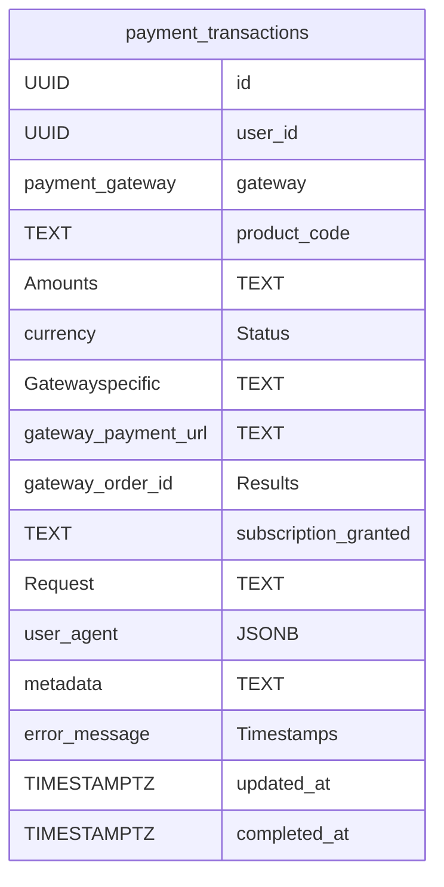

# Knowledge Graph Index

> Auto-generated by graphify. Start here — read community articles for context, then drill into god nodes for detail.

**17611 nodes · 24623 edges · 1394 communities**

---

## System Architecture Flowchart

```mermaid
flowchart TD
    C0["Menu Management (1577 nodes)"]
    C1["Music Generation (1371 nodes)"]
    C2["Music Interaction (729 nodes)"]
    C3["User Achievements (540 nodes)"]
    C4["Lyric Generation (423 nodes)"]
    C5["Accessibility and Rhythm (406 nodes)"]
    C6["Audio Playback (307 nodes)"]
    C7["Media Playback (292 nodes)"]
    C8["Tab Navigation (289 nodes)"]
    C9["User Interface Management (246 nodes)"]
    C10["Audio Analysis (195 nodes)"]
    C11["Note Management (187 nodes)"]
    C12["Error Handling (185 nodes)"]
    C13["Progress Tracking (184 nodes)"]
    C14["Audio Playback (179 nodes)"]
    C15["Subscription Management (164 nodes)"]
    C16["UI Management (156 nodes)"]
    C17["Audio Context Management (154 nodes)"]
    C18["User Interaction (153 nodes)"]
    C19["Audio Analysis (134 nodes)"]
    C20["Audio Visualization (114 nodes)"]
    C21["Admin Management (98 nodes)"]
    C22["Music Notation (97 nodes)"]
    C23["Lyrics Processing (78 nodes)"]
    C24["User Interface Effects (74 nodes)"]
    C25["User Interface Controls (73 nodes)"]
    C26["Dialog Management (67 nodes)"]
    C27["AI Assistant (66 nodes)"]
    C28["Audio Analysis (55 nodes)"]
    C29["Image Optimization (51 nodes)"]
    C30["Character Counter (48 nodes)"]
    C31["Audio Playback (46 nodes)"]
    C32["Sprint Management (44 nodes)"]
    C33["User Moderation (44 nodes)"]
    C34["Music Playback (42 nodes)"]
    C35["User Engagement (39 nodes)"]
    C36["Project Management (39 nodes)"]
    C37["Lyrics Scrolling (38 nodes)"]
    C38["Artist Project Management (38 nodes)"]
    C39["Lyrics Management (38 nodes)"]
    C40["Audio Playback (37 nodes)"]
    C41["User Interaction Tracking (36 nodes)"]
    C42["Audio Management (36 nodes)"]
    C43["Music Composition (35 nodes)"]
    C44["Software Deployment (35 nodes)"]
    C45["Color Management (35 nodes)"]
    C46["Audio Processing (34 nodes)"]
    C47["User Engagement (33 nodes)"]
    C48["Performance Optimization (33 nodes)"]
    C49["Lyrics Synchronization (33 nodes)"]
    C50["Track Management (33 nodes)"]
    C51["Music Visualization (33 nodes)"]
    C52["Canvas Interaction (33 nodes)"]
    C53["Audio Playback Management (33 nodes)"]
    C54["Chat Interface (32 nodes)"]
    C55["Content Generation (32 nodes)"]
    C56["Payment Processing (32 nodes)"]
    C57["Content Management (32 nodes)"]
    C58["Grid Interaction (32 nodes)"]
    C59["Music Generation (31 nodes)"]
    C60["Lyrics Management (31 nodes)"]
    C61["Dialog Management (31 nodes)"]
    C62["Admin Management (30 nodes)"]
    C63["MIDI Management (30 nodes)"]
    C64["Creative Content Generation (30 nodes)"]
    C65["Media Player (30 nodes)"]
    C66["Music Metadata Processing (30 nodes)"]
    C67["User Interface (29 nodes)"]
    C68["Media Processing (29 nodes)"]
    C69["Tag Management (28 nodes)"]
    C70["Media Playback (28 nodes)"]
    C71["Audio Visualization (28 nodes)"]
    C72["Music Production (27 nodes)"]
    C73["Performance Metrics (27 nodes)"]
    C74["Music Playback (27 nodes)"]
    C75["Music Notation (27 nodes)"]
    C76["Audit and Sprint Management (27 nodes)"]
    C77["Media Editing (26 nodes)"]
    C78["Web Accessibility (25 nodes)"]
    C79["Music Timing (25 nodes)"]
    C80["Image Cropper (25 nodes)"]
    C81["Timeline Interaction (24 nodes)"]
    C82["Card Management (24 nodes)"]
    C83["Memory Management (24 nodes)"]
    C84["Charge Management (24 nodes)"]
    C85["Canvas Visualization (23 nodes)"]
    C86["Audio Player (23 nodes)"]
    C87["Music Visualization (23 nodes)"]
    C88["Progress Indicator (23 nodes)"]
    C89["Graph Visualization (23 nodes)"]
    C90["Section Management (23 nodes)"]
    C91["UI Layout Management (23 nodes)"]
    C92["Music Player (23 nodes)"]
    C93["Lyrics Management (22 nodes)"]
    C94["Audio Playback (22 nodes)"]
    C95["Lyrics Management (22 nodes)"]
    C96["Media Player (21 nodes)"]
    C97["Audio Playback (21 nodes)"]
    C98["Note Management (21 nodes)"]
    C99["LED Display Control (21 nodes)"]
    C100["Performance Optimization (21 nodes)"]
    C101["Music Application (21 nodes)"]
    C102["Artist Profile (21 nodes)"]
    C103["Broadcast Management (20 nodes)"]
    C104["Template Management (20 nodes)"]
    C105["Section Management (20 nodes)"]
    C106["Subscription Notifications (20 nodes)"]
    C107["Code Quality (20 nodes)"]
    C108["Audio Management (20 nodes)"]
    C109["Music Composition (20 nodes)"]
    C110["Version Management (20 nodes)"]
    C111["Audio Playback (20 nodes)"]
    C112["Music Player (19 nodes)"]
    C113["Payment Processing (19 nodes)"]
    C114["Audio Recording (19 nodes)"]
    C115["Tag Management (19 nodes)"]
    C116["Draft Management (19 nodes)"]
    C117["Music Project Management (19 nodes)"]
    C118["Lyrics Management (18 nodes)"]
    C119["Version Management (18 nodes)"]
    C120["Error Handling (18 nodes)"]
    C121["UI Animations (18 nodes)"]
    C122["Animation Effects (18 nodes)"]
    C123["Media Interaction (18 nodes)"]
    C124["File Management (18 nodes)"]
    C125["Menu Management (17 nodes)"]
    C126["Section Management (17 nodes)"]
    C127["Animation Control (17 nodes)"]
    C128["Slide Navigation (17 nodes)"]
    C129["Slider Component (17 nodes)"]
    C130["Artist Management (17 nodes)"]
    C131["Music Interaction (17 nodes)"]
    C132["Graph Exploration (17 nodes)"]
    C133["Reports Management (17 nodes)"]
    C134["Notification Management (17 nodes)"]
    C135["Navigation Management (17 nodes)"]
    C136["Audio Visualization (17 nodes)"]
    C137["Dashboard Storage (17 nodes)"]
    C138["Audio Analysis (16 nodes)"]
    C139["Data Navigation (16 nodes)"]
    C140["Audio Timeline (16 nodes)"]
    C141["User Profile Management (16 nodes)"]
    C142["Subscription Management (16 nodes)"]
    C143["Authentication System (16 nodes)"]
    C144["Data Analysis (16 nodes)"]
    C145["Track Management (16 nodes)"]
    C146["Text Editor (16 nodes)"]
    C147["Notification Management (16 nodes)"]
    C148["Guitar Tablature (16 nodes)"]
    C149["Artist Profile (16 nodes)"]
    C150["Guitar Chord Visualization (16 nodes)"]
    C151["Instrument Selection (16 nodes)"]
    C152["AI Prompt Management (16 nodes)"]
    C153["Digital Audio Workstation (16 nodes)"]
    C154["Feedback Management (16 nodes)"]
    C155["Scrolling Management (15 nodes)"]
    C156["Analytics Reporting (15 nodes)"]
    C157["Subscription Management (15 nodes)"]
    C158["Emoji Management (15 nodes)"]
    C159["Version Management (15 nodes)"]
    C160["Product Management (15 nodes)"]
    C161["Subscription Management (15 nodes)"]
    C162["Social Media Interaction (15 nodes)"]
    C163["Musical Timing (15 nodes)"]
    C164["Generation Management (15 nodes)"]
    C165["Template Management (15 nodes)"]
    C166["Music Sequencer (15 nodes)"]
    C167["Chord Navigation (15 nodes)"]
    C168["Text Editor (15 nodes)"]
    C169["Tag Management (15 nodes)"]
    C170["Music Playback (15 nodes)"]
    C171["Tour Navigation (14 nodes)"]
    C172["Media Playback (14 nodes)"]
    C173["Media Playback (14 nodes)"]
    C174["Music Playback (14 nodes)"]
    C175["Music Playback (14 nodes)"]
    C176["Lyrics Editor (14 nodes)"]
    C177["Timeline Editor (14 nodes)"]
    C178["Audio Control (14 nodes)"]
    C179["Audio Controls (14 nodes)"]
    C180["Audio Playback (14 nodes)"]
    C181["Music Notation (14 nodes)"]
    C182["Media Playback (14 nodes)"]
    C183["Deep Link Management (14 nodes)"]
    C184["Referral Management (14 nodes)"]
    C185["Template Management (14 nodes)"]
    C186["Error Handling (14 nodes)"]
    C187["Rendering Metrics (14 nodes)"]
    C188["Audio Application Architecture (14 nodes)"]
    C189["Notification System (14 nodes)"]
    C190["Audio Management (13 nodes)"]
    C191["User Engagement (13 nodes)"]
    C192["Guitar Chord Layout (13 nodes)"]
    C193["Guitar Fingering (13 nodes)"]
    C194["File Management (13 nodes)"]
    C195["Tip Management (13 nodes)"]
    C196["Image Cropping (13 nodes)"]
    C197["Media Management (13 nodes)"]
    C198["MIDI Controller (13 nodes)"]
    C199["Tip Management (13 nodes)"]
    C200["Media Player (13 nodes)"]
    C201["Volume Control (13 nodes)"]
    C202["Chart Visualization (13 nodes)"]
    C203["Data Storage (13 nodes)"]
    C204["Animation Management (13 nodes)"]
    C205["Product Selection (13 nodes)"]
    C206["Music Management (13 nodes)"]
    C207["User Management (13 nodes)"]
    C208["File Migration (13 nodes)"]
    C209["Admin Dashboard (13 nodes)"]
    C210["Media Playback (13 nodes)"]
    C211["Music Arrangement (13 nodes)"]
    C212["Music Sequencer (13 nodes)"]
    C213["Lyrics Management (13 nodes)"]
    C214["Music Tagging (13 nodes)"]
    C215["Template Management (13 nodes)"]
    C216["Music Genre Management (13 nodes)"]
    C217["Chat Interface (13 nodes)"]
    C218["Music Playback (13 nodes)"]
    C219["Media Playback (13 nodes)"]
    C220["Music Generation (13 nodes)"]
    C221["Lyrics Management (13 nodes)"]
    C222["Audio Processing (13 nodes)"]
    C223["Lyrics Management (13 nodes)"]
    C224["Feature Access Control (13 nodes)"]
    C225["Button Variants (12 nodes)"]
    C226["Chip Input (12 nodes)"]
    C227["Audio Visualization (12 nodes)"]
    C228["Media Configuration (12 nodes)"]
    C229["Lyric Parsing (12 nodes)"]
    C230["Notification Management (12 nodes)"]
    C231["Media Handling (12 nodes)"]
    C232["Software Development (12 nodes)"]
    C233["Menu Navigation (12 nodes)"]
    C234["Comment Management (12 nodes)"]
    C235["Drag and Drop (12 nodes)"]
    C236["User Engagement (12 nodes)"]
    C237["Music File Viewer (12 nodes)"]
    C238["Slide Navigation (12 nodes)"]
    C239["Lyrics Management (12 nodes)"]
    C240["User Engagement (12 nodes)"]
    C241["Volume Control (12 nodes)"]
    C242["Interactive UI Controls (12 nodes)"]
    C243["Speech Recognition (12 nodes)"]
    C244["User Preferences (12 nodes)"]
    C245["Lyrics Editor (12 nodes)"]
    C246["Music Recording (12 nodes)"]
    C247["Transcription Management (12 nodes)"]
    C248["Music Recording (12 nodes)"]
    C249["UI State Management (12 nodes)"]
    C250["Image Loading (11 nodes)"]
    C251["UI Components (11 nodes)"]
    C252["Slider Component (11 nodes)"]
    C253["Touch Interaction (11 nodes)"]
    C254["Onboarding Navigation (11 nodes)"]
    C255["E-commerce Transactions (11 nodes)"]
    C256["Audio Mixing (11 nodes)"]
    C257["Media Management (11 nodes)"]
    C258["Text Validation (11 nodes)"]
    C259["Audio Processing (11 nodes)"]
    C260["Audio State Management (11 nodes)"]
    C261["Creative Tools Development (11 nodes)"]
    C262["Design System (11 nodes)"]
    C263["MusicVerse AI (11 nodes)"]
    C264["Music Player (11 nodes)"]
    C265["Music Player (11 nodes)"]
    C266["Admin Image Management (11 nodes)"]
    C267["Analytics Dashboard (11 nodes)"]
    C268["User Retention (11 nodes)"]
    C269["Music Notation (11 nodes)"]
    C270["Music Player (11 nodes)"]
    C271["Project Management (11 nodes)"]
    C272["UI Configuration (11 nodes)"]
    C273["User Interaction (11 nodes)"]
    C274["User Interface Tutorial (11 nodes)"]
    C275["Creator Management (11 nodes)"]
    C276["Data Management (11 nodes)"]
    C277["Tool Management (11 nodes)"]
    C278["User Interaction (11 nodes)"]
    C279["Modal Interaction (11 nodes)"]
    C280["Lyrics Management (11 nodes)"]
    C281["Admin Navigation (11 nodes)"]
    C282["Pricing Information (11 nodes)"]
    C283["Version Management (11 nodes)"]
    C284["Audio Playback (11 nodes)"]
    C285["Audio Playback (11 nodes)"]
    C286["UI State Management (10 nodes)"]
    C287["Audio Error Handling (10 nodes)"]
    C288["UI Animation (10 nodes)"]
    C289["Playlist Management (10 nodes)"]
    C290["Theme Management (10 nodes)"]
    C291["Audio Processing (10 nodes)"]
    C292["Music Analysis (10 nodes)"]
    C293["Image Management (10 nodes)"]
    C294["Design Spacing (10 nodes)"]
    C295["User Authentication (10 nodes)"]
    C296["Audio Processing (10 nodes)"]
    C297["Audio Processing (10 nodes)"]
    C298["Music Production Agents (10 nodes)"]
    C299["Network Request (10 nodes)"]
    C300["Alert Management (10 nodes)"]
    C301["Configuration Management (10 nodes)"]
    C302["Cohort Management (10 nodes)"]
    C303["Music Settings (10 nodes)"]
    C304["Blog Content Management (10 nodes)"]
    C305["UI Components (10 nodes)"]
    C306["Audio Sequencer (10 nodes)"]
    C307["User Ranking (10 nodes)"]
    C308["Check-in Management (10 nodes)"]
    C309["User Interface Actions (10 nodes)"]
    C310["Music Creation (10 nodes)"]
    C311["Audio Playback (10 nodes)"]
    C312["Playlist Management (10 nodes)"]
    C313["Visibility Management (10 nodes)"]
    C314["Date Management (10 nodes)"]
    C315["User Interaction (10 nodes)"]
    C316["Text Area Management (10 nodes)"]
    C317["Slide Navigation (10 nodes)"]
    C318["Product Pricing (10 nodes)"]
    C319["AI Analysis (10 nodes)"]
    C320["Design Configuration (10 nodes)"]
    C321["Project Management (10 nodes)"]
    C322["Drag-and-Drop (10 nodes)"]
    C323["Audio Controls (10 nodes)"]
    C324["Music Visualization (10 nodes)"]
    C325["Tab Management (10 nodes)"]
    C326["Like Button (10 nodes)"]
    C327["Animated Button (10 nodes)"]
    C328["Form Management (10 nodes)"]
    C329["Image Optimization (10 nodes)"]
    C330["Image Handling (10 nodes)"]
    C331["User Interaction (10 nodes)"]
    C332["User Journey Analytics (10 nodes)"]
    C333["Accessibility Utilities (10 nodes)"]
    C334["Reward Calculation (10 nodes)"]
    C335["Mention Notifications (10 nodes)"]
    C336["Remix Management (10 nodes)"]
    C337["Admin Post Management (10 nodes)"]
    C338["Project Management (9 nodes)"]
    C339["Playback Management (9 nodes)"]
    C340["Data Visualization (9 nodes)"]
    C341["User Session Management (9 nodes)"]
    C342["File Validation (9 nodes)"]
    C343["Report Management (9 nodes)"]
    C344["Journey Filtering (9 nodes)"]
    C345["Conversion Metrics (9 nodes)"]
    C346["Error Handling (9 nodes)"]
    C347["Item Management (9 nodes)"]
    C348["Audio Analysis (9 nodes)"]
    C349["Audio Playback (9 nodes)"]
    C350["Feature Management (9 nodes)"]
    C351["Navigation Management (9 nodes)"]
    C352["Modal Management (9 nodes)"]
    C353["Audio Management (9 nodes)"]
    C354["User Check-in (9 nodes)"]
    C355["Media Management (9 nodes)"]
    C356["Editing Interface (9 nodes)"]
    C357["Safe Area Management (9 nodes)"]
    C358["Filter Management (9 nodes)"]
    C359["Project Management (9 nodes)"]
    C360["Media Attributes (9 nodes)"]
    C361["Tool Management (9 nodes)"]
    C362["Lyrics Formatting (9 nodes)"]
    C363["Tag Management (9 nodes)"]
    C364["Alert Management (9 nodes)"]
    C365["Track Management (9 nodes)"]
    C366["User Account Management (9 nodes)"]
    C367["User Notifications (9 nodes)"]
    C368["User Account Management (9 nodes)"]
    C369["Project Publishing (9 nodes)"]
    C370["MIDI Configuration (9 nodes)"]
    C371["Audio Mixing (9 nodes)"]
    C372["Time Management (9 nodes)"]
    C373["User Interface (9 nodes)"]
    C374["UI Layout (9 nodes)"]
    C375["Audio Track Management (9 nodes)"]
    C376["Modal Management (9 nodes)"]
    C377["Chord Management (9 nodes)"]
    C378["Audio Version Management (9 nodes)"]
    C379["Audio Control (9 nodes)"]
    C380["Group Management (9 nodes)"]
    C381["Music Track Attributes (9 nodes)"]
    C382["Version Management (9 nodes)"]
    C383["Editing Functionality (8 nodes)"]
    C384["Input Field (8 nodes)"]
    C385["Animation Effects (8 nodes)"]
    C386["Graphic Properties (8 nodes)"]
    C387["Layout Configuration (8 nodes)"]
    C388["Drum Kits (8 nodes)"]
    C389["Stem Representation (8 nodes)"]
    C390["Playlist Management (8 nodes)"]
    C391["Tab Navigation (8 nodes)"]
    C392["Navigation Management (8 nodes)"]
    C393["State Management (8 nodes)"]
    C394["Mock Utilities (8 nodes)"]
    C395["Version Management (8 nodes)"]
    C396["Music Application (8 nodes)"]
    C397["Music Production (8 nodes)"]
    C398["Watermark Management (8 nodes)"]
    C399["Data Visualization (8 nodes)"]
    C400["Edit Functionality (8 nodes)"]
    C401["Template Management (8 nodes)"]
    C402["Resource Management (8 nodes)"]
    C403["Audio Control (8 nodes)"]
    C404["Error Handling (8 nodes)"]
    C405["User Top-Up (8 nodes)"]
    C406["Artist Management (8 nodes)"]
    C407["UI Components (8 nodes)"]
    C408["Mobile Menu Interaction (8 nodes)"]
    C409["Tutorial Management (8 nodes)"]
    C410["Modal Interaction (8 nodes)"]
    C411["Playlist Management (8 nodes)"]
    C412["Track Management (8 nodes)"]
    C413["Text Editing (8 nodes)"]
    C414["UI Event Handlers (8 nodes)"]
    C415["Recommendation System (8 nodes)"]
    C416["Group Management (8 nodes)"]
    C417["Musical Notes (8 nodes)"]
    C418["Content Comparison (8 nodes)"]
    C419["Variant Management (8 nodes)"]
    C420["Music Interaction (8 nodes)"]
    C421["File Management (8 nodes)"]
    C422["Stem Management (8 nodes)"]
    C423["Media Actions (8 nodes)"]
    C424["Project Management (8 nodes)"]
    C425["Playlist Management (8 nodes)"]
    C426["Dropdown Menu (8 nodes)"]
    C427["Clipboard Management (8 nodes)"]
    C428["UI Components (8 nodes)"]
    C429["UI Component State (8 nodes)"]
    C430["Drag and Motion (8 nodes)"]
    C431["Responsive Design (8 nodes)"]
    C432["Image Loading (8 nodes)"]
    C433["Tag Management (8 nodes)"]
    C434["Audio Processing (8 nodes)"]
    C435["Guitar Chord Management (8 nodes)"]
    C436["Data Formatting (7 nodes)"]
    C437["Response Parsing (7 nodes)"]
    C438["Tab Navigation (7 nodes)"]
    C439["Playback Management (7 nodes)"]
    C440["UI Component Layout (7 nodes)"]
    C441["Timestamp Management (7 nodes)"]
    C442["Mobile Platform Development (7 nodes)"]
    C443["Project Audits (7 nodes)"]
    C444["UI Architecture Refactoring (7 nodes)"]
    C445["UI Design System (7 nodes)"]
    C446["MusicVerse AI (7 nodes)"]
    C447["User Management (7 nodes)"]
    C448["Configuration Health (7 nodes)"]
    C449["Error Telemetry (7 nodes)"]
    C450["Data Visualization (7 nodes)"]
    C451["Deeplink Analytics (7 nodes)"]
    C452["Health Metrics (7 nodes)"]
    C453["Tier Management (7 nodes)"]
    C454["User Interface State (7 nodes)"]
    C455["UI Components (7 nodes)"]
    C456["User Confirmation (7 nodes)"]
    C457["Music Metadata (7 nodes)"]
    C458["User Interaction (7 nodes)"]
    C459["User Interaction (7 nodes)"]
    C460["Error Handling (7 nodes)"]
    C461["Track Management (7 nodes)"]
    C462["FAQ Management (7 nodes)"]
    C463["Tab Management (7 nodes)"]
    C464["Lyrics Visualization (7 nodes)"]
    C465["Music Player (7 nodes)"]
    C466["UI Animation (7 nodes)"]
    C467["UI State Management (7 nodes)"]
    C468["Social Media (7 nodes)"]
    C469["Project Management (7 nodes)"]
    C470["Form Styling (7 nodes)"]
    C471["Music Production (7 nodes)"]
    C472["User Interaction (7 nodes)"]
    C473["Form State Management (7 nodes)"]
    C474["Audio Processing (7 nodes)"]
    C475["Section Management (7 nodes)"]
    C476["Audio Controls (7 nodes)"]
    C477["Audio Control (7 nodes)"]
    C478["UI Color Management (7 nodes)"]
    C479["Version Management (7 nodes)"]
    C480["User Mode Selection (7 nodes)"]
    C481["Category Management (7 nodes)"]
    C482["Track Management (7 nodes)"]
    C483["Music Editing (7 nodes)"]
    C484["Audio Analysis (7 nodes)"]
    C485["Drag and Drop (7 nodes)"]
    C486["Carousel Component (7 nodes)"]
    C487["Context Menu (7 nodes)"]
    C488["UI Components (7 nodes)"]
    C489["Visibility Control (7 nodes)"]
    C490["Scroll Management (7 nodes)"]
    C491["Form Elements (7 nodes)"]
    C492["Pagination System (7 nodes)"]
    C493["Typography Management (7 nodes)"]
    C494["Music Metadata (7 nodes)"]
    C495["Audio Effects (7 nodes)"]
    C496["Caching Mechanism (7 nodes)"]
    C497["User Management (7 nodes)"]
    C498["Caching System (7 nodes)"]
    C499["Version Management (6 nodes)"]
    C500["Event Management (6 nodes)"]
    C501["User Analytics (6 nodes)"]
    C502["Error Handling (6 nodes)"]
    C503["User Blocking (6 nodes)"]
    C504["Audio Processing (6 nodes)"]
    C505["Testing Utilities (6 nodes)"]
    C506["Error Handling (6 nodes)"]
    C507["UI Framework (6 nodes)"]
    C508["Audio Processing (6 nodes)"]
    C509["Data Analysis Integration (6 nodes)"]
    C510["User Statistics (6 nodes)"]
    C511["User Risk Management (6 nodes)"]
    C512["Music Theory (6 nodes)"]
    C513["User Interface Modes (6 nodes)"]
    C514["User Interaction (6 nodes)"]
    C515["User Interaction (6 nodes)"]
    C516["Search Functionality (6 nodes)"]
    C517["UI Variants (6 nodes)"]
    C518["Music Playback (6 nodes)"]
    C519["Pointer Events (6 nodes)"]
    C520["Achievements Management (6 nodes)"]
    C521["Editor Management (6 nodes)"]
    C522["Step Navigation (6 nodes)"]
    C523["Subscription Management (6 nodes)"]
    C524["UI Toggle (6 nodes)"]
    C525["Track Display (6 nodes)"]
    C526["Lyrics Interaction (6 nodes)"]
    C527["Music Playback (6 nodes)"]
    C528["UI State Management (6 nodes)"]
    C529["Undo Redo Management (6 nodes)"]
    C530["Lyrics Translation (6 nodes)"]
    C531["Filtering System (6 nodes)"]
    C532["Data Visualization (6 nodes)"]
    C533["Network Status (6 nodes)"]
    C534["Media Player (6 nodes)"]
    C535["Playlist Management (6 nodes)"]
    C536["Category Management (6 nodes)"]
    C537["Lyrics Management (6 nodes)"]
    C538["Content Management (6 nodes)"]
    C539["Track Management (6 nodes)"]
    C540["Channel Management (6 nodes)"]
    C541["File Upload (6 nodes)"]
    C542["Music Feed (6 nodes)"]
    C543["Audio Effects (6 nodes)"]
    C544["Music Composition (6 nodes)"]
    C545["Audio Mixing (6 nodes)"]
    C546["User Interface (6 nodes)"]
    C547["UI Preset Management (6 nodes)"]
    C548["Category Management (6 nodes)"]
    C549["User Interface (6 nodes)"]
    C550["User Interface State (6 nodes)"]
    C551["Audio Mixer (6 nodes)"]
    C552["File Management (5 nodes)"]
    C553["Copy and Share (5 nodes)"]
    C554["Button Component (5 nodes)"]
    C555["Modal Management (5 nodes)"]
    C556["Media Playback (5 nodes)"]
    C557["UI Icon Management (5 nodes)"]
    C558["Haptic Feedback (5 nodes)"]
    C559["Menu Management (5 nodes)"]
    C560["UI Components (5 nodes)"]
    C561["UI Styling (5 nodes)"]
    C562["Sheet Management (5 nodes)"]
    C563["UI Styling (5 nodes)"]
    C564["User Management (5 nodes)"]
    C565["Styling and Logging (5 nodes)"]
    C566["User Management (5 nodes)"]
    C567["Track Management (5 nodes)"]
    C568["Statistical Analysis (5 nodes)"]
    C569["Configuration Management (5 nodes)"]
    C570["Feature Management (5 nodes)"]
    C571["Content Management (5 nodes)"]
    C572["User Management (5 nodes)"]
    C573["Audio Processing (5 nodes)"]
    C574["Suno Tag Management (5 nodes)"]
    C575["Audio Mixing (5 nodes)"]
    C576["History Management (5 nodes)"]
    C577["Data Duplication (5 nodes)"]
    C578["File Management (5 nodes)"]
    C579["User Interaction (5 nodes)"]
    C580["Data Fetching (5 nodes)"]
    C581["Data Fetching (5 nodes)"]
    C582["Audio Processing (5 nodes)"]
    C583["Interface Management (5 nodes)"]
    C584["Software Development (5 nodes)"]
    C585["Project Documentation (5 nodes)"]
    C586["Web Automation (5 nodes)"]
    C587["User Management (5 nodes)"]
    C588["Error Handling (5 nodes)"]
    C589["Anomaly Detection (5 nodes)"]
    C590["Action Management (5 nodes)"]
    C591["Change Tracker (5 nodes)"]
    C592["Data Visualization (5 nodes)"]
    C593["User Interface (5 nodes)"]
    C594["Data Visualization (5 nodes)"]
    C595["User Engagement (5 nodes)"]
    C596["Preset Management (5 nodes)"]
    C597["UI Components (5 nodes)"]
    C598["Referral Sharing (5 nodes)"]
    C599["Template Management (5 nodes)"]
    C600["Template Management (5 nodes)"]
    C601["Suggestion Management (5 nodes)"]
    C602["Music XML Processing (5 nodes)"]
    C603["UI Elements (5 nodes)"]
    C604["User Interaction (5 nodes)"]
    C605["User Interaction (5 nodes)"]
    C606["UI Theme (5 nodes)"]
    C607["Track Management (5 nodes)"]
    C608["Version Comparison (5 nodes)"]
    C609["UI Components (5 nodes)"]
    C610["User Management (5 nodes)"]
    C611["UI Elements (5 nodes)"]
    C612["Fullscreen Management (5 nodes)"]
    C613["Timer Management (5 nodes)"]
    C614["UI Components (5 nodes)"]
    C615["User Interface (5 nodes)"]
    C616["User Interface (5 nodes)"]
    C617["Project Management (5 nodes)"]
    C618["Timer Management (5 nodes)"]
    C619["Instrument Management (5 nodes)"]
    C620["Preset Management (5 nodes)"]
    C621["Icon Management (5 nodes)"]
    C622["User Input Management (5 nodes)"]
    C623["Change Log (5 nodes)"]
    C624["Image Display (5 nodes)"]
    C625["UI Component Management (5 nodes)"]
    C626["Report Submission (5 nodes)"]
    C627["User Actions (5 nodes)"]
    C628["Content Sharing (5 nodes)"]
    C629["Emotional Metrics (5 nodes)"]
    C630["Dialog Management (5 nodes)"]
    C631["Drawer Management (5 nodes)"]
    C632["Error Handling (5 nodes)"]
    C633["Navigation Menu (5 nodes)"]
    C634["Content Presentation (5 nodes)"]
    C635["Deep Link Management (5 nodes)"]
    C636["User Management (5 nodes)"]
    C637["Route Navigation (5 nodes)"]
    C638["Logging System (5 nodes)"]
    C639["Rendering Configuration (5 nodes)"]
    C640["User Management (5 nodes)"]
    C641["API Response Management (5 nodes)"]
    C642["Action Management (5 nodes)"]
    C643["Animation Timing (5 nodes)"]
    C644["Music Visualization (5 nodes)"]
    C645["Model Metadata (5 nodes)"]
    C646["State Management (5 nodes)"]
    C647["User Interface (5 nodes)"]
    C648["Invoice Management (5 nodes)"]
    C649["Navigation System (5 nodes)"]
    C650["Mobile Studio V2 (5 nodes)"]
    C651["Sprint Reporting (4 nodes)"]
    C652["Dialog Properties (4 nodes)"]
    C653["User Management (4 nodes)"]
    C654["SEO Management (4 nodes)"]
    C655["Webhook Management (4 nodes)"]
    C656["UI Components (4 nodes)"]
    C657["Financial Metrics (4 nodes)"]
    C658["Time Management (4 nodes)"]
    C659["UI State Management (4 nodes)"]
    C660["Data Analysis (4 nodes)"]
    C661["Data Loading (4 nodes)"]
    C662["History Management (4 nodes)"]
    C663["UI Components (4 nodes)"]
    C664["Responsive Layout (4 nodes)"]
    C665["Project Management (4 nodes)"]
    C666["Artist Management (4 nodes)"]
    C667["Audio Control (4 nodes)"]
    C668["User Analytics (4 nodes)"]
    C669["Music Composition (4 nodes)"]
    C670["Artist Management (4 nodes)"]
    C671["Game State (4 nodes)"]
    C672["Artist Suggestions (4 nodes)"]
    C673["Character Limit (4 nodes)"]
    C674["Text Input Handling (4 nodes)"]
    C675["Music Recommendations (4 nodes)"]
    C676["Icon Management (4 nodes)"]
    C677["Hint Management (4 nodes)"]
    C678["Authentication Flow (4 nodes)"]
    C679["User Engagement (4 nodes)"]
    C680["Display Resolution (4 nodes)"]
    C681["User Interface (4 nodes)"]
    C682["Category Management (4 nodes)"]
    C683["Change Management (4 nodes)"]
    C684["Content Parsing (4 nodes)"]
    C685["User Interface (4 nodes)"]
    C686["UI Expansion (4 nodes)"]
    C687["Category Management (4 nodes)"]
    C688["Navigation Management (4 nodes)"]
    C689["Search Functionality (4 nodes)"]
    C690["Music Album (4 nodes)"]
    C691["Status Management (4 nodes)"]
    C692["Data Visualization (4 nodes)"]
    C693["Music Playback (4 nodes)"]
    C694["Content Management (4 nodes)"]
    C695["Media Weighting (4 nodes)"]
    C696["User Onboarding (4 nodes)"]
    C697["Audio Recording (4 nodes)"]
    C698["Transcription Management (4 nodes)"]
    C699["Compression Settings (4 nodes)"]
    C700["Audio Processing (4 nodes)"]
    C701["Media Controls (4 nodes)"]
    C702["Time Management (4 nodes)"]
    C703["Audio Control (4 nodes)"]
    C704["Track Expansion (4 nodes)"]
    C705["Styling Configuration (4 nodes)"]
    C706["Haptic Feedback (4 nodes)"]
    C707["Media Metadata (4 nodes)"]
    C708["Media Playback (4 nodes)"]
    C709["UI Styling (4 nodes)"]
    C710["UI Tabs Management (4 nodes)"]
    C711["Accordion Component (4 nodes)"]
    C712["Alert Management (4 nodes)"]
    C713["UI Components (4 nodes)"]
    C714["Text Formatting (4 nodes)"]
    C715["UI Components (4 nodes)"]
    C716["Product Configuration (4 nodes)"]
    C717["User Management (4 nodes)"]
    C718["Tooltip Management (4 nodes)"]
    C719["Feature Management (4 nodes)"]
    C720["Action Management (4 nodes)"]
    C721["Lyrics Management (4 nodes)"]
    C722["Project Configuration (4 nodes)"]
    C723["Preset Management (4 nodes)"]
    C724["Media Genres (4 nodes)"]
    C725["Z-Index Management (4 nodes)"]
    C726["AI Assistant (4 nodes)"]
    C727["Music Playlist Management (4 nodes)"]
    C728["Telegram Bot (4 nodes)"]
    C729["User Management (4 nodes)"]
    C730["Audio Processing (4 nodes)"]
    C731["Logging System (4 nodes)"]
    C732["Audio Processing (4 nodes)"]
    C733["Onboarding Process (4 nodes)"]
    C734["Analytics Management (4 nodes)"]
    C735["Caching Mechanism (4 nodes)"]
    C736["Tablet Limits (4 nodes)"]
    C737["Voice Input (4 nodes)"]
    C738["Threshold Management (4 nodes)"]
    C739["Performance Monitoring (4 nodes)"]
    C740["Audio Management (4 nodes)"]
    C741["Audio Management (4 nodes)"]
    C742["User Interaction (4 nodes)"]
    C743["Biometric Authentication (4 nodes)"]
    C744["Artist Management (4 nodes)"]
    C745["Data Loading (4 nodes)"]
    C746["Safe Area Management (4 nodes)"]
    C747["Device Detection (4 nodes)"]
    C748["User Engagement (4 nodes)"]
    C749["Media Management (4 nodes)"]
    C750["Content Generation (4 nodes)"]
    C751["Telegram Integration (4 nodes)"]
    C752["Session Management (4 nodes)"]
    C753["UI Component Unification (4 nodes)"]
    C754["Telegram Payments (4 nodes)"]
    C755["Project Management (4 nodes)"]
    C756["UI State Management (4 nodes)"]
    C757["User Roles (4 nodes)"]
    C758["Music Lyrics (4 nodes)"]
    C759["Cohort Analysis (4 nodes)"]
    C760["Tab Management (4 nodes)"]
    C761["Musical Pitch (4 nodes)"]
    C762["Blog Skeletons (4 nodes)"]
    C763["Product Sizing (4 nodes)"]
    C764["Modal State Management (4 nodes)"]
    C765["Media Playback (4 nodes)"]
    C766["Prompt Management (4 nodes)"]
    C767["Resource Monitoring (4 nodes)"]
    C768["UI Elements (4 nodes)"]
    C769["Messaging Configuration (4 nodes)"]
    C770["Analysis Management (4 nodes)"]
    C771["Task Management (3 nodes)"]
    C772["User Interaction (3 nodes)"]
    C773["Data Management (3 nodes)"]
    C774["Category Management (3 nodes)"]
    C775["User Interaction (3 nodes)"]
    C776["Section Type Management (3 nodes)"]
    C777["User Interface (3 nodes)"]
    C778["Selection Management (3 nodes)"]
    C779["Pattern Handling (3 nodes)"]
    C780["Mobile Transitions (3 nodes)"]
    C781["Value Commitment (3 nodes)"]
    C782["UI State Management (3 nodes)"]
    C783["UI Assets (3 nodes)"]
    C784["Offline Management (3 nodes)"]
    C785["UI Animation (3 nodes)"]
    C786["Feature Management (3 nodes)"]
    C787["Bio Display (3 nodes)"]
    C788["Circle Geometry (3 nodes)"]
    C789["Music Theory (3 nodes)"]
    C790["Channel Settings (3 nodes)"]
    C791["User Interface (3 nodes)"]
    C792["Icon Sizing (3 nodes)"]
    C793["User Interface (3 nodes)"]
    C794["Feature Toggles (3 nodes)"]
    C795["Type Selection (3 nodes)"]
    C796["Keyboard Shortcuts (3 nodes)"]
    C797["Preset Management (3 nodes)"]
    C798["Audio Controls (3 nodes)"]
    C799["User Interaction (3 nodes)"]
    C800["Music Management (3 nodes)"]
    C801["User Interface (3 nodes)"]
    C802["Grid Layout (3 nodes)"]
    C803["Telegram UI (3 nodes)"]
    C804["Messaging Themes (3 nodes)"]
    C805["Prompt Management (3 nodes)"]
    C806["Media Controls (3 nodes)"]
    C807["Audio Playback (3 nodes)"]
    C808["Track Navigation (3 nodes)"]
    C809["Data Management (3 nodes)"]
    C810["Client Permissions (3 nodes)"]
    C811["Alert Management (3 nodes)"]
    C812["UI Layout (3 nodes)"]
    C813["Image Loading (3 nodes)"]
    C814["UI Components (3 nodes)"]
    C815["Collapsible UI (3 nodes)"]
    C816["Size Management (3 nodes)"]
    C817["Emotion Tracking (3 nodes)"]
    C818["User Management (3 nodes)"]
    C819["Hover Card UI (3 nodes)"]
    C820["Product Attributes (3 nodes)"]
    C821["Popover Component (3 nodes)"]
    C822["UI Navigation (3 nodes)"]
    C823["Toggle Management (3 nodes)"]
    C824["User Interaction (3 nodes)"]
    C825["Visual Indicators (3 nodes)"]
    C826["UI Effects (3 nodes)"]
    C827["Beat Evaluation (3 nodes)"]
    C828["Audio Processing (3 nodes)"]
    C829["User Authentication (3 nodes)"]
    C830["Application State (3 nodes)"]
    C831["Logging System (3 nodes)"]
    C832["Configuration Management (3 nodes)"]
    C833["User Authentication (3 nodes)"]
    C834["Audio Processing (3 nodes)"]
    C835["Payment Management (3 nodes)"]
    C836["Audio Processing (3 nodes)"]
    C837["Section Notes (3 nodes)"]
    C838["Subscription Management (3 nodes)"]
    C839["MIDI Logging (3 nodes)"]
    C840["Audio Processing (3 nodes)"]
    C841["Configuration Management (3 nodes)"]
    C842["User Access Levels (3 nodes)"]
    C843["Status Management (3 nodes)"]
    C844["Status Management (3 nodes)"]
    C845["Status Management (3 nodes)"]
    C846["Audio Mixing (3 nodes)"]
    C847["Synchronization Settings (3 nodes)"]
    C848["Audio Processing (3 nodes)"]
    C849["User Management (3 nodes)"]
    C850["Configuration Management (3 nodes)"]
    C851["Keyboard Shortcuts (3 nodes)"]
    C852["Operation Management (3 nodes)"]
    C853["Supabase Configuration (3 nodes)"]
    C854["User Authentication (3 nodes)"]
    C855["Audio Processing (3 nodes)"]
    C856["User Interface (3 nodes)"]
    C857["Funnel Analytics (3 nodes)"]
    C858["Track Visualization (3 nodes)"]
    C859["User Authentication (3 nodes)"]
    C860["User Authentication (3 nodes)"]
    C861["Audio Processing (3 nodes)"]
    C862["Error Handling (3 nodes)"]
    C863["Performance Management (3 nodes)"]
    C864["React Error Handling (3 nodes)"]
    C865["Quality Assurance (3 nodes)"]
    C866["UI Redesign (3 nodes)"]
    C867["Mobile UI Redesign (3 nodes)"]
    C868["Klang.io Integration (3 nodes)"]
    C869["Authentication Control (3 nodes)"]
    C870["User Management (3 nodes)"]
    C871["UI State Management (3 nodes)"]
    C872["User Management (3 nodes)"]
    C873["Product Information (3 nodes)"]
    C874["Music Structure (3 nodes)"]
    C875["Stroke Analysis (3 nodes)"]
    C876["Dialog Management (3 nodes)"]
    C877["Drum Step Length (3 nodes)"]
    C878["User Management (3 nodes)"]
    C879["User Authentication (3 nodes)"]
    C880["Form Management (3 nodes)"]
    C881["Task Status (3 nodes)"]
    C882["User Management (3 nodes)"]
    C883["Provider Management (3 nodes)"]
    C884["Validation Handling (3 nodes)"]
    C885["Responsive Design (3 nodes)"]
    C886["User Interface (3 nodes)"]
    C887["Size Management (3 nodes)"]
    C888["Text Processing (3 nodes)"]
    C889["Synchronized Drawing (3 nodes)"]
    C890["Step Management (3 nodes)"]
    C891["User Management (3 nodes)"]
    C892["User Authentication (3 nodes)"]
    C893["Workflow Management (3 nodes)"]
    C894["Score Management (3 nodes)"]
    C895["User Authentication (3 nodes)"]
    C896["User Interface Styles (3 nodes)"]
    C897["String Manipulation (3 nodes)"]
    C898["Template Management (3 nodes)"]
    C899["User Management (3 nodes)"]
    C900["User Interface (3 nodes)"]
    C901["Data Fetching (3 nodes)"]
    C902["UI Rendering (3 nodes)"]
    C903["Last Element Retrieval (3 nodes)"]
    C904["User Management (3 nodes)"]
    C905["User Identity (3 nodes)"]
    C906["Size Management (3 nodes)"]
    C907["Task Status (3 nodes)"]
    C908["Variant Management (3 nodes)"]
    C909["User Experience (3 nodes)"]
    C910["Recommendation System (3 nodes)"]
    C911["Bar Chart (3 nodes)"]
    C912["User Management (3 nodes)"]
    C913["File Download (3 nodes)"]
    C914["UI State Management (3 nodes)"]
    C915["Time Management (3 nodes)"]
    C916["Lyrics Management (2 nodes)"]
    C917["Type Limitation (2 nodes)"]
    C918["Transcription Management (2 nodes)"]
    C919["Audio Playback (2 nodes)"]
    C920["UI Components (2 nodes)"]
    C921["Sheet Interaction (2 nodes)"]
    C922["Tag Management (2 nodes)"]
    C923["Visibility Management (2 nodes)"]
    C924["Stem Display (2 nodes)"]
    C925["Technical Information (2 nodes)"]
    C926["Navigation Components (2 nodes)"]
    C927["Configuration Management (2 nodes)"]
    C928["Configuration Management (2 nodes)"]
    C929["OTP Input (2 nodes)"]
    C930["Product Labeling (2 nodes)"]
    C931["UI Sizing (2 nodes)"]
    C932["Radio Button Selection (2 nodes)"]
    C933["Scrolling Interface (2 nodes)"]
    C934["Configuration Management (2 nodes)"]
    C935["UI Styling (2 nodes)"]
    C936["Data Presentation (2 nodes)"]
    C937["Toggle Management (2 nodes)"]
    C938["State Management (2 nodes)"]
    C939["UI Animation (2 nodes)"]
    C940["Task Tracking (2 nodes)"]
    C941["Messaging Logger (2 nodes)"]
    C942["Messaging Logger (2 nodes)"]
    C943["Responsive Design (2 nodes)"]
    C944["Music Playlists (2 nodes)"]
    C945["Application State (2 nodes)"]
    C946["Logging System (2 nodes)"]
    C947["User Management (2 nodes)"]
    C948["Logging System (2 nodes)"]
    C949["Haptic Feedback (2 nodes)"]
    C950["User Management (2 nodes)"]
    C951["Logging System (2 nodes)"]
    C952["Logging System (2 nodes)"]
    C953["User Management (2 nodes)"]
    C954["Data Storage (2 nodes)"]
    C955["Logging System (2 nodes)"]
    C956["User Management (2 nodes)"]
    C957["User Management (2 nodes)"]
    C958["Track Data Management (2 nodes)"]
    C959["Stem Type Management (2 nodes)"]
    C960["User Management (2 nodes)"]
    C961["User Management (2 nodes)"]
    C962["Audio Logging (2 nodes)"]
    C963["User Management (2 nodes)"]
    C964["Picture-in-Picture (2 nodes)"]
    C965["Audio Configuration (2 nodes)"]
    C966["Configuration Management (2 nodes)"]
    C967["Application State (2 nodes)"]
    C968["STEM Prioritization (2 nodes)"]
    C969["User Management (2 nodes)"]
    C970["User Management (2 nodes)"]
    C971["State Management (2 nodes)"]
    C972["Configuration Management (2 nodes)"]
    C973["User Management (2 nodes)"]
    C974["Logging System (2 nodes)"]
    C975["Logging System (2 nodes)"]
    C976["Logging System (2 nodes)"]
    C977["Logging System (2 nodes)"]
    C978["Configuration Management (2 nodes)"]
    C979["Navigation Controls (2 nodes)"]
    C980["Navigation Controls (2 nodes)"]
    C981["Mobile Analytics (2 nodes)"]
    C982["Performance Monitoring (2 nodes)"]
    C983["Data Access (2 nodes)"]
    C984["Reference Management (2 nodes)"]
    C985["Provider Management (2 nodes)"]
    C986["Data Expiry Management (2 nodes)"]
    C987["Lyrics History (2 nodes)"]
    C988["Lyrics Management (2 nodes)"]
    C989["Project Management (2 nodes)"]
    C990["Tracking System (2 nodes)"]
    C991["View Management (2 nodes)"]
    C992["Telegram Integration (2 nodes)"]
    C993["Client Query (2 nodes)"]
    C994["Client Query (2 nodes)"]
    C995["User Authentication (2 nodes)"]
    C996["Music Player (2 nodes)"]
    C997["Telegram Bot (2 nodes)"]
    C998["Sprint Closure (2 nodes)"]
    C999["User Engagement (2 nodes)"]
    C1000["MusicVerse AI (2 nodes)"]
    C1001["UI/UX Audit (2 nodes)"]
    C1002["Web Page Layout (2 nodes)"]
    C1003["Configuration Management (2 nodes)"]
    C1004["Shadow Management (2 nodes)"]
    C1005["User Management (2 nodes)"]
    C1006["Instrument Management (2 nodes)"]
    C1007["Audio Processing (2 nodes)"]
    C1008["User Management (2 nodes)"]
    C1009["Track Management (2 nodes)"]
    C1010["User Management (2 nodes)"]
    C1011["User Management (2 nodes)"]
    C1012["Application Tiers (2 nodes)"]
    C1013["System Monitoring (2 nodes)"]
    C1014["Color Management (2 nodes)"]
    C1015["User Authentication (2 nodes)"]
    C1016["User Management (2 nodes)"]
    C1017["User Management (2 nodes)"]
    C1018["User Management (2 nodes)"]
    C1019["User Management (2 nodes)"]
    C1020["Web Performance (2 nodes)"]
    C1021["Navigation System (2 nodes)"]
    C1022["Audio Recording (2 nodes)"]
    C1023["User Management (2 nodes)"]
    C1024["UI Layout (2 nodes)"]
    C1025["File Management (2 nodes)"]
    C1026["User Management (2 nodes)"]
    C1027["Track Selection (2 nodes)"]
    C1028["Music Instrument Selector (2 nodes)"]
    C1029["Pointer Events (2 nodes)"]
    C1030["Pattern Management (2 nodes)"]
    C1031["Credit Management (2 nodes)"]
    C1032["User Management (2 nodes)"]
    C1033["User Role Management (2 nodes)"]
    C1034["User Management (2 nodes)"]
    C1035["Document Structure (2 nodes)"]
    C1036["User Management (2 nodes)"]
    C1037["Contextual Information (2 nodes)"]
    C1038["User Management (2 nodes)"]
    C1039["Process Management (2 nodes)"]
    C1040["Music Library (2 nodes)"]
    C1041["User Management (2 nodes)"]
    C1042["Music Display (2 nodes)"]
    C1043["Device Detection (2 nodes)"]
    C1044["Gap Management (2 nodes)"]
    C1045["UI Refresh (2 nodes)"]
    C1046["Time Management (2 nodes)"]
    C1047["Content Management (2 nodes)"]
    C1048["Text Processing (2 nodes)"]
    C1049["User Management (2 nodes)"]
    C1050["User Management (2 nodes)"]
    C1051["User Management (2 nodes)"]
    C1052["User Management (2 nodes)"]
    C1053["User Management (2 nodes)"]
    C1054["User Management (2 nodes)"]
    C1055["User Management (2 nodes)"]
    C1056["Feature Management (2 nodes)"]
    C1057["User Management (2 nodes)"]
    C1058["User Authentication (2 nodes)"]
    C1059["User Onboarding (2 nodes)"]
    C1060["User Interface (2 nodes)"]
    C1061["User Management (2 nodes)"]
    C1062["User Management (2 nodes)"]
    C1063["User Interface (2 nodes)"]
    C1064["Version Management (2 nodes)"]
    C1065["User Management (2 nodes)"]
    C1066["User Management (2 nodes)"]
    C1067["User Management (2 nodes)"]
    C1068["Track Editing (2 nodes)"]
    C1069["Project Configuration (2 nodes)"]
    C1070["Project Management (2 nodes)"]
    C1071["Mobile Actions (2 nodes)"]
    C1072["Project Management (2 nodes)"]
    C1073["User Management (2 nodes)"]
    C1074["User Management (2 nodes)"]
    C1075["User Configuration (2 nodes)"]
    C1076["Data Visualization (2 nodes)"]
    C1077["Modes Management (2 nodes)"]
    C1078["Data Loading (2 nodes)"]
    C1079["User Management (2 nodes)"]
    C1080["User Management (2 nodes)"]
    C1081["Device Detection (2 nodes)"]
    C1082["User Interface (2 nodes)"]
    C1083["Navigation System (2 nodes)"]
    C1084["Navigation System (2 nodes)"]
    C1085["Progress Tracking (2 nodes)"]
    C1086["Device Detection (2 nodes)"]
    C1087["User Authentication (2 nodes)"]
    C1088["Marker Management (2 nodes)"]
    C1089["Mobile Actions (2 nodes)"]
    C1090["Track Export (2 nodes)"]
    C1091["User Management (2 nodes)"]
    C1092["User Authentication (2 nodes)"]
    C1093["UI State Management (2 nodes)"]
    C1094["Configuration Management (2 nodes)"]
    C1095["Track Management (2 nodes)"]
    C1096["Game Status (2 nodes)"]
    C1097["Sheet Interaction (2 nodes)"]
    C1098["Track Management (2 nodes)"]
    C1099["User Management (2 nodes)"]
    C1100["User Management (2 nodes)"]
    C1101["Version Management (2 nodes)"]
    C1102["User Management (2 nodes)"]
    C1103["Lyrics Management (2 nodes)"]
    C1104["User Interaction (2 nodes)"]
    C1105["Reference Management (2 nodes)"]
    C1106["Music Analytics (2 nodes)"]
    C1107["User Management (2 nodes)"]
    C1108["Animation Control (2 nodes)"]
    C1109["Media Formatting (2 nodes)"]
    C1110["Badge Management (2 nodes)"]
    C1111["Card Management (2 nodes)"]
    C1112["User Input (2 nodes)"]
    C1113["Game Character (2 nodes)"]
    C1114["User Management (2 nodes)"]
    C1115["User Management (2 nodes)"]
    C1116["Progress Tracking (2 nodes)"]
    C1117["System Readiness (2 nodes)"]
    C1118["Pull-to-Refresh (2 nodes)"]
    C1119["Data Formatting (2 nodes)"]
    C1120["UI Animation (2 nodes)"]
    C1121["User Interface (2 nodes)"]
    C1122["Tab Management (2 nodes)"]
    C1123["User Input (2 nodes)"]
    C1124["Accessibility Features (2 nodes)"]
    C1125["Audio Control (2 nodes)"]
    C1126["Signal Visualization (2 nodes)"]
    C1127["User Management (2 nodes)"]
    C1128["User Management (2 nodes)"]
    C1129["User Management (2 nodes)"]
    C1130["User Management (2 nodes)"]
    C1131["User Management (2 nodes)"]
    C1132["User Management (2 nodes)"]
    C1133["User Management (2 nodes)"]
    C1134["User Management (2 nodes)"]
    C1135["User Management (2 nodes)"]
    C1136["User Management (2 nodes)"]
    C1137["User Management (2 nodes)"]
    C1138["User Management (2 nodes)"]
    C1139["User Management (2 nodes)"]
    C1140["User Management (2 nodes)"]
    C1141["User Management (2 nodes)"]
    C1142["User Management (2 nodes)"]
    C1143["User Management (2 nodes)"]
    C1144["User Management (2 nodes)"]
    C1145["User Management (2 nodes)"]
    C1146["User Management (2 nodes)"]
    C1147["User Management (2 nodes)"]
    C1148["User Management (1 nodes)"]
    C1149["User Management (1 nodes)"]
    C1150["User Management (1 nodes)"]
    C1151["User Management (1 nodes)"]
    C1152["User Management (1 nodes)"]
    C1153["User Management (1 nodes)"]
    C1154["User Management (1 nodes)"]
    C1155["User Management (1 nodes)"]
    C1156["User Management (1 nodes)"]
    C1157["User Management (1 nodes)"]
    C1158["User Management (1 nodes)"]
    C1159["User Management (1 nodes)"]
    C1160["User Management (1 nodes)"]
    C1161["User Management (1 nodes)"]
    C1162["User Management (1 nodes)"]
    C1163["User Management (1 nodes)"]
    C1164["User Management (1 nodes)"]
    C1165["User Management (1 nodes)"]
    C1166["User Management (1 nodes)"]
    C1167["Configuration Management (1 nodes)"]
    C1168["User Authentication (1 nodes)"]
    C1169["Dashboard Management (1 nodes)"]
    C1170["Audio Management (1 nodes)"]
    C1171["User Management (1 nodes)"]
    C1172["User Management (1 nodes)"]
    C1173["User Management (1 nodes)"]
    C1174["Statistics Management (1 nodes)"]
    C1175["User Authentication (1 nodes)"]
    C1176["User Management (1 nodes)"]
    C1177["User Management (1 nodes)"]
    C1178["User Interface (1 nodes)"]
    C1179["User Management (1 nodes)"]
    C1180["User Management (1 nodes)"]
    C1181["Product Management (1 nodes)"]
    C1182["Audio Visualization (1 nodes)"]
    C1183["UI Consistency (1 nodes)"]
    C1184["Music Audit (1 nodes)"]
    C1185["Social Features (1 nodes)"]
    C1186["UI Component Development (1 nodes)"]
    C1187["Studio Management (1 nodes)"]
    C1188["Repository Audit (1 nodes)"]
    C1189["Audio Troubleshooting (1 nodes)"]
    C1190["Software Optimization (1 nodes)"]
    C1191["Telegram Bot Payments (1 nodes)"]
    C1192["Agile Project Management (1 nodes)"]
    C1193["Music Production (1 nodes)"]
    C1194["Music Production (1 nodes)"]
    C1195["Mobile Studio Migration (1 nodes)"]
    C1196["User Management (1 nodes)"]
    C1197["User Management (1 nodes)"]
    C1198["User Management (1 nodes)"]
    C1199["User Management (1 nodes)"]
    C1200["User Management (1 nodes)"]
    C1201["User Management (1 nodes)"]
    C1202["User Management (1 nodes)"]
    C1203["User Management (1 nodes)"]
    C1204["User Management (1 nodes)"]
    C1205["User Management (1 nodes)"]
    C1206["User Management (1 nodes)"]
    C1207["User Management (1 nodes)"]
    C1208["User Management (1 nodes)"]
    C1209["User Management (1 nodes)"]
    C1210["User Management (1 nodes)"]
    C1211["User Management (1 nodes)"]
    C1212["User Management (1 nodes)"]
    C1213["User Management (1 nodes)"]
    C1214["User Management (1 nodes)"]
    C1215["User Management (1 nodes)"]
    C1216["User Authentication (1 nodes)"]
    C1217["User Management (1 nodes)"]
    C1218["User Management (1 nodes)"]
    C1219["User Management (1 nodes)"]
    C1220["User Management (1 nodes)"]
    C1221["User Management (1 nodes)"]
    C1222["User Management (1 nodes)"]
    C1223["User Management (1 nodes)"]
    C1224["User Authentication (1 nodes)"]
    C1225["User Management (1 nodes)"]
    C1226["User Management (1 nodes)"]
    C1227["User Management (1 nodes)"]
    C1228["User Management (1 nodes)"]
    C1229["User Management (1 nodes)"]
    C1230["User Management (1 nodes)"]
    C1231["User Management (1 nodes)"]
    C1232["User Management (1 nodes)"]
    C1233["User Management (1 nodes)"]
    C1234["User Management (1 nodes)"]
    C1235["User Management (1 nodes)"]
    C1236["User Management (1 nodes)"]
    C1237["User Authentication (1 nodes)"]
    C1238["User Management (1 nodes)"]
    C1239["User Management (1 nodes)"]
    C1240["User Management (1 nodes)"]
    C1241["User Management (1 nodes)"]
    C1242["User Management (1 nodes)"]
    C1243["User Management (1 nodes)"]
    C1244["User Management (1 nodes)"]
    C1245["User Management (1 nodes)"]
    C1246["User Management (1 nodes)"]
    C1247["User Management (1 nodes)"]
    C1248["User Management (1 nodes)"]
    C1249["User Authentication (1 nodes)"]
    C1250["User Management (1 nodes)"]
    C1251["User Management (1 nodes)"]
    C1252["User Management (1 nodes)"]
    C1253["User Management (1 nodes)"]
    C1254["User Management (1 nodes)"]
    C1255["User Authentication (1 nodes)"]
    C1256["User Management (1 nodes)"]
    C1257["User Management (1 nodes)"]
    C1258["User Management (1 nodes)"]
    C1259["User Management (1 nodes)"]
    C1260["User Management (1 nodes)"]
    C1261["User Management (1 nodes)"]
    C1262["User Authentication (1 nodes)"]
    C1263["User Management (1 nodes)"]
    C1264["User Management (1 nodes)"]
    C1265["User Management (1 nodes)"]
    C1266["User Management (1 nodes)"]
    C1267["User Management (1 nodes)"]
    C1268["User Authentication (1 nodes)"]
    C1269["User Management (1 nodes)"]
    C1270["User Management (1 nodes)"]
    C1271["User Management (1 nodes)"]
    C1272["User Management (1 nodes)"]
    C1273["User Management (1 nodes)"]
    C1274["User Management (1 nodes)"]
    C1275["User Management (1 nodes)"]
    C1276["User Management (1 nodes)"]
    C1277["User Management (1 nodes)"]
    C1278["User Management (1 nodes)"]
    C1279["User Management (1 nodes)"]
    C1280["User Management (1 nodes)"]
    C1281["User Management (1 nodes)"]
    C1282["User Management (1 nodes)"]
    C1283["User Management (1 nodes)"]
    C1284["User Management (1 nodes)"]
    C1285["User Authentication (1 nodes)"]
    C1286["User Authentication (1 nodes)"]
    C1287["User Management (1 nodes)"]
    C1288["User Management (1 nodes)"]
    C1289["User Management (1 nodes)"]
    C1290["User Management (1 nodes)"]
    C1291["User Management (1 nodes)"]
    C1292["User Management (1 nodes)"]
    C1293["User Authentication (1 nodes)"]
    C1294["User Management (1 nodes)"]
    C1295["User Management (1 nodes)"]
    C1296["User Management (1 nodes)"]
    C1297["User Management (1 nodes)"]
    C1298["User Management (1 nodes)"]
    C1299["User Management (1 nodes)"]
    C1300["User Management (1 nodes)"]
    C1301["User Management (1 nodes)"]
    C1302["User Management (1 nodes)"]
    C1303["User Management (1 nodes)"]
    C1304["User Management (1 nodes)"]
    C1305["User Management (1 nodes)"]
    C1306["User Management (1 nodes)"]
    C1307["User Management (1 nodes)"]
    C1308["User Management (1 nodes)"]
    C1309["User Management (1 nodes)"]
    C1310["User Authentication (1 nodes)"]
    C1311["User Management (1 nodes)"]
    C1312["User Management (1 nodes)"]
    C1313["User Authentication (1 nodes)"]
    C1314["User Management (1 nodes)"]
    C1315["User Management (1 nodes)"]
    C1316["User Management (1 nodes)"]
    C1317["User Management (1 nodes)"]
    C1318["User Management (1 nodes)"]
    C1319["User Management (1 nodes)"]
    C1320["User Management (1 nodes)"]
    C1321["User Management (1 nodes)"]
    C1322["User Management (1 nodes)"]
    C1323["User Management (1 nodes)"]
    C1324["User Management (1 nodes)"]
    C1325["User Management (1 nodes)"]
    C1326["User Management (1 nodes)"]
    C1327["User Management (1 nodes)"]
    C1328["User Management (1 nodes)"]
    C1329["User Management (1 nodes)"]
    C1330["User Management (1 nodes)"]
    C1331["User Management (1 nodes)"]
    C1332["User Authentication (1 nodes)"]
    C1333["User Management (1 nodes)"]
    C1334["User Authentication (1 nodes)"]
    C1335["User Management (1 nodes)"]
    C1336["User Management (1 nodes)"]
    C1337["User Management (1 nodes)"]
    C1338["User Management (1 nodes)"]
    C1339["User Management (1 nodes)"]
    C1340["User Management (1 nodes)"]
    C1341["User Authentication (1 nodes)"]
    C1342["User Authentication (1 nodes)"]
    C1343["User Management (1 nodes)"]
    C1344["User Authentication (1 nodes)"]
    C1345["User Management (1 nodes)"]
    C1346["User Management (1 nodes)"]
    C1347["User Management (1 nodes)"]
    C1348["User Management (1 nodes)"]
    C1349["User Authentication (1 nodes)"]
    C1350["User Management (1 nodes)"]
    C1351["User Management (1 nodes)"]
    C1352["User Management (1 nodes)"]
    C1353["User Management (1 nodes)"]
    C1354["User Management (1 nodes)"]
    C1355["User Management (1 nodes)"]
    C1356["User Management (1 nodes)"]
    C1357["User Management (1 nodes)"]
    C1358["User Management (1 nodes)"]
    C1359["User Management (1 nodes)"]
    C1360["User Management (1 nodes)"]
    C1361["User Management (1 nodes)"]
    C1362["User Management (1 nodes)"]
    C1363["User Management (1 nodes)"]
    C1364["User Management (1 nodes)"]
    C1365["User Management (1 nodes)"]
    C1366["User Management (1 nodes)"]
    C1367["User Management (1 nodes)"]
    C1368["User Management (1 nodes)"]
    C1369["User Management (1 nodes)"]
    C1370["User Management (1 nodes)"]
    C1371["User Management (1 nodes)"]
    C1372["User Management (1 nodes)"]
    C1373["User Management (1 nodes)"]
    C1374["User Management (1 nodes)"]
    C1375["User Management (1 nodes)"]
    C1376["User Management (1 nodes)"]
    C1377["User Management (1 nodes)"]
    C1378["User Management (1 nodes)"]
    C1379["User Management (1 nodes)"]
    C1380["User Management (1 nodes)"]
    C1381["User Management (1 nodes)"]
    C1382["User Management (1 nodes)"]
    C1383["User Management (1 nodes)"]
    C1384["User Management (1 nodes)"]
    C1385["User Management (1 nodes)"]
    C1386["User Management (1 nodes)"]
    C1387["User Management (1 nodes)"]
    C1388["User Management (1 nodes)"]
    C1389["User Management (1 nodes)"]
    C1390["User Management (1 nodes)"]
    C1391["User Management (1 nodes)"]
    C1392["User Management (1 nodes)"]
    C1393["User Management (1 nodes)"]
    C2 -->|132 edges| C0
    C0 -->|84 edges| C2
    C1 -->|84 edges| C0
    C6 -->|72 edges| C0
    C4 -->|70 edges| C0
    C0 -->|63 edges| C1
    C22 -->|39 edges| C0
    C0 -->|33 edges| C9
    C16 -->|32 edges| C0
    C0 -->|27 edges| C4
    C0 -->|25 edges| C22
    C15 -->|24 edges| C0
    C7 -->|24 edges| C0
    C14 -->|23 edges| C0
    C0 -->|21 edges| C6
    C0 -->|21 edges| C69
    C10 -->|20 edges| C0
    C12 -->|18 edges| C0
    C10 -->|17 edges| C2
    C11 -->|15 edges| C0
    C3 -->|15 edges| C0
    C9 -->|15 edges| C0
    C5 -->|13 edges| C0
    C0 -->|12 edges| C12
    C13 -->|12 edges| C0
    C18 -->|11 edges| C0
    C1 -->|10 edges| C9
    C2 -->|9 edges| C4
    C28 -->|9 edges| C0
    C0 -->|9 edges| C222
    C0 -->|8 edges| C90
    C17 -->|8 edges| C0
    C0 -->|8 edges| C45
    C3 -->|7 edges| C7
    C3 -->|7 edges| C4
    C20 -->|7 edges| C0
    C170 -->|7 edges| C0
    C90 -->|7 edges| C0
    C22 -->|7 edges| C1
    C45 -->|7 edges| C0
    C2 -->|6 edges| C22
    C4 -->|6 edges| C2
    C422 -->|6 edges| C0
    C280 -->|6 edges| C0
    C110 -->|6 edges| C0
    C1 -->|6 edges| C45
    C0 -->|5 edges| C16
    C0 -->|5 edges| C11
    C2 -->|5 edges| C17
    C17 -->|5 edges| C2
    C2 -->|5 edges| C13
    C12 -->|5 edges| C2
    C0 -->|5 edges| C28
    C0 -->|5 edges| C19
    C4 -->|5 edges| C1
    C122 -->|5 edges| C0
    C0 -->|4 edges| C15
    C14 -->|4 edges| C9
    C437 -->|4 edges| C0
    C0 -->|4 edges| C10
    C0 -->|4 edges| C5
    C11 -->|4 edges| C2
    C85 -->|4 edges| C0
    C31 -->|4 edges| C0
    C4 -->|4 edges| C22
    C126 -->|4 edges| C0
    C2 -->|3 edges| C9
    C48 -->|3 edges| C0
    C0 -->|3 edges| C7
    C295 -->|3 edges| C0
    C25 -->|3 edges| C3
    C15 -->|3 edges| C2
    C5 -->|3 edges| C2
    C584 -->|3 edges| C0
    C10 -->|3 edges| C15
    C3 -->|3 edges| C19
    C4 -->|3 edges| C11
    C0 -->|3 edges| C548
    C1 -->|3 edges| C222
    C0 -->|3 edges| C334
    C0 -->|3 edges| C494
    C69 -->|3 edges| C0
    C8 -->|3 edges| C0
    C0 -->|2 edges| C8
    C14 -->|2 edges| C10
    C6 -->|2 edges| C4
    C90 -->|2 edges| C2
    C652 -->|2 edges| C0
    C27 -->|2 edges| C0
    C190 -->|2 edges| C0
    C6 -->|2 edges| C9
    C12 -->|2 edges| C5
    C174 -->|2 edges| C0
    C567 -->|2 edges| C0
    C33 -->|2 edges| C0
    C21 -->|2 edges| C0
    C177 -->|2 edges| C0
    C236 -->|2 edges| C0
    C461 -->|2 edges| C0
    C24 -->|2 edges| C2
    C24 -->|2 edges| C0
    C11 -->|2 edges| C5
    C25 -->|2 edges| C7
    C10 -->|2 edges| C4
    C60 -->|2 edges| C0
    C3 -->|2 edges| C29
    C475 -->|2 edges| C0
    C11 -->|2 edges| C4
    C91 -->|2 edges| C0
    C477 -->|2 edges| C0
    C0 -->|2 edges| C13
    C4 -->|2 edges| C12
    C4 -->|2 edges| C19
    C9 -->|2 edges| C1
    C4 -->|2 edges| C9
    C0 -->|2 edges| C71
    C117 -->|2 edges| C0
    C4 -->|2 edges| C33
    C26 -->|2 edges| C2
    C188 -->|2 edges| C1
    C109 -->|2 edges| C0
    C34 -->|2 edges| C0
    C761 -->|2 edges| C0
    C246 -->|2 edges| C0
    C19 -->|2 edges| C0
    C334 -->|2 edges| C0
    C222 -->|2 edges| C0
    C5 -->|2 edges| C13
    C499 -->|1 edges| C0
    C15 -->|1 edges| C8
    C14 -->|1 edges| C6
    C14 -->|1 edges| C16
    C14 -->|1 edges| C1
    C14 -->|1 edges| C8
    C286 -->|1 edges| C0
    C16 -->|1 edges| C4
    C19 -->|1 edges| C6
    C6 -->|1 edges| C16
    C0 -->|1 edges| C761
    C9 -->|1 edges| C2
    C0 -->|1 edges| C760
    C760 -->|1 edges| C0
    C0 -->|1 edges| C127
    C0 -->|1 edges| C330
    C0 -->|1 edges| C48
    C0 -->|1 edges| C21
    C2 -->|1 edges| C11
    C2 -->|1 edges| C6
    C2 -->|1 edges| C246
    C2 -->|1 edges| C110
    C2 -->|1 edges| C12
    C2 -->|1 edges| C5
    C4 -->|1 edges| C99
    C500 -->|1 edges| C0
    C27 -->|1 edges| C2
    C383 -->|1 edges| C0
    C96 -->|1 edges| C0
    C126 -->|1 edges| C2
    C385 -->|1 edges| C0
    C253 -->|1 edges| C0
    C505 -->|1 edges| C0
    C556 -->|1 edges| C0
    C254 -->|1 edges| C0
    C6 -->|1 edges| C2
    C86 -->|1 edges| C0
    C127 -->|1 edges| C0
    C72 -->|1 edges| C0
    C344 -->|1 edges| C0
    C0 -->|1 edges| C18
    C7 -->|1 edges| C3
    C25 -->|1 edges| C0
    C48 -->|1 edges| C2
    C15 -->|1 edges| C9
    C15 -->|1 edges| C6
    C297 -->|1 edges| C0
    C298 -->|1 edges| C0
    C257 -->|1 edges| C0
    C43 -->|1 edges| C0
    C15 -->|1 edges| C5
    C16 -->|1 edges| C9
    C391 -->|1 edges| C0
    C4 -->|1 edges| C6
    C787 -->|1 edges| C0
    C20 -->|1 edges| C5
    C20 -->|1 edges| C2
    C81 -->|1 edges| C0
    C44 -->|1 edges| C0
    C678 -->|1 edges| C0
    C33 -->|1 edges| C2
    C307 -->|1 edges| C0
    C393 -->|1 edges| C0
    C580 -->|1 edges| C0
    C798 -->|1 edges| C0
    C681 -->|1 edges| C0
    C522 -->|1 edges| C0
    C376 -->|1 edges| C0
    C26 -->|1 edges| C0
    C21 -->|1 edges| C11
    C203 -->|1 edges| C0
    C18 -->|1 edges| C7
    C357 -->|1 edges| C0
    C807 -->|1 edges| C0
    C689 -->|1 edges| C0
    C21 -->|1 edges| C5
    C21 -->|1 edges| C2
    C164 -->|1 edges| C0
    C22 -->|1 edges| C2
    C814 -->|1 edges| C0
    C819 -->|1 edges| C0
    C24 -->|1 edges| C22
    C87 -->|1 edges| C0
    C822 -->|1 edges| C0
    C238 -->|1 edges| C0
    C2 -->|1 edges| C15
    C15 -->|1 edges| C16
    C180 -->|1 edges| C0
    C40 -->|1 edges| C0
    C131 -->|1 edges| C0
    C7 -->|1 edges| C15
    C83 -->|1 edges| C0
    C74 -->|1 edges| C0
    C5 -->|1 edges| C7
    C5 -->|1 edges| C21
    C405 -->|1 edges| C0
    C28 -->|1 edges| C7
    C18 -->|1 edges| C10
    C11 -->|1 edges| C10
    C10 -->|1 edges| C5
    C5 -->|1 edges| C10
    C828 -->|1 edges| C0
    C275 -->|1 edges| C0
    C10 -->|1 edges| C11
    C13 -->|1 edges| C11
    C11 -->|1 edges| C13
    C3 -->|1 edges| C23
    C837 -->|1 edges| C0
    C0 -->|1 edges| C422
    C414 -->|1 edges| C0
    C116 -->|1 edges| C0
    C723 -->|1 edges| C0
    C244 -->|1 edges| C0
    C63 -->|1 edges| C0
    C613 -->|1 edges| C0
    C29 -->|1 edges| C0
    C618 -->|1 edges| C0
    C68 -->|1 edges| C3
    C3 -->|1 edges| C11
    C0 -->|1 edges| C328
    C416 -->|1 edges| C0
    C4 -->|1 edges| C3
    C732 -->|1 edges| C0
    C734 -->|1 edges| C0
    C371 -->|1 edges| C0
    C853 -->|1 edges| C0
    C3 -->|1 edges| C9
    C857 -->|1 edges| C0
    C25 -->|1 edges| C6
    C860 -->|1 edges| C0
    C7 -->|1 edges| C4
    C4 -->|1 edges| C7
    C7 -->|1 edges| C5
    C31 -->|1 edges| C7
    C871 -->|1 edges| C0
    C5 -->|1 edges| C30
    C0 -->|1 edges| C424
    C7 -->|1 edges| C9
    C7 -->|1 edges| C8
    C12 -->|1 edges| C20
    C99 -->|1 edges| C0
    C23 -->|1 edges| C9
    C754 -->|1 edges| C0
    C20 -->|1 edges| C1
    C20 -->|1 edges| C16
    C0 -->|1 edges| C170
    C0 -->|1 edges| C110
    C0 -->|1 edges| C126
    C0 -->|1 edges| C23
    C887 -->|1 edges| C0
    C25 -->|1 edges| C11
    C16 -->|1 edges| C3
    C16 -->|1 edges| C6
    C217 -->|1 edges| C0
    C326 -->|1 edges| C1
    C19 -->|1 edges| C17
    C20 -->|1 edges| C6
    C12 -->|1 edges| C28
    C77 -->|1 edges| C0
    C328 -->|1 edges| C0
    C484 -->|1 edges| C0
    C424 -->|1 edges| C0
    C889 -->|1 edges| C0
    C28 -->|1 edges| C13
    C28 -->|1 edges| C6
    C6 -->|1 edges| C7
    C0 -->|1 edges| C91
    C6 -->|1 edges| C12
    C187 -->|1 edges| C0
    C756 -->|1 edges| C0
    C23 -->|1 edges| C2
    C68 -->|1 edges| C0
    C108 -->|1 edges| C2
    C108 -->|1 edges| C0
    C2 -->|1 edges| C1
    C134 -->|1 edges| C0
    C18 -->|1 edges| C9
    C4 -->|1 edges| C15
    C135 -->|1 edges| C0
    C16 -->|1 edges| C22
    C16 -->|1 edges| C1
    C22 -->|1 edges| C9
    C478 -->|1 edges| C0
    C763 -->|1 edges| C0
    C1 -->|1 edges| C22
    C1 -->|1 edges| C434
    C1 -->|1 edges| C16
    C1 -->|1 edges| C35
    C1 -->|1 edges| C18
    C18 -->|1 edges| C1
    C1 -->|1 edges| C2
    C19 -->|1 edges| C1
    C1 -->|1 edges| C20
    C45 -->|1 edges| C1
    C8 -->|1 edges| C22
    C39 -->|1 edges| C0
    C71 -->|1 edges| C4
    C71 -->|1 edges| C0
    C285 -->|1 edges| C0
    C12 -->|1 edges| C9
    C6 -->|1 edges| C13
    C20 -->|1 edges| C12
```

## Database Schema (ERD)



## Communities
(sorted by size, largest first)

- [[Menu Management]] — 1577 nodes
- [[Music Generation]] — 1371 nodes
- [[Music Interaction]] — 729 nodes
- [[User Achievements]] — 540 nodes
- [[Lyric Generation]] — 423 nodes
- [[Accessibility and Rhythm]] — 406 nodes
- [[Audio Playback]] — 307 nodes
- [[Media Playback]] — 292 nodes
- [[Tab Navigation]] — 289 nodes
- [[User Interface Management]] — 246 nodes
- [[Audio Analysis]] — 195 nodes
- [[Note Management]] — 187 nodes
- [[Error Handling]] — 185 nodes
- [[Progress Tracking]] — 184 nodes
- [[Audio Playback]] — 179 nodes
- [[Subscription Management]] — 164 nodes
- [[UI Management]] — 156 nodes
- [[Audio Context Management]] — 154 nodes
- [[User Interaction]] — 153 nodes
- [[Audio Analysis]] — 134 nodes
- [[Audio Visualization]] — 114 nodes
- [[Admin Management]] — 98 nodes
- [[Music Notation]] — 97 nodes
- [[Lyrics Processing]] — 78 nodes
- [[User Interface Effects]] — 74 nodes
- [[User Interface Controls]] — 73 nodes
- [[Dialog Management]] — 67 nodes
- [[AI Assistant]] — 66 nodes
- [[Audio Analysis]] — 55 nodes
- [[Image Optimization]] — 51 nodes
- [[Character Counter]] — 48 nodes
- [[Audio Playback]] — 46 nodes
- [[Sprint Management]] — 44 nodes
- [[User Moderation]] — 44 nodes
- [[Music Playback]] — 42 nodes
- [[User Engagement]] — 39 nodes
- [[Project Management]] — 39 nodes
- [[Lyrics Scrolling]] — 38 nodes
- [[Artist Project Management]] — 38 nodes
- [[Lyrics Management]] — 38 nodes
- [[Audio Playback]] — 37 nodes
- [[User Interaction Tracking]] — 36 nodes
- [[Audio Management]] — 36 nodes
- [[Music Composition]] — 35 nodes
- [[Software Deployment]] — 35 nodes
- [[Color Management]] — 35 nodes
- [[Audio Processing]] — 34 nodes
- [[User Engagement]] — 33 nodes
- [[Performance Optimization]] — 33 nodes
- [[Lyrics Synchronization]] — 33 nodes
- [[Track Management]] — 33 nodes
- [[Music Visualization]] — 33 nodes
- [[Canvas Interaction]] — 33 nodes
- [[Audio Playback Management]] — 33 nodes
- [[Chat Interface]] — 32 nodes
- [[Content Generation]] — 32 nodes
- [[Payment Processing]] — 32 nodes
- [[Content Management]] — 32 nodes
- [[Grid Interaction]] — 32 nodes
- [[Music Generation]] — 31 nodes
- [[Lyrics Management]] — 31 nodes
- [[Dialog Management]] — 31 nodes
- [[Admin Management]] — 30 nodes
- [[MIDI Management]] — 30 nodes
- [[Creative Content Generation]] — 30 nodes
- [[Media Player]] — 30 nodes
- [[Music Metadata Processing]] — 30 nodes
- [[User Interface]] — 29 nodes
- [[Media Processing]] — 29 nodes
- [[Tag Management]] — 28 nodes
- [[Media Playback]] — 28 nodes
- [[Audio Visualization]] — 28 nodes
- [[Music Production]] — 27 nodes
- [[Performance Metrics]] — 27 nodes
- [[Music Playback]] — 27 nodes
- [[Music Notation]] — 27 nodes
- [[Audit and Sprint Management]] — 27 nodes
- [[Media Editing]] — 26 nodes
- [[Web Accessibility]] — 25 nodes
- [[Music Timing]] — 25 nodes
- [[Image Cropper]] — 25 nodes
- [[Timeline Interaction]] — 24 nodes
- [[Card Management]] — 24 nodes
- [[Memory Management]] — 24 nodes
- [[Charge Management]] — 24 nodes
- [[Canvas Visualization]] — 23 nodes
- [[Audio Player]] — 23 nodes
- [[Music Visualization]] — 23 nodes
- [[Progress Indicator]] — 23 nodes
- [[Graph Visualization]] — 23 nodes
- [[Section Management]] — 23 nodes
- [[UI Layout Management]] — 23 nodes
- [[Music Player]] — 23 nodes
- [[Lyrics Management]] — 22 nodes
- [[Audio Playback]] — 22 nodes
- [[Lyrics Management]] — 22 nodes
- [[Media Player]] — 21 nodes
- [[Audio Playback]] — 21 nodes
- [[Note Management]] — 21 nodes
- [[LED Display Control]] — 21 nodes
- [[Performance Optimization]] — 21 nodes
- [[Music Application]] — 21 nodes
- [[Artist Profile]] — 21 nodes
- [[Broadcast Management]] — 20 nodes
- [[Template Management]] — 20 nodes
- [[Section Management]] — 20 nodes
- [[Subscription Notifications]] — 20 nodes
- [[Code Quality]] — 20 nodes
- [[Audio Management]] — 20 nodes
- [[Music Composition]] — 20 nodes
- [[Version Management]] — 20 nodes
- [[Audio Playback]] — 20 nodes
- [[Music Player]] — 19 nodes
- [[Payment Processing]] — 19 nodes
- [[Audio Recording]] — 19 nodes
- [[Tag Management]] — 19 nodes
- [[Draft Management]] — 19 nodes
- [[Music Project Management]] — 19 nodes
- [[Lyrics Management]] — 18 nodes
- [[Version Management]] — 18 nodes
- [[Error Handling]] — 18 nodes
- [[UI Animations]] — 18 nodes
- [[Animation Effects]] — 18 nodes
- [[Media Interaction]] — 18 nodes
- [[File Management]] — 18 nodes
- [[Menu Management]] — 17 nodes
- [[Section Management]] — 17 nodes
- [[Animation Control]] — 17 nodes
- [[Slide Navigation]] — 17 nodes
- [[Slider Component]] — 17 nodes
- [[Artist Management]] — 17 nodes
- [[Music Interaction]] — 17 nodes
- [[Graph Exploration]] — 17 nodes
- [[Reports Management]] — 17 nodes
- [[Notification Management]] — 17 nodes
- [[Navigation Management]] — 17 nodes
- [[Audio Visualization]] — 17 nodes
- [[Dashboard Storage]] — 17 nodes
- [[Audio Analysis]] — 16 nodes
- [[Data Navigation]] — 16 nodes
- [[Audio Timeline]] — 16 nodes
- [[User Profile Management]] — 16 nodes
- [[Subscription Management]] — 16 nodes
- [[Authentication System]] — 16 nodes
- [[Data Analysis]] — 16 nodes
- [[Track Management]] — 16 nodes
- [[Text Editor]] — 16 nodes
- [[Notification Management]] — 16 nodes
- [[Guitar Tablature]] — 16 nodes
- [[Artist Profile]] — 16 nodes
- [[Guitar Chord Visualization]] — 16 nodes
- [[Instrument Selection]] — 16 nodes
- [[AI Prompt Management]] — 16 nodes
- [[Digital Audio Workstation]] — 16 nodes
- [[Feedback Management]] — 16 nodes
- [[Scrolling Management]] — 15 nodes
- [[Analytics Reporting]] — 15 nodes
- [[Subscription Management]] — 15 nodes
- [[Emoji Management]] — 15 nodes
- [[Version Management]] — 15 nodes
- [[Product Management]] — 15 nodes
- [[Subscription Management]] — 15 nodes
- [[Social Media Interaction]] — 15 nodes
- [[Musical Timing]] — 15 nodes
- [[Generation Management]] — 15 nodes
- [[Template Management]] — 15 nodes
- [[Music Sequencer]] — 15 nodes
- [[Chord Navigation]] — 15 nodes
- [[Text Editor]] — 15 nodes
- [[Tag Management]] — 15 nodes
- [[Music Playback]] — 15 nodes
- [[Tour Navigation]] — 14 nodes
- [[Media Playback]] — 14 nodes
- [[Media Playback]] — 14 nodes
- [[Music Playback]] — 14 nodes
- [[Music Playback]] — 14 nodes
- [[Lyrics Editor]] — 14 nodes
- [[Timeline Editor]] — 14 nodes
- [[Audio Control]] — 14 nodes
- [[Audio Controls]] — 14 nodes
- [[Audio Playback]] — 14 nodes
- [[Music Notation]] — 14 nodes
- [[Media Playback]] — 14 nodes
- [[Deep Link Management]] — 14 nodes
- [[Referral Management]] — 14 nodes
- [[Template Management]] — 14 nodes
- [[Error Handling]] — 14 nodes
- [[Rendering Metrics]] — 14 nodes
- [[Audio Application Architecture]] — 14 nodes
- [[Notification System]] — 14 nodes
- [[Audio Management]] — 13 nodes
- [[User Engagement]] — 13 nodes
- [[Guitar Chord Layout]] — 13 nodes
- [[Guitar Fingering]] — 13 nodes
- [[File Management]] — 13 nodes
- [[Tip Management]] — 13 nodes
- [[Image Cropping]] — 13 nodes
- [[Media Management]] — 13 nodes
- [[MIDI Controller]] — 13 nodes
- [[Tip Management]] — 13 nodes
- [[Media Player]] — 13 nodes
- [[Volume Control]] — 13 nodes
- [[Chart Visualization]] — 13 nodes
- [[Data Storage]] — 13 nodes
- [[Animation Management]] — 13 nodes
- [[Product Selection]] — 13 nodes
- [[Music Management]] — 13 nodes
- [[User Management]] — 13 nodes
- [[File Migration]] — 13 nodes
- [[Admin Dashboard]] — 13 nodes
- [[Media Playback]] — 13 nodes
- [[Music Arrangement]] — 13 nodes
- [[Music Sequencer]] — 13 nodes
- [[Lyrics Management]] — 13 nodes
- [[Music Tagging]] — 13 nodes
- [[Template Management]] — 13 nodes
- [[Music Genre Management]] — 13 nodes
- [[Chat Interface]] — 13 nodes
- [[Music Playback]] — 13 nodes
- [[Media Playback]] — 13 nodes
- [[Music Generation]] — 13 nodes
- [[Lyrics Management]] — 13 nodes
- [[Audio Processing]] — 13 nodes
- [[Lyrics Management]] — 13 nodes
- [[Feature Access Control]] — 13 nodes
- [[Button Variants]] — 12 nodes
- [[Chip Input]] — 12 nodes
- [[Audio Visualization]] — 12 nodes
- [[Media Configuration]] — 12 nodes
- [[Lyric Parsing]] — 12 nodes
- [[Notification Management]] — 12 nodes
- [[Media Handling]] — 12 nodes
- [[Software Development]] — 12 nodes
- [[Menu Navigation]] — 12 nodes
- [[Comment Management]] — 12 nodes
- [[Drag and Drop]] — 12 nodes
- [[User Engagement]] — 12 nodes
- [[Music File Viewer]] — 12 nodes
- [[Slide Navigation]] — 12 nodes
- [[Lyrics Management]] — 12 nodes
- [[User Engagement]] — 12 nodes
- [[Volume Control]] — 12 nodes
- [[Interactive UI Controls]] — 12 nodes
- [[Speech Recognition]] — 12 nodes
- [[User Preferences]] — 12 nodes
- [[Lyrics Editor]] — 12 nodes
- [[Music Recording]] — 12 nodes
- [[Transcription Management]] — 12 nodes
- [[Music Recording]] — 12 nodes
- [[UI State Management]] — 12 nodes
- [[Image Loading]] — 11 nodes
- [[UI Components]] — 11 nodes
- [[Slider Component]] — 11 nodes
- [[Touch Interaction]] — 11 nodes
- [[Onboarding Navigation]] — 11 nodes
- [[E-commerce Transactions]] — 11 nodes
- [[Audio Mixing]] — 11 nodes
- [[Media Management]] — 11 nodes
- [[Text Validation]] — 11 nodes
- [[Audio Processing]] — 11 nodes
- [[Audio State Management]] — 11 nodes
- [[Creative Tools Development]] — 11 nodes
- [[Design System]] — 11 nodes
- [[MusicVerse AI]] — 11 nodes
- [[Music Player]] — 11 nodes
- [[Music Player]] — 11 nodes
- [[Admin Image Management]] — 11 nodes
- [[Analytics Dashboard]] — 11 nodes
- [[User Retention]] — 11 nodes
- [[Music Notation]] — 11 nodes
- [[Music Player]] — 11 nodes
- [[Project Management]] — 11 nodes
- [[UI Configuration]] — 11 nodes
- [[User Interaction]] — 11 nodes
- [[User Interface Tutorial]] — 11 nodes
- [[Creator Management]] — 11 nodes
- [[Data Management]] — 11 nodes
- [[Tool Management]] — 11 nodes
- [[User Interaction]] — 11 nodes
- [[Modal Interaction]] — 11 nodes
- [[Lyrics Management]] — 11 nodes
- [[Admin Navigation]] — 11 nodes
- [[Pricing Information]] — 11 nodes
- [[Version Management]] — 11 nodes
- [[Audio Playback]] — 11 nodes
- [[Audio Playback]] — 11 nodes
- [[UI State Management]] — 10 nodes
- [[Audio Error Handling]] — 10 nodes
- [[UI Animation]] — 10 nodes
- [[Playlist Management]] — 10 nodes
- [[Theme Management]] — 10 nodes
- [[Audio Processing]] — 10 nodes
- [[Music Analysis]] — 10 nodes
- [[Image Management]] — 10 nodes
- [[Design Spacing]] — 10 nodes
- [[User Authentication]] — 10 nodes
- [[Audio Processing]] — 10 nodes
- [[Audio Processing]] — 10 nodes
- [[Music Production Agents]] — 10 nodes
- [[Network Request]] — 10 nodes
- [[Alert Management]] — 10 nodes
- [[Configuration Management]] — 10 nodes
- [[Cohort Management]] — 10 nodes
- [[Music Settings]] — 10 nodes
- [[Blog Content Management]] — 10 nodes
- [[UI Components]] — 10 nodes
- [[Audio Sequencer]] — 10 nodes
- [[User Ranking]] — 10 nodes
- [[Check-in Management]] — 10 nodes
- [[User Interface Actions]] — 10 nodes
- [[Music Creation]] — 10 nodes
- [[Audio Playback]] — 10 nodes
- [[Playlist Management]] — 10 nodes
- [[Visibility Management]] — 10 nodes
- [[Date Management]] — 10 nodes
- [[User Interaction]] — 10 nodes
- [[Text Area Management]] — 10 nodes
- [[Slide Navigation]] — 10 nodes
- [[Product Pricing]] — 10 nodes
- [[AI Analysis]] — 10 nodes
- [[Design Configuration]] — 10 nodes
- [[Project Management]] — 10 nodes
- [[Drag-and-Drop]] — 10 nodes
- [[Audio Controls]] — 10 nodes
- [[Music Visualization]] — 10 nodes
- [[Tab Management]] — 10 nodes
- [[Like Button]] — 10 nodes
- [[Animated Button]] — 10 nodes
- [[Form Management]] — 10 nodes
- [[Image Optimization]] — 10 nodes
- [[Image Handling]] — 10 nodes
- [[User Interaction]] — 10 nodes
- [[User Journey Analytics]] — 10 nodes
- [[Accessibility Utilities]] — 10 nodes
- [[Reward Calculation]] — 10 nodes
- [[Mention Notifications]] — 10 nodes
- [[Remix Management]] — 10 nodes
- [[Admin Post Management]] — 10 nodes
- [[Project Management]] — 9 nodes
- [[Playback Management]] — 9 nodes
- [[Data Visualization]] — 9 nodes
- [[User Session Management]] — 9 nodes
- [[File Validation]] — 9 nodes
- [[Report Management]] — 9 nodes
- [[Journey Filtering]] — 9 nodes
- [[Conversion Metrics]] — 9 nodes
- [[Error Handling]] — 9 nodes
- [[Item Management]] — 9 nodes
- [[Audio Analysis]] — 9 nodes
- [[Audio Playback]] — 9 nodes
- [[Feature Management]] — 9 nodes
- [[Navigation Management]] — 9 nodes
- [[Modal Management]] — 9 nodes
- [[Audio Management]] — 9 nodes
- [[User Check-in]] — 9 nodes
- [[Media Management]] — 9 nodes
- [[Editing Interface]] — 9 nodes
- [[Safe Area Management]] — 9 nodes
- [[Filter Management]] — 9 nodes
- [[Project Management]] — 9 nodes
- [[Media Attributes]] — 9 nodes
- [[Tool Management]] — 9 nodes
- [[Lyrics Formatting]] — 9 nodes
- [[Tag Management]] — 9 nodes
- [[Alert Management]] — 9 nodes
- [[Track Management]] — 9 nodes
- [[User Account Management]] — 9 nodes
- [[User Notifications]] — 9 nodes
- [[User Account Management]] — 9 nodes
- [[Project Publishing]] — 9 nodes
- [[MIDI Configuration]] — 9 nodes
- [[Audio Mixing]] — 9 nodes
- [[Time Management]] — 9 nodes
- [[User Interface]] — 9 nodes
- [[UI Layout]] — 9 nodes
- [[Audio Track Management]] — 9 nodes
- [[Modal Management]] — 9 nodes
- [[Chord Management]] — 9 nodes
- [[Audio Version Management]] — 9 nodes
- [[Audio Control]] — 9 nodes
- [[Group Management]] — 9 nodes
- [[Music Track Attributes]] — 9 nodes
- [[Version Management]] — 9 nodes
- [[Editing Functionality]] — 8 nodes
- [[Input Field]] — 8 nodes
- [[Animation Effects]] — 8 nodes
- [[Graphic Properties]] — 8 nodes
- [[Layout Configuration]] — 8 nodes
- [[Drum Kits]] — 8 nodes
- [[Stem Representation]] — 8 nodes
- [[Playlist Management]] — 8 nodes
- [[Tab Navigation]] — 8 nodes
- [[Navigation Management]] — 8 nodes
- [[State Management]] — 8 nodes
- [[Mock Utilities]] — 8 nodes
- [[Version Management]] — 8 nodes
- [[Music Application]] — 8 nodes
- [[Music Production]] — 8 nodes
- [[Watermark Management]] — 8 nodes
- [[Data Visualization]] — 8 nodes
- [[Edit Functionality]] — 8 nodes
- [[Template Management]] — 8 nodes
- [[Resource Management]] — 8 nodes
- [[Audio Control]] — 8 nodes
- [[Error Handling]] — 8 nodes
- [[User Top-Up]] — 8 nodes
- [[Artist Management]] — 8 nodes
- [[UI Components]] — 8 nodes
- [[Mobile Menu Interaction]] — 8 nodes
- [[Tutorial Management]] — 8 nodes
- [[Modal Interaction]] — 8 nodes
- [[Playlist Management]] — 8 nodes
- [[Track Management]] — 8 nodes
- [[Text Editing]] — 8 nodes
- [[UI Event Handlers]] — 8 nodes
- [[Recommendation System]] — 8 nodes
- [[Group Management]] — 8 nodes
- [[Musical Notes]] — 8 nodes
- [[Content Comparison]] — 8 nodes
- [[Variant Management]] — 8 nodes
- [[Music Interaction]] — 8 nodes
- [[File Management]] — 8 nodes
- [[Stem Management]] — 8 nodes
- [[Media Actions]] — 8 nodes
- [[Project Management]] — 8 nodes
- [[Playlist Management]] — 8 nodes
- [[Dropdown Menu]] — 8 nodes
- [[Clipboard Management]] — 8 nodes
- [[UI Components]] — 8 nodes
- [[UI Component State]] — 8 nodes
- [[Drag and Motion]] — 8 nodes
- [[Responsive Design]] — 8 nodes
- [[Image Loading]] — 8 nodes
- [[Tag Management]] — 8 nodes
- [[Audio Processing]] — 8 nodes
- [[Guitar Chord Management]] — 8 nodes
- [[Data Formatting]] — 7 nodes
- [[Response Parsing]] — 7 nodes
- [[Tab Navigation]] — 7 nodes
- [[Playback Management]] — 7 nodes
- [[UI Component Layout]] — 7 nodes
- [[Timestamp Management]] — 7 nodes
- [[Mobile Platform Development]] — 7 nodes
- [[Project Audits]] — 7 nodes
- [[UI Architecture Refactoring]] — 7 nodes
- [[UI Design System]] — 7 nodes
- [[MusicVerse AI]] — 7 nodes
- [[User Management]] — 7 nodes
- [[Configuration Health]] — 7 nodes
- [[Error Telemetry]] — 7 nodes
- [[Data Visualization]] — 7 nodes
- [[Deeplink Analytics]] — 7 nodes
- [[Health Metrics]] — 7 nodes
- [[Tier Management]] — 7 nodes
- [[User Interface State]] — 7 nodes
- [[UI Components]] — 7 nodes
- [[User Confirmation]] — 7 nodes
- [[Music Metadata]] — 7 nodes
- [[User Interaction]] — 7 nodes
- [[User Interaction]] — 7 nodes
- [[Error Handling]] — 7 nodes
- [[Track Management]] — 7 nodes
- [[FAQ Management]] — 7 nodes
- [[Tab Management]] — 7 nodes
- [[Lyrics Visualization]] — 7 nodes
- [[Music Player]] — 7 nodes
- [[UI Animation]] — 7 nodes
- [[UI State Management]] — 7 nodes
- [[Social Media]] — 7 nodes
- [[Project Management]] — 7 nodes
- [[Form Styling]] — 7 nodes
- [[Music Production]] — 7 nodes
- [[User Interaction]] — 7 nodes
- [[Form State Management]] — 7 nodes
- [[Audio Processing]] — 7 nodes
- [[Section Management]] — 7 nodes
- [[Audio Controls]] — 7 nodes
- [[Audio Control]] — 7 nodes
- [[UI Color Management]] — 7 nodes
- [[Version Management]] — 7 nodes
- [[User Mode Selection]] — 7 nodes
- [[Category Management]] — 7 nodes
- [[Track Management]] — 7 nodes
- [[Music Editing]] — 7 nodes
- [[Audio Analysis]] — 7 nodes
- [[Drag and Drop]] — 7 nodes
- [[Carousel Component]] — 7 nodes
- [[Context Menu]] — 7 nodes
- [[UI Components]] — 7 nodes
- [[Visibility Control]] — 7 nodes
- [[Scroll Management]] — 7 nodes
- [[Form Elements]] — 7 nodes
- [[Pagination System]] — 7 nodes
- [[Typography Management]] — 7 nodes
- [[Music Metadata]] — 7 nodes
- [[Audio Effects]] — 7 nodes
- [[Caching Mechanism]] — 7 nodes
- [[User Management]] — 7 nodes
- [[Caching System]] — 7 nodes
- [[Version Management]] — 6 nodes
- [[Event Management]] — 6 nodes
- [[User Analytics]] — 6 nodes
- [[Error Handling]] — 6 nodes
- [[User Blocking]] — 6 nodes
- [[Audio Processing]] — 6 nodes
- [[Testing Utilities]] — 6 nodes
- [[Error Handling]] — 6 nodes
- [[UI Framework]] — 6 nodes
- [[Audio Processing]] — 6 nodes
- [[Data Analysis Integration]] — 6 nodes
- [[User Statistics]] — 6 nodes
- [[User Risk Management]] — 6 nodes
- [[Music Theory]] — 6 nodes
- [[User Interface Modes]] — 6 nodes
- [[User Interaction]] — 6 nodes
- [[User Interaction]] — 6 nodes
- [[Search Functionality]] — 6 nodes
- [[UI Variants]] — 6 nodes
- [[Music Playback]] — 6 nodes
- [[Pointer Events]] — 6 nodes
- [[Achievements Management]] — 6 nodes
- [[Editor Management]] — 6 nodes
- [[Step Navigation]] — 6 nodes
- [[Subscription Management]] — 6 nodes
- [[UI Toggle]] — 6 nodes
- [[Track Display]] — 6 nodes
- [[Lyrics Interaction]] — 6 nodes
- [[Music Playback]] — 6 nodes
- [[UI State Management]] — 6 nodes
- [[Undo Redo Management]] — 6 nodes
- [[Lyrics Translation]] — 6 nodes
- [[Filtering System]] — 6 nodes
- [[Data Visualization]] — 6 nodes
- [[Network Status]] — 6 nodes
- [[Media Player]] — 6 nodes
- [[Playlist Management]] — 6 nodes
- [[Category Management]] — 6 nodes
- [[Lyrics Management]] — 6 nodes
- [[Content Management]] — 6 nodes
- [[Track Management]] — 6 nodes
- [[Channel Management]] — 6 nodes
- [[File Upload]] — 6 nodes
- [[Music Feed]] — 6 nodes
- [[Audio Effects]] — 6 nodes
- [[Music Composition]] — 6 nodes
- [[Audio Mixing]] — 6 nodes
- [[User Interface]] — 6 nodes
- [[UI Preset Management]] — 6 nodes
- [[Category Management]] — 6 nodes
- [[User Interface]] — 6 nodes
- [[User Interface State]] — 6 nodes
- [[Audio Mixer]] — 6 nodes
- [[File Management]] — 5 nodes
- [[Copy and Share]] — 5 nodes
- [[Button Component]] — 5 nodes
- [[Modal Management]] — 5 nodes
- [[Media Playback]] — 5 nodes
- [[UI Icon Management]] — 5 nodes
- [[Haptic Feedback]] — 5 nodes
- [[Menu Management]] — 5 nodes
- [[UI Components]] — 5 nodes
- [[UI Styling]] — 5 nodes
- [[Sheet Management]] — 5 nodes
- [[UI Styling]] — 5 nodes
- [[User Management]] — 5 nodes
- [[Styling and Logging]] — 5 nodes
- [[User Management]] — 5 nodes
- [[Track Management]] — 5 nodes
- [[Statistical Analysis]] — 5 nodes
- [[Configuration Management]] — 5 nodes
- [[Feature Management]] — 5 nodes
- [[Content Management]] — 5 nodes
- [[User Management]] — 5 nodes
- [[Audio Processing]] — 5 nodes
- [[Suno Tag Management]] — 5 nodes
- [[Audio Mixing]] — 5 nodes
- [[History Management]] — 5 nodes
- [[Data Duplication]] — 5 nodes
- [[File Management]] — 5 nodes
- [[User Interaction]] — 5 nodes
- [[Data Fetching]] — 5 nodes
- [[Data Fetching]] — 5 nodes
- [[Audio Processing]] — 5 nodes
- [[Interface Management]] — 5 nodes
- [[Software Development]] — 5 nodes
- [[Project Documentation]] — 5 nodes
- [[Web Automation]] — 5 nodes
- [[User Management]] — 5 nodes
- [[Error Handling]] — 5 nodes
- [[Anomaly Detection]] — 5 nodes
- [[Action Management]] — 5 nodes
- [[Change Tracker]] — 5 nodes
- [[Data Visualization]] — 5 nodes
- [[User Interface]] — 5 nodes
- [[Data Visualization]] — 5 nodes
- [[User Engagement]] — 5 nodes
- [[Preset Management]] — 5 nodes
- [[UI Components]] — 5 nodes
- [[Referral Sharing]] — 5 nodes
- [[Template Management]] — 5 nodes
- [[Template Management]] — 5 nodes
- [[Suggestion Management]] — 5 nodes
- [[Music XML Processing]] — 5 nodes
- [[UI Elements]] — 5 nodes
- [[User Interaction]] — 5 nodes
- [[User Interaction]] — 5 nodes
- [[UI Theme]] — 5 nodes
- [[Track Management]] — 5 nodes
- [[Version Comparison]] — 5 nodes
- [[UI Components]] — 5 nodes
- [[User Management]] — 5 nodes
- [[UI Elements]] — 5 nodes
- [[Fullscreen Management]] — 5 nodes
- [[Timer Management]] — 5 nodes
- [[UI Components]] — 5 nodes
- [[User Interface]] — 5 nodes
- [[User Interface]] — 5 nodes
- [[Project Management]] — 5 nodes
- [[Timer Management]] — 5 nodes
- [[Instrument Management]] — 5 nodes
- [[Preset Management]] — 5 nodes
- [[Icon Management]] — 5 nodes
- [[User Input Management]] — 5 nodes
- [[Change Log]] — 5 nodes
- [[Image Display]] — 5 nodes
- [[UI Component Management]] — 5 nodes
- [[Report Submission]] — 5 nodes
- [[User Actions]] — 5 nodes
- [[Content Sharing]] — 5 nodes
- [[Emotional Metrics]] — 5 nodes
- [[Dialog Management]] — 5 nodes
- [[Drawer Management]] — 5 nodes
- [[Error Handling]] — 5 nodes
- [[Navigation Menu]] — 5 nodes
- [[Content Presentation]] — 5 nodes
- [[Deep Link Management]] — 5 nodes
- [[User Management]] — 5 nodes
- [[Route Navigation]] — 5 nodes
- [[Logging System]] — 5 nodes
- [[Rendering Configuration]] — 5 nodes
- [[User Management]] — 5 nodes
- [[API Response Management]] — 5 nodes
- [[Action Management]] — 5 nodes
- [[Animation Timing]] — 5 nodes
- [[Music Visualization]] — 5 nodes
- [[Model Metadata]] — 5 nodes
- [[State Management]] — 5 nodes
- [[User Interface]] — 5 nodes
- [[Invoice Management]] — 5 nodes
- [[Navigation System]] — 5 nodes
- [[Mobile Studio V2]] — 5 nodes
- [[Sprint Reporting]] — 4 nodes
- [[Dialog Properties]] — 4 nodes
- [[User Management]] — 4 nodes
- [[SEO Management]] — 4 nodes
- [[Webhook Management]] — 4 nodes
- [[UI Components]] — 4 nodes
- [[Financial Metrics]] — 4 nodes
- [[Time Management]] — 4 nodes
- [[UI State Management]] — 4 nodes
- [[Data Analysis]] — 4 nodes
- [[Data Loading]] — 4 nodes
- [[History Management]] — 4 nodes
- [[UI Components]] — 4 nodes
- [[Responsive Layout]] — 4 nodes
- [[Project Management]] — 4 nodes
- [[Artist Management]] — 4 nodes
- [[Audio Control]] — 4 nodes
- [[User Analytics]] — 4 nodes
- [[Music Composition]] — 4 nodes
- [[Artist Management]] — 4 nodes
- [[Game State]] — 4 nodes
- [[Artist Suggestions]] — 4 nodes
- [[Character Limit]] — 4 nodes
- [[Text Input Handling]] — 4 nodes
- [[Music Recommendations]] — 4 nodes
- [[Icon Management]] — 4 nodes
- [[Hint Management]] — 4 nodes
- [[Authentication Flow]] — 4 nodes
- [[User Engagement]] — 4 nodes
- [[Display Resolution]] — 4 nodes
- [[User Interface]] — 4 nodes
- [[Category Management]] — 4 nodes
- [[Change Management]] — 4 nodes
- [[Content Parsing]] — 4 nodes
- [[User Interface]] — 4 nodes
- [[UI Expansion]] — 4 nodes
- [[Category Management]] — 4 nodes
- [[Navigation Management]] — 4 nodes
- [[Search Functionality]] — 4 nodes
- [[Music Album]] — 4 nodes
- [[Status Management]] — 4 nodes
- [[Data Visualization]] — 4 nodes
- [[Music Playback]] — 4 nodes
- [[Content Management]] — 4 nodes
- [[Media Weighting]] — 4 nodes
- [[User Onboarding]] — 4 nodes
- [[Audio Recording]] — 4 nodes
- [[Transcription Management]] — 4 nodes
- [[Compression Settings]] — 4 nodes
- [[Audio Processing]] — 4 nodes
- [[Media Controls]] — 4 nodes
- [[Time Management]] — 4 nodes
- [[Audio Control]] — 4 nodes
- [[Track Expansion]] — 4 nodes
- [[Styling Configuration]] — 4 nodes
- [[Haptic Feedback]] — 4 nodes
- [[Media Metadata]] — 4 nodes
- [[Media Playback]] — 4 nodes
- [[UI Styling]] — 4 nodes
- [[UI Tabs Management]] — 4 nodes
- [[Accordion Component]] — 4 nodes
- [[Alert Management]] — 4 nodes
- [[UI Components]] — 4 nodes
- [[Text Formatting]] — 4 nodes
- [[UI Components]] — 4 nodes
- [[Product Configuration]] — 4 nodes
- [[User Management]] — 4 nodes
- [[Tooltip Management]] — 4 nodes
- [[Feature Management]] — 4 nodes
- [[Action Management]] — 4 nodes
- [[Lyrics Management]] — 4 nodes
- [[Project Configuration]] — 4 nodes
- [[Preset Management]] — 4 nodes
- [[Media Genres]] — 4 nodes
- [[Z-Index Management]] — 4 nodes
- [[AI Assistant]] — 4 nodes
- [[Music Playlist Management]] — 4 nodes
- [[Telegram Bot]] — 4 nodes
- [[User Management]] — 4 nodes
- [[Audio Processing]] — 4 nodes
- [[Logging System]] — 4 nodes
- [[Audio Processing]] — 4 nodes
- [[Onboarding Process]] — 4 nodes
- [[Analytics Management]] — 4 nodes
- [[Caching Mechanism]] — 4 nodes
- [[Tablet Limits]] — 4 nodes
- [[Voice Input]] — 4 nodes
- [[Threshold Management]] — 4 nodes
- [[Performance Monitoring]] — 4 nodes
- [[Audio Management]] — 4 nodes
- [[Audio Management]] — 4 nodes
- [[User Interaction]] — 4 nodes
- [[Biometric Authentication]] — 4 nodes
- [[Artist Management]] — 4 nodes
- [[Data Loading]] — 4 nodes
- [[Safe Area Management]] — 4 nodes
- [[Device Detection]] — 4 nodes
- [[User Engagement]] — 4 nodes
- [[Media Management]] — 4 nodes
- [[Content Generation]] — 4 nodes
- [[Telegram Integration]] — 4 nodes
- [[Session Management]] — 4 nodes
- [[UI Component Unification]] — 4 nodes
- [[Telegram Payments]] — 4 nodes
- [[Project Management]] — 4 nodes
- [[UI State Management]] — 4 nodes
- [[User Roles]] — 4 nodes
- [[Music Lyrics]] — 4 nodes
- [[Cohort Analysis]] — 4 nodes
- [[Tab Management]] — 4 nodes
- [[Musical Pitch]] — 4 nodes
- [[Blog Skeletons]] — 4 nodes
- [[Product Sizing]] — 4 nodes
- [[Modal State Management]] — 4 nodes
- [[Media Playback]] — 4 nodes
- [[Prompt Management]] — 4 nodes
- [[Resource Monitoring]] — 4 nodes
- [[UI Elements]] — 4 nodes
- [[Messaging Configuration]] — 4 nodes
- [[Analysis Management]] — 4 nodes
- [[Task Management]] — 3 nodes
- [[User Interaction]] — 3 nodes
- [[Data Management]] — 3 nodes
- [[Category Management]] — 3 nodes
- [[User Interaction]] — 3 nodes
- [[Section Type Management]] — 3 nodes
- [[User Interface]] — 3 nodes
- [[Selection Management]] — 3 nodes
- [[Pattern Handling]] — 3 nodes
- [[Mobile Transitions]] — 3 nodes
- [[Value Commitment]] — 3 nodes
- [[UI State Management]] — 3 nodes
- [[UI Assets]] — 3 nodes
- [[Offline Management]] — 3 nodes
- [[UI Animation]] — 3 nodes
- [[Feature Management]] — 3 nodes
- [[Bio Display]] — 3 nodes
- [[Circle Geometry]] — 3 nodes
- [[Music Theory]] — 3 nodes
- [[Channel Settings]] — 3 nodes
- [[User Interface]] — 3 nodes
- [[Icon Sizing]] — 3 nodes
- [[User Interface]] — 3 nodes
- [[Feature Toggles]] — 3 nodes
- [[Type Selection]] — 3 nodes
- [[Keyboard Shortcuts]] — 3 nodes
- [[Preset Management]] — 3 nodes
- [[Audio Controls]] — 3 nodes
- [[User Interaction]] — 3 nodes
- [[Music Management]] — 3 nodes
- [[User Interface]] — 3 nodes
- [[Grid Layout]] — 3 nodes
- [[Telegram UI]] — 3 nodes
- [[Messaging Themes]] — 3 nodes
- [[Prompt Management]] — 3 nodes
- [[Media Controls]] — 3 nodes
- [[Audio Playback]] — 3 nodes
- [[Track Navigation]] — 3 nodes
- [[Data Management]] — 3 nodes
- [[Client Permissions]] — 3 nodes
- [[Alert Management]] — 3 nodes
- [[UI Layout]] — 3 nodes
- [[Image Loading]] — 3 nodes
- [[UI Components]] — 3 nodes
- [[Collapsible UI]] — 3 nodes
- [[Size Management]] — 3 nodes
- [[Emotion Tracking]] — 3 nodes
- [[User Management]] — 3 nodes
- [[Hover Card UI]] — 3 nodes
- [[Product Attributes]] — 3 nodes
- [[Popover Component]] — 3 nodes
- [[UI Navigation]] — 3 nodes
- [[Toggle Management]] — 3 nodes
- [[User Interaction]] — 3 nodes
- [[Visual Indicators]] — 3 nodes
- [[UI Effects]] — 3 nodes
- [[Beat Evaluation]] — 3 nodes
- [[Audio Processing]] — 3 nodes
- [[User Authentication]] — 3 nodes
- [[Application State]] — 3 nodes
- [[Logging System]] — 3 nodes
- [[Configuration Management]] — 3 nodes
- [[User Authentication]] — 3 nodes
- [[Audio Processing]] — 3 nodes
- [[Payment Management]] — 3 nodes
- [[Audio Processing]] — 3 nodes
- [[Section Notes]] — 3 nodes
- [[Subscription Management]] — 3 nodes
- [[MIDI Logging]] — 3 nodes
- [[Audio Processing]] — 3 nodes
- [[Configuration Management]] — 3 nodes
- [[User Access Levels]] — 3 nodes
- [[Status Management]] — 3 nodes
- [[Status Management]] — 3 nodes
- [[Status Management]] — 3 nodes
- [[Audio Mixing]] — 3 nodes
- [[Synchronization Settings]] — 3 nodes
- [[Audio Processing]] — 3 nodes
- [[User Management]] — 3 nodes
- [[Configuration Management]] — 3 nodes
- [[Keyboard Shortcuts]] — 3 nodes
- [[Operation Management]] — 3 nodes
- [[Supabase Configuration]] — 3 nodes
- [[User Authentication]] — 3 nodes
- [[Audio Processing]] — 3 nodes
- [[User Interface]] — 3 nodes
- [[Funnel Analytics]] — 3 nodes
- [[Track Visualization]] — 3 nodes
- [[User Authentication]] — 3 nodes
- [[User Authentication]] — 3 nodes
- [[Audio Processing]] — 3 nodes
- [[Error Handling]] — 3 nodes
- [[Performance Management]] — 3 nodes
- [[React Error Handling]] — 3 nodes
- [[Quality Assurance]] — 3 nodes
- [[UI Redesign]] — 3 nodes
- [[Mobile UI Redesign]] — 3 nodes
- [[Klang.io Integration]] — 3 nodes
- [[Authentication Control]] — 3 nodes
- [[User Management]] — 3 nodes
- [[UI State Management]] — 3 nodes
- [[User Management]] — 3 nodes
- [[Product Information]] — 3 nodes
- [[Music Structure]] — 3 nodes
- [[Stroke Analysis]] — 3 nodes
- [[Dialog Management]] — 3 nodes
- [[Drum Step Length]] — 3 nodes
- [[User Management]] — 3 nodes
- [[User Authentication]] — 3 nodes
- [[Form Management]] — 3 nodes
- [[Task Status]] — 3 nodes
- [[User Management]] — 3 nodes
- [[Provider Management]] — 3 nodes
- [[Validation Handling]] — 3 nodes
- [[Responsive Design]] — 3 nodes
- [[User Interface]] — 3 nodes
- [[Size Management]] — 3 nodes
- [[Text Processing]] — 3 nodes
- [[Synchronized Drawing]] — 3 nodes
- [[Step Management]] — 3 nodes
- [[User Management]] — 3 nodes
- [[User Authentication]] — 3 nodes
- [[Workflow Management]] — 3 nodes
- [[Score Management]] — 3 nodes
- [[User Authentication]] — 3 nodes
- [[User Interface Styles]] — 3 nodes
- [[String Manipulation]] — 3 nodes
- [[Template Management]] — 3 nodes
- [[User Management]] — 3 nodes
- [[User Interface]] — 3 nodes
- [[Data Fetching]] — 3 nodes
- [[UI Rendering]] — 3 nodes
- [[Last Element Retrieval]] — 3 nodes
- [[User Management]] — 3 nodes
- [[User Identity]] — 3 nodes
- [[Size Management]] — 3 nodes
- [[Task Status]] — 3 nodes
- [[Variant Management]] — 3 nodes
- [[User Experience]] — 3 nodes
- [[Recommendation System]] — 3 nodes
- [[Bar Chart]] — 3 nodes
- [[User Management]] — 3 nodes
- [[File Download]] — 3 nodes
- [[UI State Management]] — 3 nodes
- [[Time Management]] — 3 nodes
- [[Lyrics Management]] — 2 nodes
- [[Type Limitation]] — 2 nodes
- [[Transcription Management]] — 2 nodes
- [[Audio Playback]] — 2 nodes
- [[UI Components]] — 2 nodes
- [[Sheet Interaction]] — 2 nodes
- [[Tag Management]] — 2 nodes
- [[Visibility Management]] — 2 nodes
- [[Stem Display]] — 2 nodes
- [[Technical Information]] — 2 nodes
- [[Navigation Components]] — 2 nodes
- [[Configuration Management]] — 2 nodes
- [[Configuration Management]] — 2 nodes
- [[OTP Input]] — 2 nodes
- [[Product Labeling]] — 2 nodes
- [[UI Sizing]] — 2 nodes
- [[Radio Button Selection]] — 2 nodes
- [[Scrolling Interface]] — 2 nodes
- [[Configuration Management]] — 2 nodes
- [[UI Styling]] — 2 nodes
- [[Data Presentation]] — 2 nodes
- [[Toggle Management]] — 2 nodes
- [[State Management]] — 2 nodes
- [[UI Animation]] — 2 nodes
- [[Task Tracking]] — 2 nodes
- [[Messaging Logger]] — 2 nodes
- [[Messaging Logger]] — 2 nodes
- [[Responsive Design]] — 2 nodes
- [[Music Playlists]] — 2 nodes
- [[Application State]] — 2 nodes
- [[Logging System]] — 2 nodes
- [[User Management]] — 2 nodes
- [[Logging System]] — 2 nodes
- [[Haptic Feedback]] — 2 nodes
- [[User Management]] — 2 nodes
- [[Logging System]] — 2 nodes
- [[Logging System]] — 2 nodes
- [[User Management]] — 2 nodes
- [[Data Storage]] — 2 nodes
- [[Logging System]] — 2 nodes
- [[User Management]] — 2 nodes
- [[User Management]] — 2 nodes
- [[Track Data Management]] — 2 nodes
- [[Stem Type Management]] — 2 nodes
- [[User Management]] — 2 nodes
- [[User Management]] — 2 nodes
- [[Audio Logging]] — 2 nodes
- [[User Management]] — 2 nodes
- [[Picture-in-Picture]] — 2 nodes
- [[Audio Configuration]] — 2 nodes
- [[Configuration Management]] — 2 nodes
- [[Application State]] — 2 nodes
- [[STEM Prioritization]] — 2 nodes
- [[User Management]] — 2 nodes
- [[User Management]] — 2 nodes
- [[State Management]] — 2 nodes
- [[Configuration Management]] — 2 nodes
- [[User Management]] — 2 nodes
- [[Logging System]] — 2 nodes
- [[Logging System]] — 2 nodes
- [[Logging System]] — 2 nodes
- [[Logging System]] — 2 nodes
- [[Configuration Management]] — 2 nodes
- [[Navigation Controls]] — 2 nodes
- [[Navigation Controls]] — 2 nodes
- [[Mobile Analytics]] — 2 nodes
- [[Performance Monitoring]] — 2 nodes
- [[Data Access]] — 2 nodes
- [[Reference Management]] — 2 nodes
- [[Provider Management]] — 2 nodes
- [[Data Expiry Management]] — 2 nodes
- [[Lyrics History]] — 2 nodes
- [[Lyrics Management]] — 2 nodes
- [[Project Management]] — 2 nodes
- [[Tracking System]] — 2 nodes
- [[View Management]] — 2 nodes
- [[Telegram Integration]] — 2 nodes
- [[Client Query]] — 2 nodes
- [[Client Query]] — 2 nodes
- [[User Authentication]] — 2 nodes
- [[Music Player]] — 2 nodes
- [[Telegram Bot]] — 2 nodes
- [[Sprint Closure]] — 2 nodes
- [[User Engagement]] — 2 nodes
- [[MusicVerse AI]] — 2 nodes
- [[UI/UX Audit]] — 2 nodes
- [[Web Page Layout]] — 2 nodes
- [[Configuration Management]] — 2 nodes
- [[Shadow Management]] — 2 nodes
- [[User Management]] — 2 nodes
- [[Instrument Management]] — 2 nodes
- [[Audio Processing]] — 2 nodes
- [[User Management]] — 2 nodes
- [[Track Management]] — 2 nodes
- [[User Management]] — 2 nodes
- [[User Management]] — 2 nodes
- [[Application Tiers]] — 2 nodes
- [[System Monitoring]] — 2 nodes
- [[Color Management]] — 2 nodes
- [[User Authentication]] — 2 nodes
- [[User Management]] — 2 nodes
- [[User Management]] — 2 nodes
- [[User Management]] — 2 nodes
- [[User Management]] — 2 nodes
- [[Web Performance]] — 2 nodes
- [[Navigation System]] — 2 nodes
- [[Audio Recording]] — 2 nodes
- [[User Management]] — 2 nodes
- [[UI Layout]] — 2 nodes
- [[File Management]] — 2 nodes
- [[User Management]] — 2 nodes
- [[Track Selection]] — 2 nodes
- [[Music Instrument Selector]] — 2 nodes
- [[Pointer Events]] — 2 nodes
- [[Pattern Management]] — 2 nodes
- [[Credit Management]] — 2 nodes
- [[User Management]] — 2 nodes
- [[User Role Management]] — 2 nodes
- [[User Management]] — 2 nodes
- [[Document Structure]] — 2 nodes
- [[User Management]] — 2 nodes
- [[Contextual Information]] — 2 nodes
- [[User Management]] — 2 nodes
- [[Process Management]] — 2 nodes
- [[Music Library]] — 2 nodes
- [[User Management]] — 2 nodes
- [[Music Display]] — 2 nodes
- [[Device Detection]] — 2 nodes
- [[Gap Management]] — 2 nodes
- [[UI Refresh]] — 2 nodes
- [[Time Management]] — 2 nodes
- [[Content Management]] — 2 nodes
- [[Text Processing]] — 2 nodes
- [[User Management]] — 2 nodes
- [[User Management]] — 2 nodes
- [[User Management]] — 2 nodes
- [[User Management]] — 2 nodes
- [[User Management]] — 2 nodes
- [[User Management]] — 2 nodes
- [[User Management]] — 2 nodes
- [[Feature Management]] — 2 nodes
- [[User Management]] — 2 nodes
- [[User Authentication]] — 2 nodes
- [[User Onboarding]] — 2 nodes
- [[User Interface]] — 2 nodes
- [[User Management]] — 2 nodes
- [[User Management]] — 2 nodes
- [[User Interface]] — 2 nodes
- [[Version Management]] — 2 nodes
- [[User Management]] — 2 nodes
- [[User Management]] — 2 nodes
- [[User Management]] — 2 nodes
- [[Track Editing]] — 2 nodes
- [[Project Configuration]] — 2 nodes
- [[Project Management]] — 2 nodes
- [[Mobile Actions]] — 2 nodes
- [[Project Management]] — 2 nodes
- [[User Management]] — 2 nodes
- [[User Management]] — 2 nodes
- [[User Configuration]] — 2 nodes
- [[Data Visualization]] — 2 nodes
- [[Modes Management]] — 2 nodes
- [[Data Loading]] — 2 nodes
- [[User Management]] — 2 nodes
- [[User Management]] — 2 nodes
- [[Device Detection]] — 2 nodes
- [[User Interface]] — 2 nodes
- [[Navigation System]] — 2 nodes
- [[Navigation System]] — 2 nodes
- [[Progress Tracking]] — 2 nodes
- [[Device Detection]] — 2 nodes
- [[User Authentication]] — 2 nodes
- [[Marker Management]] — 2 nodes
- [[Mobile Actions]] — 2 nodes
- [[Track Export]] — 2 nodes
- [[User Management]] — 2 nodes
- [[User Authentication]] — 2 nodes
- [[UI State Management]] — 2 nodes
- [[Configuration Management]] — 2 nodes
- [[Track Management]] — 2 nodes
- [[Game Status]] — 2 nodes
- [[Sheet Interaction]] — 2 nodes
- [[Track Management]] — 2 nodes
- [[User Management]] — 2 nodes
- [[User Management]] — 2 nodes
- [[Version Management]] — 2 nodes
- [[User Management]] — 2 nodes
- [[Lyrics Management]] — 2 nodes
- [[User Interaction]] — 2 nodes
- [[Reference Management]] — 2 nodes
- [[Music Analytics]] — 2 nodes
- [[User Management]] — 2 nodes
- [[Animation Control]] — 2 nodes
- [[Media Formatting]] — 2 nodes
- [[Badge Management]] — 2 nodes
- [[Card Management]] — 2 nodes
- [[User Input]] — 2 nodes
- [[Game Character]] — 2 nodes
- [[User Management]] — 2 nodes
- [[User Management]] — 2 nodes
- [[Progress Tracking]] — 2 nodes
- [[System Readiness]] — 2 nodes
- [[Pull-to-Refresh]] — 2 nodes
- [[Data Formatting]] — 2 nodes
- [[UI Animation]] — 2 nodes
- [[User Interface]] — 2 nodes
- [[Tab Management]] — 2 nodes
- [[User Input]] — 2 nodes
- [[Accessibility Features]] — 2 nodes
- [[Audio Control]] — 2 nodes
- [[Signal Visualization]] — 2 nodes
- [[User Management]] — 2 nodes
- [[User Management]] — 2 nodes
- [[User Management]] — 2 nodes
- [[User Management]] — 2 nodes
- [[User Management]] — 2 nodes
- [[User Management]] — 2 nodes
- [[User Management]] — 2 nodes
- [[User Management]] — 2 nodes
- [[User Management]] — 2 nodes
- [[User Management]] — 2 nodes
- [[User Management]] — 2 nodes
- [[User Management]] — 2 nodes
- [[User Management]] — 2 nodes
- [[User Management]] — 2 nodes
- [[User Management]] — 2 nodes
- [[User Management]] — 2 nodes
- [[User Management]] — 2 nodes
- [[User Management]] — 2 nodes
- [[User Management]] — 2 nodes
- [[User Management]] — 2 nodes
- [[User Management]] — 2 nodes
- [[User Management]] — 1 nodes
- [[User Management]] — 1 nodes
- [[User Management]] — 1 nodes
- [[User Management]] — 1 nodes
- [[User Management]] — 1 nodes
- [[User Management]] — 1 nodes
- [[User Management]] — 1 nodes
- [[User Management]] — 1 nodes
- [[User Management]] — 1 nodes
- [[User Management]] — 1 nodes
- [[User Management]] — 1 nodes
- [[User Management]] — 1 nodes
- [[User Management]] — 1 nodes
- [[User Management]] — 1 nodes
- [[User Management]] — 1 nodes
- [[User Management]] — 1 nodes
- [[User Management]] — 1 nodes
- [[User Management]] — 1 nodes
- [[User Management]] — 1 nodes
- [[Configuration Management]] — 1 nodes
- [[User Authentication]] — 1 nodes
- [[Dashboard Management]] — 1 nodes
- [[Audio Management]] — 1 nodes
- [[User Management]] — 1 nodes
- [[User Management]] — 1 nodes
- [[User Management]] — 1 nodes
- [[Statistics Management]] — 1 nodes
- [[User Authentication]] — 1 nodes
- [[User Management]] — 1 nodes
- [[User Management]] — 1 nodes
- [[User Interface]] — 1 nodes
- [[User Management]] — 1 nodes
- [[User Management]] — 1 nodes
- [[Product Management]] — 1 nodes
- [[Audio Visualization]] — 1 nodes
- [[UI Consistency]] — 1 nodes
- [[Music Audit]] — 1 nodes
- [[Social Features]] — 1 nodes
- [[UI Component Development]] — 1 nodes
- [[Studio Management]] — 1 nodes
- [[Repository Audit]] — 1 nodes
- [[Audio Troubleshooting]] — 1 nodes
- [[Software Optimization]] — 1 nodes
- [[Telegram Bot Payments]] — 1 nodes
- [[Agile Project Management]] — 1 nodes
- [[Music Production]] — 1 nodes
- [[Music Production]] — 1 nodes
- [[Mobile Studio Migration]] — 1 nodes
- [[User Management]] — 1 nodes
- [[User Management]] — 1 nodes
- [[User Management]] — 1 nodes
- [[User Management]] — 1 nodes
- [[User Management]] — 1 nodes
- [[User Management]] — 1 nodes
- [[User Management]] — 1 nodes
- [[User Management]] — 1 nodes
- [[User Management]] — 1 nodes
- [[User Management]] — 1 nodes
- [[User Management]] — 1 nodes
- [[User Management]] — 1 nodes
- [[User Management]] — 1 nodes
- [[User Management]] — 1 nodes
- [[User Management]] — 1 nodes
- [[User Management]] — 1 nodes
- [[User Management]] — 1 nodes
- [[User Management]] — 1 nodes
- [[User Management]] — 1 nodes
- [[User Management]] — 1 nodes
- [[User Authentication]] — 1 nodes
- [[User Management]] — 1 nodes
- [[User Management]] — 1 nodes
- [[User Management]] — 1 nodes
- [[User Management]] — 1 nodes
- [[User Management]] — 1 nodes
- [[User Management]] — 1 nodes
- [[User Management]] — 1 nodes
- [[User Authentication]] — 1 nodes
- [[User Management]] — 1 nodes
- [[User Management]] — 1 nodes
- [[User Management]] — 1 nodes
- [[User Management]] — 1 nodes
- [[User Management]] — 1 nodes
- [[User Management]] — 1 nodes
- [[User Management]] — 1 nodes
- [[User Management]] — 1 nodes
- [[User Management]] — 1 nodes
- [[User Management]] — 1 nodes
- [[User Management]] — 1 nodes
- [[User Management]] — 1 nodes
- [[User Authentication]] — 1 nodes
- [[User Management]] — 1 nodes
- [[User Management]] — 1 nodes
- [[User Management]] — 1 nodes
- [[User Management]] — 1 nodes
- [[User Management]] — 1 nodes
- [[User Management]] — 1 nodes
- [[User Management]] — 1 nodes
- [[User Management]] — 1 nodes
- [[User Management]] — 1 nodes
- [[User Management]] — 1 nodes
- [[User Management]] — 1 nodes
- [[User Authentication]] — 1 nodes
- [[User Management]] — 1 nodes
- [[User Management]] — 1 nodes
- [[User Management]] — 1 nodes
- [[User Management]] — 1 nodes
- [[User Management]] — 1 nodes
- [[User Authentication]] — 1 nodes
- [[User Management]] — 1 nodes
- [[User Management]] — 1 nodes
- [[User Management]] — 1 nodes
- [[User Management]] — 1 nodes
- [[User Management]] — 1 nodes
- [[User Management]] — 1 nodes
- [[User Authentication]] — 1 nodes
- [[User Management]] — 1 nodes
- [[User Management]] — 1 nodes
- [[User Management]] — 1 nodes
- [[User Management]] — 1 nodes
- [[User Management]] — 1 nodes
- [[User Authentication]] — 1 nodes
- [[User Management]] — 1 nodes
- [[User Management]] — 1 nodes
- [[User Management]] — 1 nodes
- [[User Management]] — 1 nodes
- [[User Management]] — 1 nodes
- [[User Management]] — 1 nodes
- [[User Management]] — 1 nodes
- [[User Management]] — 1 nodes
- [[User Management]] — 1 nodes
- [[User Management]] — 1 nodes
- [[User Management]] — 1 nodes
- [[User Management]] — 1 nodes
- [[User Management]] — 1 nodes
- [[User Management]] — 1 nodes
- [[User Management]] — 1 nodes
- [[User Management]] — 1 nodes
- [[User Authentication]] — 1 nodes
- [[User Authentication]] — 1 nodes
- [[User Management]] — 1 nodes
- [[User Management]] — 1 nodes
- [[User Management]] — 1 nodes
- [[User Management]] — 1 nodes
- [[User Management]] — 1 nodes
- [[User Management]] — 1 nodes
- [[User Authentication]] — 1 nodes
- [[User Management]] — 1 nodes
- [[User Management]] — 1 nodes
- [[User Management]] — 1 nodes
- [[User Management]] — 1 nodes
- [[User Management]] — 1 nodes
- [[User Management]] — 1 nodes
- [[User Management]] — 1 nodes
- [[User Management]] — 1 nodes
- [[User Management]] — 1 nodes
- [[User Management]] — 1 nodes
- [[User Management]] — 1 nodes
- [[User Management]] — 1 nodes
- [[User Management]] — 1 nodes
- [[User Management]] — 1 nodes
- [[User Management]] — 1 nodes
- [[User Management]] — 1 nodes
- [[User Authentication]] — 1 nodes
- [[User Management]] — 1 nodes
- [[User Management]] — 1 nodes
- [[User Authentication]] — 1 nodes
- [[User Management]] — 1 nodes
- [[User Management]] — 1 nodes
- [[User Management]] — 1 nodes
- [[User Management]] — 1 nodes
- [[User Management]] — 1 nodes
- [[User Management]] — 1 nodes
- [[User Management]] — 1 nodes
- [[User Management]] — 1 nodes
- [[User Management]] — 1 nodes
- [[User Management]] — 1 nodes
- [[User Management]] — 1 nodes
- [[User Management]] — 1 nodes
- [[User Management]] — 1 nodes
- [[User Management]] — 1 nodes
- [[User Management]] — 1 nodes
- [[User Management]] — 1 nodes
- [[User Management]] — 1 nodes
- [[User Management]] — 1 nodes
- [[User Authentication]] — 1 nodes
- [[User Management]] — 1 nodes
- [[User Authentication]] — 1 nodes
- [[User Management]] — 1 nodes
- [[User Management]] — 1 nodes
- [[User Management]] — 1 nodes
- [[User Management]] — 1 nodes
- [[User Management]] — 1 nodes
- [[User Management]] — 1 nodes
- [[User Authentication]] — 1 nodes
- [[User Authentication]] — 1 nodes
- [[User Management]] — 1 nodes
- [[User Authentication]] — 1 nodes
- [[User Management]] — 1 nodes
- [[User Management]] — 1 nodes
- [[User Management]] — 1 nodes
- [[User Management]] — 1 nodes
- [[User Authentication]] — 1 nodes
- [[User Management]] — 1 nodes
- [[User Management]] — 1 nodes
- [[User Management]] — 1 nodes
- [[User Management]] — 1 nodes
- [[User Management]] — 1 nodes
- [[User Management]] — 1 nodes
- [[User Management]] — 1 nodes
- [[User Management]] — 1 nodes
- [[User Management]] — 1 nodes
- [[User Management]] — 1 nodes
- [[User Management]] — 1 nodes
- [[User Management]] — 1 nodes
- [[User Management]] — 1 nodes
- [[User Management]] — 1 nodes
- [[User Management]] — 1 nodes
- [[User Management]] — 1 nodes
- [[User Management]] — 1 nodes
- [[User Management]] — 1 nodes
- [[User Management]] — 1 nodes
- [[User Management]] — 1 nodes
- [[User Management]] — 1 nodes
- [[User Management]] — 1 nodes
- [[User Management]] — 1 nodes
- [[User Management]] — 1 nodes
- [[User Management]] — 1 nodes
- [[User Management]] — 1 nodes
- [[User Management]] — 1 nodes
- [[User Management]] — 1 nodes
- [[User Management]] — 1 nodes
- [[User Management]] — 1 nodes
- [[User Management]] — 1 nodes
- [[User Management]] — 1 nodes
- [[User Management]] — 1 nodes
- [[User Management]] — 1 nodes
- [[User Management]] — 1 nodes
- [[User Management]] — 1 nodes
- [[User Management]] — 1 nodes
- [[User Management]] — 1 nodes
- [[User Management]] — 1 nodes
- [[User Management]] — 1 nodes
- [[User Management]] — 1 nodes
- [[User Management]] — 1 nodes
- [[User Management]] — 1 nodes
- [[User Management]] — 1 nodes

## God Nodes
(most connected concepts — the load-bearing abstractions)

- [[from]] — 514 connections
- [[error]] — 483 connections
- [[Select]] — 370 connections
- [[map]] — 259 connections
- [[now]] — 215 connections
- [[success]] — 152 connections
- [[sendMessage()]] — 135 connections
- [[invoke()]] — 131 connections
- [[editMessageText()]] — 130 connections
- [[useAuth()]] — 125 connections

---

*Generated by [graphify](https://github.com/safishamsi/graphify)*