# useAuth()

> God node · 118 connections · [D:\.MUSICVERSE\aimusicverse\src\contexts\AuthContext.tsx](file:///D:/.MUSICVERSE/aimusicverse/src/contexts/AuthContext.tsx#L285)

## Call Trace Diagram

```mermaid
sequenceDiagram
    participant P0 as useAuth()
    participant P1 as useFeatureAccess()
    participant P2 as useSubscriptionStatus()
    participant P3 as usePaywallTrigger()
    participant P4 as useUserFeatures()
    participant P5 as useCreditsLimits()
    participant P6 as useHasActiveSubscription()
    participant P7 as useIsSubscriptionExpiring()
    participant P8 as status
    participant P9 as useUserRole()
    participant P10 as useFeaturePermissions()
    participant P11 as MidiTranscriptionActions()
    participant P12 as FeatureGate()
    participant P13 as FeatureWithBadge()
    participant P14 as MobileTrackActionSheet()
    participant P15 as useProfile()
    participant P16 as useUserCredits()
    participant P17 as Library()
    participant P18 as useAnalyticsTracking()
    participant P19 as useAudioReference()
    participant P20 as useAuditLog()
    participant P21 as useTracks()
    participant P22 as usePlayerAnalytics()
    participant P23 as useLikeTrack()
    participant P24 as useProjectDetailData()
    participant P25 as SmartAlertProvider()
    participant P26 as EnhancedProfileSetup()
    participant P27 as useTrackCardState()
    participant P28 as LikeButton()
    participant P29 as useExperiment()
    participant P30 as useProfileSetupCheck()
    participant P31 as useProjects()
    participant P32 as useProjectTracks()
    participant P33 as useReferralStats()
    participant P34 as useAnalyticsProvider()
    participant P35 as useActiveGenerations()
    participant P36 as useMusicLabStudio()
    participant P37 as useFollowingIds()
    participant P38 as useLikedCreatorIds()
    participant P39 as useActivityFeed()
    participant P40 as useFollow()
    participant P41 as useStudioProject()
    participant P42 as CommentForm()
    participant P43 as ReportCommentDialog()
    participant P44 as FollowButton()
    participant P45 as useEnhancedStudioLogger()
    participant P46 as NotificationProvider()
    participant P47 as useAchievementNotifications()
    participant P48 as useAnalyticsData()
    participant P49 as useArtists()
    participant P50 as useFirstGeneratedTrack()
    participant P51 as useRewardShare()
    participant P52 as useGenerationHistory()
    participant P53 as useGenerationRealtime()
    participant P54 as useGuestAccess()
    participant P55 as useHomePageHandlers()
    participant P56 as useMarkAsRead()
    participant P57 as useMarkAllAsRead()
    participant P58 as useNotificationSettings()
    participant P59 as usePlaylists()
    participant P60 as usePromptHistorySync()
    participant P61 as useReferenceAudio()
    participant P62 as useReferralRewards()
    participant P63 as useTelegramIntegration()
    participant P64 as useUserJourneyState()
    participant P65 as useUserPreferences()
    participant P66 as useUserStudioStats()
    participant P67 as useLikeComment()
    participant P68 as useFailedGenerations()
    participant P69 as useGenerationQueue()
    participant P70 as useSmartAssistant()
    participant P71 as useSyncStaleTasks()
    participant P72 as usePublicContentBatch()
    participant P73 as LikeEncouragementProvider()
    participant P74 as useCredits()
    participant P75 as useCheckin()
    participant P76 as useCanCheckinToday()
    participant P77 as useRewardAction()
    participant P78 as useTransactionHistory()
    participant P79 as useUserAchievements()
    participant P80 as useWelcomeBonusCheck()
    participant P81 as useUserCredits()
    participant P82 as useUserAchievements()
    participant P83 as useCreditTransactions()
    participant P84 as useCheckin()
    participant P85 as useRewardAction()
    participant P86 as useCanCheckinToday()
    participant P87 as useAddToHistory()
    participant P88 as useClearHistory()
    participant P89 as useKlangioAnalysis()
    participant P90 as useKlangioSaveAnalysis()
    participant P91 as useLyricsTemplates()
    participant P92 as useLyricsVersioning()
    participant P93 as useCreateLyricVersion()
    participant P94 as useCreateNotification()
    participant P95 as useCreatePreset()
    participant P96 as useUpdatePreset()
    participant P97 as useDeletePreset()
    participant P98 as useClonePreset()
    participant P99 as useUpdateProfile()
    participant P100 as useSavedStylePresets()
    participant P101 as useRecordingUpload()
    participant P102 as useReferenceStems()
    participant P103 as useReferralLeaderboard()
    participant P104 as useReferralRank()
    participant P105 as useApplyReferralCode()
    participant P106 as useStudioChangeLog()
    participant P107 as usePublicTracks()
    participant P108 as useTrialEligibility()
    participant P109 as useUserGenerationStats()
    participant P110 as useTotalGenerationCount()
    participant P111 as useUserStats()
    participant P112 as useFeatureUsageTracking()
    participant P113 as useComments()
    participant P114 as useAddComment()
    participant P115 as useDeleteComment()
    participant P116 as useGenerationResult()
    participant P117 as useLyricsStudio()
    participant P118 as useBlockedUsers()
    participant P119 as useIsBlocked()
    participant P120 as useBlockUser()
    participant P121 as useUnblockUser()
    participant P122 as useBlockUser()
    participant P123 as useBlockedUsers()
    participant P124 as useCustomVoices()
    participant P125 as useUserVocalStems()
    participant P126 as useVoiceCloneWizard()
    P0->>+ P1: calls
    P1-->>- P0: return
    P1->>+ P0: calls
    P0-->>- P1: return
    P1->>+ P2: calls
    P2-->>- P1: return
    P2->>+ P1: calls
    P1-->>- P2: return
    P2->>+ P3: calls
    P3-->>- P2: return
    P2->>+ P4: calls
    P4-->>- P2: return
    P2->>+ P5: calls
    P5-->>- P2: return
    P2->>+ P6: calls
    P6-->>- P2: return
    P2->>+ P7: calls
    P7-->>- P2: return
    P2->>+ P8: calls
    P8-->>- P2: return
    P1->>+ P9: calls
    P9-->>- P1: return
    P9->>+ P0: calls
    P0-->>- P9: return
    P9->>+ P1: calls
    P1-->>- P9: return
    P9->>+ P4: calls
    P4-->>- P9: return
    P1->>+ P10: calls
    P10-->>- P1: return
    P1->>+ P11: calls
    P11-->>- P1: return
    P1->>+ P12: calls
    P12-->>- P1: return
    P1->>+ P13: calls
    P13-->>- P1: return
    P1->>+ P14: calls
    P14-->>- P1: return
    P0->>+ P15: calls
    P15-->>- P0: return
    P0->>+ P3: calls
    P3-->>- P0: return
    P0->>+ P16: calls
    P16-->>- P0: return
    P0->>+ P17: calls
    P17-->>- P0: return
    P0->>+ P18: calls
    P18-->>- P0: return
    P0->>+ P19: calls
    P19-->>- P0: return
    P0->>+ P20: calls
    P20-->>- P0: return
    P0->>+ P4: calls
    P4-->>- P0: return
    P0->>+ P21: calls
    P21-->>- P0: return
    P0->>+ P22: calls
    P22-->>- P0: return
    P0->>+ P23: calls
    P23-->>- P0: return
    P0->>+ P24: calls
    P24-->>- P0: return
    P0->>+ P25: calls
    P25-->>- P0: return
    P0->>+ P26: calls
    P26-->>- P0: return
    P0->>+ P27: calls
    P27-->>- P0: return
    P0->>+ P28: calls
    P28-->>- P0: return
    P0->>+ P29: calls
    P29-->>- P0: return
    P0->>+ P30: calls
    P30-->>- P0: return
    P0->>+ P31: calls
    P31-->>- P0: return
    P0->>+ P32: calls
    P32-->>- P0: return
    P0->>+ P33: calls
    P33-->>- P0: return
    P0->>+ P9: calls
    P9-->>- P0: return
    P0->>+ P34: calls
    P34-->>- P0: return
    P0->>+ P35: calls
    P35-->>- P0: return
    P0->>+ P36: calls
    P36-->>- P0: return
    P0->>+ P37: calls
    P37-->>- P0: return
    P0->>+ P38: calls
    P38-->>- P0: return
    P0->>+ P39: calls
    P39-->>- P0: return
    P0->>+ P40: calls
    P40-->>- P0: return
    P0->>+ P41: calls
    P41-->>- P0: return
    P0->>+ P42: calls
    P42-->>- P0: return
    P0->>+ P43: calls
    P43-->>- P0: return
    P0->>+ P44: calls
    P44-->>- P0: return
    P0->>+ P45: calls
    P45-->>- P0: return
    P0->>+ P46: calls
    P46-->>- P0: return
    P0->>+ P47: calls
    P47-->>- P0: return
    P0->>+ P48: calls
    P48-->>- P0: return
    P0->>+ P49: calls
    P49-->>- P0: return
    P0->>+ P5: calls
    P5-->>- P0: return
    P0->>+ P50: calls
    P50-->>- P0: return
    P0->>+ P51: calls
    P51-->>- P0: return
    P0->>+ P52: calls
    P52-->>- P0: return
    P0->>+ P53: calls
    P53-->>- P0: return
    P0->>+ P54: calls
    P54-->>- P0: return
    P0->>+ P55: calls
    P55-->>- P0: return
    P0->>+ P56: calls
    P56-->>- P0: return
    P0->>+ P57: calls
    P57-->>- P0: return
    P0->>+ P58: calls
    P58-->>- P0: return
    P0->>+ P59: calls
    P59-->>- P0: return
    P0->>+ P60: calls
    P60-->>- P0: return
    P0->>+ P61: calls
    P61-->>- P0: return
    P0->>+ P62: calls
    P62-->>- P0: return
    P0->>+ P63: calls
    P63-->>- P0: return
    P0->>+ P64: calls
    P64-->>- P0: return
    P0->>+ P65: calls
    P65-->>- P0: return
    P0->>+ P66: calls
    P66-->>- P0: return
    P0->>+ P67: calls
    P67-->>- P0: return
    P0->>+ P68: calls
    P68-->>- P0: return
    P0->>+ P69: calls
    P69-->>- P0: return
    P0->>+ P70: calls
    P70-->>- P0: return
    P0->>+ P71: calls
    P71-->>- P0: return
    P0->>+ P72: calls
    P72-->>- P0: return
    P0->>+ P73: calls
    P73-->>- P0: return
    P0->>+ P74: calls
    P74-->>- P0: return
    P0->>+ P75: calls
    P75-->>- P0: return
    P0->>+ P76: calls
    P76-->>- P0: return
    P0->>+ P77: calls
    P77-->>- P0: return
    P0->>+ P78: calls
    P78-->>- P0: return
    P0->>+ P79: calls
    P79-->>- P0: return
    P0->>+ P80: calls
    P80-->>- P0: return
    P0->>+ P81: calls
    P81-->>- P0: return
    P0->>+ P82: calls
    P82-->>- P0: return
    P0->>+ P83: calls
    P83-->>- P0: return
    P0->>+ P84: calls
    P84-->>- P0: return
    P0->>+ P85: calls
    P85-->>- P0: return
    P0->>+ P86: calls
    P86-->>- P0: return
    P0->>+ P87: calls
    P87-->>- P0: return
    P0->>+ P88: calls
    P88-->>- P0: return
    P0->>+ P89: calls
    P89-->>- P0: return
    P0->>+ P90: calls
    P90-->>- P0: return
    P0->>+ P91: calls
    P91-->>- P0: return
    P0->>+ P92: calls
    P92-->>- P0: return
    P0->>+ P93: calls
    P93-->>- P0: return
    P0->>+ P94: calls
    P94-->>- P0: return
    P0->>+ P95: calls
    P95-->>- P0: return
    P0->>+ P96: calls
    P96-->>- P0: return
    P0->>+ P97: calls
    P97-->>- P0: return
    P0->>+ P98: calls
    P98-->>- P0: return
    P0->>+ P99: calls
    P99-->>- P0: return
    P0->>+ P100: calls
    P100-->>- P0: return
    P0->>+ P101: calls
    P101-->>- P0: return
    P0->>+ P102: calls
    P102-->>- P0: return
    P0->>+ P103: calls
    P103-->>- P0: return
    P0->>+ P104: calls
    P104-->>- P0: return
    P0->>+ P105: calls
    P105-->>- P0: return
    P0->>+ P106: calls
    P106-->>- P0: return
    P0->>+ P107: calls
    P107-->>- P0: return
    P0->>+ P108: calls
    P108-->>- P0: return
    P0->>+ P109: calls
    P109-->>- P0: return
    P0->>+ P110: calls
    P110-->>- P0: return
    P0->>+ P111: calls
    P111-->>- P0: return
    P0->>+ P112: calls
    P112-->>- P0: return
    P0->>+ P113: calls
    P113-->>- P0: return
    P0->>+ P114: calls
    P114-->>- P0: return
    P0->>+ P115: calls
    P115-->>- P0: return
    P0->>+ P116: calls
    P116-->>- P0: return
    P0->>+ P117: calls
    P117-->>- P0: return
    P0->>+ P118: calls
    P118-->>- P0: return
    P0->>+ P119: calls
    P119-->>- P0: return
    P0->>+ P120: calls
    P120-->>- P0: return
    P0->>+ P121: calls
    P121-->>- P0: return
    P0->>+ P122: calls
    P122-->>- P0: return
    P0->>+ P123: calls
    P123-->>- P0: return
    P0->>+ P124: calls
    P124-->>- P0: return
    P0->>+ P125: calls
    P125-->>- P0: return
    P0->>+ P126: calls
    P126-->>- P0: return
```

## Connections by Relation

### calls
- [[useFeatureAccess()]] `INFERRED`
- [[useProfile()]] `INFERRED`
- [[usePaywallTrigger()]] `INFERRED`
- [[useUserCredits()]] `INFERRED`
- [[Library()]] `INFERRED`
- [[useAnalyticsTracking()]] `INFERRED`
- [[useAudioReference()]] `INFERRED`
- [[useAuditLog()]] `INFERRED`
- [[useUserFeatures()]] `INFERRED`
- [[useTracks()]] `INFERRED`
- [[usePlayerAnalytics()]] `INFERRED`
- [[useLikeTrack()]] `INFERRED`
- [[useProjectDetailData()]] `INFERRED`
- [[SmartAlertProvider()]] `INFERRED`
- [[EnhancedProfileSetup()]] `INFERRED`
- [[useTrackCardState()]] `INFERRED`
- [[LikeButton()]] `INFERRED`
- [[useExperiment()]] `INFERRED`
- [[useProfileSetupCheck()]] `INFERRED`
- [[useProjects()]] `INFERRED`

### contains
- [[AuthContext.tsx]] `EXTRACTED`

---

*Part of the graphify knowledge wiki. See [[index]] to navigate.*