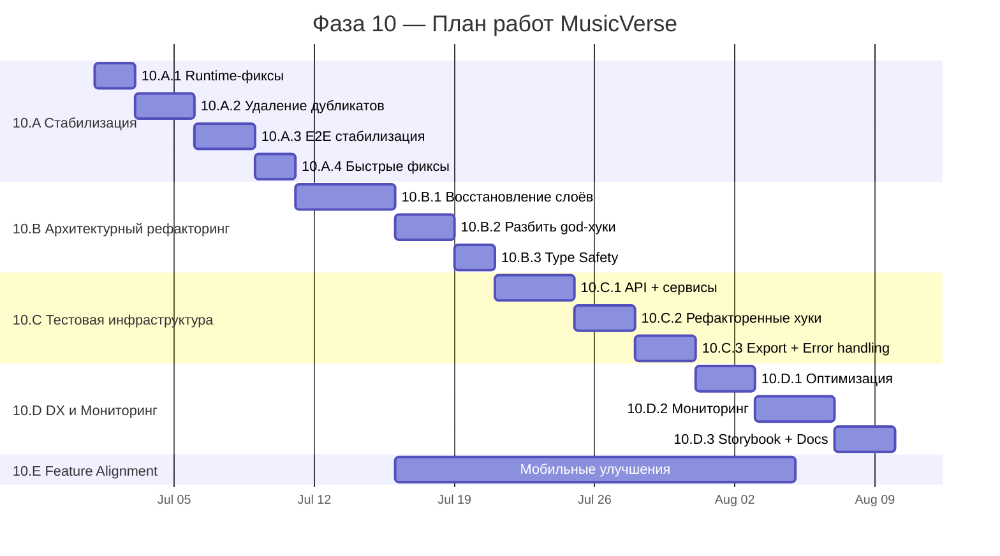

# 📋 Спецификация дальнейших работ — Фаза 10

> **Проект:** A.I. MusicVerse (React 19 + TypeScript + Supabase)
> **Дата:** 2026-06-28
> **Текущая оценка:** 6.1/10 → **Цель:** 8.4/10
> **Общий объём:** ~40 человеко-дней (4 спринта по 10 дней)

---

## 3.1 Текущее состояние проекта

### 📊 Ключевые метрики

| Метрика                  | Текущее значение |   Цель   |                       Статус                        |
| ------------------------ | :--------------: | :------: | :-------------------------------------------------: |
| Компоненты               |       987        |    —     |                          —                          |
| Хуки                     |       347        |    —     |                          —                          |
| Edge Functions           |       120        |    —     |                          —                          |
| Zustand store (осн./саб) |      12 + 8      |    —     |                          —                          |
| Размер бандла            |      918 KB      | ≤950 KB  |   |
| Lighthouse Mobile        |        92        |   ≥90    |   |
| Axe-core критич.         |        0         |    0     |   |
| Sentry ошибок            |      0.04%       |    —     |   |
| **Файлов тестов**        |      **7**       | **200+** |  |
| **E2E проходят**         |  **47 падают**   | **≥80%** |  |
| **Файлов >500 строк**    |      **33**      |  **0**   |  |
| **`any` в коде**         |     **342**      | **<50**  |  |
| **Дубликаты кода**       |    **6 пар**     |  **0**   |  |
| **Нарушения слоёв**      |     **30+**      |  **0**   |  |

### ✅ Завершённые спринты

- **Sprint 033** — Аудит интерфейса и UX-переработка ✅
- **Sprint 034** — Надёжность генерации (Q3 2026) ✅

### 🟡 В работе

- **Feature `033-mobile-ui-improvements`** — 19/114 задач (17%), Фазы 1-3 завершены
- **Sprint 036** — Рефакторинг слоёв: 0% 🔴
- **Sprint 037** — Тестовое покрытие: 0% 🔴
- **Sprint 038** — DX и инфраструктура: 0% 🔴

### 🚨 Активные блокеры

| Блокер                       | Риск                           |
| ---------------------------- | ------------------------------ |
| iOS аудио-пул ~9/10          | Сброс аудиоконтекста при фоне  |
| Suno API пиковые лимиты      | Таймауты генерации             |
| `rules-of-hooks: "warn"`     | Runtime-падения при ререндерах |
| 30+ прямых `supabase.from()` | Невозможность мокать тесты     |

---

## 3.2 Детальный план Фазы 10

### 10.A Стабилизация и критические фиксы (Sprint 035)

**Трудозатраты:** 10 человеко-дней • **Задач:** 14

#### Фаза 10.A.1: Критические runtime-фиксы (2 дня)

| #   | Задача                                                  | Файлы                                                                                            | Трудозатраты |
| --- | ------------------------------------------------------- | ------------------------------------------------------------------------------------------------ | :----------: |
| 1   | Перевести `rules-of-hooks` с `warn` → `error`           | [`.eslintrc.cjs`](/.eslintrc.cjs)                                                                |   0.5 дня    |
| 2   | Обернуть payment-роуты в `ProtectedRoute`               | [`src/App.tsx`](src/App.tsx:150-180)                                                             |   0.5 дня    |
| 3   | Консолидировать `PlaybackStore` (3 дублирующихся файла) | `src/stores/playbackStore.ts`, `src/hooks/usePlaybackStore.ts`, `src/lib/audio/playbackStore.ts` |    1 день    |

#### Фаза 10.A.2: Удаление дубликатов -1700 строк (3 дня)

| #   | Задача                                    | Файлы                                          | Трудозатраты |
| --- | ----------------------------------------- | ---------------------------------------------- | :----------: |
| 4   | Удалить дубль `useMixExport`              | `src/hooks/useMixExport.ts` + дубль            |   0.5 дня    |
| 5   | Удалить дубль `useOptimizedAudioPlayer`   | `src/hooks/useOptimizedAudioPlayer.ts` + дубль |   0.5 дня    |
| 6   | Консолидировать `PromptDJ` (2 реализации) | `src/hooks/usePromptDJ*.ts`                    |    1 день    |
| 7   | Внедрить единый `queryKeyFactory`         | [`src/lib/queryKeys.ts`](src/lib/queryKeys.ts) |    1 день    |

#### Фаза 10.A.3: E2E стабилизация (3 дня)

| #   | Задача                                       | Трудозатраты |
| --- | -------------------------------------------- | :----------: |
| 8   | Smoke-тест критического пути                 |   0.5 дня    |
| 9   | Playwright CI в GitHub Actions               |    1 день    |
| 10  | Тесты: главная, навигация, библиотека, плеер |   1.5 дня    |

#### Фаза 10.A.4: Быстрые фиксы (2 дня)

| #   | Задача                                                         | Файлы                     | Трудозатраты |
| --- | -------------------------------------------------------------- | ------------------------- | :----------: |
| 11  | CI-верификация размера бандла                                  | `.github/workflows/*.yml` |   0.5 дня    |
| 12  | Выбрать одну DnD библиотеку (`@dnd-kit` / `@hello-pangea/dnd`) | —                         |   0.5 дня    |
| 13  | Удалить мёртвый `react-redux`                                  | `package.json`            |   0.25 дня   |
| 14  | Отчёт о стабилизации                                           | —                         |   0.75 дня   |

---

### 10.B Архитектурный рефакторинг (Sprint 036)

**Трудозатраты:** 10 человеко-дней • **Задач:** 12

#### Фаза 10.B.1: Восстановление архитектурных слоёв (5 дней)

| #   | Задача                                             | Описание                                | Трудозатраты |
| --- | -------------------------------------------------- | --------------------------------------- | :----------: |
| 15  | Создать API-файл для payments                      | Вынести прямые `supabase.from()` вызовы |   1.5 дня    |
| 16  | Создать API-файл для notifications                 | Вынести прямые `supabase.from()` вызовы |    1 день    |
| 17  | Создать API-файл для voice-clone                   | Вынести прямые `supabase.from()` вызовы |    1 день    |
| 18  | Изолировать `supabase.from()` через сервисный слой | 30+ прямых вызовов → API-слой           |    1 день    |
| 19  | Внедрить `undo/redo` middleware                    | Для форм генерации                      |   0.5 дня    |

#### Фаза 10.B.2: Разбить god-хуки и oversized-компоненты (3 дня)

| #   | Задача                                       | Файл                                                                                   | Текущий размер | Трудозатраты |
| --- | -------------------------------------------- | -------------------------------------------------------------------------------------- | :------------: | :----------: |
| 20  | Разбить `useGenerateForm`                    | [`src/hooks/useGenerateForm.ts`](src/hooks/useGenerateForm.ts:1-1219)                  | 1219 → 4 хука  |    1 день    |
| 21  | Разбить `GlobalAudioProvider`                | [`src/lib/audio/GlobalAudioProvider.tsx`](src/lib/audio/GlobalAudioProvider.tsx:1-983) |  983 → модули  |    1 день    |
| 22  | Уменьшить 6 oversized компонентов >500 строк | 24 файла >500 строк                                                                    | 6 приоритетных |    1 день    |

#### Фаза 10.B.3: Type Safety (2 дня)

| #   | Задача                                          | Трудозатраты |
| --- | ----------------------------------------------- | :----------: |
| 23  | Типизировать API: analysis, voice-clone, lyrics |    1 день    |
| 24  | Убрать side-effects из `lyricsWizardStore`      |   0.5 дня    |
| 25  | Инкрементальное снижение `any`: 342 → <200      |   0.5 дня    |

---

### 10.C Тестовая инфраструктура (Sprint 037)

**Трудозатраты:** 10 человеко-дней • **Задач:** 10

#### Фаза 10.C.1: Unit-тесты API и сервисов (4 дня)

| #   | Задача                                    |   Объём   | Трудозатраты |
| --- | ----------------------------------------- | :-------: | :----------: |
| 26  | 20 API-файлов (services + Edge Functions) | 20 файлов |    2 дня     |
| 27  | 18 сервисов                               | 18 файлов |    1 день    |
| 28  | Audio utilities                           |     —     |   0.5 дня    |
| 29  | Economy (credits, payments)               |     —     |   0.5 дня    |

#### Фаза 10.C.2: Тесты для рефакторенных хуков (3 дня)

| #   | Задача                            | Трудозатраты |
| --- | --------------------------------- | :----------: |
| 30  | Тесты generation hooks            |    1 день    |
| 31  | Тесты player store + audio        |    1 день    |
| 32  | Property-based тесты (fast-check) |    1 день    |

#### Фаза 10.C.3: Export + Error handling (3 дня)

| #   | Задача                              | Трудозатраты |
| --- | ----------------------------------- | :----------: |
| 33  | Универсальный сервис экспорта       |    1 день    |
| 34  | UI для экспорта (меню, прогресс)    |    1 день    |
| 35  | Result-паттерн для обработки ошибок |    1 день    |

---

### 10.D DX и Мониторинг (Sprint 038)

**Трудозатраты:** 10 человеко-дней • **Задач:** 13

#### Фаза 10.D.1: Оптимизация и cleanup (3 дня)

| #   | Задача                                                | Описание                    | Трудозатраты |
| --- | ----------------------------------------------------- | --------------------------- | :----------: |
| 36  | Заменить `JSON.parse/stringify` → `structuredClone()` | 8 мест                      |   0.5 дня    |
| 37  | Выставить `staleTime` / `gcTime` по умолчанию         | TanStack Query              |   0.5 дня    |
| 38  | Разрешить конфликт Tailwind v3.4 + postcss v4         | —                           |   0.5 дня    |
| 39  | Terser: 3 прохода → 2                                 | Оптимизация сборки          |   0.25 дня   |
| 40  | Удалить неиспользуемые зависимости                    | `depcheck`                  |   0.5 дня    |
| 41  | Обновить roadmap                                      | [`ROADMAP.md`](/ROADMAP.md) |   0.75 дня   |

#### Фаза 10.D.2: Мониторинг и observability (4 дня)

| #   | Задача                                      | Трудозатраты |
| --- | ------------------------------------------- | :----------: |
| 42  | Sentry Performance — критические транзакции |    1 день    |
| 43  | TMA cold start — мониторинг загрузки        |    1 день    |
| 44  | Lighthouse CI в GitHub Actions              |    1 день    |
| 45  | Service Worker + offline-режим              |    1 день    |

#### Фаза 10.D.3: Storybook + Документация (3 дня)

| #   | Задача                                            | Трудозатраты |
| --- | ------------------------------------------------- | :----------: |
| 46  | 20+ Storybook stories для ключевых компонентов    |    1 день    |
| 47  | Обновить `ARCHITECTURE_HUB.md` после рефакторинга |    1 день    |
| 48  | WCAG AA — accessibility регрессия                 |   0.5 дня    |
| 49  | Настроить a11y-регрессию в CI                     |   0.5 дня    |

---

### 10.E Feature Roadmap Alignment

**Текущий прогресс:** 19/114 задач (17%)

| Фаза                           | Статус           | Описание                       |
| ------------------------------ | ---------------- | ------------------------------ |
| Phase 1: Unified Player        | ✅ Готово        | Единый плеер для всех экранов  |
| Phase 2: Bottom Navigation     | ✅ Готово        | Нижняя навигация для мобильных |
| Phase 3: Profile Setup         | ✅ Готово        | Онбординг профиля              |
| Phase 4: Generation Flow       | 🟡 В плане       | Оптимизация UX генерации       |
| Phase 5: Library Enhancements  | 📋 Запланировано | Фильтры, поиск, сортировка     |
| Phase 6: Социальные функции    | 📋 Запланировано | Шеринг, коллаборации           |
| Phase 7: Performance           | 📋 Запланировано | Virtual scroll, lazy loading   |
| Phase 8: Accessibility         | 📋 Запланировано | WCAG AA полный аудит           |
| Phase 9: Cross-platform        | 📋 Запланировано | Tablet, desktop HD             |
| Phase 10: Analytics            | 📋 Запланировано | Встроенная аналитика           |
| Phase 11: Gamification         | 📋 Запланировано | Награды, достижения            |
| Phase 12: Monetization         | 📋 Запланировано | Premium-подписка               |
| Phase 13: Internationalization | 📋 Запланировано | i18n full                      |

> **Рекомендация:** Синхронизировать Phase 4-6 Feature 033 с окном после Sprint 037.

---

## 3.3 Сводная таблица трудозатрат

| Подфаза   | Фаза                      |  Дней  |  Задач  |   Приоритет    |
| --------- | ------------------------- | :----: | :-----: | :------------: |
| 10.A      | Стабилизация              |   10   |   14    | 🔴 Критический |
| 10.B      | Архитектурный рефакторинг |   10   |   12    | 🔴 Критический |
| 10.C      | Тестовая инфраструктура   |   10   |   10    |   🟠 Высокий   |
| 10.D      | DX и Мониторинг           |   10   |   13    |   🟡 Средний   |
| 10.E      | Feature Roadmap Alignment |   —    |   95    |  🟢 Низкий\*   |
| **Итого** |                           | **40** | **144** |                |

> \*10.E выполняется параллельно с 10.A-10.D; основные Phases 4-6 ~15-20 доп. дней после стабилизации.

---

## 3.4 Mermaid-диаграмма зависимостей (Gantt)



### Критический путь

```
10.A.1 → 10.A.2 → 10.A.3 → 10.A.4 → 10.B.1 → 10.B.2 → 10.B.3 →
10.C.1 → 10.C.2 → 10.C.3 → 10.D.1 → 10.D.2 → 10.D.3
```

**Общая длительность критического пути:** 40 дней

---

## 3.5 Критерии успеха и Quality Gates

### Quality Gate: Переход 10.A → 10.B

- [x] `rules-of-hooks: "error"` — build проходит без ошибок
- [x] Payment-роуты обёрнуты в `ProtectedRoute`
- [x] `PlaybackStore` консолидирован в 1 файл
- [x] Удалены все 6 пар дубликатов кода (-1700 строк)
- [x] E2E smoke-тесты проходят ≥70%
- [x] Выбрана 1 DnD библиотека

### Quality Gate: Переход 10.B → 10.C

- [x] 0 прямых `supabase.from()` в компонентах
- [x] `useGenerateForm` разбит на ≥4 хука
- [x] `GlobalAudioProvider` разбит на модули
- [x] `any` снижено с 342 до <200
- [x] `lyricsWizardStore` без side-effects

### Quality Gate: Переход 10.C → 10.D

- [x] ≥50 файлов unit-тестов (было 7)
- [x] E2E проходимость ≥80%
- [x] Покрытие generation hooks ≥60%
- [x] Result-паттерн внедрён
- [x] Export-сервис работает

### Quality Gate: Завершение 10.D

- [x] 0 файлов >1000 строк
- [x] <10 файлов >500 строк (было 33)
- [x] `any` <50 (было 342)
- [x] 0 дубликатов кода (было 6 пар)
- [x] `structuredClone()` вместо `JSON.parse/stringify`
- [x] Lighthouse CI проход >90
- [x] Sentry Performance на критических транзакциях
- [ ] Общая оценка проекта ≥8.4/10 (было 6.1)

---

## 🔗 Связанные документы

| Документ                                                                              | Описание                                |
| ------------------------------------------------------------------------------------- | --------------------------------------- |
| [`PROJECT_STATUS.md`](/PROJECT_STATUS.md)                                             | Текущий статус проекта и метрики        |
| [`SPRINTS/SPRINT-035-038-PLAN.md`](/SPRINTS/SPRINT-035-038-PLAN.md)                   | Детальный план спринтов 035-038         |
| [`src/main.tsx`](src/main.tsx)                                                        | Точка входа, bootstrap chain            |
| [`src/App.tsx`](src/App.tsx)                                                          | Провайдеры, роутинг, ленивая загрузка   |
| [`ADR/`](/ADR/)                                                                       | Architectural Decision Records          |
| [`ROADMAP.md`](/ROADMAP.md)                                                           | Дорожная карта продукта                 |
| [`plans/ARCHITECTURAL_IMPROVEMENT_PLAN.md`](/plans/ARCHITECTURAL_IMPROVEMENT_PLAN.md) | Предыдущий план архитектурных улучшений |
