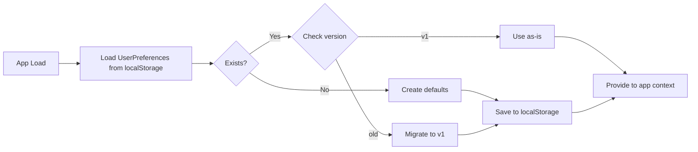
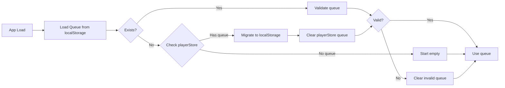
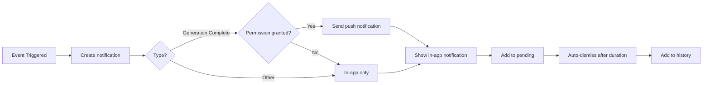

# Data Model: Mobile UI/UX Improvements

**Feature**: 033-mobile-ui-improvements
**Date**: 2026-01-06
**Status**: Draft

## Overview

This document defines the data entities and storage schemas for the mobile UI/UX improvements feature. All data is stored client-side using localStorage.

## Entities

### 1. UserPreferences

**Purpose**: Store user UI preferences and settings

**Storage**: `localStorage` key `musicverse-preferences`

**Schema**:
```typescript
interface UserPreferences {
  // Hint dismissals (prevents re-showing)
  hintsDismissed: {
    moreMenuHint: boolean;        // "More" menu tooltip dismissed
    gestureHint: boolean;          // Gesture overlay dismissed
  };

  // Gesture enable/disable settings
  gesturesEnabled: {
    doubleTapSeek: boolean;        // Double-tap to seek (default: true)
    horizontalSwipe: boolean;      // Swipe to switch tracks (default: true)
    hintOverlay: boolean;          // Show hint overlay (default: true)
  };

  // Notification permission state
  notificationPermission: 'default' | 'granted' | 'denied';

  // Theme preference (extends existing)
  theme: 'light' | 'dark' | 'system';

  // Version for future migrations
  version: 1;

  // Last updated timestamp
  lastUpdated: number;             // Unix timestamp
}
```

**Validation Rules**:
- All boolean fields default to `false` (hints not dismissed, gestures enabled)
- `notificationPermission` defaults to `'default'`
- `theme` defaults to `'system'`
- `version` must be `1`

**Migration Strategy**:
- On app load, check if `version` field exists
- If not, add `version: 1` and migrate existing preferences
- Future versions: Add migration logic based on version number

### 2. PlaybackQueue

**Purpose**: Persist user's playback queue across sessions

**Storage**: `localStorage` key `musicverse-queue`

**Schema**:
```typescript
interface PlaybackQueue {
  // Version for future migrations
  version: 1;

  // Ordered list of track IDs
  queue: TrackID[];                 // Max 100 tracks

  // Current playing position in queue
  currentIndex: number;            // -1 if not playing from queue

  // Last update timestamp (for cache invalidation)
  timestamp: number;               // Unix timestamp
}

type TrackID = string;             // Supabase track ID (UUID)
```

**Validation Rules**:
- `queue` max length: 100 tracks
- `queue` must contain unique track IDs (no duplicates)
- `currentIndex` must be >= -1 and < queue.length
- `timestamp` must be within last 30 days (expire old queues)

**Migration Strategy**:
- Migrate from `playerStore` on first load (one-time migration)
- Check if localStorage exists, if not, migrate from Zustand store
- After migration, clear queue from playerStore

**Operations**:
- `addToQueue(trackId: TrackID)`: Add to end of queue
- `playNext(trackId: TrackID)`: Insert after current index
- `removeFromQueue(index: number)`: Remove track at index
- `reorderQueue(fromIndex: number, toIndex: number)`: Move track
- `clearQueue()`: Empty queue
- `setCurrentIndex(index: number)`: Update current position

### 3. RecentlyPlayed

**Purpose**: Track recently played tracks for homepage section

**Storage**: `localStorage` key `musicverse-recent`

**Schema**:
```typescript
interface RecentlyPlayed {
  // Ordered list of recently played tracks (most recent first)
  tracks: Array<{
    trackId: string;                // Supabase track ID (UUID)
    playedAt: number;              // Unix timestamp
    title: string;                  // Track title (for offline display)
    coverUrl?: string;             // Cover URL (for offline display)
  }>;                               // Max 6 tracks

  // Last updated timestamp
  lastUpdated: number;             // Unix timestamp
}
```

**Validation Rules**:
- `tracks` max length: 6 tracks
- `tracks` must be deduplicated by `trackId` (most recent wins)
- `playedAt` must be within last 7 days (expire old entries)
- `lastUpdated` must be within last 24 hours

**Operations**:
- `addTrack(track)`: Add to beginning, remove duplicates, trim to 6
- `getTracks()`: Return all tracks (most recent first)
- `clearOld()`: Remove tracks older than 7 days
- `clearAll()`: Empty list

**Usage**:
- Display in "Recently Played" section on homepage
- Update when track finishes playing (not when starts)
- Persist across sessions
- Show only if tracks exist (hide section if empty)

### 4. GestureSettings

**Purpose**: Store gesture-related settings (separate from UserPreferences for clarity)

**Storage**: `localStorage` key `musicverse-gestures`

**Schema**:
```typescript
interface GestureSettings {
  // Double-tap seek settings
  doubleTapSeek: {
    enabled: boolean;              // Feature enabled (default: true)
    seekAmount: number;            // Seconds to seek (default: 10)
    leftSideEnabled: boolean;      // Left side of screen (default: true)
    rightSideEnabled: boolean;     // Right side of screen (default: true)
  };

  // Horizontal swipe settings
  horizontalSwipe: {
    enabled: boolean;              // Feature enabled (default: true)
    threshold: number;             // Swipe threshold in px (default: 80)
    velocityThreshold: number;     // Velocity in px/s (default: 400)
  };

  // Hint overlay settings
  hintOverlay: {
    shown: boolean;                // Has been shown at least once (default: false)
    dismissed: boolean;            // User dismissed it (default: false)
    lastShown: number;             // Last shown timestamp
  };

  // Keyboard settings (desktop accessibility)
  keyboard: {
    enabled: boolean;              // Keyboard shortcuts enabled (default: true)
    seekAmount: number;            // Arrow key seek amount (default: 10)
  };

  // Version for migrations
  version: 1;

  // Last updated
  lastUpdated: number;             // Unix timestamp
}
```

**Validation Rules**:
- All `enabled` fields default to `true`
- `seekAmount` must be between 5 and 30 seconds
- `threshold` must be between 50 and 150 pixels
- `velocityThreshold` must be between 200 and 800 px/s
- `version` must be `1`

### 5. NotificationState

**Purpose**: In-memory notification state (not persisted)

**Storage**: In-memory (React state or Zustand store)

**Schema**:
```typescript
interface NotificationState {
  // Pending notifications (active in UI)
  pending: Array<{
    id: string;                    // Unique notification ID
    type: 'generation-complete' | 'error' | 'success' | 'info';
    title: string;                 // Notification title
    message: string;               // Notification message
    action?: {
      label: string;               // Action button label (e.g., "Listen Now")
      callback: () => void;        // Action button handler
      icon?: LucideIcon;           // Optional icon
    };
    timestamp: number;             // When notification was created
    duration?: number;             // Auto-dismiss after ms (default: 5000)
    priority: 'low' | 'normal' | 'high';
  }>;                               // Max 10 pending

  // History for grouping deduplication
  history: Array<{
    id: string;                    // Notification ID
    type: string;                  // Notification type
    timestamp: number;             // When shown
    dismissed: boolean;            // How it was dismissed
  }>;                               // Max 50 history entries

  // Notification preferences
  preferences: {
    inAppEnabled: boolean;         // In-app notifications enabled (default: true)
    pushEnabled: boolean;          // Push notifications enabled (default: false)
    soundEnabled: boolean;         // Notification sound enabled (default: true)
    hapticEnabled: boolean;        // Haptic feedback enabled (default: true)
  };
}
```

**Validation Rules**:
- `pending` max length: 10 notifications (auto-dismiss oldest)
- `history` max length: 50 entries (auto-remove oldest)
- `duration` must be between 3000 and 10000ms
- `id` must be unique (use UUID or timestamp-based ID)

**Operations**:
- `show(notification)`: Add to pending, auto-dismiss after duration
- `dismiss(id)`: Remove from pending, add to history
- `dismissAll()`: Clear all pending, add to history
- `getPending()`: Return all pending notifications
- `getHistory()`: Return notification history

## Data Flow

### User Preferences Flow



### Queue Persistence Flow



### Notification Flow



## Zod Schemas

For runtime validation, use these Zod schemas:

```typescript
import { z } from 'zod';

// UserPreferences
const UserPreferencesSchema = z.object({
  hintsDismissed: z.object({
    moreMenuHint: z.boolean().default(false),
    gestureHint: z.boolean().default(false),
  }),
  gesturesEnabled: z.object({
    doubleTapSeek: z.boolean().default(true),
    horizontalSwipe: z.boolean().default(true),
    hintOverlay: z.boolean().default(true),
  }),
  notificationPermission: z.enum(['default', 'granted', 'denied']).default('default'),
  theme: z.enum(['light', 'dark', 'system']).default('system'),
  version: z.literal(1),
  lastUpdated: z.number().int().positive(),
});

// PlaybackQueue
const PlaybackQueueSchema = z.object({
  version: z.literal(1),
  queue: z.array(z.string().uuid()).max(100),
  currentIndex: z.number().int().min(-1),
  timestamp: z.number().int().positive(),
});

// RecentlyPlayed
const RecentlyPlayedSchema = z.object({
  tracks: z.array(z.object({
    trackId: z.string().uuid(),
    playedAt: z.number().int().positive(),
    title: z.string().min(1),
    coverUrl: z.string().url().optional(),
  })).max(6),
  lastUpdated: z.number().int().positive(),
});

// GestureSettings
const GestureSettingsSchema = z.object({
  doubleTapSeek: z.object({
    enabled: z.boolean().default(true),
    seekAmount: z.number().int().min(5).max(30).default(10),
    leftSideEnabled: z.boolean().default(true),
    rightSideEnabled: z.boolean().default(true),
  }),
  horizontalSwipe: z.object({
    enabled: z.boolean().default(true),
    threshold: z.number().int().min(50).max(150).default(80),
    velocityThreshold: z.number().int().min(200).max(800).default(400),
  }),
  hintOverlay: z.object({
    shown: z.boolean().default(false),
    dismissed: z.boolean().default(false),
    lastShown: z.number().int().positive().optional(),
  }),
  keyboard: z.object({
    enabled: z.boolean().default(true),
    seekAmount: z.number().int().min(5).max(30).default(10),
  }),
  version: z.literal(1),
  lastUpdated: z.number().int().positive(),
});
```

## Migration Scripts

### Queue Migration from playerStore

```typescript
// One-time migration on app load
export function migrateQueueFromPlayerStore() {
  const existingQueue = localStorage.getItem('musicverse-queue');
  if (existingQueue) return; // Already migrated

  const playerStore = usePlayerStore.getState();
  const { queue, currentIndex } = playerStore;

  if (queue.length === 0) return; // Nothing to migrate

  const queueData: PlaybackQueue = {
    version: 1,
    queue: queue.map(track => track.id),
    currentIndex,
    timestamp: Date.now(),
  };

  localStorage.setItem('musicverse-queue', JSON.stringify(queueData));

  // Clear from playerStore
  playerStore.setQueue([]);
  playerStore.setCurrentIndex(-1);
}
```

## Storage Limits

| Entity | Storage Key | Max Size | Estimated Size |
|--------|-------------|----------|----------------|
| UserPreferences | `musicverse-preferences` | ~5KB | ~1KB |
| PlaybackQueue | `musicverse-queue` | ~10KB | ~2KB (100 IDs) |
| RecentlyPlayed | `musicverse-recent` | ~5KB | ~1KB (6 tracks) |
| GestureSettings | `musicverse-gestures` | ~5KB | ~1KB |
| **Total** | | ~25KB | ~5KB |

**Notes**:
- localStorage has 5-10MB limit per domain
- Our usage is well within limits (0.1% of capacity)
- All data is non-sensitive (track IDs, preferences only)
- No PII or authentication tokens stored

## Next Steps

1. Implement Zod validation schemas in `src/lib/validation/`
2. Create storage utility functions for each entity
3. Implement migration scripts
4. Add TypeScript types to shared types file
5. Update agent context with new entities
