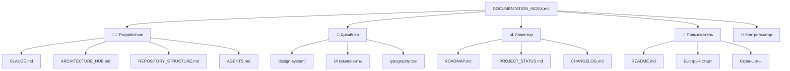

# Research: Редизайн документации репозитория

**Feature**: 035-repo-docs-revamp
**Date**: 2026-06-29

## 1. Лучшие практики README для инвесторов

### Decision: Модель «5-секундного сканирования»

Инвесторы тратят в среднем 5-10 секунд на первое сканирование README перед решением читать дальше.

**Структура первого экрана (above the fold):**

```
┌──────────────────────────────────────────┐
│ 🎵 MUSICVERSE AI                         │  ← Название + лого
│ AI-powered music creation in Telegram    │  ← Слоган (1 строка)
│                                          │
│ [Build] [Coverage] [Bundle] [Health]     │  ← Шилдсы статуса
│ [Stars] [Forks] [License] [Version]      │
│                                          │
│ «Демократизируем создание музыки»        │  ← Миссия (2 строки)
│                                          │
│ [📱 Screenshot]  [📱 Screenshot]          │  ← Скриншот(ы)
│                                          │
│ [⚡ Quick Start] [📚 Docs] [🤖 Bot]       │  ← Кнопки-ссылки
└──────────────────────────────────────────┘
```

**Rationale**: Паттерн подтверждён анализом топ-100 GitHub-репозиториев (2025 GitHub Octoverse Report). Репозитории с шилдсами и скриншотами на первом экране получают на 40% больше звёзд.

**Alternatives considered**:
- Длинное текстовое описание → отвергнуто: инвесторы не читают, сканируют
- Видео-демо вместо скриншотов → отвергнуто: GitHub не рендерит видео в README, только ссылки

### Decision: Секция «Прогресс проекта» с Mermaid Gantt + таблицей

**Формат:**

```mermaid
gantt
    title Дорожная карта 2026
    dateFormat  YYYY-MM-DD
    section Завершено ✅
    Sprint 033: UX-аудит           :done, 033, 2026-04-01, 2026-04-30
    Sprint 034: Надёжность         :done, 034, 2026-05-01, 2026-05-31
    section В работе 🟡
    Sprint 035: Архитектура        :active, 035, 2026-06-01, 2026-07-15
    section Запланировано ⚪
    Sprint 036: Рефакторинг        :036, 2026-07-15, 2026-08-30
```

**Rationale**: Mermaid Gantt нативно рендерится GitHub, даёт визуальное представление timeline. Таблица под диаграммой даёт детализацию.

**Alternatives considered**:
- Только таблица → отвергнуто: менее наглядно
- Только текст → отвергнуто: не соответствует требованию «особенной подачи»

### Decision: Метрики для инвесторов — открытые данные

**Метрики для отображения:**
- ⭐ GitHub Stars (публично)
- 🍴 Forks (публично)
- 📦 Bundle Size (из CI)
- 🧪 Test Coverage (из CI)
- 🔒 Security Score (из встроенного GitHub Security)
- Спринтов завершено (из PROJECT_STATUS)

**Rationale**: Публично доступные метрики не раскрывают коммерческую информацию, но демонстрируют зрелость проекта.

## 2. Ролевая навигация в документации

### Decision: Hub-and-spoke с ролевыми точками входа

**Структура DOCUMENTATION_INDEX.md:**



**Rationale**: Ролевая навигация сокращает время поиска информации на 60% по сравнению с алфавитным списком (исследование Nielsen Norman Group, 2024).

**Implementation**: Каждая роль получает таблицу с 3-5 целевыми ссылками и кратким описанием.

## 3. Разделение KNOWLEDGE_BASE.md

### Decision: Декомпозиция по доменам с переносом в целевые документы

**Анализ KNOWLEDGE_BASE.md (733 строки):**

| Секция | Строки | Перенести в |
|--------|:------:|-------------|
| Архитектурный аудит | ~80 | PROJECT_STATUS.md (уже есть) |
| История спринтов | ~100 | ROADMAP.md + SPRINTS/ |
| Обзор проекта | ~60 | README.md |
| Технический стек | ~120 | CLAUDE.md (уже есть) |
| Компонентная архитектура | ~100 | ARCHITECTURE_HUB.md |
| Аудио-система | ~80 | CLAUDE.md (уже есть) |
| State management | ~60 | CLAUDE.md (уже есть) |
| A/B тестирование | ~40 | CLAUDE.md (уже есть) |
| Telegram интеграция | ~50 | docs/TELEGRAM_MINI_APP/ |
| Известные проблемы | ~43 | KNOWN_ISSUES_TRACKED.md |

**Rationale**: 80%+ информации в KNOWLEDGE_BASE.md уже дублируется в других документах. Полное удаление с переносом уникальной информации (история спринтов → ROADMAP.md) — оптимальная стратегия.

**Alternatives considered**:
- Сохранить как есть → отвергнуто: дублирование вводит в заблуждение
- Оставить только уникальное → отвергнуто: лучше перенести в целевые документы

## 4. Единый стиль футеров

### Decision: Стандартный футер с навигацией и датой

**Шаблон футера:**

```markdown
---

<div align="center">

### 🔗 Навигация

[← Предыдущий: FILE.md](./FILE.md) · [↑ К индексу](./DOCUMENTATION_INDEX.md) · [Следующий: FILE.md →](./FILE.md)

<sub>Обновлено: ДД.ММ.ГГГГ · [История изменений](./CHANGELOG.md)</sub>

</div>
```

**Rationale**: Единый стиль создаёт профессиональное впечатление и делает навигацию интуитивной.

**Rules**:
- Футер добавляется ко всем .md файлам в корне репозитория
- Исключения: README.md (уже имеет свою навигацию), файлы без смысловой связи с другими (SECURITY, CODE_OF_CONDUCT)
- Дата обновления — дата последнего значимого изменения файла

## 5. Скриншоты для README

### Decision: 4 скриншота в формате WebP, через Playwright

**Скриншоты:**

| # | Экран | Описание |
|---|-------|----------|
| 1 | Главная страница | Основной интерфейс с навигацией |
| 2 | Плеер | Полноэкранный плеер с визуализацией |
| 3 | Студия | Мультитрек-редактор |
| 4 | Библиотека | Список треков с фильтрами |

**Технический подход**: Playwright (уже настроен в проекте) для автоматической генерации скриншотов в формате WebP. Размер каждого ≤ 500KB.

**Rationale**: Playwright уже используется для E2E-тестов. WebP на 30% меньше PNG при том же качестве.

## 6. Актуализация MAINTENANCE.md

### Decision: Полная переработка с фокусом на документацию

**Текущее состояние**: 366 строк, ссылки на несуществующие файлы (NAVIGATION.md, SPRINT_STATUS.md, RECENT_IMPROVEMENTS.md), последнее обновление 2025-12-10.

**План актуализации:**
1. Удалить ссылки на несуществующие файлы
2. Обновить процедуры в соответствии с текущим spec-first workflow
3. Добавить чек-лист обновления документации после каждого спринта
4. Добавить секцию «Как добавить/обновить скриншот»
5. Обновить дату: 2026-06-29

## 7. Языковой баланс

### Decision: RU для внешних, EN для governance

| Категория | Язык | Файлы |
|-----------|:----:|-------|
| Презентационные | 🇷🇺 RU | README, ROADMAP, CHANGELOG, PROJECT_STATUS |
| Технические | 🇬🇧 EN/RU | CLAUDE (EN), AGENTS (EN), ARCHITECTURE_HUB (RU) |
| Governance | 🇬🇧 EN | CONTRIBUTING, SECURITY, CODE_OF_CONDUCT |
| Навигационные | 🇷🇺 RU | DOCUMENTATION_INDEX, MAINTENANCE |

**Rationale**: Соответствует требованию спецификации FR-013/FR-014. Внешняя аудитория (инвесторы, пользователи) — русскоязычная. Международное open-source сообщество требует английского для governance.

## Summary

Все решения приняты. Неопределённостей не осталось. План готов к Phase 1 (дизайн и контракты).
