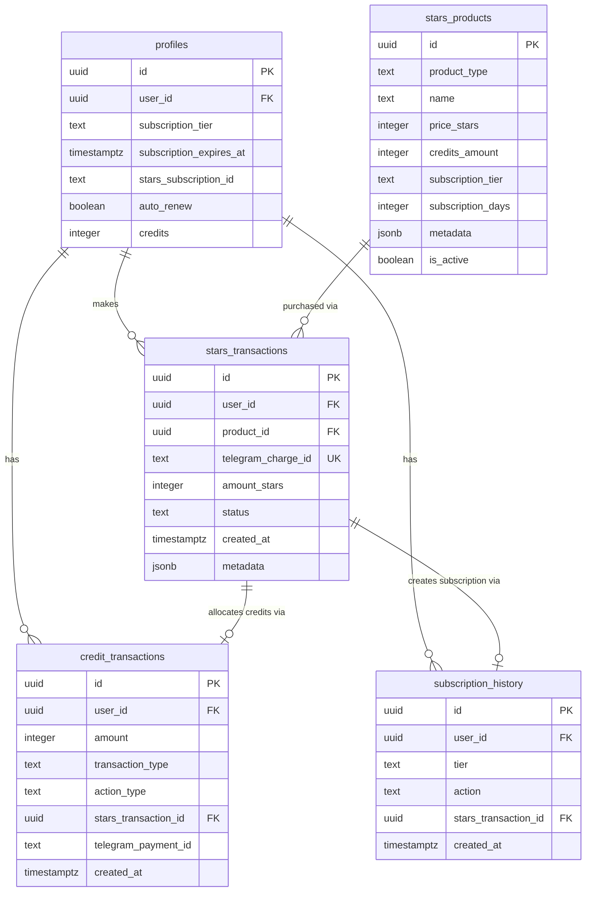
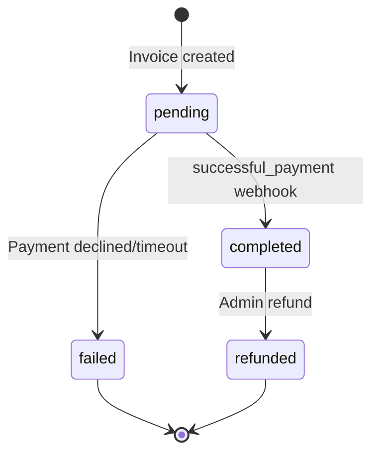
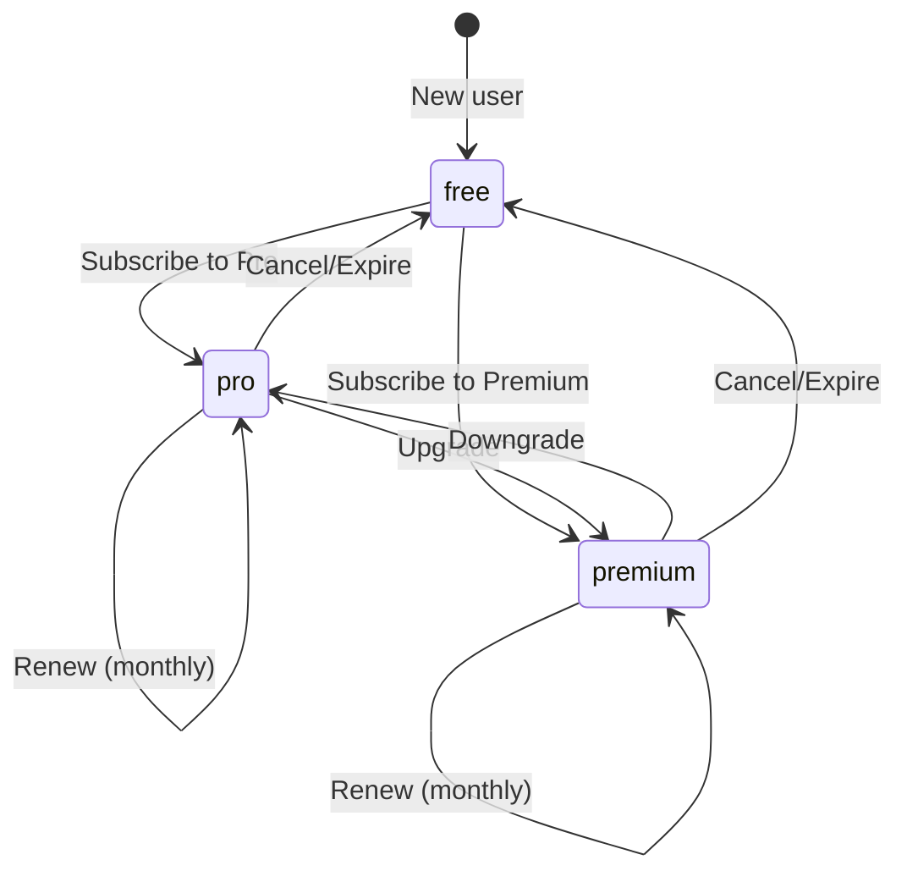

# Data Model: Telegram Stars Payment System

**Date**: 2025-12-09  
**Feature**: Telegram Stars (XTR) payment integration  
**Status**: Phase 1 - Data Model Design

---

## Table of Contents

1. [Overview](#overview)
2. [Entity Relationship Diagram](#entity-relationship-diagram)
3. [Table Definitions](#table-definitions)
4. [Database Functions](#database-functions)
5. [Row Level Security (RLS) Policies](#row-level-security-rls-policies)
6. [Indexes and Performance](#indexes-and-performance)
7. [Migration Scripts](#migration-scripts)
8. [State Transitions](#state-transitions)
9. [Data Validation Rules](#data-validation-rules)

---

## Overview

The Telegram Stars payment system extends the existing MusicVerse credit system with:
- **New tables**: `stars_products`, `stars_transactions`, `subscription_history`
- **Extended tables**: `credit_transactions`, `profiles`
- **Database functions**: Payment processing, subscription management, idempotency checks

**Design principles**:
- ✅ **Idempotency**: Prevent duplicate credit allocation via unique constraints
- ✅ **Auditability**: Complete transaction log with metadata
- ✅ **Performance**: Indexed foreign keys and timestamp columns
- ✅ **Security**: RLS policies on all user-facing tables
- ✅ **Extensibility**: JSONB metadata for future payment features

---

## Entity Relationship Diagram



---

## Table Definitions

### 1. stars_products

Product catalog for credit packages and subscriptions.

```sql
CREATE TABLE public.stars_products (
  id UUID PRIMARY KEY DEFAULT gen_random_uuid(),
  
  -- Product identification
  product_type TEXT NOT NULL CHECK (product_type IN ('credits', 'subscription')),
  sku TEXT NOT NULL UNIQUE, -- e.g., 'credits_100', 'sub_pro'
  name TEXT NOT NULL, -- Display name: "100 Credits Package"
  description TEXT,
  
  -- Pricing
  price_stars INTEGER NOT NULL CHECK (price_stars > 0), -- Price in Telegram Stars
  
  -- Credits (for product_type = 'credits')
  credits_amount INTEGER CHECK (
    (product_type = 'credits' AND credits_amount > 0) OR
    (product_type = 'subscription' AND credits_amount IS NULL)
  ),
  
  -- Subscription (for product_type = 'subscription')
  subscription_tier TEXT CHECK (
    (product_type = 'subscription' AND subscription_tier IN ('pro', 'premium', 'enterprise')) OR
    (product_type = 'credits' AND subscription_tier IS NULL)
  ),
  subscription_days INTEGER CHECK (
    (product_type = 'subscription' AND subscription_days > 0) OR
    (product_type = 'credits' AND subscription_days IS NULL)
  ),
  
  -- Display and sorting
  display_order INTEGER NOT NULL DEFAULT 0,
  is_featured BOOLEAN DEFAULT false,
  is_active BOOLEAN DEFAULT true, -- Can be disabled without deletion
  
  -- Metadata
  metadata JSONB DEFAULT '{}'::jsonb, -- Flexible storage for future features
  
  -- Timestamps
  created_at TIMESTAMPTZ NOT NULL DEFAULT NOW(),
  updated_at TIMESTAMPTZ NOT NULL DEFAULT NOW()
);

COMMENT ON TABLE stars_products IS 'Product catalog for Telegram Stars payments';
COMMENT ON COLUMN stars_products.sku IS 'Unique product identifier (e.g., credits_100, sub_pro)';
COMMENT ON COLUMN stars_products.price_stars IS 'Price in Telegram Stars (1 Star ≈ $0.01)';
COMMENT ON COLUMN stars_products.metadata IS 'Additional product data (tags, badges, promotion codes)';
```

**Initial Products**:
```sql
INSERT INTO stars_products (product_type, sku, name, description, price_stars, credits_amount, display_order, is_featured) VALUES
-- Credit packages
('credits', 'credits_50', '50 Credits', 'Perfect for beginners', 200, 50, 1, false),
('credits', 'credits_100', '100 Credits', 'Most popular choice', 500, 100, 2, true),
('credits', 'credits_300', '300 Credits', 'Best value + 50 bonus credits', 1200, 350, 3, false),
('credits', 'credits_1000', '1000 Credits', 'Professional package + 200 bonus', 3500, 1200, 4, false);

-- Subscriptions
INSERT INTO stars_products (product_type, sku, name, description, price_stars, subscription_tier, subscription_days, display_order) VALUES
('subscription', 'sub_pro', 'Pro Subscription', '500 credits/month + priority queue', 2000, 'pro', 30, 5),
('subscription', 'sub_premium', 'Premium Subscription', '2000 credits/month + commercial use', 6000, 'premium', 30, 6);
```

---

### 2. stars_transactions

Transaction log for all Stars payments.

```sql
CREATE TABLE public.stars_transactions (
  id UUID PRIMARY KEY DEFAULT gen_random_uuid(),
  
  -- User and product
  user_id UUID NOT NULL REFERENCES auth.users(id) ON DELETE CASCADE,
  product_id UUID NOT NULL REFERENCES stars_products(id) ON DELETE RESTRICT,
  
  -- Telegram payment details
  telegram_charge_id TEXT NOT NULL UNIQUE, -- Idempotency key from Telegram
  telegram_bot_payment_charge_id TEXT, -- Secondary ID from Telegram
  invoice_payload TEXT NOT NULL, -- Original payload sent in invoice
  
  -- Amount
  amount_stars INTEGER NOT NULL CHECK (amount_stars > 0),
  amount_usd_cents INTEGER, -- Approximate USD value (for analytics)
  
  -- Status
  status TEXT NOT NULL DEFAULT 'pending' 
    CHECK (status IN ('pending', 'completed', 'failed', 'refunded')),
  failure_reason TEXT, -- If status = 'failed'
  
  -- Metadata
  metadata JSONB DEFAULT '{}'::jsonb, -- Telegram payment metadata + custom fields
  
  -- Timestamps
  created_at TIMESTAMPTZ NOT NULL DEFAULT NOW(),
  completed_at TIMESTAMPTZ,
  refunded_at TIMESTAMPTZ
);

COMMENT ON TABLE stars_transactions IS 'Log of all Telegram Stars payment transactions';
COMMENT ON COLUMN stars_transactions.telegram_charge_id IS 'Unique payment ID from Telegram (prevents duplicates)';
COMMENT ON COLUMN stars_transactions.invoice_payload IS 'JSON payload from invoice creation (contains product details)';
COMMENT ON COLUMN stars_transactions.amount_usd_cents IS 'USD equivalent in cents (for reporting, not authoritative)';
```

---

### 3. subscription_history

Audit log for subscription lifecycle events.

```sql
CREATE TABLE public.subscription_history (
  id UUID PRIMARY KEY DEFAULT gen_random_uuid(),
  
  -- User and subscription
  user_id UUID NOT NULL REFERENCES auth.users(id) ON DELETE CASCADE,
  tier TEXT NOT NULL CHECK (tier IN ('free', 'pro', 'premium', 'enterprise')),
  
  -- Action
  action TEXT NOT NULL CHECK (action IN (
    'subscribe',    -- First subscription
    'renew',        -- Auto-renewal
    'upgrade',      -- Tier upgrade (free→pro, pro→premium)
    'downgrade',    -- Tier downgrade (premium→pro, pro→free)
    'cancel',       -- User cancelled
    'expire'        -- Subscription expired (non-payment)
  )),
  
  -- Related transaction
  stars_transaction_id UUID REFERENCES stars_transactions(id) ON DELETE SET NULL,
  
  -- Previous state (for upgrades/downgrades)
  previous_tier TEXT,
  previous_expires_at TIMESTAMPTZ,
  
  -- New state
  new_tier TEXT NOT NULL,
  new_expires_at TIMESTAMPTZ,
  
  -- Timestamps
  created_at TIMESTAMPTZ NOT NULL DEFAULT NOW()
);

COMMENT ON TABLE subscription_history IS 'Audit log of subscription lifecycle events';
COMMENT ON COLUMN subscription_history.action IS 'Type of subscription change';
COMMENT ON COLUMN subscription_history.previous_tier IS 'Tier before change (for audit)';
```

---

### 4. Extended: credit_transactions

Add Stars payment reference to existing credit transactions.

```sql
-- Add new columns to existing table
ALTER TABLE public.credit_transactions
ADD COLUMN IF NOT EXISTS stars_transaction_id UUID REFERENCES stars_transactions(id) ON DELETE SET NULL,
ADD COLUMN IF NOT EXISTS telegram_payment_id TEXT; -- Deprecated, use stars_transaction_id

COMMENT ON COLUMN credit_transactions.stars_transaction_id IS 'Reference to Stars payment that allocated these credits';
COMMENT ON COLUMN credit_transactions.telegram_payment_id IS 'DEPRECATED: Legacy field, use stars_transaction_id';
```

---

### 5. Extended: profiles

Add subscription fields to user profiles.

```sql
-- Add new columns to existing table
ALTER TABLE public.profiles
ADD COLUMN IF NOT EXISTS subscription_tier TEXT DEFAULT 'free' 
  CHECK (subscription_tier IN ('free', 'pro', 'premium', 'enterprise')),
ADD COLUMN IF NOT EXISTS subscription_expires_at TIMESTAMPTZ,
ADD COLUMN IF NOT EXISTS stars_subscription_id TEXT, -- Telegram recurring subscription ID
ADD COLUMN IF NOT EXISTS auto_renew BOOLEAN DEFAULT true;

COMMENT ON COLUMN profiles.subscription_tier IS 'Current subscription tier (free, pro, premium, enterprise)';
COMMENT ON COLUMN profiles.subscription_expires_at IS 'Timestamp when subscription expires (NULL = lifetime/free)';
COMMENT ON COLUMN profiles.stars_subscription_id IS 'Telegram subscription ID for recurring payments';
COMMENT ON COLUMN profiles.auto_renew IS 'Whether subscription auto-renews (Telegram managed)';
```

---

## Database Functions

### Function 1: Process Stars Payment

Allocates credits and updates subscription based on successful payment.

```sql
CREATE OR REPLACE FUNCTION public.process_stars_payment(
  p_telegram_charge_id TEXT,
  p_user_id UUID,
  p_product_id UUID,
  p_amount_stars INTEGER,
  p_metadata JSONB DEFAULT '{}'::jsonb
)
RETURNS JSONB
LANGUAGE plpgsql
SECURITY DEFINER
SET search_path = public
AS $$
DECLARE
  v_transaction_id UUID;
  v_product RECORD;
  v_result JSONB;
BEGIN
  -- Check for duplicate (idempotency)
  SELECT id INTO v_transaction_id
  FROM stars_transactions
  WHERE telegram_charge_id = p_telegram_charge_id;
  
  IF v_transaction_id IS NOT NULL THEN
    RETURN jsonb_build_object(
      'success', true,
      'duplicate', true,
      'transaction_id', v_transaction_id
    );
  END IF;
  
  -- Get product details
  SELECT * INTO v_product
  FROM stars_products
  WHERE id = p_product_id AND is_active = true;
  
  IF v_product IS NULL THEN
    RAISE EXCEPTION 'Product not found or inactive: %', p_product_id;
  END IF;
  
  -- Validate amount
  IF p_amount_stars != v_product.price_stars THEN
    RAISE EXCEPTION 'Amount mismatch: expected %, got %', v_product.price_stars, p_amount_stars;
  END IF;
  
  -- Begin transaction
  BEGIN
    -- Insert Stars transaction
    INSERT INTO stars_transactions (
      user_id, product_id, telegram_charge_id,
      amount_stars, status, metadata, completed_at
    ) VALUES (
      p_user_id, p_product_id, p_telegram_charge_id,
      p_amount_stars, 'completed', p_metadata, NOW()
    )
    RETURNING id INTO v_transaction_id;
    
    -- Handle credits
    IF v_product.product_type = 'credits' THEN
      -- Allocate credits
      INSERT INTO credit_transactions (
        user_id, amount, transaction_type, action_type,
        description, stars_transaction_id
      ) VALUES (
        p_user_id, v_product.credits_amount, 'earn', 'purchase',
        format('Purchased %s credits via Telegram Stars', v_product.credits_amount),
        v_transaction_id
      );
      
      -- Update user balance
      UPDATE profiles
      SET credits = COALESCE(credits, 0) + v_product.credits_amount
      WHERE user_id = p_user_id;
      
    -- Handle subscription
    ELSIF v_product.product_type = 'subscription' THEN
      -- Update subscription
      UPDATE profiles
      SET 
        subscription_tier = v_product.subscription_tier,
        subscription_expires_at = NOW() + (v_product.subscription_days || ' days')::INTERVAL,
        auto_renew = true
      WHERE user_id = p_user_id;
      
      -- Log subscription change
      INSERT INTO subscription_history (
        user_id, tier, action, stars_transaction_id,
        new_tier, new_expires_at
      ) VALUES (
        p_user_id, v_product.subscription_tier, 'subscribe', v_transaction_id,
        v_product.subscription_tier, NOW() + (v_product.subscription_days || ' days')::INTERVAL
      );
    END IF;
    
    -- Build result
    v_result := jsonb_build_object(
      'success', true,
      'duplicate', false,
      'transaction_id', v_transaction_id,
      'product_type', v_product.product_type,
      'credits_allocated', v_product.credits_amount,
      'subscription_tier', v_product.subscription_tier
    );
    
    RETURN v_result;
    
  EXCEPTION WHEN OTHERS THEN
    -- Mark transaction as failed
    UPDATE stars_transactions
    SET status = 'failed', failure_reason = SQLERRM
    WHERE id = v_transaction_id;
    
    RAISE;
  END;
END;
$$;

COMMENT ON FUNCTION process_stars_payment IS 'Process successful Stars payment (idempotent)';
```

---

### Function 2: Check Subscription Status

Returns user subscription details and expiry status.

```sql
CREATE OR REPLACE FUNCTION public.get_subscription_status(p_user_id UUID)
RETURNS JSONB
LANGUAGE plpgsql
SECURITY DEFINER
SET search_path = public
AS $$
DECLARE
  v_profile RECORD;
  v_is_active BOOLEAN;
  v_days_remaining INTEGER;
BEGIN
  SELECT 
    subscription_tier,
    subscription_expires_at,
    auto_renew
  INTO v_profile
  FROM profiles
  WHERE user_id = p_user_id;
  
  IF v_profile IS NULL THEN
    RETURN jsonb_build_object('error', 'User not found');
  END IF;
  
  -- Check if subscription is active
  v_is_active := (
    v_profile.subscription_tier != 'free' AND
    (v_profile.subscription_expires_at IS NULL OR v_profile.subscription_expires_at > NOW())
  );
  
  -- Calculate days remaining
  IF v_profile.subscription_expires_at IS NOT NULL THEN
    v_days_remaining := EXTRACT(DAY FROM v_profile.subscription_expires_at - NOW())::INTEGER;
  ELSE
    v_days_remaining := NULL; -- Lifetime or free
  END IF;
  
  RETURN jsonb_build_object(
    'tier', v_profile.subscription_tier,
    'is_active', v_is_active,
    'expires_at', v_profile.subscription_expires_at,
    'days_remaining', v_days_remaining,
    'auto_renew', v_profile.auto_renew
  );
END;
$$;

COMMENT ON FUNCTION get_subscription_status IS 'Get user subscription status and expiry';
```

---

### Function 3: Get Payment Statistics (Admin)

Returns payment analytics for admin dashboard.

```sql
CREATE OR REPLACE FUNCTION public.get_stars_payment_stats(
  p_from_date TIMESTAMPTZ DEFAULT NOW() - INTERVAL '30 days',
  p_to_date TIMESTAMPTZ DEFAULT NOW()
)
RETURNS JSONB
LANGUAGE plpgsql
SECURITY DEFINER
SET search_path = public
AS $$
DECLARE
  v_total_transactions INTEGER;
  v_total_revenue_stars INTEGER;
  v_success_rate NUMERIC;
  v_top_products JSONB;
  v_active_subscriptions INTEGER;
BEGIN
  -- Total transactions
  SELECT COUNT(*) INTO v_total_transactions
  FROM stars_transactions
  WHERE created_at BETWEEN p_from_date AND p_to_date;
  
  -- Total revenue
  SELECT COALESCE(SUM(amount_stars), 0) INTO v_total_revenue_stars
  FROM stars_transactions
  WHERE status = 'completed'
    AND created_at BETWEEN p_from_date AND p_to_date;
  
  -- Success rate
  SELECT 
    CASE WHEN COUNT(*) > 0 
      THEN ROUND(100.0 * COUNT(*) FILTER (WHERE status = 'completed') / COUNT(*), 2)
      ELSE 0
    END
  INTO v_success_rate
  FROM stars_transactions
  WHERE created_at BETWEEN p_from_date AND p_to_date;
  
  -- Top products
  SELECT jsonb_agg(
    jsonb_build_object(
      'product_name', sp.name,
      'sku', sp.sku,
      'sales_count', product_stats.sales_count,
      'revenue_stars', product_stats.revenue_stars
    )
  ) INTO v_top_products
  FROM (
    SELECT 
      product_id,
      COUNT(*) as sales_count,
      SUM(amount_stars) as revenue_stars
    FROM stars_transactions
    WHERE status = 'completed'
      AND created_at BETWEEN p_from_date AND p_to_date
    GROUP BY product_id
    ORDER BY revenue_stars DESC
    LIMIT 5
  ) product_stats
  JOIN stars_products sp ON sp.id = product_stats.product_id;
  
  -- Active subscriptions
  SELECT COUNT(*) INTO v_active_subscriptions
  FROM profiles
  WHERE subscription_tier != 'free'
    AND (subscription_expires_at IS NULL OR subscription_expires_at > NOW());
  
  RETURN jsonb_build_object(
    'period', jsonb_build_object('from', p_from_date, 'to', p_to_date),
    'total_transactions', v_total_transactions,
    'total_revenue_stars', v_total_revenue_stars,
    'success_rate', v_success_rate,
    'top_products', COALESCE(v_top_products, '[]'::jsonb),
    'active_subscriptions', v_active_subscriptions
  );
END;
$$;

COMMENT ON FUNCTION get_stars_payment_stats IS 'Get payment analytics for admin dashboard';
```

---

## Row Level Security (RLS) Policies

### stars_products (Public Read)

```sql
ALTER TABLE stars_products ENABLE ROW LEVEL SECURITY;

-- Anyone can view active products
CREATE POLICY "Anyone can view active products"
  ON stars_products FOR SELECT
  USING (is_active = true);

-- Only admins can manage products
CREATE POLICY "Admins can manage products"
  ON stars_products FOR ALL
  USING (
    EXISTS (
      SELECT 1 FROM user_roles
      WHERE user_id = auth.uid() AND role = 'admin'
    )
  );
```

---

### stars_transactions (User-scoped)

```sql
ALTER TABLE stars_transactions ENABLE ROW LEVEL SECURITY;

-- Users can view their own transactions
CREATE POLICY "Users can view own transactions"
  ON stars_transactions FOR SELECT
  USING (auth.uid() = user_id);

-- Service role can insert transactions (Edge Functions)
CREATE POLICY "Service role can insert transactions"
  ON stars_transactions FOR INSERT
  WITH CHECK (
    current_setting('request.jwt.claims', true)::json->>'role' = 'service_role'
  );

-- Admins can view all transactions
CREATE POLICY "Admins can view all transactions"
  ON stars_transactions FOR SELECT
  USING (
    EXISTS (
      SELECT 1 FROM user_roles
      WHERE user_id = auth.uid() AND role = 'admin'
    )
  );
```

---

### subscription_history (User-scoped)

```sql
ALTER TABLE subscription_history ENABLE ROW LEVEL SECURITY;

-- Users can view their own subscription history
CREATE POLICY "Users can view own subscription history"
  ON subscription_history FOR SELECT
  USING (auth.uid() = user_id);

-- Service role can insert history (Edge Functions)
CREATE POLICY "Service role can insert subscription history"
  ON subscription_history FOR INSERT
  WITH CHECK (
    current_setting('request.jwt.claims', true)::json->>'role' = 'service_role'
  );

-- Admins can view all subscription history
CREATE POLICY "Admins can view all subscription history"
  ON subscription_history FOR SELECT
  USING (
    EXISTS (
      SELECT 1 FROM user_roles
      WHERE user_id = auth.uid() AND role = 'admin'
    )
  );
```

---

## Indexes and Performance

```sql
-- stars_products indexes
CREATE INDEX idx_stars_products_sku ON stars_products(sku);
CREATE INDEX idx_stars_products_type_active ON stars_products(product_type, is_active);
CREATE INDEX idx_stars_products_display_order ON stars_products(display_order) WHERE is_active = true;

-- stars_transactions indexes
CREATE UNIQUE INDEX idx_stars_transactions_charge_id ON stars_transactions(telegram_charge_id); -- Idempotency
CREATE INDEX idx_stars_transactions_user_id ON stars_transactions(user_id);
CREATE INDEX idx_stars_transactions_created_at ON stars_transactions(created_at DESC);
CREATE INDEX idx_stars_transactions_status ON stars_transactions(status);
CREATE INDEX idx_stars_transactions_product_id ON stars_transactions(product_id);

-- subscription_history indexes
CREATE INDEX idx_subscription_history_user_id ON subscription_history(user_id);
CREATE INDEX idx_subscription_history_created_at ON subscription_history(created_at DESC);
CREATE INDEX idx_subscription_history_action ON subscription_history(action);

-- profiles indexes (extended)
CREATE INDEX idx_profiles_subscription_tier ON profiles(subscription_tier) WHERE subscription_tier != 'free';
CREATE INDEX idx_profiles_subscription_expires_at ON profiles(subscription_expires_at) WHERE subscription_expires_at IS NOT NULL;
```

---

## Migration Scripts

### Migration 1: Create Stars Tables

```sql
-- File: supabase/migrations/YYYYMMDD_create_stars_tables.sql

BEGIN;

-- Create stars_products table
CREATE TABLE public.stars_products (
  -- [Full definition from above]
);

-- Create stars_transactions table
CREATE TABLE public.stars_transactions (
  -- [Full definition from above]
);

-- Create subscription_history table
CREATE TABLE public.subscription_history (
  -- [Full definition from above]
);

-- Insert initial products
INSERT INTO stars_products (...) VALUES (...);

-- Create indexes
CREATE INDEX ...;

-- Enable RLS and create policies
ALTER TABLE stars_products ENABLE ROW LEVEL SECURITY;
CREATE POLICY ...;

COMMIT;
```

---

### Migration 2: Extend Existing Tables

```sql
-- File: supabase/migrations/YYYYMMDD_extend_tables_for_stars.sql

BEGIN;

-- Extend credit_transactions
ALTER TABLE public.credit_transactions
ADD COLUMN IF NOT EXISTS stars_transaction_id UUID REFERENCES stars_transactions(id) ON DELETE SET NULL;

-- Extend profiles
ALTER TABLE public.profiles
ADD COLUMN IF NOT EXISTS subscription_tier TEXT DEFAULT 'free',
ADD COLUMN IF NOT EXISTS subscription_expires_at TIMESTAMPTZ,
ADD COLUMN IF NOT EXISTS stars_subscription_id TEXT,
ADD COLUMN IF NOT EXISTS auto_renew BOOLEAN DEFAULT true;

-- Add constraints
ALTER TABLE profiles
ADD CONSTRAINT check_subscription_tier 
  CHECK (subscription_tier IN ('free', 'pro', 'premium', 'enterprise'));

-- Create indexes
CREATE INDEX idx_profiles_subscription_tier ON profiles(subscription_tier);

COMMIT;
```

---

### Migration 3: Create Functions

```sql
-- File: supabase/migrations/YYYYMMDD_create_stars_functions.sql

BEGIN;

-- Create process_stars_payment function
CREATE OR REPLACE FUNCTION process_stars_payment(...) ...;

-- Create get_subscription_status function
CREATE OR REPLACE FUNCTION get_subscription_status(...) ...;

-- Create get_stars_payment_stats function
CREATE OR REPLACE FUNCTION get_stars_payment_stats(...) ...;

COMMIT;
```

---

## State Transitions

### Transaction Status States



---

### Subscription Lifecycle States



---

## Data Validation Rules

### Product Validation

```typescript
interface ProductValidation {
  // SKU must be unique and follow pattern
  sku: /^(credits_\d+|sub_[a-z]+)$/;
  
  // Price must be positive integer
  price_stars: (value) => value > 0 && Number.isInteger(value);
  
  // Credits products must have credits_amount
  credits_amount: (product) => 
    product.product_type === 'credits' ? product.credits_amount > 0 : true;
  
  // Subscription products must have tier and days
  subscription_tier: (product) =>
    product.product_type === 'subscription' ? 
      ['pro', 'premium', 'enterprise'].includes(product.subscription_tier) : true;
}
```

---

### Transaction Validation

```typescript
interface TransactionValidation {
  // Telegram charge ID must be unique (idempotency)
  telegram_charge_id: (value) => /^[A-Za-z0-9_-]+$/.test(value);
  
  // Amount must match product price
  amount_stars: (transaction, product) => 
    transaction.amount_stars === product.price_stars;
  
  // User must exist
  user_id: async (userId) => {
    const user = await getUser(userId);
    return user !== null;
  };
  
  // Product must be active
  product_id: async (productId) => {
    const product = await getProduct(productId);
    return product?.is_active === true;
  };
}
```

---

## Summary

Data model design complete with:

✅ **3 new tables**: `stars_products`, `stars_transactions`, `subscription_history`  
✅ **2 extended tables**: `credit_transactions`, `profiles`  
✅ **3 database functions**: Payment processing, subscription status, admin stats  
✅ **RLS policies**: User-scoped access, admin override, service role permissions  
✅ **Indexes**: Performance optimized for common queries  
✅ **Migrations**: Reversible SQL scripts with transactions  
✅ **State machines**: Transaction and subscription lifecycle  
✅ **Validation rules**: Data integrity constraints  

**Next Steps**: Generate API contracts (Phase 1 continued).
