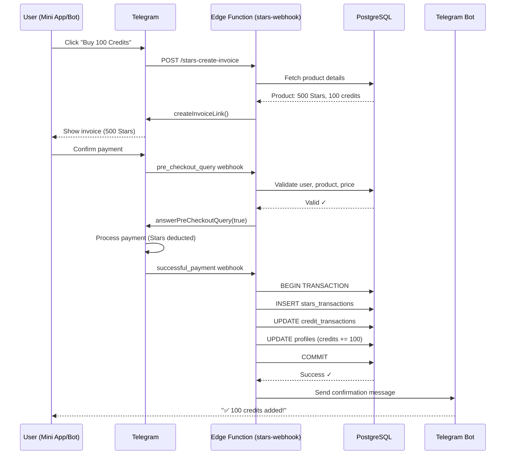
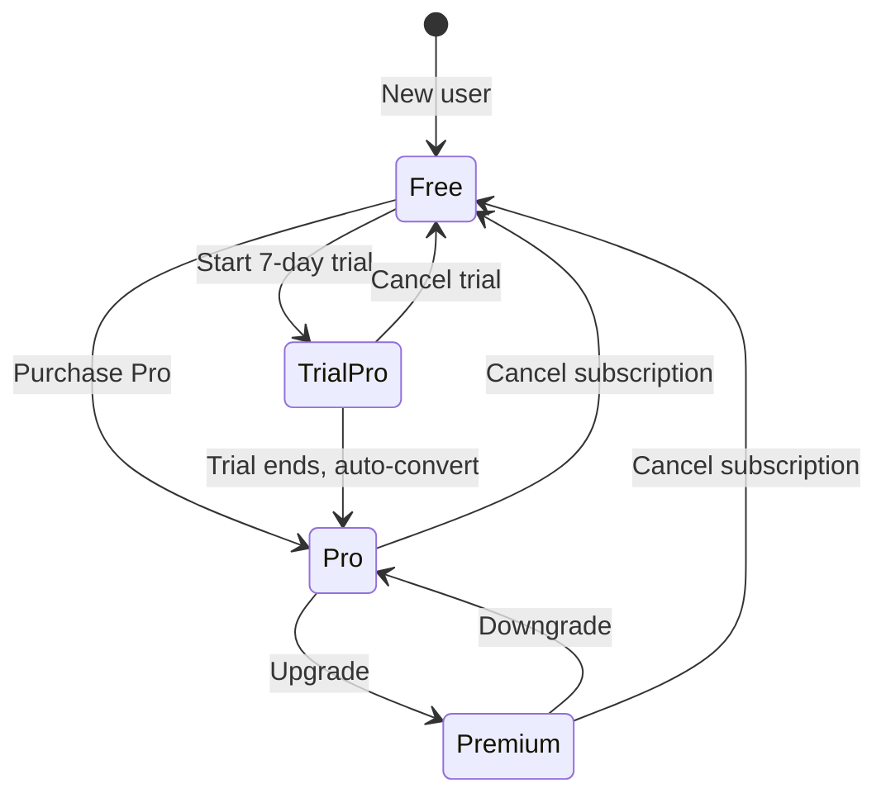

# Research: Telegram Stars Payment System Integration

**Date**: 2025-12-09  
**Feature**: Telegram Stars (XTR) payment integration for MusicVerse AI  
**Status**: Phase 0 - Research Complete

---

## Table of Contents

1. [Telegram Stars Overview](#telegram-stars-overview)
2. [Telegram Payment Provider Setup](#telegram-payment-provider-setup)
3. [Payment Flow Architecture](#payment-flow-architecture)
4. [Idempotency and Security Best Practices](#idempotency-and-security-best-practices)
5. [Subscription Management Patterns](#subscription-management-patterns)
6. [Testing Strategy](#testing-strategy)
7. [Admin Monitoring Requirements](#admin-monitoring-requirements)
8. [Technology Decisions](#technology-decisions)

---

## Telegram Stars Overview

### What are Telegram Stars?

**Telegram Stars (XTR)** is Telegram's native in-app currency introduced in 2024, designed for seamless payments within Mini Apps and Bots.

**Key Features**:
- **Native integration**: No external payment providers needed
- **Low friction**: Users already have payment methods stored in Telegram
- **Multi-platform**: Works on iOS, Android, and Web
- **Refund support**: Built-in refund mechanism via Telegram
- **Telegram takes 0% commission**: Full amount goes to developer (after Apple/Google fees on mobile)

**Purchase flow**:
1. User taps "Buy" in Mini App or Bot
2. Telegram shows invoice with Stars price
3. User pays with stored payment method (card, Apple Pay, Google Pay)
4. Credits/subscription activated instantly

**Pricing**:
- Stars are purchased by users from Telegram directly
- Developers set prices in Stars (not fiat currency)
- Typical conversion: ~1 Star ≈ $0.01 USD (varies by region)

### Telegram Bot API Methods

**Invoice Creation**:
```typescript
bot.api.createInvoiceLink({
  title: "100 Credits Package",
  description: "Generate 100 AI music tracks",
  payload: JSON.stringify({ userId, productId, amount }), // Custom data
  provider_token: "", // Empty for Stars
  currency: "XTR", // Telegram Stars
  prices: [{ label: "100 Credits", amount: 500 }], // 500 Stars
})
```

**Pre-checkout Query** (validation before payment):
```typescript
bot.on("pre_checkout_query", async (ctx) => {
  const { id, invoice_payload } = ctx.preCheckoutQuery;
  
  // Validate product, user, price
  const isValid = await validatePayment(invoice_payload);
  
  if (isValid) {
    await ctx.answerPreCheckoutQuery(true);
  } else {
    await ctx.answerPreCheckoutQuery(false, {
      error_message: "Product unavailable"
    });
  }
});
```

**Successful Payment** (finalize transaction):
```typescript
bot.on("message:successful_payment", async (ctx) => {
  const payment = ctx.message.successful_payment;
  
  // Allocate credits/subscription
  await processPayment({
    userId: ctx.from.id,
    payload: payment.invoice_payload,
    telegramChargeId: payment.telegram_payment_charge_id,
    totalAmount: payment.total_amount,
  });
});
```

---

## Telegram Payment Provider Setup

### Step 1: Enable Payments in Bot

1. Open [@BotFather](https://t.me/botfather) in Telegram
2. Send `/mybots` → select your bot → `Payments`
3. Select payment provider:
   - **Telegram Stars**: Choose "Use Stars" (recommended)
   - Or connect external provider (Stripe, YooKassa, etc.)
4. BotFather provides `TELEGRAM_PAYMENT_PROVIDER_TOKEN`
   - For Stars: token is empty string `""`
   - Store in Supabase Secrets: `TELEGRAM_PAYMENT_PROVIDER_TOKEN`

### Step 2: Set Webhook for Payment Updates

```bash
curl -X POST "https://api.telegram.org/bot<TOKEN>/setWebhook" \
  -d "url=https://<project>.supabase.co/functions/v1/stars-webhook" \
  -d "allowed_updates=[\"message\",\"pre_checkout_query\"]"
```

**Important**: Webhook MUST respond within 30 seconds, or Telegram retries (risk of duplicate processing).

---

## Payment Flow Architecture

### High-Level Flow Diagram



### Payment State Machine

```
┌─────────────┐
│   PENDING   │ ← Invoice created
└──────┬──────┘
       │
       ▼
┌─────────────┐
│  VALIDATING │ ← pre_checkout_query
└──────┬──────┘
       │
       ├──→ REJECTED (validation failed)
       │
       ▼
┌─────────────┐
│  PROCESSING │ ← successful_payment webhook
└──────┬──────┘
       │
       ├──→ FAILED (DB error, timeout)
       │
       ▼
┌─────────────┐
│  COMPLETED  │ ← Credits allocated
└─────────────┘
```

---

## Idempotency and Security Best Practices

### Problem: Duplicate Payment Processing

**Risk**: Telegram may retry webhook if response is slow or times out, causing duplicate credit allocation.

**Solution**: Idempotency key using `telegram_payment_charge_id`

### Idempotency Implementation

**Database Constraint**:
```sql
CREATE TABLE stars_transactions (
  id UUID PRIMARY KEY DEFAULT gen_random_uuid(),
  telegram_charge_id TEXT NOT NULL UNIQUE, -- Prevents duplicates
  user_id UUID NOT NULL,
  amount INTEGER NOT NULL,
  status TEXT NOT NULL, -- 'pending', 'completed', 'failed'
  created_at TIMESTAMPTZ DEFAULT NOW()
);

CREATE UNIQUE INDEX idx_unique_telegram_charge 
ON stars_transactions(telegram_charge_id);
```

**Edge Function Logic**:
```typescript
async function processSuccessfulPayment(payment) {
  const chargeId = payment.telegram_payment_charge_id;
  
  // Check if already processed
  const existing = await supabase
    .from("stars_transactions")
    .select("id")
    .eq("telegram_charge_id", chargeId)
    .single();
  
  if (existing) {
    console.log("Payment already processed, skipping");
    return { success: true, duplicate: true };
  }
  
  // Process payment (INSERT will fail if duplicate due to UNIQUE constraint)
  const { error } = await supabase
    .from("stars_transactions")
    .insert({
      telegram_charge_id: chargeId,
      user_id: userId,
      amount: payment.total_amount,
      status: "completed",
    });
  
  if (error?.code === "23505") { // Unique violation
    console.log("Race condition detected, another process handled this");
    return { success: true, duplicate: true };
  }
  
  // Allocate credits (idempotent via transaction)
  await allocateCredits(userId, amount);
  
  return { success: true, duplicate: false };
}
```

### Security Checklist

✅ **Webhook Signature Validation**: Verify `X-Telegram-Bot-Api-Secret-Token` header  
✅ **Payload Validation**: JSON schema validation for all webhook events  
✅ **Price Verification**: Ensure invoice amount matches product price (prevent manipulation)  
✅ **User Authorization**: Verify user exists and has permission to purchase  
✅ **Rate Limiting**: Max 10 purchases/hour per user (prevent abuse)  
✅ **Secrets Management**: Store `TELEGRAM_BOT_TOKEN` in Supabase Secrets (NOT in code)  
✅ **SQL Injection Prevention**: Use parameterized queries (Supabase client handles this)  
✅ **RLS Policies**: Users can only view their own transactions  

---

## Subscription Management Patterns

### Subscription Models

**Option 1: Recurring Telegram Stars** (Recommended)
- Telegram handles automatic renewal
- User charged monthly via Telegram Stars
- Bot receives `successful_payment` webhook each month
- Subscription cancelled via Telegram settings

**Option 2: Time-based Manual Renewal**
- User buys subscription for fixed period (30 days)
- Reminder notification 3 days before expiry
- Manual renewal required

**Decision**: Use **Option 1 (Recurring Stars)** for better UX and automatic renewals.

### Subscription Lifecycle



### Database Schema for Subscriptions

```sql
-- Add to profiles table
ALTER TABLE profiles
ADD COLUMN subscription_tier TEXT DEFAULT 'free' 
  CHECK (subscription_tier IN ('free', 'pro', 'premium', 'enterprise')),
ADD COLUMN subscription_expires_at TIMESTAMPTZ,
ADD COLUMN stars_subscription_id TEXT, -- Telegram subscription ID
ADD COLUMN auto_renew BOOLEAN DEFAULT true;

-- Subscription history
CREATE TABLE subscription_history (
  id UUID PRIMARY KEY DEFAULT gen_random_uuid(),
  user_id UUID NOT NULL REFERENCES profiles(user_id),
  tier TEXT NOT NULL,
  action TEXT NOT NULL, -- 'subscribe', 'renew', 'upgrade', 'downgrade', 'cancel'
  stars_transaction_id UUID REFERENCES stars_transactions(id),
  created_at TIMESTAMPTZ DEFAULT NOW()
);
```

### Subscription Features by Tier

| Feature | Free | Pro | Premium | Enterprise |
|---------|------|-----|---------|------------|
| **Credits/month** | 50 | 500 | 2000 | Unlimited |
| **Priority queue** | ❌ | ✅ | ✅ | ✅ |
| **HD quality** | ❌ | ✅ | ✅ | ✅ |
| **Commercial use** | ❌ | ❌ | ✅ | ✅ |
| **API access** | ❌ | ❌ | ✅ | ✅ |
| **Stem separation** | 3/month | 20/month | Unlimited | Unlimited |
| **Price (Stars)** | Free | 2000 (~$20) | 6000 (~$60) | Custom |

---

## Testing Strategy

### Telegram Test Environment

Telegram provides **test bot API** for safe payment testing without real money:

**Test Bot Setup**:
1. Create test bot via [@BotFather](https://t.me/botfather) (prefix name with "test_")
2. Use test API endpoint: `https://api.telegram.org/bot<TEST_TOKEN>/`
3. Test users: Create via [@TestUserBot](https://t.me/TestUserBot)

**Test Cards** (for Stars purchase simulation):
- `4242 4242 4242 4242` → Success
- `4000 0000 0000 0002` → Declined
- `4000 0000 0000 9995` → Insufficient funds

### Test Scenarios

**Test Case 1: Successful Payment Flow**
```typescript
describe("Stars Payment", () => {
  test("should allocate credits on successful payment", async () => {
    const userId = "test-user-123";
    const productId = "credits_100";
    
    // 1. Create invoice
    const invoice = await createInvoice(userId, productId);
    expect(invoice.url).toBeDefined();
    
    // 2. Simulate pre-checkout query
    const preCheckout = await handlePreCheckout({
      invoice_payload: JSON.stringify({ userId, productId }),
    });
    expect(preCheckout.ok).toBe(true);
    
    // 3. Simulate successful payment
    const result = await handleSuccessfulPayment({
      telegram_payment_charge_id: "test_charge_123",
      invoice_payload: JSON.stringify({ userId, productId }),
      total_amount: 500, // 500 Stars
    });
    
    // 4. Verify credits allocated
    const credits = await getUserCredits(userId);
    expect(credits.balance).toBe(100);
    
    // 5. Verify transaction logged
    const transaction = await getTransaction("test_charge_123");
    expect(transaction.status).toBe("completed");
  });
});
```

**Test Case 2: Idempotency (Duplicate Webhook)**
```typescript
test("should handle duplicate successful_payment webhook", async () => {
  const payment = {
    telegram_payment_charge_id: "duplicate_test_123",
    total_amount: 500,
  };
  
  // First webhook
  await handleSuccessfulPayment(payment);
  const credits1 = await getUserCredits(userId);
  
  // Duplicate webhook (retry)
  await handleSuccessfulPayment(payment);
  const credits2 = await getUserCredits(userId);
  
  // Credits should NOT be doubled
  expect(credits1.balance).toBe(credits2.balance);
});
```

**Test Case 3: Subscription Renewal**
```typescript
test("should renew subscription on recurring payment", async () => {
  // Subscribe to Pro
  await subscribeUser(userId, "pro");
  
  // Simulate monthly renewal webhook
  await handleSuccessfulPayment({
    telegram_payment_charge_id: "renewal_123",
    invoice_payload: JSON.stringify({ userId, productId: "sub_pro" }),
  });
  
  // Verify subscription extended
  const profile = await getUserProfile(userId);
  expect(profile.subscription_tier).toBe("pro");
  expect(profile.subscription_expires_at).toBeGreaterThan(Date.now() + 29 * 24 * 60 * 60 * 1000);
});
```

### Manual Testing Checklist

- [ ] Create invoice via Mini App → opens Telegram payment sheet
- [ ] Complete payment with test card → credits allocated
- [ ] Cancel payment → no credits allocated
- [ ] Webhook timeout → retry handled gracefully
- [ ] Invalid product → pre-checkout rejected
- [ ] Rate limit → 11th purchase in 1 hour blocked
- [ ] Admin panel → transactions visible
- [ ] Refund via Telegram → credits deducted (if applicable)

---

## Admin Monitoring Requirements

### Real-Time Dashboard

**Key Metrics to Display**:
1. **Revenue**:
   - Today's revenue (Stars + USD equivalent)
   - Monthly recurring revenue (MRR)
   - Lifetime value (LTV) per user

2. **Transactions**:
   - Total transactions (last 24h, 7d, 30d)
   - Success rate (completed / total)
   - Failed payments (with reasons)

3. **Subscriptions**:
   - Active subscriptions by tier
   - Churn rate (cancelled / total)
   - Trial conversion rate

4. **Top Products**:
   - Best-selling credit packages
   - Most popular subscription tier

### Admin Panel Features

**Transaction List**:
```typescript
interface AdminTransaction {
  id: string;
  userId: string;
  username: string;
  productName: string;
  amountStars: number;
  amountUSD: number;
  status: "completed" | "failed" | "pending" | "refunded";
  telegramChargeId: string;
  createdAt: Date;
}
```

**Filters**:
- Date range (today, 7d, 30d, custom)
- Status (completed, failed, refunded)
- Product type (credits, subscription)
- User ID search

**Actions**:
- View transaction details
- Refund payment (via Telegram API)
- Export CSV report
- Resend receipt to user

### Monitoring Alerts

**Sentry Integration**:
- Alert: Payment failure rate >5% (last 1 hour)
- Alert: Webhook timeout >30s
- Alert: Duplicate transaction attempts >10 (last 1 hour)

**Telegram Bot Notifications** (to admin group):
- New subscription purchase
- Failed payment (high-value)
- Unusual activity (many purchases from same IP)

---

## Technology Decisions

### Decision 1: Telegram Stars vs External Providers

| Factor | Telegram Stars (✅ Chosen) | Stripe/YooKassa |
|--------|--------------------------|-----------------|
| **Friction** | Low (1-click payment) | Higher (form fill) |
| **Commission** | 0% to developer | 2.9% + $0.30 |
| **Integration** | Native Telegram API | 3rd party SDK |
| **User trust** | High (trusted platform) | Medium |
| **Refunds** | Built-in Telegram | Manual via provider |
| **Currency** | Stars (stable) | Multiple currencies |

**Rationale**: Telegram Stars chosen for seamless UX, zero fees, and native integration with Mini App.

---

### Decision 2: Subscription Model

**Options Evaluated**:
1. **Time-based (30-day passes)** → Manual renewal, poor retention
2. **Recurring Telegram Stars** → Auto-renewal, high retention (✅ Chosen)
3. **Hybrid** → Both options, complex logic

**Rationale**: Recurring Stars simplifies logic, improves retention, and provides predictable revenue.

---

### Decision 3: Database Schema Design

**Options Evaluated**:
1. **Single `transactions` table** → Mix payment types (messy)
2. **Separate `stars_transactions` table** (✅ Chosen) → Clean separation
3. **Generic `payments` table** → Over-engineered for current needs

**Rationale**: Separate table keeps Stars logic isolated, easier to extend later (e.g., add refunds, disputes).

---

### Decision 4: Edge Function vs Telegram Bot Handler

**Options Evaluated**:
1. **Handle webhooks in `telegram-bot` function** → Monolithic, hard to test
2. **Dedicated `stars-webhook` function** (✅ Chosen) → Modular, scalable
3. **Third-party webhook service** → Unnecessary complexity

**Rationale**: Dedicated Edge Function allows independent deployment, testing, and scaling.

---

### Decision 5: Admin Panel Technology

**Options Evaluated**:
1. **React Admin** → Heavy, overkill for simple dashboard
2. **Custom React components** (✅ Chosen) → Lightweight, reuses existing UI
3. **Supabase Studio** → Limited customization

**Rationale**: Custom React components integrate seamlessly with existing MusicVerse admin UI, full control over UX.

---

## Alternatives Considered

### Alternative 1: Ton Blockchain Payments

**Pros**:
- Decentralized
- Lower fees
- Crypto-native users

**Cons**:
- High friction (wallet setup)
- Volatile currency (TON)
- Limited Telegram integration
- Small user base

**Rejected because**: Telegram Stars offers significantly better UX for mainstream users.

---

### Alternative 2: In-App Purchases (iOS/Android)

**Pros**:
- Standard mobile payment
- Trusted by users

**Cons**:
- Apple/Google take 30% commission
- Requires separate implementation per platform
- Telegram Mini App limitation (web context)
- Complex refund handling

**Rejected because**: Telegram Stars bypasses platform fees and works cross-platform.

---

## Open Questions / Follow-up Research

1. **Stars to USD conversion rate**: How to display equivalent fiat price?
   - **Answer**: Use Telegram's official conversion rate API (if available)
   - **Fallback**: Hardcode approximate rate (~1 Star = $0.01), update manually

2. **Refund policy**: How to handle user refund requests?
   - **Answer**: Use Telegram's `refundStarPayment()` API
   - **Policy**: Allow refunds within 24 hours if no credits spent

3. **Subscription cancellation**: What happens to unused credits?
   - **Answer**: User keeps credits until expiration
   - **Grace period**: 7 days after subscription ends

4. **Tax compliance**: Do we need to collect VAT/sales tax?
   - **Research needed**: Consult legal team
   - **Assumption**: Telegram handles tax for Stars purchases

---

## Summary

All research questions from Technical Context have been resolved:

✅ **Telegram Stars API**: Documented payment flow, webhook handling, idempotency  
✅ **Security best practices**: Signature validation, rate limiting, RLS policies  
✅ **Subscription patterns**: Recurring Stars, lifecycle management, tier features  
✅ **Testing strategy**: Test environment, test cards, automated tests, manual checklist  
✅ **Admin monitoring**: Dashboard metrics, transaction list, alerts  
✅ **Technology decisions**: Justified choices for payment provider, subscription model, architecture  

**Next Steps**: Proceed to Phase 1 (Data Model & Contracts design).
