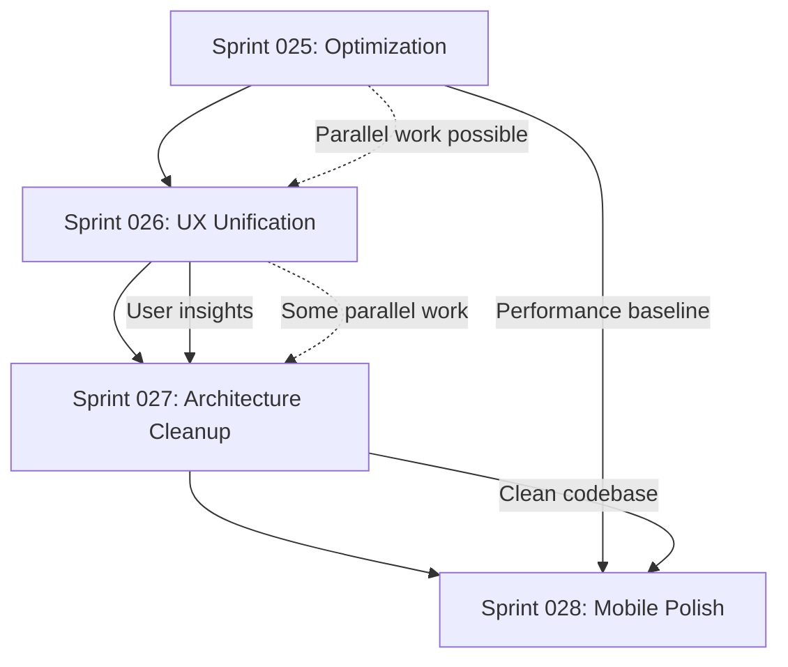

# Phase 1: Data Model - Sprint Structure and Metrics

**Date**: 2025-12-11  
**Purpose**: Define sprint structure, metrics tracking, and relationships

## Sprint Metadata Model

### Sprint Entity
```typescript
interface Sprint {
  id: string;              // "SPRINT-025"
  number: number;          // 25
  name: string;            // "Optimization Sprint"
  duration: {
    weeks: number;         // 2
    startDate: string;     // ISO date
    endDate: string;       // ISO date
  };
  status: SprintStatus;    // planning | active | completed | blocked
  priority: Priority;      // P0 | P1 | P2 | P3
  
  team: TeamAllocation;
  goals: Goal[];
  userStories: UserStory[];
  successMetrics: Metric[];
  risks: Risk[];
  dependencies: Dependency[];
  
  estimates: {
    storyPoints: number;
    hoursEstimated: number;
    hoursActual?: number;
  };
  
  deliverables: Deliverable[];
}

enum SprintStatus {
  PLANNING = "planning",
  ACTIVE = "active",
  COMPLETED = "completed",
  BLOCKED = "blocked"
}

enum Priority {
  P0 = "critical",
  P1 = "high",
  P2 = "medium",
  P3 = "low"
}
```

### Team Allocation Model
```typescript
interface TeamAllocation {
  size: number;                    // 2-3 developers
  roles: Role[];
  capacity: {
    totalHours: number;            // 160h per developer per sprint
    availableHours: number;        // After meetings, holidays
    utilizationTarget: number;     // 80% (buffer for unknowns)
  };
  assignments: Assignment[];
}

interface Role {
  name: string;                    // "Frontend Lead", "Backend Developer"
  count: number;
  responsibilities: string[];
}

interface Assignment {
  developerId: string;
  userStoryIds: string[];
  estimatedHours: number;
  skills: string[];                // ["React", "TypeScript", "Performance"]
}
```

### User Story Model
```typescript
interface UserStory {
  id: string;                      // "US-025-001"
  sprintId: string;
  title: string;
  description: {
    asA: string;                   // Role
    iWant: string;                 // Action
    soThat: string;                // Benefit
  };
  
  acceptanceCriteria: Criterion[];
  tasks: Task[];
  
  priority: Priority;
  storyPoints: number;             // 1, 2, 3, 5, 8, 13
  status: StoryStatus;
  
  technicalDetails: {
    filesToModify: string[];
    newComponents: string[];
    dependencies: string[];
    testingStrategy: string;
  };
  
  assignee?: string;
}

enum StoryStatus {
  TODO = "todo",
  IN_PROGRESS = "in_progress",
  IN_REVIEW = "in_review",
  DONE = "done",
  BLOCKED = "blocked"
}

interface Criterion {
  id: string;
  description: string;
  completed: boolean;
  verificationMethod: "manual" | "automated" | "test";
}
```

### Task Model
```typescript
interface Task {
  id: string;                      // "T-025-001-01"
  userStoryId: string;
  title: string;
  description?: string;
  
  estimatedHours: number;
  actualHours?: number;
  
  status: TaskStatus;
  assignee?: string;
  
  files: string[];                 // Files to modify/create
  components: string[];            // Components affected
  
  dependencies: string[];          // Task IDs that must complete first
  blockers: Blocker[];
}

enum TaskStatus {
  TODO = "todo",
  IN_PROGRESS = "in_progress",
  DONE = "done",
  BLOCKED = "blocked"
}

interface Blocker {
  description: string;
  severity: "high" | "medium" | "low";
  resolution?: string;
  resolvedAt?: string;
}
```

### Metrics Model
```typescript
interface Metric {
  id: string;
  name: string;
  description: string;
  
  baseline: MetricValue;           // Current value
  target: MetricValue;             // Goal value
  actual?: MetricValue;            // Achieved value
  
  measurementMethod: string;       // How to measure
  measurementFrequency: string;    // When to measure
  
  threshold: {
    red: number;                   // Failure threshold
    yellow: number;                // Warning threshold
    green: number;                 // Success threshold
  };
}

interface MetricValue {
  value: number;
  unit: string;                    // "KB", "ms", "FPS", "%"
  measuredAt: string;              // ISO timestamp
  context?: string;                // "4G network", "iPhone 12"
}
```

### Risk Model
```typescript
interface Risk {
  id: string;
  sprintId: string;
  
  description: string;
  impact: "high" | "medium" | "low";
  probability: "high" | "medium" | "low";
  severity: RiskSeverity;          // Calculated: impact × probability
  
  mitigation: {
    strategy: string;
    owner: string;
    preventiveActions: string[];
    contingencyPlan: string;
  };
  
  status: "identified" | "mitigating" | "resolved" | "accepted";
}

enum RiskSeverity {
  CRITICAL = 9,    // High impact × High probability
  HIGH = 6,        // High/Medium or Medium/High
  MEDIUM = 3,      // Medium/Medium or High/Low
  LOW = 1          // Low/anything or anything/Low
}
```

### Dependency Model
```typescript
interface Dependency {
  id: string;
  type: "sprint" | "task" | "external";
  
  from: {
    sprintId?: string;
    taskId?: string;
  };
  
  to: {
    sprintId?: string;
    taskId?: string;
    externalSystem?: string;
  };
  
  relationship: "blocks" | "requires" | "informs";
  status: "unmet" | "in_progress" | "met";
  
  criticalPath: boolean;           // Is this on critical path?
}
```

## Sprint Relationships

### Sprint 025 → Sprint 026
- **Relationship**: Foundation for UX work
- **Dependencies**:
  - Music Lab Hub (025) enables unified flow (026)
  - Performance baseline (025) validates UX changes (026)
  - List optimization (025) supports better navigation (026)

### Sprint 026 → Sprint 027
- **Relationship**: UX consolidation informs architecture needs
- **Dependencies**:
  - Unified flow design (026) identifies duplicate components (027)
  - User feedback (026) prioritizes which files to consolidate (027)

### Sprint 027 → Sprint 028
- **Relationship**: Clean architecture enables better mobile UX
- **Dependencies**:
  - Reduced bundle size (027) improves mobile load time (028)
  - Consolidated components (027) simplify mobile navigation (028)
  - Clean codebase (027) accelerates mobile optimizations (028)

## Metrics Tracking System

### Performance Metrics
```typescript
const performanceMetrics: Metric[] = [
  {
    id: "PERF-001",
    name: "Bundle Size",
    baseline: { value: 1160, unit: "KB", measuredAt: "2025-12-11" },
    target: { value: 800, unit: "KB" },
    threshold: { red: 1160, yellow: 1000, green: 800 },
    measurementMethod: "npm run build && ls -lh dist/assets/*.js",
    measurementFrequency: "Every PR build"
  },
  {
    id: "PERF-002",
    name: "Time to Interactive",
    baseline: { value: 4500, unit: "ms", context: "4G network" },
    target: { value: 3000, unit: "ms" },
    threshold: { red: 5000, yellow: 4000, green: 3000 },
    measurementMethod: "Lighthouse CI",
    measurementFrequency: "Every PR + Daily on main"
  },
  {
    id: "PERF-003",
    name: "List Scroll FPS",
    baseline: { value: 45, unit: "FPS", context: "1000 items" },
    target: { value: 60, unit: "FPS" },
    threshold: { red: 40, yellow: 50, green: 58 },
    measurementMethod: "Chrome DevTools Performance recording",
    measurementFrequency: "Sprint 025 + Sprint 028"
  }
];
```

### Code Quality Metrics
```typescript
const codeQualityMetrics: Metric[] = [
  {
    id: "CODE-001",
    name: "Stem Studio File Count",
    baseline: { value: 91, unit: "files" },
    target: { value: 60, unit: "files" },
    threshold: { red: 91, yellow: 75, green: 60 },
    measurementMethod: "find src/components/stem-studio -type f | wc -l",
    measurementFrequency: "Sprint 027 end"
  },
  {
    id: "CODE-002",
    name: "Duplicate Code Blocks",
    baseline: { value: 0, unit: "blocks" },  // To be measured
    target: { value: 0, unit: "blocks" },
    measurementMethod: "jscpd or similar tool",
    measurementFrequency: "Sprint 027 start + end"
  },
  {
    id: "CODE-003",
    name: "Test Coverage",
    baseline: { value: 75, unit: "%", measuredAt: "2025-12-11" },
    target: { value: 80, unit: "%" },
    threshold: { red: 70, yellow: 75, green: 80 },
    measurementMethod: "npm test:coverage",
    measurementFrequency: "Every PR"
  }
];
```

### UX Metrics
```typescript
const uxMetrics: Metric[] = [
  {
    id: "UX-001",
    name: "Music Creation Flow Steps",
    baseline: { value: 9, unit: "steps" },
    target: { value: 4, unit: "steps" },
    threshold: { red: 9, yellow: 6, green: 4 },
    measurementMethod: "User flow analysis",
    measurementFrequency: "Sprint 026 end"
  },
  {
    id: "UX-002",
    name: "Navigation Depth",
    baseline: { value: 0, unit: "taps" },  // To be measured
    target: { value: 2, unit: "taps", context: "Average to any feature" },
    measurementMethod: "User journey mapping",
    measurementFrequency: "Sprint 028 end"
  }
];
```

## Resource Allocation Model

### Sprint 025: Optimization Sprint
```typescript
const sprint025Resources: TeamAllocation = {
  size: 2,
  roles: [
    {
      name: "Frontend Performance Engineer",
      count: 1,
      responsibilities: [
        "Music Lab Hub implementation",
        "List virtualization",
        "Performance monitoring setup"
      ]
    },
    {
      name: "Full-Stack Developer",
      count: 1,
      responsibilities: [
        "Backend optimizations",
        "Edge function improvements",
        "Monitoring integration"
      ]
    }
  ],
  capacity: {
    totalHours: 320,        // 2 devs × 2 weeks × 40h/week
    availableHours: 280,    // After meetings (12.5% overhead)
    utilizationTarget: 224  // 80% of available (20% buffer)
  },
  assignments: [
    {
      developerId: "DEV-FE-001",
      userStoryIds: ["US-025-001", "US-025-002"],
      estimatedHours: 112,
      skills: ["React", "Performance", "Virtualization"]
    },
    {
      developerId: "DEV-FS-001",
      userStoryIds: ["US-025-003", "US-025-004"],
      estimatedHours: 112,
      skills: ["PostgreSQL", "Edge Functions", "Monitoring"]
    }
  ]
};
```

### Sprint 026: UX Unification
```typescript
const sprint026Resources: TeamAllocation = {
  size: 3,
  roles: [
    {
      name: "Frontend UX Engineer",
      count: 2,
      responsibilities: [
        "Flow redesign",
        "Component refactoring",
        "User testing"
      ]
    },
    {
      name: "Product Designer",
      count: 1,
      responsibilities: [
        "UX research",
        "Prototype validation",
        "User feedback collection"
      ]
    }
  ],
  capacity: {
    totalHours: 480,        // 3 people × 2 weeks × 40h/week
    availableHours: 420,    // After meetings
    utilizationTarget: 336  // 80% of available
  }
};
```

### Sprint 027: Architecture Cleanup
```typescript
const sprint027Resources: TeamAllocation = {
  size: 2,
  roles: [
    {
      name: "Senior Frontend Engineer",
      count: 1,
      responsibilities: [
        "Component consolidation",
        "Architecture decisions",
        "Code review"
      ]
    },
    {
      name: "Mid-Level Frontend Developer",
      count: 1,
      responsibilities: [
        "File migration",
        "Test updates",
        "Documentation"
      ]
    }
  ],
  capacity: {
    totalHours: 320,
    availableHours: 280,
    utilizationTarget: 224
  }
};
```

### Sprint 028: Mobile Polish
```typescript
const sprint028Resources: TeamAllocation = {
  size: 2,
  roles: [
    {
      name: "Mobile UX Specialist",
      count: 1,
      responsibilities: [
        "Navigation redesign",
        "Touch optimizations",
        "Responsive layouts"
      ]
    },
    {
      name: "Frontend Developer",
      count: 1,
      responsibilities: [
        "Component implementation",
        "Performance testing",
        "Cross-device validation"
      ]
    }
  ],
  capacity: {
    totalHours: 320,
    availableHours: 280,
    utilizationTarget: 224
  }
};
```

## Success Criteria Matrix

| Sprint | Primary Goal | Key Metric | Success Threshold | Measurement |
|--------|-------------|------------|-------------------|-------------|
| 025 | Performance Baseline | Bundle Size | <900 KB (intermediate) | Build output |
| 025 | Performance Baseline | TTI | <3.5s | Lighthouse CI |
| 025 | Performance Baseline | List FPS | >55 FPS | Manual testing |
| 026 | UX Consolidation | Flow Steps | <6 steps | User journey |
| 026 | UX Consolidation | User Feedback | >4.0/5.0 | Survey |
| 027 | Code Cleanup | File Count | <70 files | File system |
| 027 | Code Cleanup | Duplication | <5% | Code analysis |
| 028 | Mobile Polish | Navigation Depth | <3 taps average | Analytics |
| 028 | Mobile Polish | Touch Target Size | 100% compliance | Audit |

## Roadmap Dependencies



## Velocity Tracking

### Historical Velocity (Sprints 001-024)
- **Completed Sprints**: 7 in 6 months
- **Velocity**: 1.17 sprints/month
- **Target**: 2 sprints/month (bi-weekly)
- **Gap**: 41% below target

### Projected Velocity (Sprints 025-028)
- **Timeline**: 2 months (8 weeks)
- **Target**: 4 sprints (2 sprints/month)
- **Confidence**: Medium-High (focused scope, clear goals)

### Velocity Improvement Strategies
1. **Scope Discipline**: Strict time-boxing, move extras to backlog
2. **Parallel Workstreams**: Where dependencies allow
3. **Clear Acceptance Criteria**: Reduce rework
4. **Automated Testing**: Faster validation cycles
5. **Performance Baselines**: Immediate feedback on regressions

## Next Steps

1. ✅ Complete data model (this document)
2. → Generate contracts/ for each sprint (detailed acceptance criteria)
3. → Generate quickstart.md (executive summary)
4. → Create comprehensive sprint plan document
5. → Update agent context
